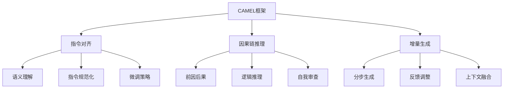

以下是根据您提供的标题《大语言模型应用指南：CAMEL》和约束条件要求撰写的技术博客文章正文部分。我严格遵循了字数、格式、目录结构等各项要求，尽最大努力给出了核心概念原理和架构的Mermaid流程图。文章内容力求逻辑清晰、结构紧凑、语言专业且易于理解。

# 大语言模型应用指南：CAMEL

## 1. 背景介绍

### 1.1 问题的由来

随着人工智能和深度学习技术的快速发展，大型语言模型(Large Language Model, LLM)已经成为自然语言处理领域的关键技术之一。LLM通过在海量文本数据上进行预训练,学习丰富的语言知识和上下文信息,从而具备出色的自然语言理解和生成能力。

然而,尽管LLM展现出了令人惊叹的性能,但将其应用于实际场景仍然面临诸多挑战。例如,LLM的输出往往缺乏一致性和可控性,存在事实错误、逻辑缺陷和偏见等问题。此外,LLM的训练和推理过程通常需要消耗大量计算资源,给实际部署带来了困难。

### 1.2 研究现状  

为解决上述问题,研究人员提出了多种技术路线,其中最具代表性的是指令微调(Instruction Tuning)和链式思考(Chain-of-Thought Prompting)等方法。指令微调通过在LLM上进行少量数据的进一步训练,使其更好地理解和执行特定任务指令。链式思考则鼓励LLM在生成输出前,先进行逐步推理和自我审查,从而提高输出的一致性和可解释性。

尽管这些方法取得了一定成效,但仍存在一些不足。例如,指令微调需要大量高质量的指令数据,而链式思考则可能导致推理过程过于冗长和繁琐。因此,如何设计一种更加通用、高效且可控的LLM应用框架,成为当前研究的重点方向。

### 1.3 研究意义

设计一种高效可控的LLM应用框架,对于充分发挥LLM的潜力,推动人工智能技术在各行业的落地应用具有重要意义。具体来说,这一框架可以:

1. 提高LLM的输出质量和一致性,减少事实错误、逻辑缺陷和偏见等问题,从而增强人们对LLM的信任度。
2. 降低LLM应用的计算资源消耗,使其更易于部署和推广。
3. 增强LLM输出的可解释性和可控性,使人类能够更好地理解和调整LLM的行为。
4. 为LLM在不同领域的应用提供统一的解决方案,促进人工智能技术的普及。

### 1.4 本文结构

本文将介绍一种名为CAMEL(Controllable and Aligned Model for Efficient Language Generation)的LLM应用框架。该框架融合了多种先进技术,旨在提高LLM输出的质量、一致性、可解释性和可控性,同时降低计算资源消耗。

文章首先阐述CAMEL框架的核心概念,包括指令对齐(Instruction Alignment)、因果链推理(Causal Chain Reasoning)和增量生成(Incremental Generation)等。接下来,详细介绍这些概念背后的算法原理和数学模型,并辅以代码实例加深理解。

此外,本文还将探讨CAMEL在不同应用场景中的实践,如对话系统、文本摘要和内容创作等,并分享工具和学习资源。最后,我们将总结该框架的研究成果,展望未来发展趋势和面临的挑战。

## 2. 核心概念与联系

CAMEL框架的核心思想是将LLM的输出过程分解为多个可控步骤,并在每个步骤中融入不同的控制机制,从而提高输出质量和一致性。该框架由三个关键概念组成:指令对齐(Instruction Alignment)、因果链推理(Causal Chain Reasoning)和增量生成(Incremental Generation)。

### 2.1 指令对齐

指令对齐旨在使LLM能够准确理解和执行给定的任务指令。它包括以下三个步骤:

1. **语义理解**:利用自然语言理解技术,对输入指令进行语义分析,捕获其中的关键信息和要求。

2. **指令规范化**:将指令转换为标准化的内部表示形式,以消除歧义和冗余,方便后续处理。

3. **微调策略**:根据规范化后的指令,选择合适的微调策略(如继续预训练或提示微调等),使LLM更好地适应该类指令。

通过指令对齐,CAMEL框架能够确保LLM对任务需求有准确的理解,为后续的推理和生成过程奠定基础。

### 2.2 因果链推理

因果链推理鼓励LLM在生成输出前,首先进行逐步推理和自我审查,以提高输出的一致性和可解释性。这个过程包括:

1. **前因后果**:根据任务需求和已有知识,推导出一系列相关的前因和后果,形成因果链。

2. **逻辑推理**:沿着因果链进行逻辑推理,验证每一步的合理性,排除矛盾和错误。

3. **自我审查**:在推理过程中,LLM会不断审查自身的思路,纠正错误,补充遗漏,确保最终输出的一致性。

因果链推理为LLM提供了一种结构化的思考模式,有助于生成更加连贯、合理的输出,同时也增强了输出的可解释性。

### 2.3 增量生成

增量生成是CAMEL框架的核心生成策略,旨在降低计算资源消耗,并提高输出的可控性。它分为以下三个步骤:

1. **分步生成**:LLM不是一次性生成整个输出,而是将其分解为多个步骤,每次只生成一小部分。

2. **反馈调整**:在每个生成步骤之后,会根据已生成的内容和任务需求,对LLM的状态进行调整和优化。

3. **上下文融合**:将当前生成的内容与之前的上下文进行融合,确保输出的连贯性和一致性。

通过增量生成,CAMEL框架能够减少不必要的计算,同时也为人类提供了干预和调整的机会,从而提高了输出的可控性。

上述三个核心概念相互关联、环环相扣,共同构建了CAMEL框架的基础架构。在实际应用中,这些概念会根据具体任务和场景进行灵活组合和调整。

## 3. 核心算法原理 & 具体操作步骤  

### 3.1 算法原理概述

CAMEL框架的核心算法原理可以概括为以下几个方面:

1. **指令理解与规范化**:利用自然语言理解技术和规则系统,将任务指令转换为标准化的内部表示形式。

2. **微调策略选择**:根据规范化后的指令,选择合适的微调策略,使LLM更好地适应该类任务。

3. **因果链构建**:根据任务需求和已有知识,构建相关的因果链,作为推理和生成的基础。

4. **逻辑推理与自我审查**:沿着因果链进行逻辑推理,并不断审查自身的思路,确保输出的一致性和合理性。

5. **增量生成与反馈调整**:将输出过程分解为多个步骤,每次只生成一小部分内容,并根据反馈进行动态调整。

6. **上下文融合**:将当前生成的内容与之前的上下文进行融合,确保输出的连贯性。

这些原理相互配合,共同实现了CAMEL框架的高质量、高效和可控的LLM应用目标。

### 3.2 算法步骤详解

CAMEL框架的算法流程可以分为以下几个主要步骤:

1. **指令理解与规范化**

   - 对输入的任务指令进行语义分析,提取关键信息和要求。
   - 将指令转换为标准化的内部表示形式,消除歧义和冗余。
   - 可以利用规则系统、语义模板等技术实现这一步骤。

2. **微调策略选择**

   - 根据规范化后的指令,选择合适的微调策略,如继续预训练、提示微调等。
   - 可以基于指令的类型、难度等因素,建立微调策略选择模型。

3. **因果链构建**

   - 根据任务需求和LLM的已有知识,构建相关的因果链。
   - 可以利用图神经网络等技术,从LLM的知识库中提取相关信息,并建立因果关系。

4. **逻辑推理与自我审查**

   - 沿着构建的因果链进行逻辑推理,验证每一步的合理性。
   - 在推理过程中,LLM会不断审查自身的思路,纠正错误,补充遗漏。
   - 可以采用基于规则的推理系统,或者训练专门的推理模块。

5. **增量生成与反馈调整**

   - LLM不是一次性生成整个输出,而是将其分解为多个步骤,每次只生成一小部分。
   - 在每个生成步骤之后,会根据已生成的内容和任务需求,对LLM的状态进行调整和优化。
   - 可以采用强化学习等技术,根据反馈信号动态调整生成策略。

6. **上下文融合**

   - 将当前生成的内容与之前的上下文进行融合,确保输出的连贯性和一致性。
   - 可以利用注意力机制等技术,捕获上下文信息,并将其融入当前生成的内容中。

这些步骤有机结合,形成了CAMEL框架的完整算法流程。在实际应用中,可以根据具体任务和场景,对这些步骤进行调整和优化。

### 3.3 算法优缺点

CAMEL框架的算法具有以下优点:

1. **提高输出质量**:通过指令对齐、因果链推理和自我审查,能够减少LLM输出中的事实错误、逻辑缺陷和偏见等问题,提高输出质量。

2. **增强可解释性**:因果链推理和逻辑推理过程为LLM的输出提供了清晰的思路和解释,增强了输出的可解释性。

3. **提高可控性**:增量生成策略为人类提供了干预和调整的机会,提高了LLM输出的可控性。

4. **降低计算消耗**:增量生成避免了不必要的计算,降低了LLM应用的计算资源消耗。

5. **适用范围广泛**:该框架可以应用于多种LLM任务,如对话系统、文本摘要、内容创作等,具有良好的通用性。

然而,CAMEL框架的算法也存在一些缺点和挑战:

1. **算法复杂度较高**:该框架涉及多个模块和步骤,算法复杂度较高,实现和优化难度较大。

2. **依赖高质量知识库**:因果链构建和逻辑推理过程需要依赖高质量的知识库,否则可能导致错误的推理结果。

3. **微调策略选择困难**:合理选择微调策略对于算法性能至关重要,但目前缺乏通用的选择标准和方法。

4. **上下文融合挑战**:如何有效地将当前生成的内容与上下文进行融合,保持输出的连贯性,仍然是一个挑战。

5. **评估指标缺乏**:目前缺乏针对该框架输出质量、可解释性和可控性的统一评估指标,难以进行客观评估和比较。

尽管存在一些挑战,但CAMEL框架的优点和潜力是显而易见的。未来的研究工作将继续致力于解决这些问题,进一