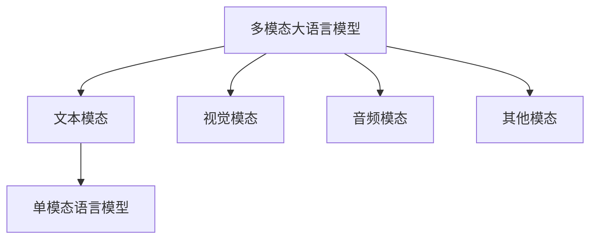
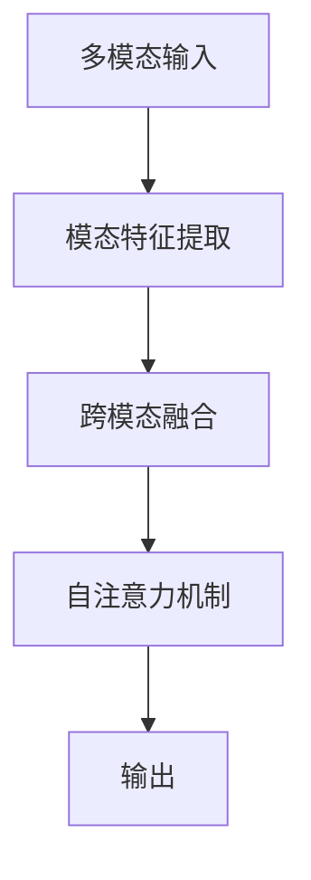

# 大语言模型应用指南：什么是多模态

## 1. 背景介绍

### 1.1 问题的由来

在过去几年中,大型语言模型(Large Language Models, LLMs)取得了令人瞩目的进展,展现出惊人的自然语言理解和生成能力。然而,纯文本形式的语言模型存在一些固有的局限性。例如,在处理视觉、音频等多模态数据时,它们的性能往往受到限制。为了更好地理解和表达真实世界中的多模态信息,研究人员提出了多模态大语言模型(Multimodal Large Language Models, MMLLMs)的概念。

### 1.2 研究现状

多模态大语言模型旨在整合不同模态的信息,如文本、图像、视频和音频等,从而实现更加全面和准确的理解和生成能力。近年来,一些突破性的多模态模型已经问世,例如CLIP、Flamingo、Socratic Models等,展现出了多模态模型在各种任务中的潜力。然而,多模态建模仍然面临着诸多挑战,例如模态融合、数据不平衡、计算资源需求等。

### 1.3 研究意义

多模态大语言模型的研究对于推进人工智能的发展具有重要意义。它们有望实现更加自然、流畅和人性化的人机交互,并在各种应用领域发挥作用,如智能助理、内容创作、教育、医疗等。此外,多模态模型也有助于我们更好地理解人类认知过程中的多模态整合机制。

### 1.4 本文结构

本文将全面介绍多模态大语言模型的相关概念、原理和应用。我们将首先探讨多模态模型的核心概念和与单模态模型的联系,然后深入剖析其核心算法原理和数学模型。接下来,我们将通过实际项目实践和代码示例,帮助读者更好地理解多模态模型的实现细节。最后,我们将讨论多模态模型的实际应用场景、未来发展趋势和面临的挑战。

## 2. 核心概念与联系

多模态大语言模型(MMLLMs)是一种旨在整合多种模态信息的新型人工智能模型。它们基于传统的单模态语言模型,但通过引入视觉、音频等其他模态的信息,实现了更加全面和准确的理解和生成能力。

单模态语言模型(如GPT、BERT等)主要关注文本数据,通过学习大量文本语料,捕捉文本中的语义和结构信息。它们在自然语言处理任务中表现出色,但在处理非文本数据时存在局限性。

相比之下,多模态大语言模型旨在融合多种模态的信息,如文本、图像、视频、音频等。通过联合建模不同模态之间的关系,多模态模型能够更好地理解和生成多模态数据,从而实现更加自然、流畅和人性化的人机交互。

多模态模型的核心思想是将不同模态的数据映射到一个共享的潜在空间中,在该空间中,不同模态的信息可以相互影响和增强。这种跨模态的信息融合有助于模型捕捉更丰富和精确的语义信息,从而提高模型的泛化能力和鲁棒性。

## 3. 核心算法原理 & 具体操作步骤

### 3.1 算法原理概述

多模态大语言模型的核心算法原理是基于自注意力机制和跨模态融合的思想。自注意力机制允许模型在处理序列数据时,捕捉不同位置之间的长程依赖关系。而跨模态融合则使模型能够整合来自不同模态的信息,实现更加全面和准确的理解和生成。

1. **模态特征提取**：首先,模型需要从不同模态的原始数据中提取特征表示。对于文本模态,可以使用预训练的语言模型(如BERT)提取文本特征;对于视觉模态,可以使用预训练的图像模型(如VGG或ResNet)提取图像特征;对于音频模态,可以使用预训练的音频模型(如VGGish或YAMNet)提取音频特征。

2. **跨模态融合**:接下来,模型需要将不同模态的特征表示融合到一个共享的潜在空间中。常见的融合方法包括简单的拼接、注意力加权融合、交互融合等。通过跨模态融合,模型可以捕捉不同模态之间的关系和相互作用。

3. **自注意力机制**:在共享的潜在空间中,模型应用自注意力机制来捕捉不同位置之间的长程依赖关系。自注意力机制允许模型动态地分配不同位置的权重,从而更好地建模序列数据的结构和语义信息。

4. **输出生成**:最后,模型根据融合后的特征表示和自注意力机制的输出,生成相应的输出。对于理解任务(如问答、分类等),模型会输出相应的标签或结果;对于生成任务(如图像描述、文本生成等),模型会生成相应的文本或其他模态的输出。

### 3.2 算法步骤详解

1. **模态特征提取**:
   - 文本模态:使用预训练的BERT模型提取文本特征,将文本序列输入BERT,获得每个词的上下文表示。
   - 视觉模态:使用预训练的ResNet模型提取图像特征,将图像输入ResNet,获得图像的特征向量。
   - 音频模态:使用预训练的VGGish模型提取音频特征,将音频波形输入VGGish,获得音频的特征向量。

2. **跨模态融合**:
   - 将不同模态的特征表示拼接成一个长向量。
   - 应用一个全连接层将拼接向量映射到一个共享的潜在空间。
   - 可选:使用注意力机制动态地加权不同模态的特征,捕捉模态之间的相互作用。

3. **自注意力机制**:
   - 将融合后的特征序列输入到多头自注意力层中。
   - 计算每个位置与其他位置之间的注意力权重,捕捉长程依赖关系。
   - 将加权后的特征表示组合成新的序列表示。

4. **输出生成**:
   - 对于理解任务:将自注意力层的输出输入到一个分类器中,预测相应的标签或结果。
   - 对于生成任务:将自注意力层的输出输入到一个解码器中,生成相应的文本或其他模态的输出序列。

### 3.3 算法优缺点

**优点**:

- 能够整合多种模态的信息,实现更加全面和准确的理解和生成。
- 通过跨模态融合和自注意力机制,捕捉不同模态之间的关系和长程依赖。
- 具有更强的泛化能力和鲁棒性,适用于各种多模态任务。
- 有助于实现更加自然、流畅和人性化的人机交互。

**缺点**:

- 模型复杂度较高,需要大量计算资源和训练数据。
- 不同模态数据的获取和预处理可能存在挑战。
- 模态融合和注意力机制的设计需要深入的研究和探索。
- 存在模态偏差和数据不平衡的问题,可能导致模型性能下降。

### 3.4 算法应用领域

多模态大语言模型具有广泛的应用前景,包括但不限于:

- **智能助理**:通过整合文本、视觉、音频等多种模态信息,实现更加自然和人性化的人机交互。
- **内容创作**:利用多模态模型生成富媒体内容,如图文结合的新闻报道、视频描述等。
- **教育和培训**:开发基于多模态模型的智能教育系统,提供个性化的学习体验。
- **医疗诊断**:融合医学影像、病历、检查报告等多模态数据,辅助医生进行更准确的诊断和治疗。
- **机器人控制**:将视觉、语音等传感器数据输入多模态模型,实现更智能的机器人控制和决策。
- **安全监控**:整合视频、音频、文本等多源信息,提高安全监控的准确性和效率。

## 4. 数学模型和公式 & 详细讲解 & 举例说明

### 4.1 数学模型构建

多模态大语言模型的数学模型基于自注意力机制和跨模态融合的思想。我们将不同模态的输入数据映射到一个共享的潜在空间中,并应用自注意力机制捕捉不同位置之间的长程依赖关系。

设有 $M$ 种模态,每种模态的输入序列分别为 $X^{(1)}, X^{(2)}, \dots, X^{(M)}$。我们首先使用模态特征提取器 $f_m$ 将每种模态的输入映射到一个共享的特征空间中,得到特征表示 $H^{(m)} = f_m(X^{(m)})$。

接下来,我们将不同模态的特征表示融合到一个共享的潜在空间中。常见的融合方法包括简单的拼接、注意力加权融合等。对于拼接融合,我们将不同模态的特征表示拼接成一个长向量:

$$Z = [H^{(1)}; H^{(2)}; \dots; H^{(M)}]$$

然后,我们应用一个全连接层将拼接向量映射到共享的潜在空间:

$$H = \text{FC}(Z) + b$$

其中 $\text{FC}$ 表示全连接层的线性变换,而 $b$ 是偏置项。

在共享的潜在空间中,我们应用多头自注意力机制捕捉不同位置之间的长程依赖关系。多头自注意力的计算过程如下:

$$\begin{aligned}
Q &= H W_Q \\
K &= H W_K \\
V &= H W_V \\
\text{Attention}(Q, K, V) &= \text{softmax}\left(\frac{QK^T}{\sqrt{d_k}}\right)V
\end{aligned}$$

其中 $W_Q, W_K, W_V$ 分别是查询、键和值的线性变换矩阵,而 $d_k$ 是缩放因子,用于避免点积过大导致的梯度饱和问题。

最后,我们将自注意力机制的输出输入到一个解码器中,生成相应的输出序列 $Y$。对于理解任务,解码器可以是一个分类器,预测相应的标签或结果;对于生成任务,解码器可以是一个语言模型,生成相应的文本或其他模态的输出序列。

### 4.2 公式推导过程

我们将详细推导多头自注意力机制的计算过程。

首先,我们将输入序列 $H$ 分别与查询、键和值的线性变换矩阵 $W_Q, W_K, W_V$ 相乘,得到查询 $Q$、键 $K$ 和值 $V$ 的表示:

$$\begin{aligned}
Q &= H W_Q \\
K &= H W_K \\
V &= H W_V
\end{aligned}$$

其中,$Q, K, V \in \mathbb{R}^{n \times d_k}$,其中 $n$ 是序列长度,而 $d_k$ 是查询、键和值的维度。

接下来,我们计算查询 $Q$ 与所有键 $K$ 的点积,并除以缩放因子 $\sqrt{d_k}$,得到注意力分数矩阵:

$$\text{Attention Scores} = \frac{QK^T}{\sqrt{d_k}}$$

注意力分数矩阵的每一行表示当前位置与所有其他位置的相关性分数。为了获得注意力权重,我们对注意力分数矩阵的每一行应用 softmax 函数:

$$\text{Attention Weights} = \text{softmax}\left(\frac{QK^T}{\sqrt{d_k}}\right)$$

注意力权重矩阵的每一行表示当前位置对其他位置的注意力权重分布。

最后,我们将注意力