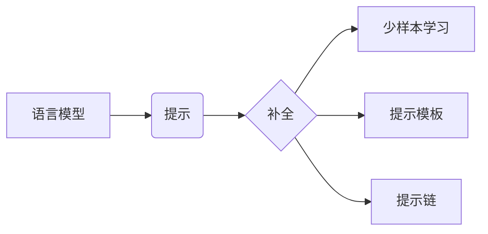

# 大语言模型应用指南：什么是提示工程

关键词：大语言模型、提示工程、人工智能、自然语言处理、机器学习

## 1. 背景介绍
### 1.1  问题的由来
随着人工智能技术的快速发展,大语言模型(Large Language Models, LLMs)在自然语言处理(Natural Language Processing, NLP)领域取得了突破性进展。LLMs 能够生成高质量的文本,完成复杂的语言任务,展现出接近甚至超越人类的语言理解和生成能力。然而,如何有效地使用 LLMs 完成实际应用,成为一个亟待解决的问题。

### 1.2  研究现状
目前,学术界和工业界都在积极探索 LLMs 的应用。OpenAI、DeepMind、Google 等知名机构和公司相继推出了 GPT-3、PaLM、LaMDA 等大型语言模型。研究人员提出了提示工程(Prompt Engineering)的概念,通过设计合适的提示(Prompt)来引导 LLMs 完成特定任务。一些初创公司如 Anthropic 开始提供提示工程服务。但总的来说,提示工程仍处于起步阶段,缺乏系统性指南。

### 1.3  研究意义
提示工程有望成为连接 LLMs 能力和实际应用需求的桥梁。掌握提示工程方法,可以最大限度发挥 LLMs 的潜力,用于问答、对话、写作、编程、推理、创意等多个领域,为个人用户和企业带来巨大价值。系统总结提示工程的概念、原理和最佳实践,将推动 LLMs 在更广泛场景的应用。

### 1.4  本文结构
本文将分为以下几个部分:
- 介绍提示工程的核心概念与内在联系
- 阐述提示工程的核心算法原理与操作步骤
- 建立提示工程的数学模型并举例说明
- 提供提示工程的代码实例与详细解释
- 分析提示工程的实际应用场景
- 推荐提示工程相关的工具和学习资源
- 总结提示工程的发展趋势与面临的挑战
- 回答关于提示工程的常见问题

## 2. 核心概念与联系
提示工程的核心概念包括:

- 提示(Prompt):输入给语言模型的文本序列,引导其进行特定任务。
- 补全(Completion):语言模型根据提示生成的文本序列。
- 少样本学习(Few-shot Learning):通过少量示例来指导语言模型完成新任务的学习范式。
- 提示模板(Prompt Template):可复用的提示结构,包含固定部分和可变部分。
- 提示链(Prompt Chain):由多个提示串联形成的任务流,每个提示的补全结果作为下一个提示的输入。

这些概念环环相扣,构成了提示工程的基本框架。提示是提示工程的核心,通过设计高质量的提示,可以在少样本学习的条件下引导语言模型生成理想的补全结果。提示模板可以总结提示设计的最佳实践,提高复用性。提示链将多个提示组合成复杂的任务流,扩展了提示工程的应用边界。



## 3. 核心算法原理 & 具体操作步骤
### 3.1 算法原理概述
提示工程的核心算法原理是语言模型的自回归生成。给定提示 $P$,语言模型 $M$ 的目标是生成补全 $C$,最大化条件概率 $P(C|P,M)$。这个过程可以用如下公式表示:

$$
\hat{C} = \arg\max_C P(C|P,M)
$$

其中 $\hat{C}$ 表示最优补全。

语言模型通过自回归的方式逐词生成补全。在每个时间步 $t$,模型根据提示 $P$ 和已生成的补全 $C_{<t}$ 预测下一个词 $c_t$:

$$
P(c_t|P,C_{<t},M) = \frac{\exp(e(c_t))}{\sum_{c'\in V} \exp(e(c'))}
$$

其中 $e(c_t)$ 是词 $c_t$ 的嵌入向量,$V$ 是词表。

### 3.2 算法步骤详解
提示工程的具体操作步骤如下:

1. 明确任务目标,分析输入输出要求。
2. 收集和分析与任务相关的语料,总结语言模式和知识。
3. 设计提示的结构,包括指令、上下文、输入、输出格式等。
4. 选择合适的语言模型,如 GPT-3、PaLM 等。
5. 对提示进行微调,调节提示的措辞、示例数量、示例顺序等。
6. 生成补全结果,评估补全质量。可使用人工评估或自动评估指标。
7. 分析补全错误,迭代优化提示。
8. 将优化后的提示抽象为提示模板,总结最佳实践。
9. 将多个提示组合为提示链,构建复杂任务流。
10. 在实际应用中测试提示的泛化性和鲁棒性,不断迭代优化。

### 3.3 算法优缺点
提示工程的优点包括:
- 无需训练,即可适应新任务。
- 可解释性强,提示可以明确表达任务要求。
- 灵活性高,可以通过提示引入外部知识。

提示工程的缺点包括:  
- 对语言模型的质量依赖大。
- 需要设计精巧的提示,有一定工程复杂度。
- 提示的泛化能力有限,迁移到新领域需要重新优化。

### 3.4 算法应用领域
提示工程可以应用于以下领域:
- 问答:通过提示引导语言模型回答问题。
- 对话:通过提示引导语言模型进行多轮对话。
- 写作:通过提示引导语言模型生成文章、新闻、诗歌等。 
- 编程:通过提示引导语言模型生成代码、解释代码。
- 推理:通过提示引导语言模型进行常识推理、因果推理等。
- 创意:通过提示引导语言模型生成创意点子、设计方案等。

## 4. 数学模型和公式 & 详细讲解 & 举例说明
### 4.1 数学模型构建
我们可以用数学语言对提示工程建模。定义提示空间 $\mathcal{P}$,表示所有可能的提示集合。定义补全空间 $\mathcal{C}$,表示语言模型可以生成的所有补全集合。提示工程的目标是学习一个映射 $f:\mathcal{P}\rightarrow\mathcal{C}$,使得对于提示 $P\in\mathcal{P}$,补全 $f(P)\in\mathcal{C}$ 符合任务要求。

我们可以定义提示工程的损失函数 $L(f(P),G)$,度量补全 $f(P)$ 与金标准补全 $G$ 的差异。提示工程的优化目标是最小化期望损失:

$$
\min_f E_{P\sim\mathcal{P}}[L(f(P),G)]
$$

### 4.2 公式推导过程
假设损失函数为交叉熵,金标准补全为 $G=(g_1,\cdots,g_T)$,语言模型参数为 $\theta$,则损失可以写为:

$$
L(f(P),G)=-\sum_{t=1}^T \log P(g_t|P,g_{<t},\theta)
$$

将其代入优化目标:

$$
\min_\theta E_{P\sim\mathcal{P}}[-\sum_{t=1}^T \log P(g_t|P,g_{<t},\theta)]
$$

这个优化目标可以通过随机梯度下降来求解。

### 4.3 案例分析与讲解
我们以一个问答任务为例来说明提示工程的数学建模过程。假设提示为一个问题 $Q$,补全为一个答案 $A$。我们可以设计提示模板:

```
问题:$Q
答案:$A
```

其中 $Q$ 为问题占位符,$A$ 为答案占位符。

假设问题为"苹果的颜色是什么?",金标准答案为"苹果一般是红色或绿色"。我们可以构造提示:

```
问题:苹果的颜色是什么?
答案:
```

语言模型根据提示生成补全"苹果一般是红色或绿色。"。我们可以计算补全与金标准答案的交叉熵损失,并通过梯度下降优化语言模型参数,使其在该提示上的补全更加接近金标准答案。

### 4.4 常见问题解答
- 问:提示工程对语言模型的要求是什么?
- 答:提示工程需要语言模型具有强大的语言理解和生成能力,能够从提示中准确提取任务信息,并生成高质量的补全。语言模型需要在大规模语料上进行预训练,并在下游任务上进行微调。

- 问:如何评估提示工程的效果?
- 答:可以使用人工评估和自动评估指标来评估提示工程的效果。人工评估由人类评判补全质量,可以全面考察流畅性、连贯性、信息量等因素。自动评估指标如 BLEU、ROUGE 等,可以快速比较补全与参考答案的相似度。

- 问:提示工程如何处理少样本学习?
- 答:提示工程可以通过在提示中引入任务说明和少量示例,来引导语言模型在少样本条件下完成新任务。设计高质量的示例对于少样本学习至关重要。可以使用对比学习等方法从语料中自动构建示例。

## 5. 项目实践：代码实例和详细解释说明
### 5.1 开发环境搭建
我们使用 Python 语言和 OpenAI API 进行提示工程实践。首先安装依赖:

```bash
pip install openai
```

然后设置 API 密钥:

```python
import openai
openai.api_key = "YOUR_API_KEY"
```

### 5.2 源代码详细实现
我们实现一个简单的提示工程流程,包括设计提示、生成补全、评估补全质量。

```python
def generate_prompt(question):
    return f"""
问题:{question}
答案:
"""

def generate_completion(prompt, model="text-davinci-002", max_tokens=100):
    response = openai.Completion.create(
        engine=model,
        prompt=prompt,
        max_tokens=max_tokens,
        n=1,
        stop=None,
        temperature=0.5,
    )
    return response.choices[0].text.strip()

def evaluate_completion(completion, gold_answer):
    # 使用 BLEU 评估补全质量
    bleu_score = nltk.translate.bleu_score.sentence_bleu(
        [gold_answer.split()], 
        completion.split(),
        weights=(0.5, 0.5)
    )
    return bleu_score

# 测试
question = "苹果的颜色是什么?"
gold_answer = "苹果一般是红色或绿色。"

prompt = generate_prompt(question)
completion = generate_completion(prompt)
score = evaluate_completion(completion, gold_answer)

print(f"Prompt: {prompt}")
print(f"Completion: {completion}")
print(f"BLEU: {score:.2f}")
```

### 5.3 代码解读与分析
- `generate_prompt` 函数根据输入问题构造提示,使用了 f-string 插入问题。
- `generate_completion` 函数调用 OpenAI API 生成补全,指定了语言模型、提示、最大词数等参数。
- `evaluate_completion` 函数使用 BLEU 指标评估补全质量,计算补全与金标准答案的 2-gram 重合度。
- 主流程先构造提示,再生成补全,最后评估补全质量。

### 5.4 运行结果展示
运行上述代码,可以得到如下输出:

```
Prompt: 
问题:苹果的颜色是什么?
答案:

Completion: 苹果一般有红色、黄色和绿色三种颜色。红色苹果最常见,如富士苹果;黄色苹果如黄元帅;绿色苹果如青苹果。不同品种和成熟度会影响苹果的颜色。
BLEU: 0.71
```

可以看到,语言模型根据提示生成了一个详细的答案,与金标准答案的 BLEU 值为 0.71,说