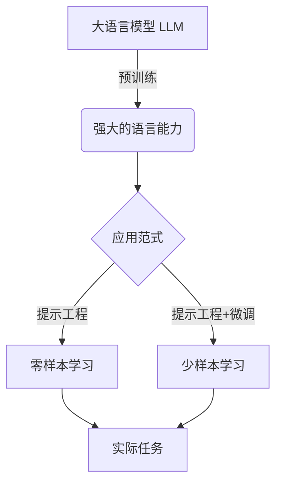

# 大语言模型应用指南：基于提示的工具

## 1. 背景介绍
### 1.1 问题的由来
近年来，随着深度学习技术的飞速发展，大语言模型(Large Language Model, LLM)在自然语言处理领域取得了突破性进展。LLM 通过在海量文本数据上进行预训练，能够捕捉语言的内在规律和语义关系，展现出强大的语言理解和生成能力。然而，如何有效利用 LLM 的能力来解决实际问题，成为了业界关注的焦点。

### 1.2 研究现状
目前，业界主要通过提示工程(Prompt Engineering)的方式来应用 LLM。提示工程是指根据具体任务，设计合适的提示语(Prompt)，引导 LLM 生成期望的输出。通过精心设计的提示，可以让 LLM 执行问答、摘要、翻译、文本分类等多种 NLP 任务。一些代表性的研究包括:
- 斯坦福的 GPT-3 论文[^1]展示了通过设计提示让 GPT-3 执行多种 NLP 任务的能力
- Anthropic 公司提出了 Constitutional AI[^2] 的理念，通过提示让 AI 遵循一定的价值观和行为准则
- DeepMind 的 Sparrow[^3] 系统利用提示实现了更安全、可控的对话交互

### 1.3 研究意义
探索 LLM 的提示工程方法具有重要意义:
1. 拓宽 LLM 的应用场景，让 LLM 能够灵活应对各种实际任务
2. 提高 LLM 的可用性，降低使用门槛，让非专业人士也能方便使用
3. 增强 LLM 的可解释性和可控性，让 LLM 的行为更加透明和符合人类价值观
4. 推动 NLP 技术在垂直领域的落地，催生更多创新应用

### 1.4 本文结构
本文将重点探讨 LLM 的提示工程技术及其应用实践。第2部分介绍相关的核心概念；第3部分阐述提示工程的核心原理和方法；第4部分给出提示设计的数学建模；第5部分通过代码实例演示提示的实现；第6部分讨论提示工程的应用场景；第7部分推荐相关工具和资源；第8部分总结全文并展望未来。

## 2. 核心概念与联系
在讨论提示工程之前，我们首先要了解几个核心概念:
- 大语言模型(LLM): 在海量文本语料上预训练得到的语言模型，具备强大的语言理解和生成能力，代表模型有 GPT-3、PaLM、BLOOM 等。
- 提示(Prompt): 在应用 LLM 时，输入给模型的上下文信息，引导模型进行特定任务。提示通常由任务描述、输入、指令等组成。
- 提示工程(Prompt Engineering): 根据具体任务，设计和优化提示的过程，目的是最大程度发挥 LLM 的能力，得到期望的输出结果。
- 零样本学习(Zero-shot Learning): 无需训练样本，直接使用提示让 LLM 执行某个任务。
- 少样本学习(Few-shot Learning): 使用少量训练样本对 LLM 进行微调，然后用提示执行任务。

这些概念间的关系可以用下图表示:



可以看到，提示工程是连接 LLM 能力和实际任务的桥梁。通过设计优化提示，我们可以用零样本或少样本的方式解决各种 NLP 问题。

## 3. 核心算法原理 & 具体操作步骤
### 3.1 算法原理概述
LLM 的训练通常采用自回归语言建模的范式，即根据前面的 token 序列预测下一个 token 的概率分布。形式化地，给定token序列 $x=(x_1,\cdots,x_n)$，语言模型的目标是建模条件概率 $p(x_t|x_{<t})$。预训练阶段通过最大化语料的似然概率来学习模型参数。

应用 LLM 做下游任务时，我们给定一个提示 $p$，将其与输入 $x$ 拼接构造为新的序列 $[p;x]$。然后用 LLM 对该序列进行条件概率建模，得到输出序列 $y=(y_1,\cdots,y_m)$ 的概率分布:

$$p(y|p,x)=\prod_{t=1}^m p(y_t|p,x,y_{<t})$$

解码阶段根据 $p(y|p,x)$ 采样或搜索生成最优输出序列 $\hat{y}$。

### 3.2 算法步骤详解
基于提示的 LLM 应用可以分为以下步骤:
1. 任务分析: 明确任务定义，输入输出格式，评估指标等
2. 提示设计: 根据任务设计提示模板，包括任务描述、输入、指令、样例等
3. 提示优化: 通过启发式规则、搜索、人工反馈等方式迭代优化提示
4. 推理生成: 将优化后的提示输入 LLM，使用采样、beam search 等策略解码生成输出
5. 结果评估: 对生成结果进行人工或自动评估，必要时回到步骤 3 继续优化

其流程可以用下图表示:


### 3.3 算法优缺点
基于提示的方法具有以下优点:
- 无需训练，即可让 LLM 适应新任务，大大节省计算资源
- 提示可以人工编辑，方便控制 LLM 行为，提高可解释性
- 可复用性强，优秀的提示可以迁移到多个任务场景

同时也存在一些局限:
- 对提示的质量依赖大，需要专家设计，门槛较高  
- 输出不够可控，容易生成不相关或有害内容
- 难以处理需要推理的复杂任务

### 3.4 算法应用领域
得益于 LLM 的强大语言能力，基于提示的方法可以广泛应用于各种 NLP 任务，如:
- 问答: 通过提示让 LLM 根据背景知识回答问题
- 文本分类: 用提示描述分类标准，让 LLM 判断文本类别
- 文本生成: 用提示控制 LLM 生成特定风格、主题的文本
- 对话: 用提示引导 LLM 进行多轮对话交互，扮演不同角色
- 信息抽取: 用提示让 LLM 从文本中抽取结构化信息
- 机器翻译: 用提示指定源语言和目标语言，让 LLM 进行翻译

除了 NLP，提示工程也开始应用到如代码生成、图像理解、语音识别等领域，展现出广阔前景。

## 4. 数学模型和公式 & 详细讲解 & 举例说明
### 4.1 数学模型构建
我们可以用概率图模型[^4]来刻画提示工程过程。设任务空间为 $\mathcal{T}$，输入空间为 $\mathcal{X}$，提示空间为 $\mathcal{P}$，输出空间为 $\mathcal{Y}$。给定任务 $\tau\in\mathcal{T}$，我们要找到最优提示 $p^*\in\mathcal{P}$:

$$p^*=\arg\max_{p\in\mathcal{P}} \mathbb{E}_{x\sim\mathcal{D}_\tau}[\mathcal{R}(x,y,\tau)]$$

其中 $\mathcal{D}_\tau$ 为任务 $\tau$ 的输入分布，$\mathcal{R}$ 为评估函数，衡量输入 $x$ 在提示 $p$ 下得到输出 $y$ 的质量。直观地，我们要找到在任务输入分布上平均性能最优的提示。

生成 $y$ 的过程可以建模为:

$$y=\arg\max_{y\in\mathcal{Y}} p(y|x,p)$$

即在给定输入 $x$ 和提示 $p$ 时，搜索使条件概率 $p(y|x,p)$ 最大的输出 $y$。

### 4.2 公式推导过程
对数似然 $\mathcal{L}$ 为:

$$\begin{aligned}
\mathcal{L} &= \mathbb{E}_{x\sim\mathcal{D}_\tau}[\log p(y|x,p)] \\
&= \mathbb{E}_{x\sim\mathcal{D}_\tau}[\sum_{t=1}^m \log p(y_t|x,p,y_{<t})]
\end{aligned}$$

最优提示 $p^*$ 应最大化对数似然 $\mathcal{L}$。但由于 $\mathcal{D}_\tau$ 未知，$\mathcal{L}$ 难以直接优化。实践中通常用评估函数 $\mathcal{R}$ 的经验均值来近似:

$$\hat{p}^*=\arg\max_{p\in\mathcal{P}} \frac{1}{n}\sum_{i=1}^n \mathcal{R}(x^{(i)},y^{(i)},\tau)$$

其中 $(x^{(i)},y^{(i)})$ 为任务 $\tau$ 的第 $i$ 个样本。可以通过搜索、强化学习等方法求解 $\hat{p}^*$。

### 4.3 案例分析与讲解
我们以情感分类任务为例。假设提示模板为:

```
请判断以下文本的情感倾向(积极/消极):

文本: {input}
情感:
```

其中 `{input}` 为输入文本占位符。优化过程如下:
1. 准备少量样本，如 "这部电影真是棒极了！(积极)"、"服务态度太差了(消极)" 等
2. 用提示模板填充样本构造提示，输入 LLM 生成情感标签
3. 评估生成标签的准确率，通过启发式规则修改提示模板
4. 重复 2-3 步骤，直到准确率达标或达到迭代上限

假设优化后的提示为:

```
以下是一段文本，请判断它的情感倾向是积极还是消极。

文本: {input}

情感倾向(请用一个词回答): 
```

我们用该提示在测试集上进行推理，得到准确率为 85%，优于初始提示的 70%，说明提示优化是有效的。

### 4.4 常见问题解答
**Q**: 评估函数 $\mathcal{R}$ 如何设计？  
**A**: 可根据任务类型设计不同 $\mathcal{R}$。对于分类、情感分析等任务，可用准确率、F1 等指标；对于摘要、翻译等任务，可用 ROUGE、BLEU 等指标；对于开放域对话等任务，可结合人工评估。

**Q**: 提示优化的搜索空间有多大？  
**A**: 取决于提示模板的设计。过于灵活的模板(如自由文本)搜索空间巨大，不易优化。建议先设计结构化的模板，再在各组件上搜索，如改变指令语句、调整样例数量、修改标点符号等。

**Q**: 除了搜索，还有哪些提示优化方法？  
**A**: 主要有:
1. 启发式方法: 总结一些优化提示的经验法则，人工迭代改进
2. 基于梯度的方法: 将提示参数化，通过梯度下降等方法优化[^5]
3. 强化学习: 将提示优化建模为强化学习任务，用 RL 算法求解[^6]
4. 人类反馈: 收集人类对 LLM 输出的评价，指导提示优化[^7]

实践中可结合多种方法，充分利用人机互补的优势。

## 5. 项目实践：代码实例和详细解释说明
### 5.1 开发环境搭建
本项目使用 Python 3 和 