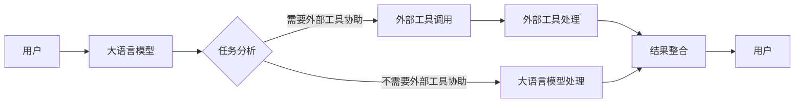

# 大语言模型应用指南：外部工具

## 1. 背景介绍
### 1.1 问题的由来
近年来，随着深度学习技术的快速发展，大语言模型(Large Language Models, LLMs)在自然语言处理(Natural Language Processing, NLP)领域取得了巨大突破。从GPT-3到ChatGPT，大语言模型展现出了惊人的语言理解和生成能力，引发了学术界和工业界的广泛关注。然而，大语言模型在实际应用中仍面临着诸多挑战，其中一个关键问题就是如何将大语言模型与外部工具进行有效集成，以实现更加智能化的应用。

### 1.2 研究现状
目前，学术界和工业界已经开始探索将大语言模型与外部工具进行集成的方法。微软的GPT-3 Codex[1]通过与代码编辑器集成，实现了根据自然语言描述自动生成代码的功能。OpenAI的WebGPT[2]通过与搜索引擎和网页分析工具集成，可以根据用户的问题检索相关网页并给出答案。DeepMind的Sparrow[3]通过与知识库和对话管理系统集成，实现了更加自然流畅的对话交互。这些研究表明，将大语言模型与外部工具进行集成是提升其应用能力的重要途径。

### 1.3 研究意义
探索大语言模型与外部工具的集成方法，对于推动大语言模型在实际应用中的落地具有重要意义：

1. 拓展大语言模型的应用场景。通过与不同领域的外部工具进行集成，可以将大语言模型应用到更加广泛的任务中，如编程、信息检索、知识问答等。

2. 提升大语言模型的性能表现。利用外部工具提供的领域知识和计算能力，可以弥补大语言模型在特定领域知识和计算能力方面的不足，提升其在实际任务中的性能表现。

3. 促进人机协作和人机共生。通过大语言模型与外部工具的无缝集成，可以实现人机之间更加自然、高效的交互与协作，推动人机共生的发展。

### 1.4 本文结构
本文将围绕大语言模型与外部工具的集成展开深入探讨。第2节介绍大语言模型和外部工具的核心概念及二者之间的关系。第3节重点阐述将大语言模型与外部工具进行集成的核心算法原理和具体操作步骤。第4节给出集成过程涉及的数学模型和公式，并结合实例进行详细讲解。第5节通过代码实例，演示如何实现大语言模型与外部工具的集成。第6节分析大语言模型与外部工具集成的实际应用场景。第7节推荐相关的学习资源、开发工具和研究论文。第8节总结全文，并对大语言模型与外部工具集成的未来发展趋势和面临的挑战进行展望。

## 2. 核心概念与联系
在探讨大语言模型与外部工具的集成之前，我们首先需要明确以下核心概念：

1. 大语言模型：是一种基于深度神经网络的语言模型，通过在大规模文本数据上进行预训练，可以学习到丰富的语言知识和语言理解能力。代表模型包括GPT系列[4]、BERT系列[5]、T5[6]等。

2. 外部工具：泛指独立于大语言模型之外，可以执行特定功能或提供特定服务的工具或系统。例如搜索引擎、知识库、代码编辑器、图像处理工具、语音识别系统等。

3. 工具集成：指将大语言模型与一个或多个外部工具进行连接、交互和协作，形成一个完整的应用系统。集成后的系统可以利用大语言模型的语言理解和生成能力，同时利用外部工具提供的专业功能，实现更加智能化的应用。

大语言模型和外部工具之间存在着紧密的联系。一方面，大语言模型可以作为外部工具的自然语言交互接口，使得用户可以使用自然语言与外部工具进行交互。另一方面，外部工具可以为大语言模型提供专业领域知识和计算能力的补充，扩展其应用范围。二者的有机结合，可以实现1+1>2的效果。

下图使用Mermaid流程图展示了大语言模型与外部工具集成的基本架构：



## 3. 核心算法原理 & 具体操作步骤
### 3.1 算法原理概述
将大语言模型与外部工具进行集成的核心算法原理可以概括为以下三个步骤：

1. 任务分析：对用户输入的自然语言指令进行分析，判断是否需要调用外部工具协助完成任务。
2. 工具调用：如果需要外部工具协助，则根据任务类型选择合适的外部工具，并将任务请求发送给外部工具进行处理。
3. 结果整合：将外部工具返回的处理结果与大语言模型的输出进行整合，形成最终的用户响应。

### 3.2 算法步骤详解

**步骤1：任务分析**

1. 对用户输入的自然语言指令进行语义理解，提取关键信息，如任务类型、任务参数等。常用的方法包括命名实体识别、关键词提取、语义角色标注等。
2. 根据提取的关键信息，判断任务是否需要外部工具协助。可以通过构建任务类型与外部工具的映射关系，或使用分类模型进行判断。

**步骤2：工具调用**

1. 如果任务需要外部工具协助，则根据任务类型选择对应的外部工具。可以预先建立任务类型与外部工具的映射表。
2. 将任务请求发送给选定的外部工具进行处理。需要根据外部工具的API接口，将任务请求转换为合适的格式。
3. 接收外部工具返回的处理结果。需要对返回结果进行解析和异常处理。

**步骤3：结果整合**

1. 将外部工具返回的处理结果与大语言模型的输出进行整合。需要考虑结果的格式、相关性和一致性。
2. 对整合后的结果进行自然语言生成，形成最终的用户响应。可以使用模板生成、文本摘要等技术，生成流畅、连贯的自然语言响应。

### 3.3 算法优缺点
优点：
1. 扩展了大语言模型的应用范围，使其能够处理更加专业和复杂的任务。
2. 提升了大语言模型的性能表现，弥补了其在特定领域知识和计算能力方面的不足。
3. 实现了人机之间更加自然、高效的交互与协作。

缺点：
1. 增加了系统复杂度，需要额外的工作来进行外部工具的集成和适配。
2. 可能引入外部工具的不稳定性和局限性，影响整体系统的鲁棒性。
3. 需要权衡大语言模型和外部工具之间的计算资源分配和调用开销。

### 3.4 算法应用领域
大语言模型与外部工具的集成可以应用于以下领域：

1. 编程助手：通过与代码编辑器、编译器、调试器等工具的集成，辅助用户进行编程任务。
2. 信息检索：通过与搜索引擎、知识库等工具的集成，协助用户进行信息检索和知识问答。
3. 数据分析：通过与数据处理、可视化等工具的集成，帮助用户进行数据分析和解释。
4. 智能控制：通过与硬件设备、传感器等工具的集成，实现设备的语音控制和智能化操作。
5. 创意生成：通过与图像处理、音乐生成等工具的集成，辅助用户进行创意内容的生成。

## 4. 数学模型和公式 & 详细讲解 & 举例说明
### 4.1 数学模型构建
我们可以使用概率图模型来描述大语言模型与外部工具集成的过程。设用户输入的自然语言指令为$x$，大语言模型的输出为$y$，外部工具的处理结果为$z$，则集成后的最终输出$\hat{y}$可以表示为：

$$
\hat{y} = \arg\max_{y} P(y|x,z) = \arg\max_{y} \frac{P(x,y,z)}{P(x,z)}
$$

其中，$P(x,y,z)$表示联合概率分布，$P(x,z)$表示边缘概率分布。

假设大语言模型的输出$y$和外部工具的处理结果$z$在给定用户输入$x$的条件下相互独立，则有：

$$
P(x,y,z) = P(x)P(y|x)P(z|x)
$$

将上式代入，可得：

$$
\hat{y} = \arg\max_{y} \frac{P(x)P(y|x)P(z|x)}{P(x)P(z|x)} = \arg\max_{y} P(y|x)
$$

这表明，集成后的最终输出$\hat{y}$可以通过大语言模型在给定用户输入$x$的条件下生成的概率分布$P(y|x)$来决定。

### 4.2 公式推导过程
为了求解$\hat{y} = \arg\max_{y} P(y|x)$，我们可以使用Beam Search算法[7]。设束宽度为$k$，搜索步数为$t$，则Beam Search的过程可以表示为：

$$
\begin{aligned}
\hat{y}_t &= \arg\max_{y_{1:t}} P(y_{1:t}|x) \\
&= \arg\max_{y_{1:t}} \prod_{i=1}^t P(y_i|y_{1:i-1},x) \\
&\approx \arg\max_{y_{1:t} \in \mathcal{B}_t} \prod_{i=1}^t P(y_i|y_{1:i-1},x)
\end{aligned}
$$

其中，$y_{1:t}$表示长度为$t$的输出序列，$\mathcal{B}_t$表示束搜索过程中保留的$k$个最优候选序列集合。

在每一步搜索中，我们选择概率最高的$k$个候选序列，作为下一步搜索的起点。重复这一过程，直到达到预设的最大搜索步数或生成了特殊的结束标记。

### 4.3 案例分析与讲解
下面我们以一个具体的例子来说明大语言模型与外部工具集成的过程。

假设用户输入的自然语言指令$x$为"帮我写一个快速排序的Python代码"。

**步骤1：任务分析**

通过对$x$进行语义理解，我们可以提取出以下关键信息：
- 任务类型：代码生成
- 编程语言：Python
- 算法：快速排序

根据任务类型，我们判断需要调用外部的代码编辑器工具来协助完成任务。

**步骤2：工具调用**

根据编程语言Python，我们选择了一个支持Python的在线代码编辑器作为外部工具。将任务请求发送给该编辑器，并接收返回的代码处理结果$z$。

**步骤3：结果整合**

我们将外部编辑器返回的代码处理结果$z$与大语言模型生成的代码解释$y$进行整合，形成最终的用户响应$\hat{y}$，例如：

```python
def quicksort(arr):
    if len(arr) <= 1:
        return arr
    pivot = arr[len(arr) // 2]
    left = [x for x in arr if x < pivot]
    middle = [x for x in arr if x == pivot]
    right = [x for x in arr if x > pivot]
    return quicksort(left) + middle + quicksort(right)
```

这是一个使用Python实现快速排序算法的代码示例。快速排序是一种高效的排序算法，其基本思想是通过分治法将数组划分为两个子数组，然后递归地对子数组进行排序。

具体步骤如下：
1. 选择一个基准元素(pivot)，一般选择数组的中间元素。
2.