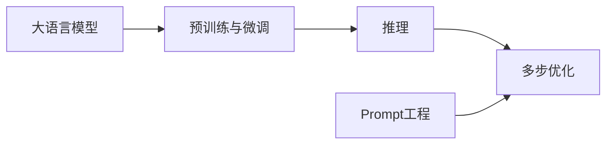

# 大语言模型应用指南：多步优化中的预测

关键词：大语言模型、预训练模型、微调、推理、多步优化、预测、Prompt工程、知识蒸馏、模型压缩

## 1. 背景介绍
### 1.1  问题的由来
随着人工智能技术的飞速发展，大语言模型(Large Language Models, LLMs)在自然语言处理(Natural Language Processing, NLP)领域取得了突破性的进展。预训练语言模型如BERT、GPT等，通过在海量无标注语料上进行自监督预训练，可以学习到丰富的语言知识和通用语义表示，并在下游任务上取得了显著的性能提升。然而，这些大型语言模型往往包含数以亿计的参数，推理计算开销巨大，难以直接应用于实际场景。因此，如何在保证模型性能的同时提高推理效率，成为了大语言模型应用落地面临的重要挑战。

### 1.2  研究现状
针对大语言模型推理效率问题，学术界和工业界提出了一系列的优化方法。其中，知识蒸馏(Knowledge Distillation)通过从大模型中提取知识来训练参数量更少的小模型，在一定程度上缓解了效率问题。此外，模型量化(Quantization)、剪枝(Pruning)等模型压缩技术也被广泛研究。近年来，Prompt工程(Prompt Engineering)作为一种新兴的范式受到了广泛关注，通过精心设计输入示例(in-context learning)来引导模型进行特定任务推理，在小样本学习等场景下表现出优异的性能。

### 1.3  研究意义
尽管已有大量工作致力于优化大语言模型的推理效率，但现有方法仍存在一些局限性。知识蒸馏虽然能显著压缩模型体积，但蒸馏过程往往需要大量的计算资源和时间成本。模型压缩技术对模型架构有较强的依赖性，泛化能力有限。Prompt工程虽然通过示例引导模型推理，但对于复杂任务往往需要精心设计prompt，工程化难度较大。因此，探索更加高效、灵活的大语言模型应用优化方法具有重要的研究价值和实践意义。本文将重点介绍一种基于多步优化的大语言模型应用方法，通过迭代式的预测优化来提升推理性能。

### 1.4  本文结构
本文将围绕大语言模型应用中的多步优化展开讨论。第2节介绍相关的核心概念及其内在联系。第3节详细阐述多步优化算法的原理和具体操作步骤。第4节建立多步优化的数学模型，并给出公式推导和案例分析。第5节通过代码实例演示多步优化的项目实践。第6节讨论多步优化在实际应用场景中的价值。第7节推荐相关的工具和学习资源。第8节总结全文，并展望未来的发展趋势与挑战。第9节附录了常见问题与解答。

## 2. 核心概念与联系
在探讨大语言模型应用中的多步优化之前，有必要先明确几个核心概念：

- 大语言模型(Large Language Models, LLMs)：指参数量巨大(通常在数亿到数千亿量级)的预训练语言模型，如GPT-3、PaLM、BLOOM等。它们通过在海量语料上进行自监督预训练，可以学习到丰富的语言知识和通用语义表示。

- 预训练与微调(Pre-training & Fine-tuning)：预训练指在大规模无标注语料上进行自监督学习，使模型掌握通用语言知识。微调指在特定任务的标注数据上对预训练模型进行监督学习，使其适应下游任务。这种"预训练-微调"范式是大语言模型的主要训练方式。

- 推理(Inference)：指使用训练好的模型对新样本进行预测的过程。对于大语言模型，推理阶段的计算开销通常非常大，是应用效率的主要瓶颈。

- 多步优化(Multi-step Optimization)：一种迭代式的预测优化方法。传统的推理过程通常是一步到位，直接基于输入生成预测结果。而多步优化将推理过程分解为多个步骤，在每一步中基于之前的预测结果对当前预测进行优化，最终得到更加精准的输出。

- Prompt工程(Prompt Engineering)：一种新兴的大语言模型应用范式。通过设计精巧的输入示例(prompt)来引导模型进行特定任务推理，可以实现小样本学习、知识引入等功能，提高模型的泛化和表达能力。

这些概念之间有着紧密的联系。大语言模型是多步优化的基础，而多步优化是提高大语言模型推理效率的重要手段。Prompt工程可以与多步优化相结合，通过示例引导模型在每个优化步骤中生成更加准确、连贯的预测结果。下图展示了这些概念之间的关系：

## 3. 核心算法原理 & 具体操作步骤
### 3.1  算法原理概述
多步优化的核心思想是将推理过程分解为多个步骤，在每一步中基于之前的预测结果对当前预测进行优化。具体来说，假设我们的目标是基于输入 $x$ 生成预测输出 $y$，传统的一步推理可以表示为：

$$y = f_\theta(x)$$

其中 $f_\theta$ 表示参数为 $\theta$ 的大语言模型。而多步优化将推理过程分解为 $T$ 步，每一步的预测可以表示为：

$$y_t = f_\theta(x, y_{1:t-1}), t=1,2,...,T$$

其中 $y_{1:t-1}$ 表示前 $t-1$ 步的预测结果。可以看出，每一步的预测都依赖于之前步骤的输出，通过迭代优化来逐步提高预测的准确性和连贯性。

### 3.2  算法步骤详解
多步优化算法的具体操作步骤如下：

1. 初始化：将输入 $x$ 作为初始预测 $y_0$。

2. 迭代优化：对于 $t=1,2,...,T$：
   
   a. 将前 $t-1$ 步的预测结果 $y_{1:t-1}$ 与输入 $x$ 拼接，作为当前步的输入：
   
   $$\tilde{x}_t = [x; y_{1:t-1}]$$
   
   b. 将 $\tilde{x}_t$ 输入大语言模型，生成当前步的预测 $y_t$：
   
   $$y_t = f_\theta(\tilde{x}_t)$$
   
   c. 对 $y_t$ 进行后处理(如截断、过滤等)，得到优化后的预测 $\hat{y}_t$。

3. 输出：将最后一步的预测结果 $\hat{y}_T$ 作为最终输出。

### 3.3  算法优缺点
多步优化算法的主要优点包括：

- 提高预测准确性：通过迭代优化，可以在每一步中纠正之前预测的错误，生成更加准确、连贯的输出。

- 增强模型泛化能力：多步优化可以看作一种自适应的fine-tuning过程，使模型在推理过程中不断适应当前任务，提高泛化能力。

- 灵活可控：可以通过调节迭代步数 $T$、设计后处理策略等方式来权衡效率和性能，适应不同的应用需求。

但多步优化也存在一些局限性：

- 推理延迟：迭代优化过程会增加推理延迟，尤其是当迭代步数 $T$ 较大时。需要在效率和性能间进行权衡。

- 误差传播：如果早期步骤的预测出现错误，可能会影响后续步骤，导致误差传播和累积。需要设计合适的纠错机制。

- 资源消耗：每一步优化都需要进行一次完整的推理，增加了计算和存储开销。

### 3.4  算法应用领域
多步优化在大语言模型的诸多应用领域中都有广阔的前景，例如：

- 文本生成：通过多步优化，可以生成更加流畅、连贯的长文本，如文章、对话、故事等。

- 问答系统：多步优化可以引入多轮交互，根据用户的反馈动态调整回答策略，提供更加精准、个性化的答案。

- 机器翻译：将源语言文本和前几步翻译结果作为输入，迭代优化以提高翻译质量，特别是在语义一致性和流畅度方面。

- 文本摘要：生成摘要时，多步优化可以考虑已生成摘要与原文的相关性，动态调整摘要的信息量和侧重点。

- 代码生成：将自然语言描述和已生成代码片段作为输入，多步优化以提高代码的语法正确性和功能完整性。

## 4. 数学模型和公式 & 详细讲解 & 举例说明
### 4.1  数学模型构建
为了形式化地描述多步优化过程，我们可以将其建模为一个马尔可夫决策过程(Markov Decision Process, MDP)。在每个优化步骤 $t$，模型根据当前状态 $s_t$（包括输入 $x$ 和之前的预测 $y_{1:t-1}$）采取行动 $a_t$（生成当前预测 $y_t$），并根据某个奖励函数 $r(s_t, a_t)$ 评估行动的好坏。模型的目标是最大化总奖励：

$$R = \sum_{t=1}^T r(s_t, a_t)$$

具体来说，状态 $s_t$ 可以表示为输入 $x$ 和前 $t-1$ 步预测 $y_{1:t-1}$ 的拼接：

$$s_t = [x; y_{1:t-1}]$$

行动 $a_t$ 对应于在状态 $s_t$ 下使用大语言模型 $f_\theta$ 生成当前预测 $y_t$：

$$a_t = y_t = f_\theta(s_t)$$

奖励函数 $r(s_t, a_t)$ 衡量在状态 $s_t$ 下采取行动 $a_t$ 的好坏。可以根据任务的特点设计不同的奖励函数，例如：

- 对于文本生成任务，可以使用语言模型的对数似然作为奖励，鼓励生成高概率、流畅的文本。

- 对于问答任务，可以使用答案与参考答案的相似度(如ROUGE、BLEU等指标)作为奖励，鼓励生成准确、完整的答案。

- 对于机器翻译任务，可以使用翻译结果与参考译文的BLEU分数作为奖励，鼓励生成高质量的翻译。

### 4.2  公式推导过程
根据马尔可夫决策过程的理论，多步优化可以看作是在状态空间 $\mathcal{S}$ 和行动空间 $\mathcal{A}$ 上求解最优策略 $\pi^*$：

$$\pi^* = \arg\max_\pi \mathbb{E}_{\tau \sim \pi}[R(\tau)]$$

其中 $\tau = (s_1, a_1, s_2, a_2, ..., s_T, a_T)$ 表示一个完整的优化轨迹，$R(\tau) = \sum_{t=1}^T r(s_t, a_t)$ 表示轨迹的总奖励。

求解最优策略 $\pi^*$ 的一种常见方法是策略梯度(Policy Gradient)算法。策略梯度定义为总奖励 $R(\tau)$ 对策略 $\pi_\theta$ 参数 $\theta$ 的梯度：

$$\nabla_\theta J(\theta) = \mathbb{E}_{\tau \sim \pi_\theta}[R(\tau) \nabla_\theta \log \pi_\theta(\tau)]$$

其中 $\pi_\theta(\tau) = \prod_{t=1}^T \pi_\theta(a_t|s_t)$ 表示在策略 $\pi_\theta$ 下生成轨迹 $\tau$ 的概率。

根据策略梯度定理，我们可以通过以下步骤来更新策略参数 $\theta$：

1. 在当前策略 $\pi_\theta$ 下采