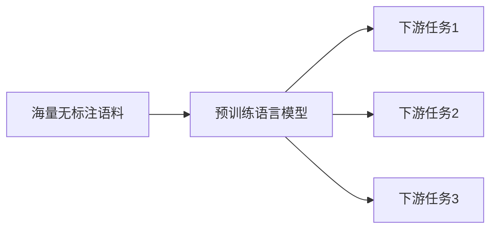

# 大语言模型应用指南：微调

## 1. 背景介绍

### 1.1 问题的由来
近年来，随着深度学习技术的快速发展，大规模预训练语言模型（Pre-trained Language Models，PLMs）在自然语言处理（NLP）领域取得了突破性进展。这些模型通过在海量无标注文本数据上进行自监督预训练，学习到了丰富的语言知识和通用语义表示，为下游NLP任务提供了强大的迁移学习能力。然而，直接将预训练模型应用于具体任务时，往往难以充分发挥其潜力。为了进一步提升模型在特定领域或任务上的性能，微调（Fine-tuning）技术应运而生。

### 1.2 研究现状
目前，大语言模型微调已成为NLP领域的研究热点之一。诸如BERT、GPT、RoBERTa等预训练模型在多个基准测试中取得了state-of-the-art的表现，证明了微调的有效性。研究人员提出了各种微调策略，如指令微调（Instruction Tuning）、提示微调（Prompt Tuning）、参数高效微调（Parameter-Efficient Fine-Tuning）等，不断拓展微调的应用范围和提升微调效果。同时，微调技术也被广泛应用于问答、文本分类、命名实体识别、机器翻译等实际场景，极大地推动了NLP技术的产业化进程。

### 1.3 研究意义
深入研究大语言模型微调技术，对于充分发掘预训练模型的潜力、提升下游任务性能、加速NLP技术落地具有重要意义。一方面，微调可以显著提高模型在特定领域的适应能力，使其更好地理解和处理领域内的专业知识和语言风格。另一方面，微调降低了针对新任务开发模型的门槛，大大缩短了NLP应用的开发周期，为中小企业和个人开发者带来了便利。此外，微调相关的研究还有助于探索语言模型的内在机制和泛化能力，为构建更加鲁棒、高效、可解释的NLP模型提供了思路。

### 1.4 本文结构
本文将全面介绍大语言模型微调的相关知识，内容涵盖微调的核心概念、主流算法、数学原理、代码实践等多个方面。第2章阐述微调的核心概念及其与预训练、下游任务的关系。第3章详细讲解微调的算法原理和具体操作步骤。第4章介绍微调涉及的数学模型和公式，并给出案例分析。第5章提供微调的代码实例和详细解释。第6章讨论微调技术的实际应用场景和未来展望。第7章推荐微调相关的学习资源、开发工具和文献。第8章总结全文，并对微调技术的发展趋势和挑战进行展望。

## 2. 核心概念与联系

微调是在特定任务上对预训练语言模型进行二次训练的过程，旨在使模型适应任务的数据分布和目标函数。通过微调，模型可以继承预训练阶段学到的通用语言知识，同时针对性地学习任务相关的模式和知识。微调一般分为两个阶段：

1. 预训练阶段：在大规模无标注语料库上进行自监督学习，捕捉语言的统计规律和语义信息。主流的预训练范式包括BERT的Masked Language Modeling (MLM)和Next Sentence Prediction (NSP)、GPT的Causal Language Modeling (CLM)等。

2. 微调阶段：在下游任务的有标注数据上对预训练模型进行监督学习，更新部分或全部模型参数。微调时一般需要根据任务的特点设计输入/输出格式、损失函数、超参数等。常见的微调任务如文本分类、序列标注、问答等。

预训练、微调与下游任务的关系可以用下图表示：

可以看出，预训练模型是连接无标注语料和有标注任务的桥梁。通过在海量语料上学习通用语言知识，预训练模型可以更高效地适应不同的下游任务，降低了任务特定数据的需求。微调则是发挥预训练模型潜力、进一步提升任务性能的关键一步。

## 3. 核心算法原理 & 具体操作步骤

### 3.1 算法原理概述
大语言模型微调的核心是利用预训练模型作为下游任务的特征提取器和初始化参数，在任务数据上对模型进行二次训练，从而学习任务特定的模式。微调过程可以形式化地表示为：

$$
\theta^* = \arg\min_\theta \mathcal{L}(\theta; \mathcal{D})
$$

其中，$\theta$ 表示模型参数，$\mathcal{D}$ 表示下游任务的有标注数据集，$\mathcal{L}$ 表示任务的损失函数。微调的目标是找到最小化任务损失函数的模型参数 $\theta^*$。

### 3.2 算法步骤详解
微调的具体步骤如下：

1. 加载预训练模型：从模型库中加载预训练的语言模型，如BERT、GPT等。

2. 准备任务数据：对下游任务的数据进行预处理，构建符合模型输入格式的数据集。一般需要将文本转换为token序列，并根据任务类型生成相应的标签。

3. 设计微调层：根据任务的特点，在预训练模型之上设计微调层。常见的做法是在模型顶层添加一个全连接层，将模型的输出映射到任务的标签空间。对于序列标注等任务，还需要针对每个token的输出设计微调层。

4. 定义损失函数：根据任务类型定义损失函数，如交叉熵损失、均方误差损失等。对于一些复杂任务，可能需要设计专门的损失函数。

5. 设置优化策略：选择优化算法（如Adam、AdamW等）和超参数（如学习率、batch size等）。一般建议使用较小的学习率和较大的batch size，以防止过拟合。

6. 训练模型：在任务数据上对模型进行微调训练，通过反向传播更新模型参数。为了提高训练效率和泛化能力，可以使用梯度累积、学习率调度、早停等技巧。

7. 评估模型：在验证集或测试集上评估微调后的模型性能，根据任务的评价指标（如准确率、F1值等）判断微调的效果。如果性能不理想，可以调整超参数或修改微调层设计，重新进行微调。

### 3.3 算法优缺点
微调算法的优点包括：
- 充分利用了预训练模型学习到的通用语言知识，可以显著提高下游任务性能，尤其是在小样本场景下。
- 降低了针对新任务开发模型的门槛，缩短了开发周期，提高了开发效率。
- 通过设计不同的微调层和损失函数，可以灵活地适应各种类型的NLP任务。

微调算法的缺点包括：
- 对于某些特定领域或风格迥异的任务，预训练模型的知识可能无法很好地迁移，微调的效果有限。
- 微调需要存储完整的预训练模型参数，对存储和计算资源有较高要求。
- 微调过程中需要谨慎选择超参数，不当的设置可能导致过拟合或欠拟合。

### 3.4 算法应用领域
微调算法几乎可以应用于所有的NLP任务，包括但不限于：
- 文本分类：情感分析、新闻分类、意图识别等。
- 序列标注：命名实体识别、词性标注、语义角色标注等。  
- 问答：阅读理解、开放域问答等。
- 文本生成：摘要生成、对话生成、机器翻译等。
- 语言理解：自然语言推理、常识推理等。

此外，微调算法也被拓展到了语音识别、图像分类等其他领域，展现出了广阔的应用前景。

## 4. 数学模型和公式 & 详细讲解 & 举例说明

### 4.1 数学模型构建
大语言模型微调可以看作是一个条件概率建模问题。给定预训练模型参数 $\theta_0$ 和下游任务数据集 $\mathcal{D} = \{(x_i, y_i)\}_{i=1}^N$，其中 $x_i$ 表示第 $i$ 个样本的输入文本，$y_i$ 表示对应的标签，微调的目标是学习一个条件概率分布 $p(y|x;\theta)$，使得对于任意一个样本 $(x,y)$，模型能够根据输入文本 $x$ 准确预测标签 $y$。

形式化地，微调的优化目标可以表示为最小化负对数似然损失：

$$
\mathcal{L}(\theta; \mathcal{D}) = -\frac{1}{N} \sum_{i=1}^N \log p(y_i|x_i; \theta)
$$

其中，$\theta$ 表示微调后的模型参数。假设样本之间相互独立，则有：

$$
p(y_i|x_i; \theta) = \prod_{t=1}^T p(y_{i,t}|x_i, y_{i,<t}; \theta)
$$

其中，$T$ 表示标签序列的长度，$y_{i,t}$ 表示第 $i$ 个样本的第 $t$ 个标签，$y_{i,<t}$ 表示第 $i$ 个样本的前 $t-1$ 个标签。

### 4.2 公式推导过程
对于分类任务，假设标签空间为 $\mathcal{Y} = \{1,2,\dots,K\}$，则条件概率分布可以通过 softmax 函数计算：

$$
p(y_{i,t}=k|x_i, y_{i,<t}; \theta) = \frac{\exp(f_k(x_i, y_{i,<t}; \theta))}{\sum_{j=1}^K \exp(f_j(x_i, y_{i,<t}; \theta))}
$$

其中，$f_k(x_i, y_{i,<t}; \theta)$ 表示模型对第 $i$ 个样本的第 $t$ 个位置标签为 $k$ 的得分。将上式代入负对数似然损失，可得：

$$
\mathcal{L}(\theta; \mathcal{D}) = -\frac{1}{N} \sum_{i=1}^N \sum_{t=1}^T \log \frac{\exp(f_{y_{i,t}}(x_i, y_{i,<t}; \theta))}{\sum_{j=1}^K \exp(f_j(x_i, y_{i,<t}; \theta))}
$$

对于生成任务，假设词表大小为 $V$，则条件概率分布可以通过 softmax 函数计算：

$$
p(y_{i,t}=w|x_i, y_{i,<t}; \theta) = \frac{\exp(f_w(x_i, y_{i,<t}; \theta))}{\sum_{v=1}^V \exp(f_v(x_i, y_{i,<t}; \theta))}
$$

其中，$w$ 表示词表中的一个单词，$f_w(x_i, y_{i,<t}; \theta)$ 表示模型对第 $i$ 个样本的第 $t$ 个位置生成单词 $w$ 的得分。将上式代入负对数似然损失，可得：

$$
\mathcal{L}(\theta; \mathcal{D}) = -\frac{1}{N} \sum_{i=1}^N \sum_{t=1}^T \log \frac{\exp(f_{y_{i,t}}(x_i, y_{i,<t}; \theta))}{\sum_{v=1}^V \exp(f_v(x_i, y_{i,<t}; \theta))}
$$

### 4.3 案例分析与讲解
下面以情感分类任务为例，说明如何应用微调的数学模型。假设我们要对一个电影评论数据集进行情感二分类，标签空间为 $\mathcal{Y} = \{0, 1\}$，其中 0 表示负面情感，1 表示正面情感。

首先，我们将每个电影评论转换为 BERT 的输入格式，即在评论前后分别添加 [CLS] 和 [SEP] 标记，并将词转换为相应的 token ID。然后，在 BERT 模型的顶层添加一个全连接层，将 [CLS] 位置的隐