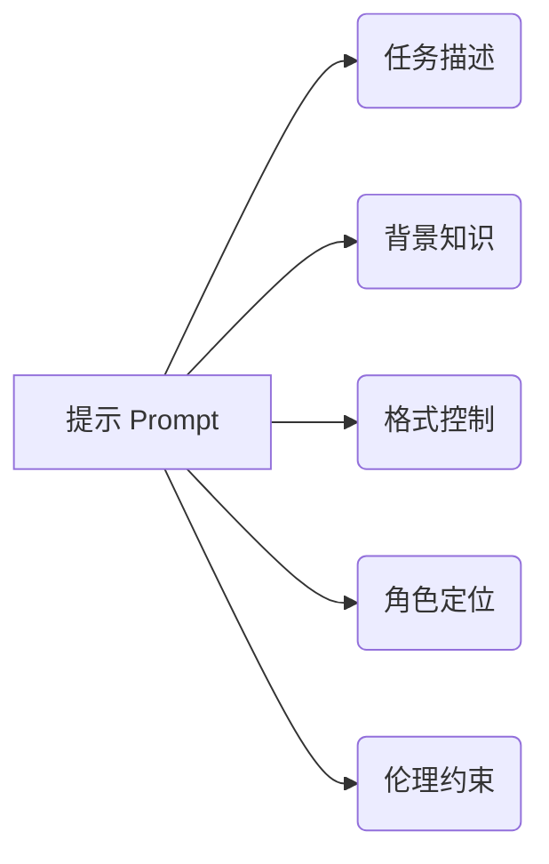

# 大语言模型应用指南：提示的构成

作者：禅与计算机程序设计艺术 / Zen and the Art of Computer Programming

## 1. 背景介绍
### 1.1  问题的由来
随着人工智能技术的飞速发展,大语言模型(Large Language Models,LLMs)已成为自然语言处理(Natural Language Processing,NLP)领域的研究热点。LLMs 通过在海量文本数据上进行无监督预训练,能够学习到丰富的语言知识和常识,在机器翻译、问答系统、对话生成等任务上取得了显著的效果提升。然而,如何有效地利用 LLMs 的能力,为下游任务提供高质量的服务,仍然是一个值得深入探讨的问题。

### 1.2  研究现状 
目前,学术界和工业界已经提出了多种利用 LLMs 的方法。其中,提示工程(Prompt Engineering)是一种简单而有效的范式。通过设计合理的提示(Prompt),可以引导 LLMs 生成符合特定需求的文本。已有研究表明,精心设计的提示能够显著提升 LLMs 在下游任务上的表现[1][2]。然而,设计优质提示需要深入理解 LLMs 的工作原理,并且需要一定的经验和技巧。如何系统地总结提示的设计方法,指导开发者高效构建应用,仍有待进一步的研究。

### 1.3  研究意义
系统总结提示的构成要素和设计方法,对于推动 LLMs 在实际应用中的落地具有重要意义:

(1) 指导开发者设计优质提示,充分发挥 LLMs 的能力,提升应用质量;

(2) 降低 LLMs 应用开发的门槛,让更多开发者能够快速构建基于 LLMs 的应用;

(3) 推动 LLMs 技术在更广泛的领域得到应用,为人们的生活和工作带来便利。

### 1.4  本文结构
本文将系统阐述提示的构成要素和设计方法,指导开发者构建高质量的 LLMs 应用。全文结构如下:

第2部分介绍提示的核心概念,阐述提示的基本构成要素。

第3部分详细讲解提示的设计算法和操作步骤。

第4部分建立提示设计的数学模型,推导相关公式,并给出案例分析。

第5部分通过代码实例,演示提示的实现过程。

第6部分讨论提示技术的实际应用场景和未来前景。

第7部分推荐提示设计相关的工具和学习资源。

第8部分总结全文,展望提示技术的未来发展趋势和挑战。

第9部分列举常见问题,给出专业解答。

## 2. 核心概念与联系
提示(Prompt)是一段自然语言文本,用于引导语言模型生成符合特定需求的内容。通过精心设计提示,可以控制 LLMs 的输出,使其在特定领域任务中表现出色。

提示的核心要素包括:

(1) 任务描述:明确需要 LLMs 执行的任务,如问答、写作、总结等。

(2) 背景知识:为 LLMs 提供必要的背景信息,引导其进行合理的推理和判断。

(3) 格式控制:规定 LLMs 输出内容的格式,如字数、段落结构、要点等。

(4) 角色定位:为 LLMs 指定代入的角色,使其以特定视角思考问题。

(5) 伦理约束:引导 LLMs 遵守基本的伦理道德规范,避免生成不恰当内容。

通过合理设置以上要素,可以充分发挥 LLMs 的能力,使其输出高质量、符合需求的内容。下图展示了提示的核心要素及其关系:



## 3. 核心算法原理 & 具体操作步骤
### 3.1  算法原理概述
提示的设计可以看作一个优化问题,目标是找到一个最优的提示,使 LLMs 的输出与预期结果尽可能接近。该问题可以形式化为:
$$\mathop{\arg\max}_{\mathbf{p}} \mathrm{Similarity}(f_{\theta}(\mathbf{p}), \mathbf{y}^*)$$
其中,$\mathbf{p}$表示提示,$f_{\theta}$表示预训练的语言模型,$\mathbf{y}^*$表示预期输出,$\mathrm{Similarity}$表示相似度度量函数。

求解该优化问题的一般步骤如下:

(1) 确定提示的基本框架,明确需要填充的关键信息;

(2) 迭代优化提示的各个部分,评估提示质量;

(3) 综合考虑提示的多个目标,平衡不同因素,得到最终的提示。

### 3.2  算法步骤详解

具体来说,提示设计的步骤如下:

(1) 明确任务目标,确定提示的基本框架。例如:
```
请你扮演一名[角色],根据以下背景资料,写一篇[字数]字的[文体],阐述[主题],要求[要求]。
背景资料:[背景]
```

(2) 确定提示中的关键元素,如任务描述、背景知识、格式控制、角色定位、伦理约束等,根据任务需求填充相应内容。

(3) 生成提示的初始版本,使用 LLMs 生成相应输出,人工评估输出质量。可以从内容相关性、逻辑连贯性、语法流畅度等方面评估。

(4) 迭代优化提示的各个部分。针对初始输出存在的问题,调整提示的相应部分。例如,输出与主题不够相关,可以扩充背景知识;输出逻辑混乱,可以优化格式控制;输出存在事实性错误,可以强化任务描述的约束。不断迭代,直到输出质量满足要求。

(5) 权衡提示的多个优化目标,如输出质量、可控性、伦理安全等,找到平衡点,得到最终的提示。在实际应用中,可能存在多个同等优秀的备选提示,需要根据应用场景和侧重点做出选择。

### 3.3  算法优缺点

提示设计算法的优点如下:

(1) 可解释性强,每个步骤都有明确的目的和作用,便于人工参与和干预。

(2) 灵活性高,可以根据不同任务需求,定制个性化的提示。

(3) 实现难度低,不需要对预训练模型进行重新训练,只需设计输入提示即可。

提示设计算法的缺点如下:  

(1) 依赖经验,设计优质提示需要一定的先验知识和经验,存在一定的门槛。

(2) 效率有限,找到最优提示可能需要较多次迭代,耗时较长。

(3) 泛化能力不足,为每个任务单独设计提示,缺乏通用性。

### 3.4  算法应用领域
提示设计算法可以应用于多个领域,包括但不限于:

(1) 问答系统:设计提示引导 LLMs 根据背景知识回答问题。

(2) 对话生成:设计提示控制对话的主题、情感、角色等属性。  

(3) 文本生成:设计提示指定文章的主题、体裁、风格、篇幅等。

(4) 机器翻译:设计提示指定源语言和目标语言,控制翻译质量。

(5) 代码生成:设计提示描述编程任务,让 LLMs 自动生成代码。

## 4. 数学模型和公式 & 详细讲解 & 举例说明
### 4.1  数学模型构建
提示设计问题可以建模为一个优化问题。假设提示空间为$\mathcal{P}$,语言模型为$f_{\theta}$,输出空间为$\mathcal{Y}$,预期输出为$\mathbf{y}^* \in \mathcal{Y}$,相似度度量函数为$\mathrm{sim}: \mathcal{Y} \times \mathcal{Y} \to \mathbb{R}$。那么最优提示$\mathbf{p}^*$满足:

$$
\mathbf{p}^* = \mathop{\arg\max}_{\mathbf{p} \in \mathcal{P}} \mathrm{sim}(f_{\theta}(\mathbf{p}), \mathbf{y}^*)
$$

直接求解该优化问题通常很困难,因为提示空间$\mathcal{P}$和输出空间$\mathcal{Y}$都是离散的、高维的、非凸的。因此,实际应用中通常采用启发式搜索的方法,通过迭代优化逐步逼近最优解。

### 4.2  公式推导过程
为了刻画提示对输出的影响,我们可以引入一个影响函数$\mathcal{I}: \mathcal{P} \to \mathcal{Y}$,将提示映射到输出空间。假设影响函数可以近似分解为:

$$
\mathcal{I}(\mathbf{p}) \approx g(\mathbf{p}) + \epsilon
$$

其中$g$为待学习的映射函数,$\epsilon$为随机噪声。

假设我们获得了一组提示-输出对$\{(\mathbf{p}_i, \mathbf{y}_i)\}_{i=1}^N$,其中$\mathbf{y}_i = f_{\theta}(\mathbf{p}_i)$。我们希望学习一个映射函数$g$,使得$g(\mathbf{p}_i)$尽可能接近$\mathbf{y}_i$。该问题可以形式化为最小化经验风险:

$$
\min_{g \in \mathcal{G}} \frac{1}{N} \sum_{i=1}^N \mathrm{loss}(g(\mathbf{p}_i), \mathbf{y}_i)
$$

其中$\mathcal{G}$为映射函数空间,$\mathrm{loss}$为损失函数,刻画$g(\mathbf{p}_i)$与$\mathbf{y}_i$之间的差异。

得到映射函数$g$之后,我们可以利用其指导提示的优化。给定初始提示$\mathbf{p}_0$,我们可以通过梯度下降迭代更新:

$$
\mathbf{p}_{t+1} = \mathbf{p}_t - \eta \nabla_{\mathbf{p}} \mathrm{loss}(g(\mathbf{p}_t), \mathbf{y}^*)
$$

其中$\eta$为学习率,$\nabla_{\mathbf{p}}$表示对$\mathbf{p}$求梯度。迭代直至满足停止条件,即可得到一个优化后的提示。

### 4.3  案例分析与讲解
下面我们以一个文本生成任务为例,演示提示优化的过程。

假设我们希望 LLMs 生成一篇关于"人工智能的发展历史"的文章,要求 1000 字左右,语言通俗易懂,逻辑清晰。

我们可以设计一个初始提示如下:

```
请根据以下要求,生成一篇文章:
主题:人工智能的发展历史  
字数:1000 字左右
语言风格:通俗易懂,逻辑清晰
```

使用该提示生成的文章可能存在以下问题:
- 内容不够全面,缺少一些重要的发展历程
- 逻辑不够清晰,前后衔接不够自然
- 语言风格不够通俗,存在一些专业术语

针对这些问题,我们可以迭代优化提示:

```
请根据以下要求,生成一篇文章:  
主题:人工智能的发展历史
字数:1000 字左右
语言风格:通俗易懂,逻辑清晰
内容要求:
1. 包括人工智能的起源、早期发展、现代人工智能三个主要阶段
2. 每个阶段要讲清楚主要的理论突破和代表性成果
3. 历史事件要按照时间顺序排列,确保逻辑连贯
4. 尽量避免使用专业术语,可以适当举例说明
```

优化后的提示补充了对文章内容和逻辑的要求,强调了通俗易懂的原则,有助于提升文章质量。

### 4.4  常见问题解答
Q: 评估提示质量的标准是什么?

A: 可以从以下几个方面评估提示的质量:
(1