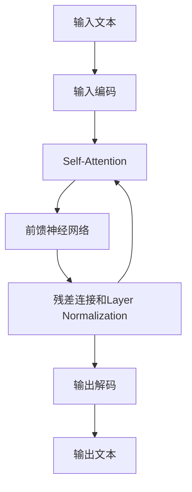

# 大语言模型应用指南：模型响应返回的参数

关键词：大语言模型、API响应、JSON格式、参数解析、模型应用

## 1. 背景介绍
### 1.1  问题的由来
随着人工智能技术的飞速发展,大语言模型在自然语言处理领域取得了突破性的进展。越来越多的开发者开始将大语言模型应用到实际的产品和服务中,以提供更加智能化、个性化的用户体验。然而,在使用大语言模型的API接口时,开发者经常会遇到响应数据解析的问题,尤其是对于返回的各种参数的含义和用途不甚了解,导致无法充分利用大语言模型的能力。

### 1.2  研究现状
目前,主流的大语言模型如GPT-3、BERT、T5等,都提供了相应的API接口供开发者调用。这些接口返回的数据通常是以JSON格式封装的,其中包含了一系列的参数,用于描述模型的输出结果。然而,官方文档对这些参数的解释往往比较简略,开发者需要花费大量的时间和精力去研究和实践,才能真正掌握这些参数的用法。

### 1.3  研究意义
深入研究大语言模型API响应中的各种参数,对于提高开发效率和应用质量有着重要的意义。一方面,通过系统全面地了解这些参数的含义和用途,开发者可以更加灵活、高效地利用大语言模型的能力,开发出功能更加强大、体验更加优秀的应用。另一方面,对常见的响应参数进行总结和归纳,可以帮助更多的开发者快速上手,降低学习和使用的门槛。

### 1.4  本文结构
本文将重点介绍大语言模型API响应中常见的几类参数,包括文本内容、置信度、词性、命名实体等,并通过实例代码演示如何解析和应用这些参数。同时,本文还将探讨一些参数使用的注意事项和优化建议,帮助开发者更好地利用大语言模型的能力。

## 2. 核心概念与联系
在介绍大语言模型API响应的参数之前,我们需要先了解一些核心概念：

- 大语言模型：是一种基于深度学习的自然语言处理模型,通过海量语料的训练,可以生成或理解人类的自然语言。
- API接口：是大语言模型提供给开发者的应用程序编程接口,开发者可以通过API接口向模型发送请求并获取响应。
- JSON格式：是一种轻量级的数据交换格式,易于人类阅读和编写,也易于机器解析和生成。大语言模型的API响应通常是JSON格式的。
- 参数：指API响应中用于描述模型输出结果的一系列键值对,如文本内容、置信度、词性等。

这些概念之间的关系如下图所示：


开发者通过调用大语言模型的API接口,获取JSON格式的响应数据,然后从中解析出各种参数,进而根据需求进行相应的处理和应用。

## 3. 核心算法原理 & 具体操作步骤
### 3.1  算法原理概述
大语言模型的核心算法主要基于Transformer架构和自注意力机制。Transformer通过堆叠多层的编码器和解码器,利用自注意力机制捕捉文本序列中的长距离依赖关系,从而实现了对自然语言的理解和生成。在此基础上,通过引入预训练和微调等技术,大语言模型可以在海量语料上学习到丰富的语言知识,进而完成各种自然语言处理任务。

### 3.2  算法步骤详解
以GPT-3为例,其主要算法步骤如下：

1. 模型初始化：加载预训练好的GPT-3模型参数。
2. 输入编码：将输入的文本序列转换为模型可以处理的向量表示。
3. Self-Attention：通过自注意力机制,计算序列中每个位置与其他位置之间的相关性,捕捉长距离依赖。
4. 前馈神经网络：对Self-Attention的输出进行非线性变换,提取高层次特征。
5. 残差连接和Layer Normalization：将前馈神经网络的输出与输入相加,并进行层归一化,有助于模型的训练和收敛。
6. 重复步骤3-5多次,构成多层的Transformer块。
7. 输出解码：将Transformer的输出向量解码为自然语言文本。

整个过程可以用下面的Mermaid流程图表示：



### 3.3  算法优缺点
GPT-3等大语言模型的优点包括：

- 强大的语言理解和生成能力,可以应用于各种自然语言处理任务。
- 通过预训练和微调,可以快速适应新的任务和领域。
- 生成的文本流畅自然,接近人类的书写水平。

但同时也存在一些局限性：

- 模型参数量巨大,训练和推理成本高昂。
- 对于一些常识性的推理和因果关系理解还比较欠缺。
- 可能产生一些不符合伦理道德的有害内容。

### 3.4  算法应用领域
大语言模型可以应用于各种自然语言处理任务,如文本分类、命名实体识别、问答系统、机器翻译、文本摘要等。同时在对话系统、内容生成、代码补全等领域也有广泛的应用前景。

## 4. 数学模型和公式 & 详细讲解 & 举例说明
### 4.1  数学模型构建
大语言模型的核心是Transformer架构,其数学模型可以表示为：

$$
\begin{aligned}
\mathrm{Attention}(Q, K, V) &= \mathrm{softmax}(\frac{QK^T}{\sqrt{d_k}})V \\
\mathrm{MultiHead}(Q, K, V) &= \mathrm{Concat}(\mathrm{head_1}, ..., \mathrm{head_h})W^O \\
\mathrm{FeedForward}(x) &= \mathrm{max}(0, xW_1 + b_1)W_2 + b_2
\end{aligned}
$$

其中,$Q$,$K$,$V$分别表示查询、键、值向量,$d_k$为向量维度,$W$和$b$为可学习的参数。

### 4.2  公式推导过程
Transformer的自注意力机制可以看作是一种映射函数,将查询向量$Q$映射到一组键值对$(K, V)$上,得到加权求和的结果。具体推导过程如下：

1. 计算查询向量$Q$与所有键向量$K$的点积,得到注意力得分$\mathrm{score}(Q, K)$。
2. 对注意力得分进行缩放,除以$\sqrt{d_k}$,以保持梯度稳定。
3. 对缩放后的注意力得分应用Softmax函数,得到注意力权重$\mathrm{weight}(Q, K)$。
4. 将注意力权重与对应的值向量$V$相乘,并求和,得到最终的注意力输出$\mathrm{Attention}(Q, K, V)$。

多头注意力机制则是将$Q$,$K$,$V$分别线性变换为$h$个子空间,并行执行$h$次注意力函数,最后将结果拼接起来。

前馈神经网络部分则是一个两层的全连接网络,用于对注意力的输出进行非线性变换。

### 4.3  案例分析与讲解
下面我们以一个简单的例子来说明Transformer的计算过程。假设有一个输入序列"I love AI"，经过词嵌入后得到三个向量$\mathbf{x_1}, \mathbf{x_2}, \mathbf{x_3}$,维度为$d_{\mathrm{model}}=512$。

1. 将输入向量$\mathbf{x_i}$分别乘以三个可学习的矩阵$W^Q, W^K, W^V$,得到查询、键、值向量$\mathbf{q_i}, \mathbf{k_i}, \mathbf{v_i}$,维度为$d_k=d_v=64$。
2. 计算$\mathbf{q_i}$与所有$\mathbf{k_j}$的点积,并除以$\sqrt{d_k}=8$,得到注意力得分$\mathrm{score}(\mathbf{q_i}, \mathbf{k_j})$。
3. 对注意力得分应用Softmax函数,得到注意力权重$\mathrm{weight}(\mathbf{q_i}, \mathbf{k_j})$。
4. 将注意力权重与对应的值向量$\mathbf{v_j}$相乘并求和,得到注意力输出$\mathbf{z_i}$。
5. 对$\mathbf{z_i}$应用前馈神经网络,得到最终的输出向量$\mathbf{y_i}$。

通过这个过程,Transformer可以学习到输入序列中每个位置与其他位置之间的依赖关系,并将其编码到输出向量中。

### 4.4  常见问题解答
1. Q: Transformer中的位置编码有什么作用？
   A: 由于Transformer不包含循环和卷积结构,需要通过位置编码来引入序列的位置信息。常见的位置编码方式有正弦编码和学习型位置编码。

2. Q: 残差连接和Layer Normalization的作用是什么？ 
   A: 残差连接可以帮助梯度更容易地传播到底层,缓解梯度消失问题。Layer Normalization则可以加速模型收敛,提高训练稳定性。

3. Q: Transformer能否并行化训练和推理？
   A: 可以。由于Transformer摒弃了循环结构,因此可以很容易地在各个位置上并行计算注意力和前馈部分,大大提高了训练和推理效率。

## 5. 项目实践：代码实例和详细解释说明
### 5.1  开发环境搭建
要使用大语言模型的API接口,首先需要搭建好开发环境。以Python为例,主要需要安装以下库：

- requests：用于发送HTTP请求,调用API接口。
- json：用于解析和处理JSON格式的响应数据。

可以使用pip命令进行安装：

```bash
pip install requests
```

### 5.2  源代码详细实现
下面是一个调用OpenAI的GPT-3 API接口,并解析响应参数的示例代码：

```python
import requests
import json

# API密钥
API_KEY = "your_api_key"
# API端点
API_ENDPOINT = "https://api.openai.com/v1/completions"

# 请求头
headers = {
    "Content-Type": "application/json",
    "Authorization": f"Bearer {API_KEY}"
}

# 请求参数
data = {
    "model": "text-davinci-002",
    "prompt": "Hello, how are you?",
    "max_tokens": 50,
    "temperature": 0.7,
    "n": 1
}

# 发送POST请求
response = requests.post(API_ENDPOINT, headers=headers, data=json.dumps(data))

# 解析响应JSON
result = response.json()

# 提取生成的文本
generated_text = result["choices"][0]["text"]

# 提取置信度得分
confidence_score = result["choices"][0]["score"]

# 输出结果
print(f"Generated Text: {generated_text}")
print(f"Confidence Score: {confidence_score}")
```

### 5.3  代码解读与分析
1. 首先定义API密钥和端点URL,用于身份验证和请求路由。
2. 设置请求头,指定内容类型为JSON,并传入API密钥。
3. 设置请求参数,包括使用的模型、输入的提示文本、生成的最大token数、随机度等。
4. 使用requests库的post方法发送POST请求,传入请求头和JSON格式的参数。
5. 调用response对象的json方法,解析响应的JSON数据。
6. 从解析后的JSON中提取生成的文本和置信度得分等参数。
7. 输出提取到的参数值。

这个过程演示了如何通过Python代码调用大语言模型的API接口,并从响应的JSON数据中解析出关键的参数,如生成的文本内容和置信度得分等。开发者可以根据这些参数值,进一步