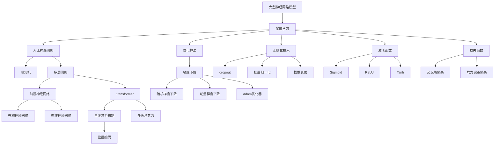

# 大语言模型应用指南：神经网络的发展历史

## 1. 背景介绍

### 1.1 问题的由来

在过去的几十年里，人工智能领域取得了长足的进步。从早期的专家系统和决策树算法,到后来的支持向量机和随机森林等机器学习模型,再到如今备受关注的深度学习和大型神经网络模型,人工智能技术不断推陷和革新。其中,大型神经网络模型在自然语言处理、计算机视觉、语音识别等领域展现出了强大的能力,引起了学术界和工业界的广泛关注。

随着数据量的激增和计算能力的飞速提高,训练大型神经网络模型成为可能。这些模型能够从海量数据中自动学习特征表示,捕捉复杂的数据模式,并在下游任务中表现出卓越的性能。然而,大型神经网络模型也面临着诸多挑战,例如需要大量的计算资源、数据标注成本高昂、模型可解释性差等问题。

### 1.2 研究现状

近年来,大型神经网络模型在自然语言处理领域取得了突破性进展。以GPT(Generative Pre-trained Transformer)系列模型为代表的大型语言模型,通过在海量无标注文本数据上进行预训练,学习到了丰富的语言知识和上下文表示能力。这些模型可以在下游任务中进行微调,展现出优异的性能表现。

除了语言模型,在计算机视觉和语音识别领域也出现了一些具有里程碑意义的大型神经网络模型,如VGGNet、ResNet、Transformer等。这些模型不仅在特定任务上取得了卓越的性能,更重要的是,它们提出了一些通用的网络结构和训练技巧,为后续模型的设计和训练提供了宝贵的经验。

### 1.3 研究意义

大型神经网络模型的研究对于推动人工智能技术的发展具有重要意义。首先,这些模型展现出了强大的学习和泛化能力,能够从海量数据中自动学习有用的特征表示,捕捉复杂的数据模式,并在下游任务中取得出色的性能表现。其次,大型模型的研究也促进了相关理论和算法的发展,如注意力机制、transformer结构、自监督学习等,这些理论和算法不仅在大型模型中发挥作用,也为其他领域的模型设计和优化提供了借鉴。

此外,大型神经网络模型在实际应用中也发挥着越来越重要的作用。它们可以应用于自然语言处理、计算机视觉、语音识别等多个领域,为智能系统的构建提供了强大的技术支持。随着模型性能的不断提高和应用场景的扩展,大型神经网络模型将为人工智能技术的发展注入新的动力。

### 1.4 本文结构

本文将全面介绍大型神经网络模型的发展历史、核心概念和算法原理,并探讨其在实际应用中的场景和挑战。文章的主要内容结构如下:

1. 背景介绍
2. 核心概念与联系
3. 核心算法原理与具体操作步骤
4. 数学模型和公式详细讲解与案例分析
5. 项目实践:代码实例和详细解释
6. 实际应用场景
7. 工具和资源推荐
8. 总结:未来发展趋势与挑战
9. 附录:常见问题与解答

通过对上述内容的全面阐述,读者能够深入理解大型神经网络模型的本质,掌握其核心算法和应用场景,并对该领域的未来发展有一个清晰的认识。

## 2. 核心概念与联系

在探讨大型神经网络模型的核心算法原理之前,我们需要先了解一些基本的概念和它们之间的联系。这些概念为后续的技术细节奠定了基础,有助于读者更好地理解整个知识体系。

上图展示了大型神经网络模型相关的一些核心概念及它们之间的关系。我们可以看到,大型神经网络模型是建立在深度学习的基础之上的。深度学习则是人工神经网络的一个分支,包括了感知机、多层网络等基本结构。

多层网络可以进一步分为前馈神经网络、卷积神经网络、循环神经网络和transformer等不同类型的网络结构。其中,transformer引入了自注意力机制、位置编码和多头注意力等创新概念,为后续的大型语言模型奠定了基础。

在训练深度神经网络时,我们需要使用优化算法(如梯度下降及其变体)来更新网络参数,同时也会采用正则化技术(如dropout、批量归一化和权重衰减)来防止过拟合。另外,激活函数和损失函数也是深度学习中不可或缺的重要组成部分。

通过对这些核心概念的理解,我们可以更好地把握大型神经网络模型的本质,为后续的技术细节做好准备。

## 3. 核心算法原理与具体操作步骤  

### 3.1 算法原理概述

大型神经网络模型的核心算法原理可以概括为三个关键步骤:预训练(Pre-training)、微调(Fine-tuning)和生成(Generation)。

1. **预训练(Pre-training)**: 在这个阶段,模型会在大量无标注的原始数据(如文本语料、图像数据等)上进行自监督学习,获取通用的表示能力。常见的预训练目标包括掩码语言模型(Masked Language Model)、下一句预测(Next Sentence Prediction)等。通过预训练,模型可以学习到丰富的语义和上下文知识,为后续的微调和生成任务奠定基础。

2. **微调(Fine-tuning)**: 在获得通用表示能力后,模型需要在特定的下游任务上进行微调,以适应该任务的特征。微调过程中,模型的大部分参数保持不变,只对最后几层的参数进行调整和优化。通过这种"先预训练、后微调"的策略,模型可以快速适应新的任务,同时保留了在预训练阶段学习到的通用知识。

3. **生成(Generation)**: 对于生成型任务(如机器翻译、文本摘要、对话系统等),经过微调的模型可以根据输入的上下文信息,自动生成相应的输出序列。生成过程通常采用自回归(Auto-Regressive)的方式,即模型会根据已生成的部分序列,预测下一个最可能的token,并将其附加到输出序列中。这个过程一直持续到生成完整的输出序列为止。

上述三个步骤构成了大型神经网络模型的核心算法流程。通过预训练、微调和生成的有机结合,这些模型可以在各种自然语言处理任务上展现出卓越的性能表现。

### 3.2 算法步骤详解

接下来,我们将详细解释大型神经网络模型的核心算法步骤,以及每个步骤中涉及的关键技术和操作。

#### 3.2.1 预训练(Pre-training)

预训练阶段的目标是在大量无标注数据上训练模型,使其学习到通用的语言表示能力。常见的预训练目标包括:

1. **掩码语言模型(Masked Language Model, MLM)**: 在输入序列中随机掩码部分token,要求模型根据上下文预测被掩码的token。这种自监督学习方式可以让模型捕捉到单词之间的语义和上下文关系。

2. **下一句预测(Next Sentence Prediction, NSP)**: 给定两个句子,要求模型判断第二个句子是否为第一个句子的下一句。这种任务可以让模型学习到更长范围的上下文依赖关系。

3. **自回归语言模型(Auto-Regressive Language Model)**: 根据前面的token序列,预测下一个最可能的token。这种预训练目标常用于生成型任务,如机器翻译、文本摘要等。

在预训练过程中,模型会在海量数据上不断优化参数,以最小化预训练目标的损失函数。优化算法通常采用随机梯度下降(SGD)及其变体,如Adam优化器。同时,也会应用诸如dropout、批量归一化等正则化技术,以防止过拟合。

预训练是一个计算密集型任务,通常需要消耗大量的计算资源和时间。但是,一旦完成预训练,模型就可以在各种下游任务上进行快速微调,从而节省了大量的时间和计算开销。

#### 3.2.2 微调(Fine-tuning)

在完成预训练后,模型需要在特定的下游任务上进行微调,以适应该任务的特征。微调过程包括以下关键步骤:

1. **准备训练数据**: 根据下游任务的性质,准备相应的训练数据集。对于监督学习任务(如文本分类、机器阅读理解等),需要准备带有标注的数据集;对于生成型任务(如机器翻译、文本摘要等),需要准备输入-输出序列对的数据集。

2. **数据预处理**: 对训练数据进行必要的预处理,如分词、标记化、填充等,以满足模型的输入格式要求。

3. **设置微调参数**: 确定微调过程中需要优化的参数层,通常只对模型的最后几层参数进行微调,而保留大部分预训练参数不变。同时,也需要设置学习率、批量大小等超参数。

4. **模型微调**: 使用准备好的训练数据,在下游任务的损失函数上优化模型参数。微调过程通常采用较小的学习率,以避免破坏预训练阶段学习到的通用知识。

5. **模型评估**: 在验证集上评估微调后模型的性能,根据需要调整超参数或进行早停(Early Stopping)等操作。

6. **模型保存**: 保存微调后的模型权重,以便后续的预测和部署。

通过微调,大型神经网络模型可以快速适应新的下游任务,同时保留了在预训练阶段学习到的通用知识。这种"先预训练、后微调"的策略大大提高了模型的泛化能力和学习效率。

#### 3.2.3 生成(Generation)

对于生成型任务(如机器翻译、文本摘要、对话系统等),经过微调的大型神经网络模型可以根据输入的上下文信息,自动生成相应的输出序列。生成过程通常采用自回归(Auto-Regressive)的方式,具体步骤如下:

1. **输入编码**: 将输入序列(如源语言文本)编码为模型可以理解的表示形式,通常是一系列的向量或embedding。

2. **初始化输出**: 初始化一个空的输出序列,作为生成的起点。

3. **自回归生成**: 重复以下步骤,直到生成完整的输出序列:
   a. 将当前的输入序列和部分输出序列输入到模型中。
   b. 模型根据输入,预测下一个最可能的token。
   c. 将预测的token附加到输出序列的末尾。

4. **输出解码**: 将生成的输出序列解码为可读的形式,如目标语言的文本序列。

在生成过程中,模型会综合考虑输入的上下文信息和已生成的部分输出,预测下一个最可能的token。这种自回归的生成方式可以确保输出序列的连