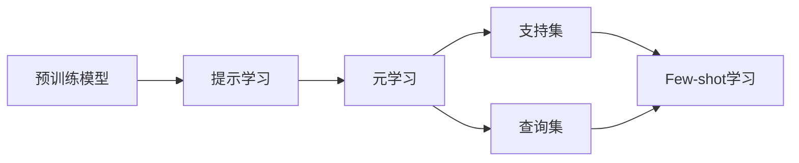

# 大语言模型的few-shot学习原理与代码实例讲解

## 1. 背景介绍
### 1.1 问题的由来
近年来，随着人工智能技术的飞速发展，自然语言处理(NLP)领域取得了突破性的进展。大语言模型(Large Language Models, LLMs)的出现，使得NLP任务的性能得到了显著提升。然而，传统的大语言模型需要在大规模标注数据集上进行预训练和微调，这对于许多实际应用场景来说是不现实的，因为获取大量高质量的标注数据非常耗时耗力。为了解决这一问题，few-shot学习(Few-Shot Learning)应运而生，它旨在让模型在只有少量标注样本的情况下，也能够快速适应新的任务，这极大地提高了大语言模型的实用性和灵活性。

### 1.2 研究现状
目前，few-shot学习已经成为NLP领域的研究热点之一。许多研究者提出了各种few-shot学习方法，如基于度量的方法、基于优化的方法和基于模型的方法等。其中，基于提示(Prompt-based)的few-shot学习方法因其简单有效而备受关注。该方法通过设计合适的提示模板，将任务转化为填空问题，让预训练的语言模型在提示的引导下生成答案。GPT-3、PaLM等大语言模型在few-shot设置下取得了令人瞩目的成绩，展现出了强大的泛化能力和知识迁移能力。

### 1.3 研究意义
探索大语言模型的few-shot学习原理和方法，对于推动NLP技术的发展具有重要意义：

1. 降低标注成本：few-shot学习大大减少了对标注数据的依赖，节省了人力物力，使得构建NLP应用变得更加高效。

2. 提高模型泛化能力：通过few-shot学习，大语言模型可以快速适应新的任务，体现出强大的泛化能力，这为NLP技术在更广泛领域的应用奠定了基础。  

3. 促进知识迁移：few-shot学习利用预训练模型中蕴含的丰富知识，实现了跨任务、跨领域的知识迁移，极大地拓展了NLP技术的应用范围。

4. 推动人机交互：基于few-shot学习的大语言模型具备更加灵活、自然的交互能力，用户可以通过简单的提示引导模型完成各种任务，这将极大地改善人机交互体验。

### 1.4 本文结构
本文将全面探讨大语言模型的few-shot学习原理与代码实现。第2部分介绍few-shot学习的核心概念；第3部分详细阐述few-shot学习的算法原理和操作步骤；第4部分给出few-shot学习的数学模型和公式推导；第5部分提供基于PyTorch的few-shot学习代码实例；第6部分讨论few-shot学习的实际应用场景；第7部分推荐few-shot学习的相关工具和资源；第8部分总结全文，展望few-shot学习的未来发展趋势和挑战；第9部分为常见问题解答。

## 2. 核心概念与联系
Few-shot学习的核心概念包括：

1. 支持集(Support Set)：包含每个类别的少量标注样本，用于模型学习如何区分不同类别。

2. 查询集(Query Set)：包含需要预测类别的未标注样本，模型需要根据支持集的知识对其进行分类。

3. 元学习(Meta-Learning)：通过训练大量不同的few-shot任务，让模型学会快速适应新任务的能力。元学习的目标是学习一个通用的学习器，而不是针对特定任务的分类器。

4. 提示学习(Prompt Learning)：通过引入适当的提示模板，将下游任务转化为预训练模型已经学会的任务形式（如填空），从而实现知识迁移和泛化。

这些概念之间紧密相关：支持集和查询集构成了few-shot学习任务的基本形式；元学习是实现few-shot学习的重要手段，它训练模型快速学习新任务的能力；提示学习则是连接预训练模型和下游任务的桥梁，让模型能够利用已有知识解决新问题。

下图展示了few-shot学习中这些核心概念之间的关系：



## 3. 核心算法原理 & 具体操作步骤
### 3.1 算法原理概述
Few-shot学习的核心算法可以分为以下三类：

1. 基于度量的方法：通过度量支持集和查询集样本之间的相似性，对查询样本进行分类。常见的度量包括欧氏距离、余弦相似度等。

2. 基于优化的方法：通过优化支持集上的损失函数，快速适应新任务。代表算法包括MAML(Model-Agnostic Meta-Learning)等。

3. 基于模型的方法：设计专门的网络结构，如记忆增强网络(Memory-Augmented Networks)，以存储和利用支持集的信息。

本文重点介绍基于提示的few-shot学习方法，它可以看作是基于度量的方法的一种变体。该方法利用自然语言提示模板，将支持集信息编码到输入中，引导预训练模型进行推理。

### 3.2 算法步骤详解
基于提示的few-shot学习算法可以分为以下步骤：

1. 构建提示模板：根据任务类型，设计适当的自然语言提示模板。提示模板需要包含占位符，用于填充支持集和查询样本。

2. 编码支持集信息：将支持集中的样本填充到提示模板中，形成完整的输入序列。支持集样本可以以文本、关键词等形式呈现。

3. 生成查询样本的提示：将查询样本填充到提示模板中，形成查询输入序列。

4. 利用预训练模型进行推理：将编码后的支持集输入和查询输入送入预训练模型，让模型基于支持集的知识，对查询样本进行分类或生成。

5. 后处理模型输出：对模型生成的输出进行解码，提取出最终的预测结果。

下面是一个基于提示的few-shot文本分类示例：

支持集：
- 样本1：This movie is amazing! [Positive]
- 样本2：The acting was terrible. [Negative]

查询样本：The plot was engaging and kept me guessing until the end.

提示模板：
```
Classify the sentiment of the following movie review:
[Review]
The review is [MASK].

Examples:
[Support Set]
```

编码后的输入：
```
Classify the sentiment of the following movie review:
The plot was engaging and kept me guessing until the end.
The review is [MASK].

Examples:
This movie is amazing! [Positive]
The acting was terrible. [Negative]
```

预训练模型根据支持集中的正负面评论样本，对查询评论进行情感分类，输出[MASK]位置的预测标签（Positive或Negative）。

### 3.3 算法优缺点
基于提示的few-shot学习算法具有以下优点：

1. 简单有效：通过设计恰当的提示模板，可以将任务转化为预训练模型已经学会的形式，无需修改模型结构和参数，即可实现快速适应。

2. 灵活多样：提示模板可以根据任务类型和领域知识进行定制，适用于各种NLP任务，如分类、生成、问答等。

3. 知识迁移：利用预训练模型中蕴含的丰富知识，实现跨任务、跨领域的知识迁移，大大提高了模型的泛化能力。

但该算法也存在一些局限性：

1. 对提示质量敏感：算法的性能很大程度上取决于提示模板的设计，需要一定的领域专业知识和经验。

2. 支持集样本数量受限：由于输入长度的限制，支持集中可包含的样本数量有限，这在一定程度上限制了算法的性能上限。

3. 推理效率较低：由于每个查询样本都需要与支持集样本拼接形成输入，推理过程的计算量较大，效率较低。

### 3.4 算法应用领域
基于提示的few-shot学习算法在NLP领域有广泛的应用，包括但不限于：

1. 文本分类：如情感分析、主题分类、意图识别等。

2. 命名实体识别：识别文本中的人名、地名、机构名等实体。

3. 关系抽取：从文本中抽取实体之间的关系，如人物关系、因果关系等。

4. 文本生成：如对话生成、故事生成、摘要生成等。

5. 问答系统：根据给定的问题和支持材料，生成相应的答案。

6. 机器翻译：利用少量平行语料，实现低资源语言之间的翻译。

## 4. 数学模型和公式 & 详细讲解 & 举例说明
### 4.1 数学模型构建
设有一个支持集$S=\{(x_i,y_i)\}_{i=1}^N$，其中$x_i$为输入样本，$y_i$为对应的标签，$N$为支持集样本数量。给定一个查询样本$x_q$，few-shot学习的目标是利用支持集$S$的知识，对$x_q$进行分类或生成。

基于提示的few-shot学习可以形式化为以下数学模型：

令$T$为提示模板，$T(x,y)$表示将样本$x$和标签$y$填充到模板$T$中形成的输入序列。令$f_\theta$为预训练语言模型，$\theta$为模型参数。则few-shot学习的过程可以表示为：

$$
\hat{y_q} = \arg\max_{y_q} f_\theta(T(x_q, y_q) \oplus T(S))
$$

其中，$\oplus$表示将查询样本的输入序列和支持集的输入序列拼接，$\hat{y_q}$为模型对查询样本$x_q$的预测标签。

### 4.2 公式推导过程
上述数学模型可以进一步展开为：

$$
\begin{aligned}
\hat{y_q} &= \arg\max_{y_q} f_\theta(T(x_q, y_q) \oplus T(S)) \\
&= \arg\max_{y_q} f_\theta(T(x_q, y_q) \oplus T(x_1, y_1) \oplus \cdots \oplus T(x_N, y_N)) \\
&= \arg\max_{y_q} p(y_q|x_q, S; \theta)
\end{aligned}
$$

其中，$p(y_q|x_q, S; \theta)$表示在给定查询样本$x_q$和支持集$S$的条件下，模型预测标签为$y_q$的概率。这个概率可以通过语言模型的输出分布得到。

### 4.3 案例分析与讲解
以情感分类任务为例，假设有以下支持集：

- 样本1：This movie is amazing! [Positive]
- 样本2：The acting was terrible. [Negative]

查询样本为：The plot was engaging and kept me guessing until the end.

使用如下提示模板：

```
Classify the sentiment of the following movie review:
[Review]
The review is [MASK].

Examples:
[Support Set]
```

将支持集样本和查询样本填充到模板中，得到输入序列：

```
Classify the sentiment of the following movie review:
The plot was engaging and kept me guessing until the end.
The review is [MASK].

Examples:
This movie is amazing! [Positive]
The acting was terrible. [Negative]
```

预训练语言模型根据输入序列，预测[MASK]位置最可能的标签。假设模型输出概率如下：

- Positive: 0.8
- Negative: 0.2

则模型的预测标签为Positive，即：

$$
\hat{y_q} = \arg\max_{y_q} p(y_q|x_q, S; \theta) = \text{Positive}
$$

### 4.4 常见问题解答
1. 问：提示模板的设计有什么原则？
答：提示模板的设计应遵循以下原则：
(1) 简洁明了，避免冗余信息；
(2) 符合自然语言习惯，易于理解；
(3) 包含必要的任务指令和输入占位符；
(4) 可以根据任务类型和领域知识进行定制。

2. 问：支持集样本数量对算法性能的影响？
答：支持集样本数量越多，模型可利用的信息就越丰富，