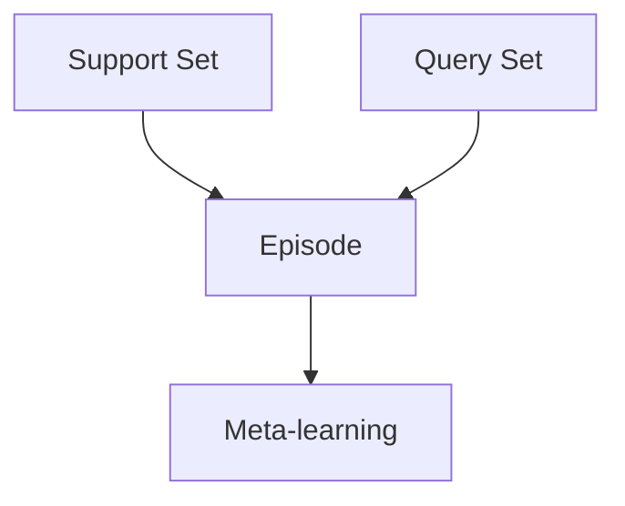

# 大语言模型的few-shot学习原理与代码实例讲解

关键词：大语言模型、few-shot学习、自然语言处理、深度学习、迁移学习、元学习

## 1. 背景介绍
### 1.1  问题的由来
随着人工智能技术的飞速发展,自然语言处理(NLP)领域取得了突破性的进展。传统的NLP任务通常需要大量的标注数据进行监督学习,这不仅耗时耗力,而且在很多场景下难以获取足够的标注数据。为了解决这一问题,研究人员提出了few-shot学习(少样本学习)的思路,旨在利用少量的标注样本实现模型的快速学习和泛化。

### 1.2  研究现状
目前,few-shot学习已经成为NLP领域的研究热点之一。基于大规模预训练语言模型(如BERT、GPT等)的few-shot学习方法取得了显著的效果,在许多NLP任务上甚至超越了传统的有监督学习方法。这些方法通过在大规模无标注语料上预训练得到强大的语言表征能力,再结合少量标注样本进行微调,从而实现了快速的任务适应和泛化。

### 1.3  研究意义 
few-shot学习在NLP领域具有重要的研究意义和应用价值:

(1)降低标注成本:通过few-shot学习,可以大幅减少所需的标注数据量,节省人力物力,提高数据标注效率。

(2)提高模型泛化能力:few-shot学习使模型能够在新的任务上快速适应,增强了模型的泛化能力和鲁棒性。

(3)探索人类学习机制:few-shot学习模拟了人类根据少量样例快速学习新知识的能力,有助于探索人类智能的奥秘。

(4)拓展应用场景:few-shot学习使得许多样本稀缺的应用场景成为可能,如罕见疾病诊断、小语种翻译等。

### 1.4  本文结构
本文将全面介绍大语言模型的few-shot学习原理与代码实例。第2部分介绍few-shot学习的核心概念;第3部分阐述few-shot学习的核心算法原理;第4部分给出few-shot学习的数学模型和公式;第5部分提供基于PyTorch的代码实例;第6部分讨论few-shot学习的应用场景;第7部分推荐相关工具和资源;第8部分总结全文并展望未来;第9部分为常见问题解答。

## 2. 核心概念与联系
few-shot学习的核心概念包括:

(1)Support Set:包含每个类别的少量标注样本,用于模型学习。

(2)Query Set:包含新的未标注样本,用于评估模型的泛化性能。

(3)Episode:一个few-shot学习任务,通常包含一个Support Set和一个Query Set。模型在每个Episode上进行训练和测试。

(4)Meta-learning:又称学会学习(Learning to Learn),通过在多个Episode上训练,使模型掌握快速学习的元知识和策略。

下图展示了few-shot学习的核心概念之间的联系:



## 3. 核心算法原理 & 具体操作步骤
### 3.1  算法原理概述
大语言模型的few-shot学习通常采用基于元学习的方法,主要分为两个阶段:

(1)元训练阶段(Meta-training):在多个Episode上训练模型,使其学会快速适应新任务的元知识。每个Episode包含一个Support Set和一个Query Set,模型在Support Set上进行内循环(Inner Loop)更新,在Query Set上进行外循环(Outer Loop)更新。

(2)元测试阶段(Meta-testing):在新的Episode上测试模型的泛化性能。给定Support Set,模型在其上进行内循环更新,然后在Query Set上进行预测。

### 3.2  算法步骤详解

以下是基于BERT的few-shot学习算法的具体步骤:

(1)模型预训练:在大规模无标注语料上预训练BERT模型,学习通用的语言表征。

(2)元训练:
- 采样一个Episode,包含Support Set和Query Set。
- 在Support Set上fine-tune BERT模型若干步,得到任务特定的参数。
- 用fine-tune后的模型在Query Set上计算损失。
- 计算损失对原始BERT参数的梯度,并更新原始参数。
- 重复多个Episode,直到收敛。

(3)元测试:
- 采样一个新的Episode。
- 在Support Set上fine-tune BERT模型若干步。 
- 用fine-tune后的模型在Query Set上进行预测。
- 评估预测结果,得到模型在新任务上的泛化性能。

### 3.3  算法优缺点

优点:
- 可以利用预训练模型的先验知识,减少所需的标注数据。
- 通过元学习,模型可以在新任务上快速适应。
- 在许多few-shot学习场景下取得了sota的结果。

缺点:  
- 元训练过程计算量大,对计算资源要求较高。
- 模型性能对Support Set的质量较为敏感。
- 目前对于一些复杂推理任务,表现还有待提高。

### 3.4  算法应用领域
few-shot学习在NLP的许多任务上都有广泛应用,如:
- 文本分类:根据少量标注样本,对新的文本进行分类。
- 命名实体识别:根据少量标注实体,识别新文本中的实体。
- 关系抽取:根据少量标注的关系样例,从新文本中抽取目标关系。
- 机器翻译:根据少量平行语料,实现特定领域的机器翻译。
- 阅读理解:根据少量问答对,回答新文章的问题。

## 4. 数学模型和公式 & 详细讲解 & 举例说明
### 4.1  数学模型构建
我们以few-shot文本分类任务为例,介绍基于BERT的few-shot学习的数学模型。

假设有$N$个类别,每个类别有$K$个标注样本,即$N$-way $K$-shot学习。Support Set为$S=\{(x_i,y_i)\}_{i=1}^{N\times K}$,Query Set为$Q=\{(x_j,y_j)\}_{j=1}^{|Q|}$。

BERT模型参数为$\theta$,fine-tune后的参数为$\phi$。$f_\theta$表示BERT模型,$g_\phi$表示fine-tune后的模型。

### 4.2  公式推导过程
元训练的目标是最小化Query Set上的损失:

$$\mathcal{L}(\theta)=\mathbb{E}_{S,Q}\left[\mathcal{L}_{Q}\left(g_{\phi}\right)\right]$$

其中$\mathcal{L}_{Q}$为Query Set上的损失函数,如交叉熵损失:

$$\mathcal{L}_{Q}\left(g_{\phi}\right)=-\frac{1}{|Q|} \sum_{(x, y) \in Q} \log p\left(y | x ; g_{\phi}\right)$$

fine-tune后的参数$\phi$通过在Support Set上梯度下降得到:

$$\phi=\theta-\alpha \nabla_{\theta} \mathcal{L}_{S}\left(f_{\theta}\right)$$

其中$\alpha$为学习率,$\mathcal{L}_{S}$为Support Set上的损失函数:

$$\mathcal{L}_{S}\left(f_{\theta}\right)=-\frac{1}{N \times K} \sum_{(x, y) \in S} \log p\left(y | x ; f_{\theta}\right)$$

最终,元训练通过梯度下降更新原始参数$\theta$:

$$\theta \leftarrow \theta-\beta \nabla_{\theta} \mathcal{L}(\theta)$$

其中$\beta$为元学习率。

### 4.3  案例分析与讲解
我们以一个3-way 2-shot的文本分类任务为例。假设类别为:体育、娱乐、科技,每个类别有2个标注样本。

Support Set:
- 体育:[詹姆斯在比赛中得到32分,湖人队获胜],[中国女排在奥运会上夺冠]
- 娱乐:[周杰伦发布新专辑],[电影《流浪地球2》票房突破40亿]  
- 科技:[苹果公司发布新款iPhone],[OpenAI推出强大的对话模型ChatGPT]

Query Set:
- [梅西在世界杯决赛中攻入制胜一球,阿根廷队夺冠]
- [新版红楼梦电视剧正在热播]
- [特斯拉推出新款电动汽车Model 3]

在元训练阶段,模型在Support Set上进行fine-tune,学习每个类别的特征表示。然后在Query Set上计算损失,并更新原始BERT参数。经过多次Episode的训练,模型学会了如何根据少量样本进行分类。

在元测试阶段,模型根据Support Set对Query Set中的样本进行预测。例如,对于查询样本"梅西在世界杯决赛中攻入制胜一球,阿根廷队夺冠",模型可以根据Support Set中的体育类样本,正确地将其分类为体育类。

### 4.4  常见问题解答
Q:few-shot学习需要多少标注样本才能取得良好效果?
A:这取决于任务的复杂度。一般来说,每个类别有2-5个样本就可以取得不错的效果。但对于一些复杂推理任务,可能需要更多的样本。

Q:除了BERT,还有哪些预训练模型可以用于few-shot学习?
A:GPT系列模型、RoBERTa、T5等都是不错的选择。这些模型在大规模语料上预训练,具有强大的语言理解和生成能力,可以很好地应用于few-shot学习。

Q:few-shot学习的主要挑战有哪些?
A:主要挑战包括:(1)如何在嘈杂的小样本上快速学习鲁棒的表示;(2)如何避免过拟合;(3)如何处理类别不平衡问题;(4)如何进行跨任务的few-shot学习等。未来还需要在这些方面进一步探索。

## 5. 项目实践：代码实例和详细解释说明
### 5.1  开发环境搭建
首先需要安装PyTorch、Transformers等依赖库:

```bash
pip install torch transformers datasets
```

### 5.2  源代码详细实现
以下是基于BERT的few-shot文本分类的PyTorch实现:

```python
import torch
import torch.nn as nn
import torch.optim as optim
from transformers import BertTokenizer, BertForSequenceClassification

class FewShotBERT(nn.Module):
    def __init__(self, num_labels):
        super().__init__()
        self.bert = BertForSequenceClassification.from_pretrained('bert-base-uncased', num_labels=num_labels)
        
    def forward(self, input_ids, attention_mask, labels=None):
        outputs = self.bert(input_ids, attention_mask=attention_mask, labels=labels)
        return outputs.loss, outputs.logits

def train_episode(model, support_set, query_set, optimizer):
    model.train()
    
    # Fine-tune on support set
    input_ids, attention_mask, labels = support_set
    loss, _ = model(input_ids, attention_mask, labels)
    loss.backward()
    optimizer.step()
    optimizer.zero_grad()
    
    # Evaluate on query set  
    input_ids, attention_mask, labels = query_set
    with torch.no_grad():
        loss, logits = model(input_ids, attention_mask, labels)
    
    return loss.item()

def test_episode(model, support_set, query_set):
    model.eval()
    
    # Fine-tune on support set
    input_ids, attention_mask, labels = support_set  
    with torch.no_grad():
        _, _ = model(input_ids, attention_mask, labels)
    
    # Predict on query set
    input_ids, attention_mask, labels = query_set
    with torch.no_grad(): 
        _, logits = model(input_ids, attention_mask)
    
    preds = torch.argmax(logits, dim=1)
    acc = (preds == labels).float().mean()
    return acc.item()

def main():
    num_labels = 3
    num_episodes = 1000
    support_size = 2
    query_size = 4
    
    tokenizer = BertTokenizer.from_pretrained('bert-base-uncased')
    model = FewShotBERT(num_labels)
    optimizer = optim.Adam(model.parameters(), lr=1e-5)
    
    for episode in range(num_episodes):
        # Sample an episode
        support_set, query_set = sample_episode(num_labels, support_size, query_size)
        support_set = tokenize(support_set, tokenizer) 
        query_set = tokenize(query_set, tokenizer)
        
        # Meta-training
        train_loss = train_episode(model, support_set, query_