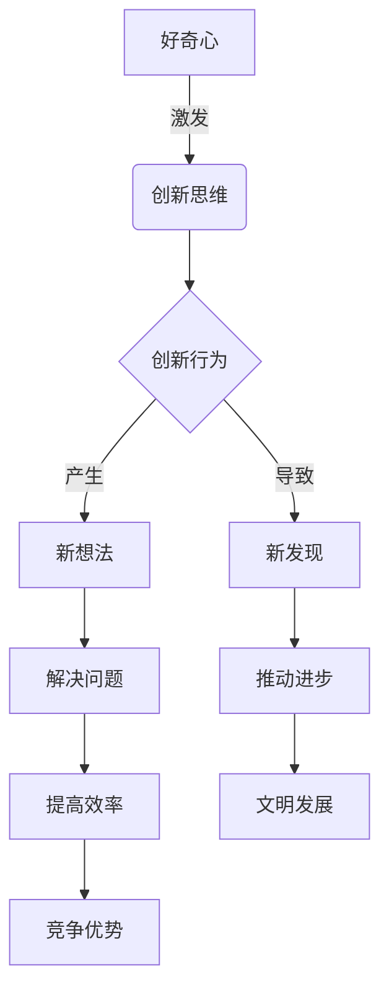

# 好奇心：创新与发现的源泉

## 1. 背景介绍

### 1.1 问题的由来

在这个瞬息万变的时代,我们面临着前所未有的挑战和机遇。科技的飞速发展不仅改变了我们的生活方式,也催生了无数新兴领域和难题。要想在这样一个充满未知和不确定性的环境中取得成功,我们就必须拥有强烈的好奇心和创新精神。

好奇心是人类与生俱来的天性,它促使我们去探索未知、追求新知,是推动科学发展和文明进步的根本动力。从伽利略用望远镜观察天体,到牛顿发现万有引力定律,再到现代物理学的诞生,每一个重大发现的背后,都蕴含着对未知事物的渴望和执着探索。

### 1.2 研究现状  

当前,人工智能、量子计算、生命科学等前沿领域正在如火如荼地发展,为人类带来了诸多惊人的发现和突破。与此同时,这些领域也面临着诸多挑战和难题,需要我们运用创新思维来加以解决。

越来越多的企业和组织意识到,创新是保持竞争力和可持续发展的关键。他们正在大力培养员工的好奇心和创新能力,鼓励他们挑战现状、提出新想法。同时,教育界也在重视培养学生的创新精神,将创新思维纳入课程体系。

### 1.3 研究意义

好奇心是创新的源泉,是人类不断进步和发展的根本动力。培养好奇心和创新精神,对于个人、组织乃至整个社会的发展都具有重要意义:

- 个人层面:好奇心可以激发学习热情,促进个人成长;创新思维有助于解决实际问题,提高工作效率。
- 组织层面:鼓励创新有利于企业保持活力,开发新产品、新服务,占据市场先机。
- 社会层面:创新推动科技进步,为人类文明发展注入新的动力,有助于解决人类面临的各种挑战。

因此,探讨如何培养好奇心、激发创新潜能,对于个人成长、组织发展和社会进步都具有重大意义。

### 1.4 本文结构

本文将从多个角度深入探讨好奇心与创新的关系,以及如何有效培养好奇心和创新思维。具体内容包括:

- 阐释好奇心和创新的核心概念及其内在联系
- 介绍激发好奇心和创新思维的关键算法原理和具体操作步骤  
- 建立相关数学模型,并通过公式和案例加以说明
- 分享实际项目中的代码实现,并解读其中的创新思路
- 探讨好奇心和创新在不同领域的应用场景
- 推荐相关学习资源、工具和论文等
- 总结未来发展趋势,并指出需要面临的挑战

希望通过本文,读者能够深入理解好奇心和创新精神的重要性,掌握相关理论和实践技巧,从而在工作和生活中发挥创新潜能,为个人发展和社会进步做出贡献。

## 2. 核心概念与联系

好奇心和创新精神有着内在的联系,它们相互促进、相辅相成。好奇心是创新的源泉,是人类探索未知、追求新知的内在动力。当我们对某个领域或问题产生浓厚的兴趣和好奇心时,就会主动去学习、思考、实践,从而激发创新思维。

创新思维则是指运用新颖独特的思路来解决问题的能力。它需要我们跳出传统思维定式,敢于质疑现有理论和做法,勇于尝试新的方法和观点。正是源于好奇心的创新思维,推动了人类不断有新发现、新创造。

创新行为是好奇心和创新思维的外在体现。当我们怀着好奇心,运用创新思维对某个领域进行探索时,就可能产生新的想法、新的见解,从而解决实际问题、提高工作效率,或是推动科技和理论的发展与进步。

因此,好奇心、创新思维和创新行为构成了一个相互促进的正循环。培养好奇心有利于激发创新思维,创新思维又能够指导创新实践,创新实践的成果反过来会进一步满足好奇心,激发新的探索欲望。只有将三者有机结合,我们才能真正释放创新潜能,在工作和生活中不断有新发现、新突破。

## 3. 核心算法原理 & 具体操作步骤

### 3.1 算法原理概述  

要培养好奇心和创新思维,关键是建立一种持续探索和学习的习惯。这就需要我们掌握一些行之有效的算法原理和方法。其核心思想可以概括为"主动学习"和"批判性思维"两个方面:

1. **主动学习**

主动学习指的是主动出击、自我驱动地去获取新知识和新技能。这种学习方式强调自主性、目的性和持续性,而不是被动地接受知识灌输。它要求我们时刻怀有一颗好奇心,对感兴趣的领域或问题保持敏锐的洞察力,并且勇于尝试、不断实践。

2. **批判性思维**

批判性思维是指能够理性地分析、评估各种观点和信息,并做出独立判断的能力。它要求我们不轻易被权威或主流观点所影响,而是运用逻辑和证据来质疑现有理论,寻找其中的漏洞和缺陷。同时,批判性思维也体现在对自己想法的审视上,勇于接受他人的质疑和反驳。

这两种核心思维方式相辅相成,共同推动了好奇心的培养和创新思维的发展。一方面,主动学习让我们不断获取新知识,为创新思维提供了丰富的营养;另一方面,批判性思维又能帮助我们突破思维定式,产生新的见解和想法。

### 3.2 算法步骤详解

为了更好地培养好奇心和创新思维,我们可以遵循以下具体步骤:

1. **确定感兴趣的领域**

首先,要明确自己对哪些领域感兴趣。这可以是工作相关的技术领域,也可以是个人爱好,甚至是一些看似陌生但很有吸引力的新兴领域。对于感兴趣的领域,我们往往会有强烈的好奇心和学习动机。

2. **制定学习计划**

接下来,需要为自己制定一个清晰的学习计划。这个计划应该包括学习目标、时间安排、资源列表等内容。同时也要为计划保留一定的弹性,以便在学习过程中根据实际情况做出调整。

3. **主动获取知识**  

学习的过程中,要主动获取相关知识。具体方式包括:阅读专业书籍和文献、观看在线视频课程、参加培训和研讨会、关注领域内的新闻和动态等。在获取知识的同时,也要勤于思考、提出疑问、记录心得。

4. **实践和应用**

理论知识必须与实践相结合,才能内化为真正的技能。因此,我们要勇于动手实践,将所学应用于实际项目和场景中。在实践的过程中,也会遇到各种问题和挑战,需要运用创新思维来加以解决。

5. **批判性思考**

无论是学习还是实践,我们都要保持开放但有批判的思维。对于所学的理论知识,要审视其中的逻辑缺陷和局限性;对于自己的实践经验,也要客观分析其中的不足之处。在此基础上,我们就能提出新的见解和想法。

6. **分享交流**

最后,要积极与他人分享自己的学习心得和创新想法,并虚心听取反馈意见。这不仅能够加深理解,还可以相互激发灵感,产生新的思路。我们可以参与线上线下的技术交流活动,或是在社交媒体上分享自己的体会。

这些步骤环环相扣,构成了一个循环过程。通过不断实践,我们可以逐步培养出好奇心和创新思维,并将其内化为一种习惯和能力。

### 3.3 算法优缺点

上述算法的优点在于:

- 突出了主动性和自驱力,有利于内化知识,培养持久的学习兴趣
- 注重理论与实践的结合,确保知识的实用性和创新性
- 强调批判性思维,有助于发现问题、提出新观点
- 重视交流分享,可以获得反馈并相互启发灵感

但同时,这个算法也存在一些不足:

- 对个人的自制力要求较高,需要坚持不懈的毅力
- 实践环节可能受到资源或条件的限制
- 交流分享过程中,可能会受到别人的否定或质疑
- 算法过程较为笼统,缺乏量化的评估和反馈机制

因此,在实施该算法时,我们需要根据具体情况做出调整和改进,并注意保持恰当的节奏,避免效率低下或精力过度消耗。

### 3.4 算法应用领域

培养好奇心和创新思维对于各个领域都具有重要意义。以下是该算法可以应用的一些典型场景:

- **教育培训领域**:可以将这一算法融入教学过程中,培养学生的主动学习能力和创新精神。
- **科研领域**:科研工作者可以借助这一算法保持好奇心,探索前沿理论并提出创新观点。
- **产品研发领域**:产品经理和工程师需要具备创新思维,以设计出符合用户需求的新产品和新功能。
- **商业管理领域**:企业管理者可以运用该算法激发员工的创新活力,提高组织的创新能力。
- **个人发展领域**:每个人都可以借助这一算法持续学习,不断提升个人技能,实现自我价值。

总的来说,无论在哪个领域,培养好奇心和创新思维都是非常宝贵的能力。拥有这种能力的个人和组织,都能在瞬息万变的时代中保持竞争力,并为人类文明进步做出贡献。

## 4. 数学模型和公式 & 详细讲解 & 举例说明  

### 4.1 数学模型构建

为了更好地理解和量化好奇心与创新之间的关系,我们可以构建一个简单的数学模型。设个体i的好奇心水平为$C_i$,创新能力为$I_i$,则两者之间可以用如下方程来描述:

$$I_i = \alpha C_i + \beta X_i + \gamma Y_i + \epsilon_i$$

其中:
- $\alpha$是好奇心对创新能力的影响系数,反映了好奇心的重要性
- $X_i$是个体i的其他个人特质(如勤奋、专注等)的综合表征
- $Y_i$是个体i所处的外部环境因素(如教育资源、文化氛围等)
- $\epsilon_i$是随机扰动项,反映了一些无法观测到的影响因素
- $\beta$和$\gamma$分别是个人特质和环境因素对创新能力的影响程度

从这个模型可以看出,好奇心是影响创新能力的重要因素之一,但并不是唯一决定性因素。个人的其他特质和外部环境也会对创新能力产生影响。

### 4.2 公式推导过程

我们可以进一步推导出好奇心对创新能力的边际影响。将上式两边对$C_i$求偏导,可得:

$$\frac{\partial I_i}{\partial C_i} = \alpha$$

这个公式表明,好奇心每提高一个单位,创新能力就会增加$\alpha$个单位。$\alpha$的大小反映了好奇心对创新能力的