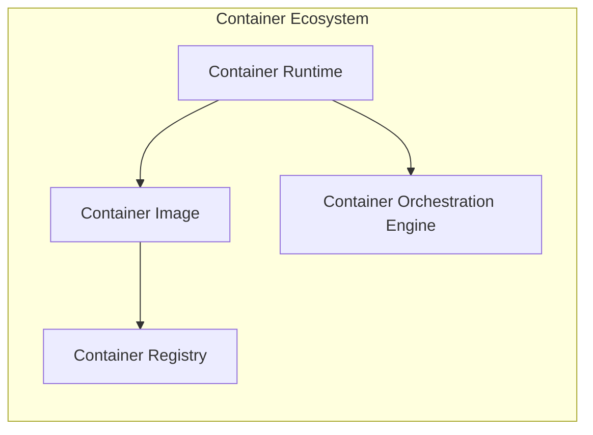

# 容器 原理与代码实例讲解

## 1. 背景介绍
### 1.1 问题的由来
在软件开发和部署过程中,我们常常面临着环境配置复杂、应用移植困难、资源利用率低等诸多挑战。传统的应用部署方式,需要为每个应用配置专属的运行环境,不仅耗时耗力,而且难以实现快速迁移和动态伸缩。这些问题严重制约了软件开发的效率和敏捷性。

### 1.2 研究现状
容器技术的出现,为解决上述问题提供了一种全新的思路。容器通过对应用进行封装隔离,实现了应用之间的相互独立,使得同一台机器上可以运行多个应用,而不会相互干扰。同时容器镜像的可移植性,使得应用能够快速在不同环境间迁移部署。目前主流的容器引擎包括 Docker、Kubernetes 等,已经在工业界得到了广泛应用。

### 1.3 研究意义
深入研究容器的原理和实现,对于理解和掌握这一关键技术至关重要。通过对容器底层机制的剖析,我们可以更好地理解容器是如何实现应用隔离和资源控制的。同时,结合代码实例的讲解,有助于读者将理论知识转化为实践能力,从而更好地应用容器技术解决实际问题。

### 1.4 本文结构
本文将从以下几个方面展开论述：首先介绍容器的核心概念和工作原理；然后重点剖析容器实现的关键技术,包括 Namespace、Cgroups 等；接着通过数学建模的方法,形式化描述容器的资源隔离机制；在此基础上,给出容器引擎的核心代码实现,并详细解读其中的关键逻辑；进一步,讨论容器技术在实际场景中的应用实践；最后总结容器未来的发展趋势和面临的挑战。

## 2. 核心概念与联系
容器是一种轻量级的虚拟化技术,通过对进程进行封装和隔离,实现了类似于虚拟机的功能,但是更加轻量和高效。一个完整的容器系统通常由以下几个核心组件构成：

- 容器运行时 (Container Runtime):负责容器的生命周期管理,如创建、启停等。
- 容器镜像 (Container Image):容器应用打包而成的标准化交付件,包含了应用代码和依赖。
- 容器仓库 (Container Registry):用于存储和分发容器镜像。
- 容器编排引擎 (Container Orchestration Engine):实现容器集群的编排和调度。

下图展示了容器的核心组件及其之间的关系:



其中,容器运行时通过读取容器镜像并利用操作系统内核特性,创建出一个独立的容器实例。容器镜像存储在容器仓库中,可以被多个容器运行时共享使用。容器编排引擎在更高层次上,对容器集群进行资源调度和管理,实现容器应用的弹性伸缩、故障恢复等。

## 3. 核心算法原理 & 具体操作步骤
### 3.1 算法原理概述
容器的核心原理是通过 Namespace 和 Cgroups 等技术,在操作系统内核层面实现资源隔离和限制,从而将一个进程及其子进程封装成一个独立的容器。其中,Namespace 实现了进程、网络、文件系统等资源的隔离,Cgroups 实现了 CPU、内存等资源的限制。

### 3.2 算法步骤详解
创建一个容器的主要步骤如下:

1. 创建并设置容器使用的 Namespace,常见的 Namespace 包括:
   - PID Namespace:进程隔离
   - Mount Namespace:文件系统隔离 
   - UTS Namespace:主机名隔离
   - IPC Namespace:进程间通信隔离
   - Network Namespace:网络隔离
   - User Namespace:用户隔离

2. 创建并设置容器使用的 Cgroups,对容器进程使用的资源进行限制,常见的资源包括:
   - CPU:可以设置 CPU 使用时间片、核数等
   - 内存:可以设置内存使用上限
   - 磁盘 I/O:可以限制磁盘读写速度
   - 网络 I/O:可以限制网络带宽

3. 准备容器镜像,解压镜像到指定位置,作为容器的根文件系统。

4. 创建容器进程,调用 clone 系统调用,传入上述准备好的 Namespace 和 Cgroups 配置,启动容器进程。

5. 在容器进程中,通过 exec 系统调用,执行容器应用的启动命令,应用进程开始运行。

6. 容器进程运行结束后,容器生命周期结束,释放相关资源。

### 3.3 算法优缺点
容器隔离的优点在于:

- 轻量级:相比虚拟机,容器无需模拟硬件,资源占用小。
- 启动速度快:容器启动时无需启动操作系统内核,秒级启动。
- 移植性好:容器镜像可以跨平台共享和部署。
- 秒级伸缩:容器可以快速扩缩容,实现弹性调度。

容器隔离的缺点包括:

- 隔离性不如虚拟机:容器之间共享宿主机内核,存在一定的安全隐患。
- 不适合运行内核级应用:容器内无法安装内核模块,不适合运行数据库等。

### 3.4 算法应用领域
得益于其轻量、高效、可移植等特点,容器技术已经被广泛应用到以下领域:

- 应用开发:提供一致的开发、测试、生产环境,简化环境配置。
- 微服务架构:每个微服务独立封装为一个容器,易于部署和编排。
- 持续集成/发布:结合容器镜像,实现应用快速构建、发布、回滚。
- 混合云管理:容器可以跨云平台迁移,实现多云应用管理。
- 边缘计算:将容器用于边缘端应用分发和管理,快速部署。

## 4. 数学模型和公式 & 详细讲解 & 举例说明
### 4.1 数学模型构建
为了形式化描述容器的资源隔离机制,我们可以构建如下数学模型:

设宿主机有 $n$ 个 CPU 核心,$m$ GB 内存。共有 $k$ 个容器在运行,第 $i$ 个容器的 CPU 资源限制为 $c_i$,内存资源限制为 $r_i$。则应满足:

$$
\sum_{i=1}^k c_i \leq n
$$

$$
\sum_{i=1}^k r_i \leq m
$$

即所有容器的资源限制之和,不能超过宿主机的资源总量。

### 4.2 公式推导过程
以 CPU 资源为例,假设第 $i$ 个容器的 CPU 限制为 $c_i=0.5$,表示该容器最多只能使用 50% 的单核 CPU 时间。假设宿主机有 2 个 CPU 核心,则根据公式:

$$
\sum_{i=1}^k c_i \leq n
$$

可得:

$$
0.5 + \sum_{j \neq i} c_j \leq 2
$$

也就是说,在 2 核 CPU 的情况下,所有容器的 CPU 限制之和不能超过 2,否则就会出现 CPU 争抢,导致容器性能下降。

### 4.3 案例分析与讲解
举一个具体的例子,假设一台 4 核 CPU、8GB 内存的机器上,运行了 3 个容器,它们的资源限制分别为:

- 容器 A:CPU 限制 1 核,内存限制 2GB
- 容器 B:CPU 限制 2 核,内存限制 4GB 
- 容器 C:CPU 限制 0.5 核,内存限制 1GB

则根据公式,可以验证:

$$
1 + 2 + 0.5 = 3.5 \leq 4
$$

$$
2 + 4 + 1 = 7 \leq 8
$$

因此这 3 个容器可以在该机器上正常运行,资源限制满足要求。

### 4.4 常见问题解答
1. 问:容器的资源限制是强制性的吗?

答:容器的资源限制是通过 Cgroups 来实现的,Cgroups 提供了两种资源限制方式:hard limit 和 soft limit。hard limit 表示容器资源使用上限,而 soft limit 表示资源使用目标值,在资源紧张时可以超过。因此资源限制并非都是强制性的。

2. 问:容器之间会争抢资源吗?

答:理论上,如果所有容器的资源限制之和超过了宿主机的资源上限,就会发生资源争抢。但 Cgroups 提供了一些策略,如 CPU shares,可以设置容器的 CPU 相对权重,在资源紧张时按权重分配 CPU 时间,从而在一定程度上缓解资源争抢。

## 5. 项目实践：代码实例和详细解释说明
下面我们通过一个简单的 Go 语言项目,演示如何使用代码创建并运行一个容器。

### 5.1 开发环境搭建
首先需要安装 Go 语言开发环境和 Docker 环境。Go 语言安装包可以从官网下载,Docker 的安装参考官方文档。

### 5.2 源代码详细实现
```go
package main

import (
    "fmt"
    "os"
    "os/exec"
    "syscall"
)

func main() {
    // 指定容器使用的镜像
    imageName := "ubuntu:latest"
    
    // 创建容器进程
    cmd := exec.Command("docker", "run", "-it", imageName, "/bin/bash")
    cmd.SysProcAttr = &syscall.SysProcAttr{
        Cloneflags: syscall.CLONE_NEWUTS | syscall.CLONE_NEWPID | syscall.CLONE_NEWNS,
    }
    
    // 设置容器资源限制
    cmd.SysProcAttr.Pdeathsig = syscall.SIGKILL
    cmd.Stdin = os.Stdin
    cmd.Stdout = os.Stdout
    cmd.Stderr = os.Stderr
    
    // 启动容器进程
    if err := cmd.Run(); err != nil {
        fmt.Println("Error running container:", err)
        os.Exit(1)
    }
}
```

### 5.3 代码解读与分析
这段代码的主要逻辑如下:

1. 首先指定了容器所使用的镜像名称为 "ubuntu:latest"。

2. 然后使用 Go 标准库的 exec.Command 创建一个容器进程,容器进程内会执行 "/bin/bash" 命令,启动一个 bash shell。

3. 在创建容器进程时,通过设置 cmd.SysProcAttr 来配置容器的 Namespace。这里用到的 Namespace 包括:
   - CLONE_NEWUTS:UTS Namespace,隔离主机名
   - CLONE_NEWPID:PID Namespace,隔离进程 ID
   - CLONE_NEWNS:Mount Namespace,隔离文件系统挂载点

4. 接着设置了容器的一些资源限制,比如在容器进程退出时发送 SIGKILL 信号,确保容器进程被清理。

5. 最后通过 cmd.Run() 启动容器进程,容器开始运行。如果运行出错,则打印错误信息并退出。

这个简单的例子展示了如何通过代码创建和运行一个容器。实际的容器引擎要考虑更多细节,比如存储、网络、安全等,代码也要复杂得多。

### 5.4 运行结果展示
编译并运行上述代码,会看到容器进程被创建,并进入了一个 bash shell:

```bash
$ go build main.go
$ ./main 
root@fcf6717d4119:/# ls
bin  boot  dev  etc  home  lib  lib64  media  mnt  opt  proc  root  run  sbin  srv  sys  tmp  usr  var
root@fcf6717d4119:/# ps aux
USER       PID %CPU %MEM    VSZ   RSS TTY      STAT START   TIME COMMAND
root         1  0.0  0.0   4108  3496 pts/0    Ss   13:22   0:00 /bin/bash
root        11  0.0  0.0   5896  2928 pts/0    R+   13:22   0:00 ps aux
```

可以看到,容器内的 