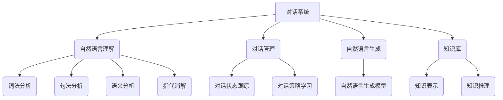

好的,我会严格遵循约束条件,以专业的技术语言写一篇关于对话系统的深度博客文章。

# 对话系统(Chatbots) - 原理与代码实例讲解

## 1. 背景介绍

### 1.1 问题的由来

在当今时代,人机交互已经成为了日常生活中不可或缺的一部分。传统的图形用户界面(GUI)虽然方便易用,但仍存在着一些局限性。比如,用户需要通过点击、拖拽等操作来与计算机交互,这在某些情况下可能会显得笨拙和低效。因此,人们开始探索更自然、更人性化的交互方式,对话系统(Chatbots)应运而生。

对话系统旨在模拟人与人之间的自然对话,让用户可以通过自然语言与计算机进行交互,描述需求、提出问题并获得响应。这种交互方式更加直观、高效,能够极大地提升用户体验。

### 1.2 研究现状

对话系统的研究最早可以追溯到20世纪60年代,当时的系统如ELIZA虽然简陋,但奠定了对话系统的基础。随着自然语言处理(NLP)、机器学习等技术的不断发展,对话系统也在不断演进和完善。

近年来,随着深度学习的兴起,对话系统取得了长足进步。基于序列到序列(Seq2Seq)模型的生成式对话系统、基于检索的对话系统、任务导向对话系统等不同类型的对话系统层出不穷,在各种场景下发挥着重要作用。

不过,现有对话系统仍然存在一些局限性,如上下文理解能力不足、知识库覆盖面有限、缺乏逻辑推理能力等,这些都是当前研究的重点方向。

### 1.3 研究意义 

对话系统作为人机交互的重要方式,具有广阔的应用前景。它可以应用于智能助手、客服系统、教育辅导、医疗诊断等多个领域,极大地提高了工作效率和服务质量。

此外,对话系统的研究也推动了自然语言处理、知识表示、推理等多个领域的发展,对于构建通用人工智能(AGI)具有重要意义。因此,对话系统的研究不仅具有重要的应用价值,也是推动人工智能发展的重要一环。

### 1.4 本文结构

本文将全面介绍对话系统的原理和实现。首先阐述对话系统的核心概念和关键技术,然后深入探讨主流对话系统的算法原理和数学模型,并结合代码实例进行详细讲解。最后,本文将分析对话系统在实际应用中的场景,并对未来发展趋势和挑战进行展望。

## 2. 核心概念与联系

对话系统涉及多个领域的知识,包括自然语言处理、机器学习、知识图谱等。下面我们将介绍对话系统的一些核心概念及它们之间的关系。



1. **自然语言理解(NLU)**:将用户的自然语言输入转化为计算机可以理解的语义表示,包括词法分析、句法分析、语义分析和指代消解等步骤。
2. **对话管理**:根据当前对话状态和用户输入,决策下一步的对话行为,包括对话状态跟踪和对话策略学习两个重要组成部分。
3. **自然语言生成(NLG)**:将对话系统的语义表示转化为自然语言输出,通常采用序列生成模型。
4. **知识库**:存储对话系统所需的知识,如事实知识、常识知识等,需要合理的知识表示方式和高效的知识推理能力。

这些模块相互关联、环环相扣,共同构成了对话系统的核心架构。下面我们将对各个模块的原理和实现进行详细阐述。

## 3. 核心算法原理 & 具体操作步骤  

### 3.1 算法原理概述

对话系统的核心算法主要包括以下几个方面:

1. **自然语言理解算法**:将自然语言输入转换为语义表示,主要涉及词法分析、句法分析、语义分析和指代消解等步骤。常用的算法有有限状态自动机、上下文无关文法、语义角色标注等。

2. **对话状态跟踪算法**:跟踪对话过程中的状态信息,为对话策略提供依据。常用的算法有基于规则的方法、统计机器学习方法和深度学习方法等。

3. **对话策略学习算法**:根据对话状态和目标,决策下一步的对话行为。主要有基于规则的方法、基于监督学习的方法、基于强化学习的方法等。

4. **自然语言生成算法**:将对话系统的语义表示转化为自然语言输出。常用的算法有基于模板的方法、基于统计机器翻译的方法、基于序列到序列学习的方法等。

5. **知识推理算法**:从知识库中获取相关知识并进行推理,为对话系统提供所需信息。常用的算法有基于规则的推理、基于统计的推理、基于深度学习的推理等。

这些算法相互配合,共同实现了对话系统的核心功能。下面我们将对其中的关键算法进行详细讲解。

### 3.2 算法步骤详解

#### 3.2.1 自然语言理解算法

自然语言理解算法将用户的自然语言输入转换为计算机可以理解的语义表示,通常包括以下几个步骤:

1. **词法分析**:将输入文本拆分为一个个单词(token),并标注每个单词的词性(Part-of-Speech,POS)。常用的算法有基于规则的方法、基于统计的方法和基于深度学习的方法。

2. **句法分析**:根据单词及其词性构建句子的语法树(Parsing Tree),表示单词之间的依赖关系。常用的算法有上下文无关文法(Context-Free Grammar,CFG)、依存句法分析等。

3. **语义分析**:从句法树中提取语义角色(Semantic Role)和关系,构建语义表示。常用的算法有语义角色标注(Semantic Role Labeling,SRL)、抽象意义表示(Abstract Meaning Representation,AMR)等。

4. **指代消解**:确定指代词(如"它"、"他们")所指代的实体。常用的算法有基于规则的方法、基于监督学习的方法等。

以"我想订一间海景房"为例,自然语言理解算法的处理步骤如下:

```
词法分析: 我/pronoun 想/verb 订/verb 一/num 间/noun 海景/noun 房/noun
句法分析: (ROOT (S (NP 我) (VP (VP 想 (VP 订 (NP (QP 一 间) (NP 海景 房)))))
语义分析: 
  - 谓词: 订
  - 论元0: 我
  - 论元1: 房
  - 修饰语: 海景, 一间
指代消解: 无需处理
```

最终得到的语义表示为:

```
订(我, 房)
房.修饰语 = {海景, 一间}
```

这个语义表示将作为对话管理模块的输入,用于决策下一步的对话行为。

#### 3.2.2 对话状态跟踪算法

对话状态跟踪算法的目标是根据当前对话历史,推断出对话当前所处的状态,为对话策略提供依据。常用的算法包括:

1. **基于规则的方法**:根据预定义的规则来更新对话状态,适用于领域较窄、场景较简单的情况。

2. **统计机器学习方法**:将对话状态跟踪建模为分类或序列标注问题,使用监督学习的方法进行训练,如条件随机场(CRF)、最大熵模型等。

3. **深度学习方法**:使用神经网络模型直接从对话历史中学习状态表示,如基于注意力机制的序列到序列模型、基于记忆网络的模型等。

以预订酒店房间为例,对话状态可能包括:

- 用户的目的地(destination)
- 入住日期(check-in date)
- 离店日期(check-out date)
- 房间类型(room type)
- ...

对话状态跟踪算法需要根据用户的每一次输入,不断更新和完善对话状态,直至获得足够的信息进行下一步操作。

#### 3.2.3 对话策略学习算法  

对话策略学习算法的目标是根据当前对话状态,决策下一步的对话行为,以完成特定任务或满足用户需求。主要算法包括:

1. **基于规则的方法**:根据预定义的规则来选择对话行为,适用于领域较窄、场景较简单的情况。

2. **基于监督学习的方法**:将对话策略建模为分类或序列标注问题,使用监督学习算法(如SVM、逻辑回归等)从标注数据中学习策略。

3. **基于强化学习的方法**:将对话过程建模为马尔可夫决策过程(MDP),使用强化学习算法(如Q-Learning、Policy Gradient等)从环境反馈中直接学习对话策略。

以预订酒店房间为例,对话策略可能包括:

- 询问用户目的地
- 询问入住日期和离店日期
- 根据条件查询可用房间
- 向用户确认订单信息
- ...

对话策略需要根据当前对话状态,选择合适的行为,引导对话朝着正确的方向发展。

#### 3.2.4 自然语言生成算法

自然语言生成算法的目标是将对话系统的语义表示转化为自然语言输出。主要算法包括:

1. **基于模板的方法**:根据预定义的模板和当前语义表示生成自然语言,适用于领域较窄、场景较简单的情况。

2. **基于统计机器翻译的方法**:将语义表示看作源语言,自然语言看作目标语言,使用统计机器翻译模型(如Moses等)进行翻译。

3. **基于序列到序列学习的方法**:使用编码器-解码器(Encoder-Decoder)模型,将语义表示编码为向量表示,再解码生成自然语言序列。常用的模型有循环神经网络(RNN)、注意力机制(Attention)、Transformer等。

以"我想订一间海景房"的语义表示为例:

```
订(我, 房)
房.修饰语 = {海景, 一间}
```

自然语言生成算法可能输出:

"好的,我们将为您预订一间海景房。"

自然语言生成算法需要生成通顺、符合语境的自然语言输出,以提供良好的用户体验。

#### 3.2.5 知识推理算法

知识推理算法的目标是从知识库中获取相关知识,并进行推理以支持对话系统的决策。主要算法包括:

1. **基于规则的推理**:根据预定义的规则从知识库中推导出新的知识,适用于领域较窄、知识较结构化的情况。

2. **基于统计的推理**:使用统计机器学习模型(如马尔可夫逻辑网络、贝叶斯网络等)从知识库中学习知识模式,并进行推理。

3. **基于深度学习的推理**:使用神经网络模型(如记忆网络、知识图嵌入等)从知识库中学习知识表示,并进行推理。

以"北京是中国的首都吗?"为例,知识推理算法可能执行如下步骤:

1. 从知识库中查找与"北京"、"中国"、"首都"相关的事实知识。
2. 根据这些知识,利用推理规则或统计模型推导出"北京是中国的首都"这一结论。
3. 将推理结果返回给对话系统,用于生成自然语言回复。

知识推理算法为对话系统提供了外部知识支持,有助于