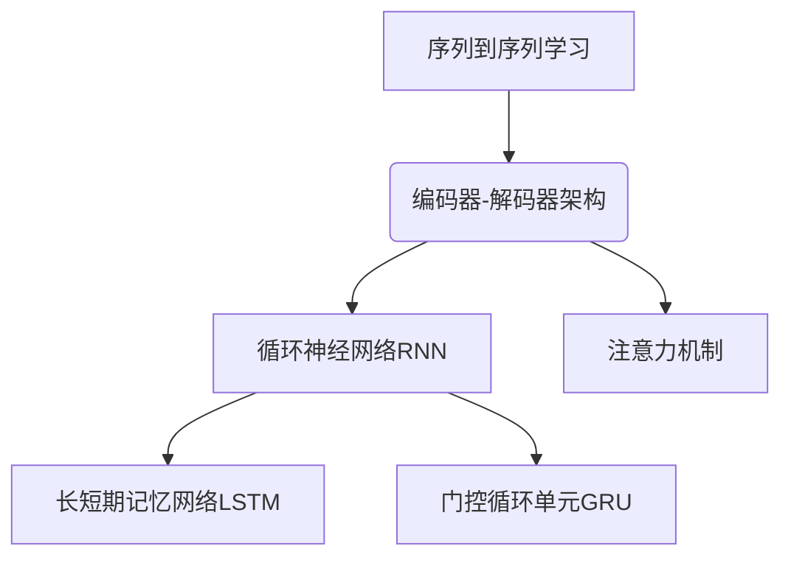

# 序列到序列学习 原理与代码实例讲解

作者：禅与计算机程序设计艺术 / Zen and the Art of Computer Programming

## 1. 背景介绍

### 1.1 问题的由来

在自然语言处理、机器翻译、语音识别等领域中,输入和输出数据通常都是序列形式的,比如句子就是一个词序列。传统的机器学习模型如何有效地处理这种序列到序列(Sequence-to-Sequence,Seq2Seq)的映射问题一直是一个挑战。

### 1.2 研究现状

早期的序列学习方法主要基于统计机器翻译和隐马尔可夫模型,但由于其对长程依赖的建模能力较差,很难有效处理长序列数据。2014年,谷歌的研究人员提出了Seq2Seq模型,借助于循环神经网络(RNN)和注意力机制,极大地提高了序列到序列学习的性能。

### 1.3 研究意义

Seq2Seq模型可以广泛应用于自然语言处理、语音识别、机器翻译等领域,是解决序列数据处理问题的重要方法。掌握Seq2Seq模型的原理和实现方法,对于从事相关领域的研究人员和工程师来说具有重要意义。

### 1.4 本文结构

本文首先介绍Seq2Seq模型的核心概念和基本原理,然后详细阐述模型的数学基础和算法流程,并结合实例代码进行讲解。最后探讨Seq2Seq模型在实际应用中的场景,以及未来的发展趋势和挑战。

## 2. 核心概念与联系

序列到序列(Sequence-to-Sequence,Seq2Seq)学习是一种将一个序列映射为另一个序列的机器学习模型,广泛应用于自然语言处理、机器翻译、语音识别等领域。

Seq2Seq模型采用编码器-解码器(Encoder-Decoder)架构,其核心思想是:

1. **编码器(Encoder)** 接收输入序列,并将其编码为一个向量表示(Context Vector),捕获输入序列的上下文信息。
2. **解码器(Decoder)** 接收编码器的Context Vector,并基于此生成目标输出序列。

在实现编码器和解码器时,通常采用**循环神经网络(Recurrent Neural Network,RNN)**,利用其对序列数据的建模能力。常用的RNN变体包括**长短期记忆网络(Long Short-Term Memory,LSTM)**和**门控循环单元(Gated Recurrent Unit,GRU)**,用于解决RNN在长序列上的梯度消失/爆炸问题。

另一个关键技术是**注意力机制(Attention Mechanism)**,它允许解码器在生成每个输出时,对输入序列中的不同部分赋予不同的权重,从而更好地捕获长距离依赖关系。

## 3. 核心算法原理 & 具体操作步骤

### 3.1 算法原理概述

Seq2Seq模型的核心思想是将输入序列映射为一个中间表示(Context Vector),然后基于该中间表示生成目标输出序列。具体来说,算法分为以下几个步骤:

1. **编码器(Encoder)** 读取输入序列,并将每个时间步的输入传递给一个RNN单元,产生一个向量序列 $\boldsymbol{h} = (\boldsymbol{h}_1, \boldsymbol{h}_2, \dots, \boldsymbol{h}_n)$。
2. 将编码器的最后一个隐状态 $\boldsymbol{h}_n$ 作为 **Context Vector** $\boldsymbol{c}$,表示整个输入序列的语义信息。
3. **解码器(Decoder)** 是另一个RNN,它在每个时间步接收前一时间步的输出 $\boldsymbol{y}_{t-1}$ 和 Context Vector $\boldsymbol{c}$ 作为输入,并生成当前时间步的输出 $\boldsymbol{y}_t$。
4. 解码器的输出 $\boldsymbol{y}_t$ 通过一个深度神经网络进行变换,得到目标序列在当前时间步的预测概率分布 $P(y_t|y_1, \dots, y_{t-1}, \boldsymbol{c})$。
5. 对于每个时间步,从预测的概率分布中采样一个标记作为输出。重复这个过程直到达到终止条件(如生成了终止符号)。

通过最大化训练数据的条件概率 $P(Y|X)$,可以学习编码器和解码器的参数,其中 $X$ 和 $Y$ 分别表示输入和目标序列。

### 3.2 算法步骤详解

1. **编码器(Encoder)**

编码器通常使用RNN对输入序列 $X = (x_1, x_2, \dots, x_n)$ 进行编码,产生一系列隐状态 $\boldsymbol{h} = (\boldsymbol{h}_1, \boldsymbol{h}_2, \dots, \boldsymbol{h}_n)$:

$$\boldsymbol{h}_t = f(\boldsymbol{h}_{t-1}, x_t)$$

其中 $f$ 是RNN的转移函数,可以是简单的RNN、LSTM或GRU等变体。最后一个隐状态 $\boldsymbol{h}_n$ 被视为 Context Vector $\boldsymbol{c}$,代表了整个输入序列的语义信息。

2. **解码器(Decoder)** 

解码器也是一个RNN,它在每个时间步 $t$ 接收前一时间步的输出 $\boldsymbol{y}_{t-1}$ 和 Context Vector $\boldsymbol{c}$ 作为输入,并生成当前时间步的输出 $\boldsymbol{y}_t$:

$$\boldsymbol{s}_t = g(\boldsymbol{s}_{t-1}, \boldsymbol{y}_{t-1}, \boldsymbol{c})$$
$$\boldsymbol{y}_t = \text{softmax}(W_o\boldsymbol{s}_t + \boldsymbol{b}_o)$$

其中 $g$ 是解码器RNN的转移函数, $\boldsymbol{s}_t$ 是解码器在时间步 $t$ 的隐状态, $W_o$ 和 $\boldsymbol{b}_o$ 是输出层的权重和偏置。

3. **注意力机制(Attention Mechanism)**

在标准的Seq2Seq模型中,Context Vector $\boldsymbol{c}$ 是编码器最后一个隐状态,它对整个输入序列赋予了相同的权重。但在实际应用中,不同的输入位置对于生成每个输出是有不同的重要程度的。

注意力机制通过计算输入序列每个位置与当前解码器隐状态的相关性分数,从而获得一个重要性权重分布,用于加权编码器的隐状态序列,得到当前时间步的Context Vector:

$$\boldsymbol{c}_t = \sum_{i=1}^n \alpha_{t,i}\boldsymbol{h}_i$$
$$\alpha_{t,i} = \frac{\exp(e_{t,i})}{\sum_{j=1}^n\exp(e_{t,j})}$$
$$e_{t,i} = \text{score}(\boldsymbol{s}_t, \boldsymbol{h}_i)$$

其中 $\alpha_{t,i}$ 是注意力权重, $e_{t,i}$ 是相关性分数函数,可以是简单的内积、多层感知机等。通过注意力机制,解码器可以动态地关注输入序列的不同部分,从而更好地捕获长距离依赖关系。

4. **训练目标**

Seq2Seq模型的目标是最大化训练数据的条件概率 $P(Y|X)$,其中 $X$ 和 $Y$ 分别表示输入和目标序列。具体来说,我们最小化负对数似然损失:

$$\mathcal{L}(\theta) = -\frac{1}{N}\sum_{n=1}^N\sum_{t=1}^{T_n}\log P(y_t^{(n)}|y_1^{(n)}, \dots, y_{t-1}^{(n)}, x^{(n)}; \theta)$$

其中 $\theta$ 表示模型参数, $N$ 是训练样本数, $T_n$ 是第 $n$ 个样本的目标序列长度。通过随机梯度下降等优化算法,可以学习模型参数 $\theta$。

### 3.3 算法优缺点

**优点:**

1. 端到端的架构,无需人工设计特征,可以直接从原始数据中学习。
2. 基于注意力机制,能够更好地捕获长距离依赖关系。
3. 具有很强的泛化能力,可以应用于多种序列到序列的学习任务。

**缺点:**

1. 训练过程复杂,需要大量的数据和计算资源。
2. 生成的序列可能存在语法错误或不合理的地方。
3. 对于长序列的处理效果可能不太理想。

### 3.4 算法应用领域

Seq2Seq模型可以广泛应用于以下领域:

- **机器翻译:** 将一种自然语言翻译为另一种语言。
- **自动问答:** 根据问题自动生成答案。
- **自动摘要:** 对长文本进行自动摘要。
- **图像描述:** 根据图像内容生成自然语言描述。
- **语音识别:** 将语音信号转录为文本。
- **等等。

## 4. 数学模型和公式 & 详细讲解 & 举例说明

### 4.1 数学模型构建

Seq2Seq模型的核心是将输入序列 $X$ 映射为一个中间表示 $\boldsymbol{c}$,然后基于 $\boldsymbol{c}$ 生成输出序列 $Y$。具体来说,我们需要学习两个条件概率模型:

1. **编码器模型** $P(\boldsymbol{c}|X)$: 将输入序列 $X$ 编码为中间表示 $\boldsymbol{c}$。
2. **解码器模型** $P(Y|\boldsymbol{c})$: 根据中间表示 $\boldsymbol{c}$ 生成输出序列 $Y$。

根据链式法则,我们可以将整个模型的条件概率分解为:

$$P(Y|X) = P(\boldsymbol{c}|X)P(Y|\boldsymbol{c})$$

在训练过程中,我们最大化训练数据的对数似然:

$$\mathcal{L}(\theta) = \sum_{(X,Y)\in\mathcal{D}}\log P(Y|X;\theta)$$

其中 $\theta$ 表示模型参数, $\mathcal{D}$ 是训练数据集。

对于编码器模型 $P(\boldsymbol{c}|X)$,我们使用RNN对输入序列进行编码,最后一个隐状态 $\boldsymbol{h}_n$ 作为中间表示 $\boldsymbol{c}$:

$$\boldsymbol{h}_t = f(\boldsymbol{h}_{t-1}, x_t)$$
$$\boldsymbol{c} = \boldsymbol{h}_n$$

其中 $f$ 是RNN的转移函数,可以是简单的RNN、LSTM或GRU等变体。

对于解码器模型 $P(Y|\boldsymbol{c})$,我们也使用RNN,但在每个时间步除了接收前一时间步的输出 $\boldsymbol{y}_{t-1}$ 外,还接收中间表示 $\boldsymbol{c}$ 作为输入:

$$\boldsymbol{s}_t = g(\boldsymbol{s}_{t-1}, \boldsymbol{y}_{t-1}, \boldsymbol{c})$$
$$P(y_t|y_1, \dots, y_{t-1}, \boldsymbol{c}) = \text{softmax}(W_o\boldsymbol{s}_t + \boldsymbol{b}_o)$$

其中 $g$ 是解码器RNN的转移函数, $\boldsymbol{s}_t$ 是解码器在时间步 $t$ 的隐状态, $W_o$ 和 $\boldsymbol{b}_o$ 是输出层的权重和偏置。

通过最大化训练数据的对数似然,我们可以同时学习编码器和解码器的参数。

### 4.2 公式推导过程

在推导 Seq2Seq 模型的目标函数时,我们需要利用一些概率论的基本知识。首先,根据链式法则,我们可以将目标序列 $Y$ 的条件概率分解为:

$$P(Y|X) = \prod_{t=1}^{