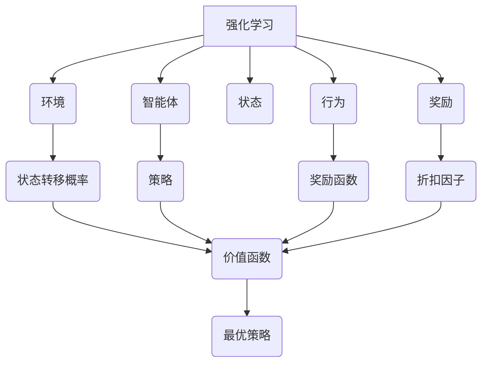

# 强化学习RL原理与代码实例讲解

## 1. 背景介绍

### 1.1 问题的由来

在传统的机器学习领域中,监督学习和无监督学习占据了主导地位。监督学习需要大量的标注数据,而无监督学习则从未标注的数据中寻找隐藏的模式。然而,这两种方法都存在一定的局限性。监督学习需要人工标注大量数据,代价高昂;无监督学习虽然不需要标注数据,但很难解决复杂的决策问题。

强化学习(Reinforcement Learning,RL)作为第三种重要的机器学习范式应运而生。它借鉴了心理学中的行为主义理论,通过对环境的探索和反馈,自主地学习如何做出最优决策。与监督学习和无监督学习不同,强化学习没有提供完整的输入-输出数据对,而是通过与环境的持续交互,根据获得的奖励信号来调整决策策略。

### 1.2 研究现状

近年来,强化学习在多个领域取得了突破性进展,如深度学习、控制理论、博弈论等。谷歌的AlphaGo战胜了世界顶尖的人类棋手,OpenAI的机器人能够完成复杂的机械臂控制任务,Deepmind的AlphaFold2能够准确预测蛋白质的三维结构。这些成就都离不开强化学习算法的支持。

与此同时,强化学习理论和算法也在不断发展和完善。从早期的Q-Learning、Sarsa等传统算法,到后来的策略梯度算法、Actor-Critic算法,再到近年来的深度强化学习算法,如深度Q网络(DQN)、深度确定性策略梯度(DDPG)等,算法的性能和应用范围都在不断扩展。

### 1.3 研究意义

强化学习为解决复杂的序列决策问题提供了有力工具,具有广阔的应用前景。它可以应用于机器人控制、自动驾驶、智能交通系统、智能制造、金融决策等诸多领域。通过强化学习,智能体可以自主探索环境,根据获得的反馈不断优化决策策略,从而实现高效、智能的控制和决策。

此外,强化学习也为人工智能的发展提供了新的思路和方法。传统的机器学习方法往往依赖于大量的人工标注数据,而强化学习则通过与环境的交互来获取经验,更接近于人类的学习方式。它为构建通用人工智能(Artificial General Intelligence,AGI)提供了新的可能性。

### 1.4 本文结构

本文将全面介绍强化学习的理论基础、核心算法、数学模型以及实际应用。文章首先阐述强化学习的基本概念和框架,然后详细讲解经典算法的原理和实现步骤。接下来,我们将构建强化学习的数学模型,推导核心公式,并通过案例分析加深理解。在此基础上,我们将实践一个强化学习项目,展示代码实现和运行结果。最后,我们将探讨强化学习在实际应用中的场景,分享相关资源,并展望未来的发展趋势和挑战。

## 2. 核心概念与联系

强化学习(Reinforcement Learning)是一种基于奖惩的机器学习范式,其核心概念包括:

1. **环境(Environment)**: 智能体与之交互的外部世界,描述了系统的动态行为。环境根据智能体的行为产生新的状态,并提供奖惩反馈。

2. **智能体(Agent)**: 在环境中做出决策和采取行动的主体,目标是通过与环境交互来学习最优策略。

3. **状态(State)**: 描述环境在某个时刻的具体情况,是智能体做出决策的基础。

4. **行为(Action)**: 智能体在当前状态下可以采取的操作。

5. **奖励(Reward)**: 环境对智能体当前行为的反馈,用于指导智能体优化决策策略。

6. **状态转移概率(State Transition Probability)**: 描述智能体在当前状态下采取某个行为后,转移到下一状态的概率分布。

7. **策略(Policy)**: 智能体在每个状态下选择行为的规则或策略,是强化学习需要学习优化的目标。

8. **奖励函数(Reward Function)**: 定义了在每个状态下采取行为所获得的即时奖励。

9. **折扣因子(Discount Factor)**: 用于权衡即时奖励和长期累积奖励的重要性,控制智能体的远见程度。

10. **价值函数(Value Function)**: 评估在当前状态下采取某个策略所能获得的长期累积奖励的期望值。

11. **最优策略(Optimal Policy)**: 能够最大化长期累积奖励的策略,是强化学习算法的最终目标。

这些概念相互关联,构成了强化学习的基本框架。智能体与环境交互,根据获得的奖励信号不断优化策略,最终学习到最优策略。

## 3. 核心算法原理 & 具体操作步骤

强化学习算法可以分为三大类:基于价值函数的算法、基于策略的算法和Actor-Critic算法。下面我们将详细介绍其中的经典算法,阐述算法原理并给出具体实现步骤。

### 3.1 算法原理概述

#### 3.1.1 基于价值函数的算法

基于价值函数的算法旨在估计每个状态或状态-行为对的价值函数,然后根据价值函数导出最优策略。代表算法包括Q-Learning和Sarsa。

- **Q-Learning**:是最早也是最著名的强化学习算法之一。它通过不断更新Q值(状态-行为对的价值函数),逐步逼近最优Q值,从而得到最优策略。

- **Sarsa**:与Q-Learning类似,但它基于实际经历的状态-行为-奖励-下一状态-下一行为序列来更新Q值,更加依赖于当前策略。

#### 3.1.2 基于策略的算法

基于策略的算法直接对策略函数进行参数化建模,通过优化策略参数来学习最优策略。代表算法包括REINFORCE和PPO。

- **REINFORCE**:是一种基于策略梯度的算法,通过估计策略梯度来更新策略参数,使得期望累积奖励最大化。

- **PPO(Proximal Policy Optimization)**: 在REINFORCE的基础上,引入了一种信赖区域优化方法,提高了算法的稳定性和样本效率。

#### 3.1.3 Actor-Critic算法

Actor-Critic算法结合了价值函数和策略的优点,通过价值函数(Critic)来估计策略(Actor)的性能,从而更有效地优化策略。代表算法包括A2C和A3C。

- **A2C(Advantage Actor-Critic)**: 将价值函数和策略同时建模,利用优势函数(Advantage Function)来估计策略梯度,实现策略和价值函数的联合更新。

- **A3C(Asynchronous Advantage Actor-Critic)**: 在A2C的基础上,引入了异步更新机制,多个智能体并行探索环境,提高了算法的效率。

### 3.2 算法步骤详解

以Q-Learning算法为例,我们将详细介绍其具体实现步骤:

1. **初始化Q表格**:创建一个Q表格,其中的每个元素Q(s,a)表示在状态s下采取行为a的价值函数估计值。初始时,所有Q值可以设置为0或者随机初始化。

2. **初始化超参数**:设置学习率α、折扣因子γ和探索策略ε-greedy等超参数。

3. **开始训练循环**:对于每个训练回合,执行以下步骤:
   a. 初始化环境,获取初始状态s。
   b. 重复以下步骤,直到达到终止状态:
      i. 根据当前策略(如ε-greedy)选择一个行为a。
      ii. 在环境中执行行为a,获得奖励r和下一状态s'。
      iii. 更新Q(s,a)的估计值,使用下式:
          $Q(s,a) \leftarrow Q(s,a) + \alpha [r + \gamma \max_{a'}Q(s',a') - Q(s,a)]$
      iv. 将s更新为s'。
   c. 重置环境,进入下一个训练回合。

4. **提取最优策略**:在训练结束后,对于每个状态s,选择具有最大Q值的行为作为最优行为:
   $\pi^*(s) = \arg\max_a Q(s,a)$

通过不断更新Q值,Q-Learning算法最终能够收敛到最优Q函数,从而得到最优策略。

### 3.3 算法优缺点

#### 3.3.1 优点

- **通用性强**:强化学习算法可以应用于各种序列决策问题,包括离散和连续的状态空间和行为空间。

- **无需人工标注数据**:与监督学习不同,强化学习算法无需人工标注大量数据,而是通过与环境交互来获取经验。

- **长期累积奖励最大化**:强化学习算法旨在优化长期累积奖励,而不仅仅是即时奖励,具有更好的前瞻性。

#### 3.3.2 缺点

- **样本效率低**:强化学习算法需要与环境进行大量交互才能收敛,样本效率较低。

- **稀疏奖励问题**:在某些环境中,奖励信号很稀疏,导致算法收敛缓慢或无法收敛。

- **探索与利用权衡**:算法需要在探索新的状态-行为对和利用已知的最优行为之间进行权衡。

- **环境设计挑战**:设计一个合理的环境并非易事,需要考虑状态空间、行为空间和奖励函数的设置。

### 3.4 算法应用领域

强化学习算法具有广泛的应用前景,包括但不限于以下领域:

- **机器人控制**: 用于机械臂控制、无人机导航、机器人行走等任务。

- **游戏AI**: 训练智能体在各种游戏环境中做出最优决策,如AlphaGo、Dota2等。

- **自动驾驶**: 控制无人驾驶汽车在复杂环境中安全行驶。

- **智能制造**: 优化生产流程,提高效率和产品质量。

- **金融决策**: 在股票交易、资产配置等金融场景中做出投资决策。

- **推荐系统**: 根据用户的行为和反馈,优化推荐策略。

- **自然语言处理**: 用于对话系统、机器翻译等任务。

- **医疗健康**: 辅助诊断和治疗决策,优化医疗资源分配。

总之,强化学习算法为解决复杂的序列决策问题提供了有力工具,在人工智能的多个领域都有广阔的应用前景。

## 4. 数学模型和公式 & 详细讲解 & 举例说明

### 4.1 数学模型构建

为了更好地理解和分析强化学习问题,我们需要构建数学模型。强化学习问题可以用马尔可夫决策过程(Markov Decision Process,MDP)来形式化描述。

一个MDP可以用一个五元组$(S, A, P, R, \gamma)$来表示,其中:

- $S$是状态空间的集合,表示环境可能的状态。
- $A$是行为空间的集合,表示智能体在每个状态下可以采取的行为。
- $P(s'|s,a)$是状态转移概率,表示在状态$s$下采取行为$a$后,转移到状态$s'$的概率。
- $R(s,a)$是奖励函数,表示在状态$s$下采取行为$a$所获得的即时奖励。
- $\gamma \in [0,1)$是折扣因子,用于权衡即时奖励和长期累积奖励的重要性。

在MDP中,智能体的目标是学习一个策略$\pi: S \rightarrow A$,使得在该策略下的长