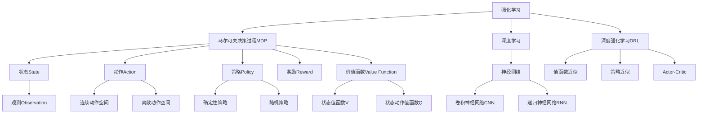

以下是根据您提供的要求和大纲，撰写的技术博客文章正文内容：

# 强化学习Reinforcement Learning与深度学习的结合之路

## 1. 背景介绍

### 1.1 问题的由来

在过去的几十年里，机器学习算法取得了长足的进步,尤其是监督学习和无监督学习在计算机视觉、自然语言处理等领域的广泛应用。然而,这些传统机器学习算法往往需要大量标注好的训练数据,并且很难解决一些具有连续状态和动作空间的序列决策问题。

强化学习(Reinforcement Learning, RL)作为机器学习的一个重要分支,它能够让智能体(Agent)通过与环境的交互来学习如何在给定的环境中获取最大化的累积奖励。与监督学习和无监督学习不同,强化学习不需要大量的标注数据,智能体可以通过试错的方式自主学习,从而解决诸如机器人控制、游戏AI等序列决策问题。

### 1.2 研究现状  

传统的强化学习算法,如Q-Learning、Sarsa等,在处理简单的环境时表现不错,但在复杂环境下往往会遇到"维数灾难"的问题。随着深度学习技术的兴起,人们开始尝试将深度神经网络应用于强化学习,以提高处理高维观测数据和动作空间的能力。这种结合深度学习与强化学习的方法被称为深度强化学习(Deep Reinforcement Learning, DRL)。

2013年,DeepMind提出的深度Q网络(Deep Q-Network, DQN)算法将深度神经网络应用于强化学习,成为深度强化学习的开山之作。之后,各种新的深度强化学习算法如A3C、DDPG、PPO等相继问世,在游戏AI、机器人控制、自动驾驶等领域取得了令人瞩目的成就。

### 1.3 研究意义

深度强化学习的出现为解决复杂序列决策问题提供了新的思路和方法。它结合了深度学习强大的特征提取能力和强化学习探索环境、自主学习的优势,能够在不需要大量标注数据的情况下,通过与环境交互来学习最优策略。

深入研究深度强化学习算法的原理、优化方法和应用场景,可以推动人工智能技术在诸如机器人控制、自动驾驶、智能制造等领域的落地应用,为解决实际问题提供有力的技术支撑。

### 1.4 本文结构

本文将全面介绍深度强化学习的核心概念、算法原理、数学模型以及实际应用。文章主要分为以下几个部分:

1. 核心概念与联系
2. 核心算法原理与具体操作步骤  
3. 数学模型和公式详细讲解与案例分析
4. 项目实践:代码实例和详细解释说明
5. 实际应用场景
6. 工具和资源推荐
7. 总结:未来发展趋势与挑战
8. 附录:常见问题与解答

## 2. 核心概念与联系

在深入探讨深度强化学习的算法细节之前,我们先来了解一些核心概念。



**马尔可夫决策过程(Markov Decision Process, MDP)**是强化学习问题的数学模型,由一组状态(State)、动作(Action)、状态转移概率(Transition Probability)、奖励函数(Reward Function)和折扣因子(Discount Factor)组成。

**状态(State)** 描述了智能体当前所处的环境状态,可能是一个低维的离散状态,也可能是高维的连续状态。

**动作(Action)** 是智能体根据当前状态做出的决策,动作空间可以是离散的,也可以是连续的。

**策略(Policy)** 定义了智能体在每个状态下选择动作的行为策略,可以是确定性的,也可以是随机的。

**奖励(Reward)** 是智能体执行某个动作后,环境给予的反馈信号,奖励函数定义了在每个状态执行动作后获得的奖励值。

**价值函数(Value Function)** 用于评估当前状态的好坏,包括状态值函数V(s)和状态动作值函数Q(s,a)。

**观测(Observation)** 是智能体对环境状态的部分可观测信息,在部分观测环境中需要根据历史观测序列来估计隐藏状态。

在传统的强化学习算法中,价值函数和策略往往使用表格或者简单的函数拟合器来表示。而**深度强化学习**则利用**深度神经网络**来拟合价值函数或策略,从而处理高维的观测数据和动作空间。根据神经网络拟合的目标不同,深度强化学习算法可分为**值函数近似**、**策略近似**和**Actor-Critic**三种范式。

## 3. 核心算法原理与具体操作步骤

### 3.1 算法原理概述

深度强化学习的核心思想是利用**深度神经网络**来拟合传统强化学习算法中的**价值函数**或**策略**,从而提高处理高维观测数据和动作空间的能力。根据神经网络拟合的目标不同,主要分为以下三种范式:

1. **值函数近似(Value Function Approximation)**
    - 使用深度神经网络拟合状态值函数V(s)或状态动作值函数Q(s,a)
    - 代表算法:深度Q网络(DQN)、双重深度Q网络(Double DQN)、深度残差Q网络(DRQN)等

2. **策略近似(Policy Approximation)** 
    - 使用深度神经网络直接拟合策略π(a|s)
    - 代表算法:深度确定性策略梯度(DDPG)、深度策略梯度(DPG)、信任区域策略优化(TRPO)等

3. **Actor-Critic**
    - 使用两个深度神经网络同时拟合价值函数和策略
    - Actor网络拟合策略π(a|s),Critic网络拟合价值函数V(s)或Q(s,a)
    - 代表算法:优势Actor-Critic(A2C)、深度确定性策略梯度(DDPG)、近端策略优化(PPO)等

下面我们将详细介绍其中的核心算法:深度Q网络(DQN)和深度确定性策略梯度(DDPG)。

### 3.2 算法步骤详解

#### 3.2.1 深度Q网络(Deep Q-Network, DQN)

DQN算法是值函数近似范式的代表,它使用一个深度神经网络来拟合状态动作值函数Q(s,a),从而解决高维观测数据的问题。DQN算法的核心步骤如下:

```mermaid
graph TD
    A[初始化Q网络和经验回放池] --> B[观测初始状态s]
    B --> C[选择动作a,执行动作获得下一状态s',奖励r]
    C --> D[将(s,a,r,s')存入经验回放池]
    D --> E[从经验回放池采样批次数据]
    E --> F[计算Q网络输出的Q值与目标Q值的均方误差]
    F --> G[使用梯度下降优化Q网络参数]
    G --> H[更新目标Q网络参数]
    H --> B
```

1. **初始化Q网络和经验回放池**
    - Q网络是一个深度神经网络,用于拟合状态动作值函数Q(s,a)
    - 经验回放池用于存储智能体与环境交互的经验数据(s,a,r,s')

2. **观测初始状态s,选择动作a并执行**
    - 根据当前Q网络输出和探索策略(如ε-贪婪)选择动作a
    - 执行动作a,获得下一状态s'和奖励r

3. **存储经验数据,采样批次数据**
    - 将(s,a,r,s')存入经验回放池
    - 从经验回放池中采样一个批次的数据

4. **计算目标Q值,优化Q网络参数**
    - 根据下一状态s'计算目标Q值Q_target
    - 计算Q网络输出的Q值与目标Q值的均方误差损失函数
    - 使用梯度下降优化Q网络参数,最小化损失函数

5. **更新目标Q网络参数**
    - 为了增加训练稳定性,使用一个延迟更新的目标Q网络,定期将Q网络参数复制到目标Q网络

6. **回到步骤2,重复以上过程**

DQN算法的创新之处在于引入了**经验回放池**和**目标Q网络**两个技巧,分别用于解决相关性抽样和非稳定性问题,从而提高了训练的稳定性和效率。

#### 3.2.2 深度确定性策略梯度(Deep Deterministic Policy Gradient, DDPG)  

DDPG算法是策略近似范式和Actor-Critic范式的结合,它使用一个Actor网络拟合确定性策略μ(s),一个Critic网络拟合状态动作值函数Q(s,a)。DDPG算法的核心步骤如下:

```mermaid
graph TD
    A[初始化Actor网络、Critic网络和经验回放池] --> B[观测初始状态s]
    B --> C[Actor网络输出动作a=μ(s)]
    C --> D[执行动作a,获得下一状态s'和奖励r]
    D --> E[将(s,a,r,s')存入经验回放池]
    E --> F[从经验回放池采样批次数据]
    F --> G[计算Critic网络输出的Q值与目标Q值的均方误差]
    G --> H[使用梯度下降优化Critic网络参数]
    H --> I[计算Actor网络策略梯度]
    I --> J[使用梯度上升优化Actor网络参数]
    J --> K[更新目标Actor和Critic网络参数]
    K --> B
```

1. **初始化Actor网络、Critic网络和经验回放池**
    - Actor网络是一个确定性策略μ(s),输出连续动作
    - Critic网络拟合状态动作值函数Q(s,a)
    - 经验回放池用于存储智能体与环境交互的经验数据

2. **观测初始状态s,Actor网络输出动作a**
    - 根据当前状态s,Actor网络输出确定性动作a=μ(s)

3. **执行动作a,获得下一状态s'和奖励r**
    - 执行动作a,获得下一状态s'和奖励r

4. **存储经验数据,采样批次数据**
    - 将(s,a,r,s')存入经验回放池
    - 从经验回放池中采样一个批次的数据  

5. **计算目标Q值,优化Critic网络参数**
    - 根据下一状态s'计算目标Q值Q_target
    - 计算Critic网络输出的Q值与目标Q值的均方误差损失函数
    - 使用梯度下降优化Critic网络参数,最小化损失函数

6. **计算策略梯度,优化Actor网络参数**
    - 根据Critic网络输出的Q值,计算Actor网络的策略梯度
    - 使用梯度上升优化Actor网络参数,最大化Q值

7. **更新目标Actor和Critic网络参数**
    - 为了增加训练稳定性,使用延迟更新的目标Actor和Critic网络
    - 定期将Actor和Critic网络参数复制到目标网络

8. **回到步骤2,重复以上过程**

DDPG算法的关键在于将确定性策略梯度与Actor-Critic结构相结合,使得算法能够处理连续动作空间。同时,它也借鉴了DQN算法中的经验回放池和目标网络等技巧,提高了训练的稳定性和效率。

### 3.3 算法