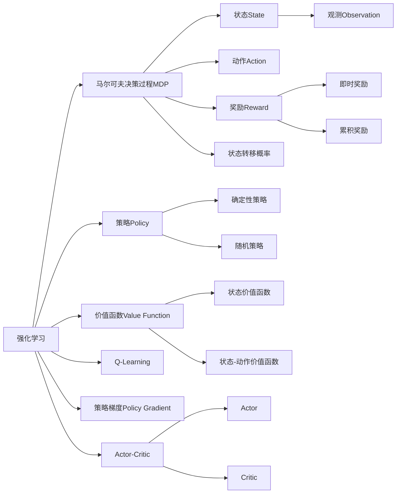

好的,我会遵循您提供的要求和约束条件,以"强化学习Reinforcement Learning与逆强化学习：理论与实践"为主题,撰写一篇专业的技术博客文章。

# 强化学习Reinforcement Learning与逆强化学习：理论与实践

## 1. 背景介绍

### 1.1 问题的由来

在传统的机器学习领域,监督学习和无监督学习占据了主导地位。但是,这两种学习范式都存在一定的局限性。监督学习需要大量的标注数据,而无监督学习则缺乏明确的目标。这就催生了强化学习(Reinforcement Learning,RL)的兴起。

强化学习是一种全新的机器学习范式,它借鉴了行为主义心理学中的理论,通过与环境的交互来学习。在强化学习中,智能体(Agent)在环境(Environment)中执行一系列行为(Actions),并根据行为的结果获得奖励或惩罚(Rewards)。智能体的目标是通过最大化累积奖励来学习最优策略(Optimal Policy)。

### 1.2 研究现状

近年来,强化学习取得了令人瞩目的进展,在诸多领域展现出巨大的潜力。例如,DeepMind的AlphaGo系统使用深度强化学习算法,战胜了人类顶尖的围棋高手。OpenAI的机器人手臂通过强化学习,能够完成复杂的操作任务。此外,强化学习还被广泛应用于自动驾驶、机器人控制、自然语言处理等领域。

然而,传统的强化学习也面临着一些挑战,例如需要大量的试错来学习、难以从人类专家处获取知识、缺乏可解释性等。为了解决这些问题,逆强化学习(Inverse Reinforcement Learning,IRL)应运而生。

### 1.3 研究意义

逆强化学习旨在从专家的示范行为中推断出潜在的奖励函数,从而学习到优化策略。与传统的强化学习相比,逆强化学习具有以下优势:

1. **高效学习**:通过观察专家的行为,可以更快地学习到优化策略,避免了大量的试错过程。
2. **知识迁移**:从专家处获取的奖励函数可以应用于相似的任务中,实现知识的有效迁移。
3. **可解释性**:推断出的奖励函数可以解释智能体的决策过程,提高了模型的可解释性。

因此,深入研究强化学习与逆强化学习的理论与实践,对于推动人工智能的发展具有重要意义。

### 1.4 本文结构

本文将全面介绍强化学习与逆强化学习的理论基础、核心算法、数学模型、实际应用等内容。文章结构安排如下:

1. 背景介绍
2. 核心概念与联系
3. 核心算法原理与具体操作步骤
4. 数学模型和公式详细讲解与举例说明
5. 项目实践:代码实例和详细解释说明
6. 实际应用场景
7. 工具和资源推荐
8. 总结:未来发展趋势与挑战
9. 附录:常见问题与解答

## 2. 核心概念与联系

在深入探讨强化学习与逆强化学习的理论与实践之前,我们需要先了解一些核心概念及它们之间的联系。

上图展示了强化学习中的核心概念及它们之间的关系。我们可以看到:

- **马尔可夫决策过程(MDP)**是强化学习的数学基础,描述了智能体与环境之间的交互过程。
- **策略(Policy)**定义了智能体在给定状态下选择动作的行为策略。
- **价值函数(Value Function)**评估了在执行某一策略时,智能体能够获得的预期累积奖励。
- **Q-Learning**和**策略梯度(Policy Gradient)**是两种常用的强化学习算法范式。
- **Actor-Critic**方法将策略函数和价值函数分开学习,结合了两种范式的优点。

此外,逆强化学习的目标是从专家示范的行为中推断出潜在的奖励函数,从而学习到优化策略。因此,逆强化学习与传统强化学习的核心概念存在密切联系。

## 3. 核心算法原理与具体操作步骤

### 3.1 算法原理概述

#### 3.1.1 强化学习算法

强化学习算法可以分为两大类:基于价值函数的算法和基于策略的算法。

**基于价值函数的算法**旨在估计给定策略下的价值函数,然后选择价值函数最大的策略作为最优策略。这种算法的典型代表是 Q-Learning。

**基于策略的算法**则直接对策略函数进行参数化,通过策略梯度的方式来优化策略参数。这种算法的典型代表是 REINFORCE 算法。

另一种流行的算法范式是 Actor-Critic 方法,它将策略函数(Actor)和价值函数(Critic)分开学习,结合了两种范式的优点。

#### 3.1.2 逆强化学习算法

逆强化学习算法的目标是从专家示范的行为中推断出潜在的奖励函数,然后基于这个奖励函数来学习最优策略。常见的逆强化学习算法包括:

- **基于最大熵原理的算法**:利用最大熵原理来约束奖励函数的学习,确保学习到的策略与专家行为尽可能接近。
- **基于对抗训练的算法**:将奖励函数的学习建模为一个对抗游戏,通过生成对抗网络(GAN)的方式来优化奖励函数。
- **基于最大边际原理的算法**:通过最大化专家行为与非专家行为之间的奖励差异,来学习奖励函数。

### 3.2 算法步骤详解

#### 3.2.1 Q-Learning算法

Q-Learning是一种基于价值函数的强化学习算法,它不需要建模环境的转移概率,可以有效解决马尔可夫决策过程。算法步骤如下:

1. 初始化Q表格,所有状态-动作对的Q值设置为0或一个较小的值。
2. 对于每一个Episode:
    - 初始化状态S
    - 对于每个时间步:
        - 选择动作A(基于epsilon-greedy或其他探索策略)
        - 执行动作A,观测奖励R和下一状态S'
        - 更新Q(S,A)值:Q(S,A) = Q(S,A) + α[R + γ*max(Q(S',a)) - Q(S,A)]
        - S = S'
    - 直到Episode终止
3. 重复步骤2,直到收敛

其中,α是学习率,γ是折扣因子。通过不断更新Q值,最终可以得到最优的Q函数,从而导出最优策略。

#### 3.2.2 REINFORCE算法(蒙特卡洛策略梯度)

REINFORCE算法是一种基于策略梯度的强化学习算法,它直接对策略函数进行参数化优化。算法步骤如下:

1. 初始化策略函数的参数θ
2. 对于每一个Episode:
    - 生成一个Episode的轨迹τ = {s0,a0,r0,s1,a1,r1,...,sT}
    - 计算该Episode的累积奖励R(τ)
    - 对于每个时间步t:
        - 计算对数概率梯度: ∇θlog(π(at|st;θ))
        - 更新策略参数: θ = θ + α*R(τ)*∇θlog(π(at|st;θ))
3. 重复步骤2,直到收敛

其中,π(a|s;θ)表示在状态s下选择动作a的概率,由策略函数参数化。通过不断优化策略参数θ,最终可以得到最优策略。

#### 3.2.3 最大熵逆强化学习算法

最大熵逆强化学习算法是一种常见的逆强化学习算法,它利用最大熵原理来约束奖励函数的学习。算法步骤如下:

1. 初始化奖励函数参数θ
2. 对于每一个迭代:
    - 根据当前的奖励函数,使用强化学习算法(如Q-Learning)求解最优策略π*
    - 计算π*与专家策略πE之间的KL散度: KL(πE||π*)
    - 更新奖励函数参数θ,使KL散度最小化
3. 重复步骤2,直到收敛

通过最小化π*与πE之间的KL散度,可以确保学习到的策略π*尽可能接近专家策略πE,从而推断出合理的奖励函数。

### 3.3 算法优缺点

#### 3.3.1 Q-Learning算法

**优点**:

- 无需建模环境的转移概率,可以有效解决马尔可夫决策过程。
- 算法简单,易于理解和实现。
- 收敛性能良好,可以找到最优策略。

**缺点**:

- 在状态-动作空间较大时,Q表格会变得非常庞大,存在维数灾难问题。
- 无法处理连续的状态和动作空间。
- 无法处理部分可观测马尔可夫决策过程(POMDP)。

#### 3.3.2 REINFORCE算法

**优点**:

- 可以直接对策略函数进行参数化优化,避免了维数灾难问题。
- 能够处理连续的状态和动作空间。
- 适用于部分可观测马尔可夫决策过程(POMDP)。

**缺点**:

- 算法存在高方差问题,收敛速度较慢。
- 需要大量的样本数据来估计策略梯度。
- 难以处理稀疏奖励问题。

#### 3.3.3 最大熵逆强化学习算法

**优点**:

- 能够从专家示范的行为中推断出潜在的奖励函数,避免了手工设计奖励函数的困难。
- 学习到的策略具有良好的可解释性,可以解释智能体的决策过程。
- 可以利用强化学习算法来优化策略,结合了两种范式的优点。

**缺点**:

- 算法复杂度较高,需要同时优化奖励函数和策略函数。
- 存在局部最优解的问题,算法的收敛性能受初始化条件影响较大。
- 需要大量的专家示范数据作为输入,数据获取成本较高。

### 3.4 算法应用领域

强化学习与逆强化学习算法在诸多领域展现出巨大的应用潜力,包括但不限于:

- **游戏AI**:强化学习算法可以训练智能体在复杂的游戏环境中学习最优策略,如AlphaGo、AlphaZero等。
- **机器人控制**:通过与环境交互,机器人可以学习复杂的运动控制策略,如OpenAI的机器人手臂。
- **自动驾驶**:强化学习可以训练自动驾驶系统在复杂的交通环境中做出正确决策。
- **自然语言处理**:逆强化学习可以从人类专家的对话示范中学习到对话策略。
- **推荐系统**:强化学习可以优化推荐系统的策略,提高用户体验。
- **金融交易**:强化学习算法可以学习最优的交易策略,实现自动化交易。

总的来说,强化学习与逆强化学习为解决复杂的序列决策问题提供了有力的工具,在人工智能的诸多领域都有广阔的应用前景。

## 4. 数学模型和公式详细讲解与举例说明

### 4.1 数学模型构建

#### 4.1.1 马尔可夫决策过程(MDP)

马尔可夫决策过程是强化学习的数学基础,用