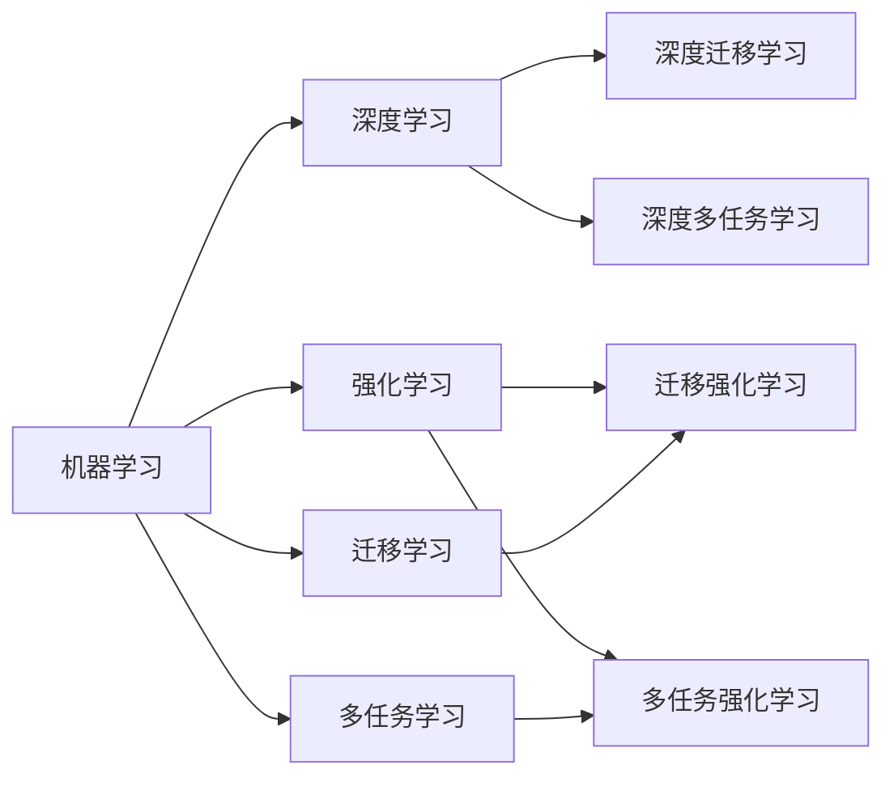
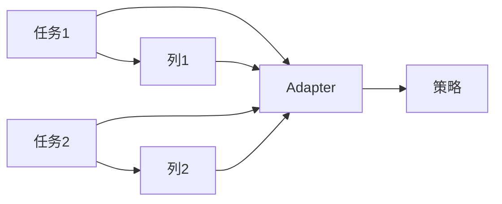
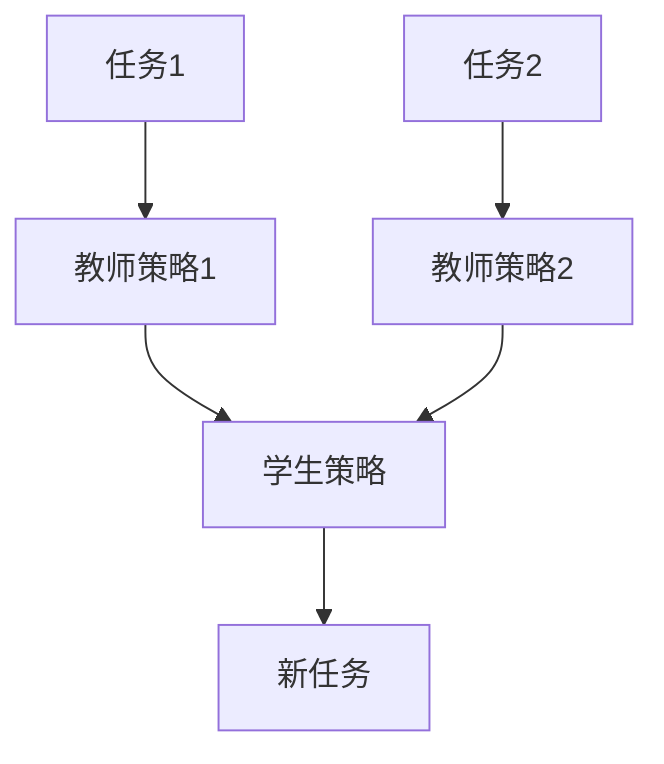

# 强化学习Reinforcement Learning中的迁移学习与多任务学习

关键词：强化学习, 迁移学习, 多任务学习, 深度学习, 机器学习, 人工智能

## 1. 背景介绍
### 1.1  问题的由来
随着人工智能技术的飞速发展,强化学习(Reinforcement Learning, RL)作为一种通用的学习和决策范式,在很多领域取得了巨大的成功,如AlphaGo在围棋领域战胜人类顶尖高手,OpenAI Five在Dota2游戏中击败人类职业选手等。然而,强化学习要达到这样的效果需要大量的训练数据和计算资源,且训练出的模型通常只针对特定任务,难以泛化和迁移到新任务。

迁移学习和多任务学习正是为了解决这些问题而提出的。迁移学习旨在将已学习的知识从源任务迁移到目标任务,减少目标任务所需的数据量和训练时间。多任务学习则是通过同时学习多个相关任务,利用任务之间的相关性,来提高模型的泛化能力和学习效率。将迁移学习和多任务学习应用到强化学习中,有望进一步提升强化学习的性能和应用范围。

### 1.2  研究现状 
近年来,迁移强化学习和多任务强化学习得到了广泛关注和研究。一些代表性的工作包括:
- Progressive Neural Networks (Rusu et al., 2016)利用迁移学习在Atari游戏中实现正迁移 
- Actor-Mimic (Parisotto et al., 2016)利用多任务学习同时训练多个游戏策略
- Distral (Teh et al., 2017)提出蒸馏多任务强化学习算法
- Meta Learning Shared Hierarchies (Frans et al., 2018)利用元学习和层次化学习进行多任务RL

尽管取得了一定进展,但是如何在强化学习中更有效地利用迁移和多任务学习,来提高采样效率、泛化能力和鲁棒性,仍然是一个开放的研究问题。

### 1.3  研究意义
迁移学习和多任务学习对于强化学习具有重要意义:
1. 通过知识迁移,减少目标任务所需的数据量和训练时间,提高学习效率
2. 通过多任务学习,利用不同任务之间的相关性,学到更具泛化能力的策略,避免过拟合
3. 提高模型对环境变化的鲁棒性和适应性,更好地应对现实世界中复杂多变的任务
4. 为迈向通用人工智能(AGI)打下基础,实现在多个领域的智能体的知识共享和迁移

### 1.4  本文结构
本文将围绕强化学习中的迁移学习和多任务学习展开,内容安排如下:
- 第2节介绍相关的核心概念与联系
- 第3节介绍几种代表性的迁移强化学习和多任务强化学习算法原理 
- 第4节对算法涉及的数学模型和公式进行详细推导和讲解
- 第5节通过项目代码实例演示算法的实现细节
- 第6节讨论算法在实际场景中的应用
- 第7节推荐相关学习资源和工具
- 第8节总结全文,展望未来研究方向和挑战
- 第9节列举常见问题解答

## 2. 核心概念与联系

在讨论强化学习中的迁移学习和多任务学习之前,我们先来看看几个核心概念:
- 强化学习(RL):智能体(Agent)通过与环境的交互,根据环境反馈的奖励来学习最优策略,以实现长期累积奖励最大化的目标。
- 马尔可夫决策过程(MDP):用于数学建模序贯决策问题,由状态、动作、转移概率、奖励和折扣因子组成,是强化学习的理论基础。
- 迁移学习(Transfer Learning):利用已学习的知识来辅助目标问题的学习,常用于提高学习效率和减少所需数据。
- 多任务学习(Multi-task Learning):通过共享不同任务的知识表示,同时学习多个相关任务,提高模型的泛化能力。

迁移学习和多任务学习在机器学习中已有广泛应用,近年来逐渐与深度学习和强化学习结合,催生出了迁移强化学习和多任务强化学习。它们的关系可以用下图表示:



可以看到,迁移强化学习是迁移学习和强化学习的结合,多任务强化学习是多任务学习和强化学习的结合。它们都是为了提高强化学习的效率和性能,但侧重点有所不同:
- 迁移强化学习重点在于知识的迁移和复用,让模型能够在新任务上快速适应和学习
- 多任务强化学习重点在于知识的共享和泛化,让模型能够同时处理多个相关任务

## 3. 核心算法原理 & 具体操作步骤
### 3.1  算法原理概述
本节选取几种有代表性的迁移强化学习和多任务强化学习算法进行介绍,包括渐进式神经网络(Progressive Neural Networks)、策略蒸馏(Policy Distillation)、软Q值学习(Soft Q-Learning)等。它们的基本思路是在传统强化学习算法的基础上,引入知识迁移或多任务学习机制,从而加速收敛和提高性能。

### 3.2  算法步骤详解
1) 渐进式神经网络(Progressive Neural Networks, PNN)
- 针对每个新任务,添加一个独立的列(Column),但共享之前任务的隐藏层表示
- 前向传播时,每个隐藏层接收当前列和之前列隐藏层的输入
- 反向传播时,只更新当前列的参数,冻结之前列的参数(避免灾难性遗忘)
- 通过Adapter模块整合不同列的特征,输出最终策略

PNN的训练过程可以表示为:



2) 策略蒸馏(Policy Distillation)
- 在每个任务上训练一个教师策略网络
- 将不同任务的教师策略网络的输出作为软标签
- 训练一个学生策略网络来模仿软标签,从而将不同任务的知识压缩到一个网络中
- 学生网络在新任务上进行微调

策略蒸馏的训练过程如下:



3) 软Q值学习(Soft Q-Learning)
- 在标准Q学习的基础上,引入一个正则化项,鼓励当前策略与先验策略接近
- 先验策略可以是人工设计的,也可以是从其他任务学到的最优策略
- 在训练过程中,同时最小化TD误差和正则化项,以实现策略的迁移

软Q值学习的更新公式为:

$$
Q(s,a) \leftarrow Q(s,a) + \alpha \Big[ r + \gamma \max_{a'}Q(s',a') - Q(s,a) + \lambda \log \pi_0(a|s) \Big]
$$

其中$\pi_0$为先验策略,$\lambda$控制正则化强度。

### 3.3  算法优缺点
以上算法的优缺点总结如下:
- PNN的优点是结构简单,通过渐进式的增量学习,同时保证正向迁移和避免负迁移。缺点是每个任务都要增加新的参数,不够紧凑。
- 策略蒸馏的优点是可以压缩知识,得到一个紧凑的多任务策略网络。缺点是需要预先训练许多单任务策略作为教师。
- 软Q值学习的优点是可以引入领域知识作为先验,加速学习。缺点是正则化项的超参数选择比较敏感。

### 3.4  算法应用领域
迁移强化学习和多任务强化学习在很多领域都有应用,例如:
- 游戏AI:在不同游戏之间迁移学习,提高泛化能力
- 机器人控制:学习多个机器人控制任务,实现策略复用
- 无人驾驶:结合驾驶模拟器和真实道路数据,提高模型鲁棒性
- 推荐系统:同时学习用户的多个偏好,提供个性化推荐

## 4. 数学模型和公式 & 详细讲解 & 举例说明
### 4.1  数学模型构建
我们以马尔可夫决策过程(MDP)为例,介绍强化学习的数学模型。一个MDP由以下元素组成:
- 状态空间 $\mathcal{S}$
- 动作空间 $\mathcal{A}$ 
- 转移概率 $\mathcal{P}(s'|s,a)$
- 奖励函数 $\mathcal{R}(s,a)$
- 折扣因子 $\gamma \in [0,1]$

智能体的目标是寻找一个策略$\pi(a|s)$,使得期望累积奖励最大化:

$$
\pi^* = \arg\max_{\pi} \mathbb{E} \Big[\sum_{t=0}^{\infty} \gamma^t r_t | \pi \Big]
$$

其中$r_t$是在时刻$t$采取动作$a_t$后获得的奖励。

### 4.2  公式推导过程
为了求解最优策略,我们引入价值函数的概念。状态价值函数$V^{\pi}(s)$表示从状态$s$开始,采用策略$\pi$能获得的期望回报:

$$
V^{\pi}(s) = \mathbb{E} \Big[\sum_{t=0}^{\infty} \gamma^t r_t | s_0=s, \pi \Big]
$$

状态-动作价值函数$Q^{\pi}(s,a)$表示从状态$s$开始,采取动作$a$,然后采用策略$\pi$能获得的期望回报:

$$
Q^{\pi}(s,a) = \mathbb{E} \Big[\sum_{t=0}^{\infty} \gamma^t r_t | s_0=s, a_0=a, \pi \Big]
$$

两者满足贝尔曼方程(Bellman Equation):

$$
V^{\pi}(s) = \sum_a \pi(a|s) \Big[ \mathcal{R}(s,a) + \gamma \sum_{s'} \mathcal{P}(s'|s,a) V^{\pi}(s') \Big]
$$

$$
Q^{\pi}(s,a) = \mathcal{R}(s,a) + \gamma \sum_{s'} \mathcal{P}(s'|s,a) \sum_{a'} \pi(a'|s') Q^{\pi}(s',a')
$$

最优价值函数$V^*(s)$和$Q^*(s,a)$满足最优贝尔曼方程:

$$
V^*(s) = \max_a \Big[ \mathcal{R}(s,a) + \gamma \sum_{s'} \mathcal{P}(s'|s,a) V^*(s') \Big]
$$

$$
Q^*(s,a) = \mathcal{R}(s,a) + \gamma \sum_{s'} \mathcal{P}(s'|s,a) \max_{a'} Q^*(s',a')
$$

最优策略可以通过贪心选择最大Q值的动作得到:

$$
\pi^*(a|s) = \arg\max_a Q^*(s,a)
$$

### 4.3  案例分析与讲解
我们以一个简单的网格世界环境为例,说明如何应用上述公式进行强化学习。

假设智能体处于一个4x4的网格中,每个格子表示一个状态。智能体可以选择上下左右四个动作,每走一步获得-1的即时奖励。如果走到终点(右下角),则获得+10的奖励并结束episode。

环境可以表示为:

```
+---+---+---+---+
| S |   |   |   |
+---+---+---+---+
|   |   |   |   |
+---+---+