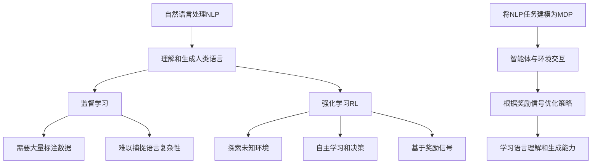

# 强化学习Reinforcement Learning在自然语言处理的前沿进展

## 1. 背景介绍

### 1.1 问题的由来

自然语言处理(Natural Language Processing, NLP)是人工智能领域的一个重要分支,旨在使计算机能够理解和生成人类语言。传统的NLP方法主要依赖于规则和统计模型,但随着深度学习的兴起,基于神经网络的方法在NLP任务中取得了巨大成功。然而,这些监督学习方法需要大量标注数据,并且难以捕捉语言的复杂性和多样性。

强化学习(Reinforcement Learning, RL)作为一种基于奖励信号的学习范式,具有探索未知环境、自主学习和决策的能力,因此被认为是解决NLP挑战的有前景方向之一。通过将NLP任务建模为马尔可夫决策过程(Markov Decision Process, MDP),智能体可以与环境进行交互,根据获得的奖励信号不断优化策略,从而学习到更好的语言理解和生成能力。

### 1.2 研究现状

近年来,将强化学习应用于自然语言处理领域的研究日益活跃。研究人员已经尝试将强化学习应用于多种NLP任务,如机器翻译、对话系统、文本摘要、文本生成等,取得了一些初步成果。然而,由于NLP任务的复杂性和多样性,以及强化学习在处理高维、离散、结构化数据方面的挑战,该领域仍面临诸多挑战和困难。

### 1.3 研究意义

将强化学习引入自然语言处理具有重要的理论和实际意义。从理论层面上,它为探索语言的复杂性和多样性提供了新的范式和视角,有助于更深入地理解语言的本质。从实际应用角度来看,强化学习在NLP任务中的成功应用将极大提高智能系统的语言理解和生成能力,推动人机交互、信息检索、内容生成等领域的发展。

### 1.4 本文结构

本文将全面探讨强化学习在自然语言处理中的前沿进展。首先介绍强化学习和NLP的基本概念,以及将两者结合的动机和挑战。接下来,详细阐述强化学习在不同NLP任务中的应用,包括机器翻译、对话系统、文本摘要和文本生成等。然后,分析当前研究中的关键问题和挑战,并探讨潜在的解决方案。最后,总结研究成果,并展望该领域的未来发展趋势。

## 2. 核心概念与联系

自然语言处理(NLP)旨在使计算机能够理解和生成人类语言。传统的NLP方法主要依赖于监督学习,即基于大量标注数据训练模型。然而,这种方法需要耗费大量人力资源,且难以捕捉语言的复杂性和多样性。

强化学习(RL)作为一种基于奖励信号的学习范式,具有探索未知环境、自主学习和决策的能力。通过将NLP任务建模为马尔可夫决策过程(MDP),智能体可以与环境进行交互,根据获得的奖励信号不断优化策略,从而学习到更好的语言理解和生成能力。

将强化学习应用于NLP任务的关键在于合理建模。需要将NLP任务抽象为一个MDP,定义状态空间、行动空间和奖励函数,使智能体能够通过与环境交互来学习最优策略。这种方式不需要大量标注数据,而是通过试错和奖励信号来自主学习,有望克服监督学习的局限性。

## 3. 核心算法原理 & 具体操作步骤 

### 3.1 算法原理概述

将强化学习应用于NLP任务的核心算法原理可以概括为以下几个步骤:

1. **任务建模**: 将NLP任务抽象为一个马尔可夫决策过程(MDP),定义状态空间、行动空间和奖励函数。
2. **智能体初始化**: 初始化一个智能体(Agent),通常采用深度神经网络作为策略模型。
3. **环境交互**: 智能体与环境进行交互,根据当前状态选择行动,并观察下一个状态和获得的奖励。
4. **策略优化**: 基于获得的奖励信号,使用强化学习算法(如Q-Learning、策略梯度等)优化策略模型的参数。
5. **迭代训练**: 重复执行步骤3和4,直到策略收敛或达到预期性能。

在这个过程中,智能体通过不断尝试和学习,逐步优化其策略,以获得更高的累积奖励。最终训练出的策略模型就可以应用于相应的NLP任务。

### 3.2 算法步骤详解

1. **任务建模**

   将NLP任务抽象为MDP是应用强化学习的关键步骤。需要定义以下三个要素:

   - **状态空间(State Space)**: 描述任务的当前状态,通常使用向量或序列表示。
   - **行动空间(Action Space)**: 智能体可以采取的行动,如生成下一个单词或选择下一个操作。
   - **奖励函数(Reward Function)**: 根据任务目标设计的奖励信号,用于评估智能体的行为。

   不同的NLP任务需要设计不同的MDP,这是一个具有挑战性的过程,需要充分考虑任务特点和目标。

2. **智能体初始化**

   智能体的核心是策略模型,通常采用深度神经网络来表示。策略模型将当前状态作为输入,输出每个可能行动的概率分布或值函数估计。常用的策略模型包括:

   - **序列到序列模型(Seq2Seq)**: 用于生成任务,如机器翻译和文本摘要。
   - **编码器-解码器模型(Encoder-Decoder)**: 用于理解任务,如文本分类和问答系统。
   - **注意力机制(Attention Mechanism)**: 增强模型对输入序列的选择性关注能力。

   初始化时,策略模型的参数通常使用预训练模型或随机初始化。

3. **环境交互**

   智能体与环境进行交互是强化学习的核心过程。在NLP任务中,环境可以是一个模拟器或真实的语言环境。智能体根据当前状态选择行动,环境则根据行动转移到下一个状态,并给出相应的奖励信号。

   例如,在机器翻译任务中,智能体可以逐步生成目标语言的单词序列,环境则根据生成的序列与参考翻译进行比较,给出奖励信号。

4. **策略优化**

   根据获得的奖励信号,智能体需要优化策略模型的参数,以获得更高的累积奖励。常用的强化学习算法包括:

   - **Q-Learning**: 基于值函数的算法,通过估计状态-行动对的值函数来优化策略。
   - **策略梯度(Policy Gradient)**: 直接优化策略模型的参数,使期望奖励最大化。
   - **Actor-Critic**: 结合值函数估计和策略梯度的算法,通常具有更好的收敛性和样本效率。

   由于NLP任务通常涉及高维、离散的状态和行动空间,需要采用适当的优化技术,如经验回放(Experience Replay)、熵正则化(Entropy Regularization)等。

5. **迭代训练**

   强化学习是一个迭代的过程,智能体需要不断与环境交互,根据获得的奖励信号优化策略模型。训练过程持续进行,直到策略收敛或达到预期性能。

   在实际应用中,还需要考虑探索与利用的平衡(Exploration-Exploitation Trade-off),以及如何处理稀疏奖励(Sparse Reward)等问题。

### 3.3 算法优缺点

将强化学习应用于NLP任务具有以下优缺点:

**优点**:

- 无需大量标注数据,可以通过与环境交互进行自主学习。
- 能够捕捉语言的复杂性和多样性,探索未知的语言现象。
- 具有端到端的学习能力,无需手工设计特征或规则。
- 可以根据任务目标进行优化,获得更好的性能表现。

**缺点**:

- 任务建模和奖励函数设计具有挑战性,需要深入的领域知识。
- 训练过程通常需要大量的计算资源和时间成本。
- 存在探索与利用的权衡,以及稀疏奖励等问题。
- 生成的语言可能存在不连贯或不自然的情况。
- 缺乏可解释性,难以理解模型的内部工作机制。

### 3.4 算法应用领域

强化学习在自然语言处理领域的应用范围广泛,包括但不限于以下任务:

- **机器翻译**: 将源语言文本翻译成目标语言,可以通过强化学习优化翻译质量和流畅度。
- **对话系统**: 构建智能对话代理,与用户进行自然语言交互,强化学习可以优化对话策略和响应生成。
- **文本摘要**: 自动生成文本的摘要,强化学习可以优化摘要的信息覆盖率和连贯性。
- **文本生成**: 包括故事创作、新闻报道、诗歌创作等,强化学习可以优化生成文本的质量和多样性。
- **信息抽取**: 从自然语言文本中提取关键信息,如命名实体识别、关系抽取等,强化学习可以优化抽取策略。
- **问答系统**: 回答基于自然语言的问题,强化学习可以优化问题理解和答案生成。
- **语言理解**: 包括文本分类、情感分析、语义解析等,强化学习可以优化模型的理解能力。

总的来说,凡是可以建模为序列决策过程的NLP任务,都可以尝试应用强化学习方法。

## 4. 数学模型和公式 & 详细讲解 & 举例说明

### 4.1 数学模型构建

将NLP任务建模为马尔可夫决策过程(MDP)是应用强化学习的基础。一个MDP可以用一个五元组 $(S, A, P, R, \gamma)$ 来表示:

- $S$ 是状态空间的集合
- $A$ 是行动空间的集合
- $P(s' | s, a)$ 是状态转移概率,表示在状态 $s$ 下执行行动 $a$ 后,转移到状态 $s'$ 的概率
- $R(s, a, s')$ 是奖励函数,表示在状态 $s$ 下执行行动 $a$ 后,转移到状态 $s'$ 所获得的奖励
- $\gamma \in [0, 1)$ 是折现因子,用于权衡即时奖励和未来奖励的重要性

在强化学习中,智能体的目标是学习一个策略 $\pi: S \rightarrow A$,使得在该策略下的期望累积奖励最大化:

$$
\max_{\pi} \mathbb{E}_{\pi}\left[ \sum_{t=0}^{\infty} \gamma^t R(s_t, a_t, s_{t+1}) \right]
$$

其中,期望是关于状态序列 $s_0, s_1, s_2, \ldots$ 和行动序列 $a_0, a_1, a_2, \ldots$ 的联合分布计算的,这些序列由策略 $\pi$ 和状态转移概率 $P$ 决定。

在NLP任务中,状态空间 $S$ 通常是一个高维、离散的空间,表示当前的语言上下文或部分生成的序列。行动空间 $A$ 也是离散的,表示可以选择的下一个单词或操作。状态转移概率 $P$ 和奖励函数 $R$ 则需要根据具体任务进行设计和定义。

### 4.2 公式推导过