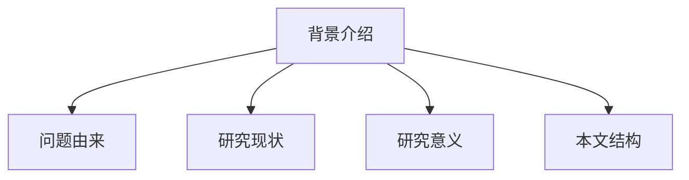
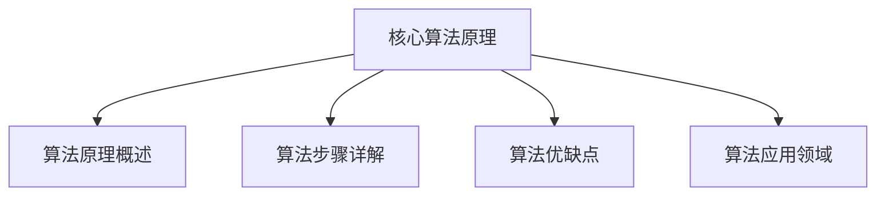

# 强化学习Reinforcement Learning探索与利用策略深度剖析

## 1. 背景介绍

### 1.1 问题的由来

在人工智能领域中,强化学习(Reinforcement Learning)是一种基于环境交互的机器学习范式。与监督学习和无监督学习不同,强化学习的目标是通过试错和累积经验,学习如何在复杂且不确定的环境中采取最优行动策略。

强化学习的核心思想是利用代理(Agent)与环境(Environment)进行交互。代理根据当前状态选择行动,环境则根据该行动产生新的状态和奖励信号。代理的目标是最大化长期累积奖励,从而学习到最优策略。

然而,在强化学习中存在一个关键的探索与利用(Exploration-Exploitation)权衡问题。代理需要在利用已学习到的知识获取高回报(Exploitation),与探索新的未知领域以发现潜在的更优策略(Exploration)之间寻求平衡。这种权衡是强化学习算法设计中的核心挑战之一。

### 1.2 研究现状

传统的强化学习算法,如Q-Learning和Sarsa,通常采用ε-greedy或软max策略来解决探索与利用的权衡问题。这些方法虽然简单有效,但存在一些局限性,例如:

1. 探索策略过于简单,难以适应复杂环境。
2. 探索行为缺乏针对性,可能浪费大量时间在无效探索上。
3. 探索策略难以根据环境动态调整。

近年来,随着深度学习(Deep Learning)和强化学习相结合,出现了一些新的探索与利用策略,如基于深度神经网络的探索策略、intrinsic motivation驱动的探索、meta-learning等。这些新方法在一定程度上缓解了传统方法的局限性,但仍存在一些挑战,如样本效率低下、难以泛化等。

### 1.3 研究意义

合理解决探索与利用权衡问题,对于强化学习算法的性能和应用具有重要意义:

1. 提高样本效率,加快学习速度。
2. 增强算法的泛化能力,适应复杂多变环境。
3. 发现更优的策略,获得更高的累积奖励。
4. 扩大强化学习在实际应用中的应用范围。

因此,深入研究探索与利用策略,设计出更加高效、通用的新算法,将极大推动强化学习理论和应用的发展。

### 1.4 本文结构

本文将全面深入剖析强化学习中的探索与利用策略。首先介绍强化学习和探索与利用问题的基本概念,阐述其重要性。然后系统地分析和比较经典算法和新兴算法所采用的各种探索策略,包括其原理、优缺点和适用场景。接着通过数学模型和公式,对核心算法进行理论分析和推导。最后,通过实际案例和代码实现,展示不同探索策略在实践中的效果,并讨论其在工业界的应用前景。

## 2. 核心概念与联系

强化学习(Reinforcement Learning)是一种基于环境交互的机器学习范式,其核心概念包括:

1. **代理(Agent)**: 执行动作并与环境交互的决策实体。
2. **环境(Environment)**: 代理所处的外部世界,由一系列状态组成。
3. **状态(State)**: 环境的instantaneous情况,代理根据状态选择行动。
4. **行动(Action)**: 代理在当前状态下可执行的操作。
5. **奖励(Reward)**: 环境对代理行动的反馈,指导代理朝着目标优化。
6. **策略(Policy)**: 代理根据状态选择行动的规则或策略函数。
7. **价值函数(Value Function)**: 评估一个状态的长期累积奖励。
8. **模型(Model)**: 描述环境的状态转移和奖励机制。

探索与利用(Exploration-Exploitation)是强化学习中一个核心的权衡问题。探索是指代理尝试新的未知行动,以发现潜在的更优策略;而利用是指代理根据已学习到的知识,选择当前已知的最优行动以获取最大化即时奖励。

合理平衡探索与利用对于强化学习算法的性能至关重要。过度探索会浪费时间在无效的行动上,而过度利用则可能陷入次优解。因此,设计高效的探索与利用策略是强化学习算法的核心挑战之一。

探索与利用策略与强化学习的其他核心概念密切相关,例如:

- **贪婪策略(Greedy Policy)**: 只考虑利用,总是选择当前已知的最优行动。
- **ε-greedy策略**: 以ε的概率随机探索,1-ε的概率贪婪利用。
- **Q-Learning**: 一种基于价值函数的强化学习算法,探索与利用策略影响Q值的更新。
- **Sarsa**: 另一种基于策略的强化学习算法,探索策略直接影响行动选择。
- **深度强化学习(Deep RL)**: 将深度神经网络应用于强化学习,探索策略可由神经网络参数化。

总的来说,探索与利用策略贯穿于强化学习的方方面面,对算法性能、样本效率和泛化能力都有重大影响。设计合理的探索策略是提高强化学习算法性能的关键所在。

## 3. 核心算法原理 & 具体操作步骤  

### 3.1 算法原理概述

强化学习算法的核心原理是通过与环境的交互,学习到一个最优策略,使得在该策略指导下,代理能够获得最大化的长期累积奖励。

为了实现这一目标,强化学习算法通常包含以下几个关键组成部分:

1. **策略评估(Policy Evaluation)**: 评估一个给定策略的价值函数,即在该策略指导下,每个状态的长期累积奖励。
2. **策略改进(Policy Improvement)**: 基于当前策略的价值函数,更新策略,使其朝着获取更高奖励的方向改进。
3. **价值迭代(Value Iteration)**: 通过反复执行策略评估和策略改进,不断优化策略和价值函数,直至收敛到最优解。

在这个过程中,探索与利用策略扮演着至关重要的角色。它决定了代理在每个状态下选择行动的方式,从而影响策略评估和改进的效率和质量。

一般来说,强化学习算法遵循以下基本操作步骤:

1. 初始化策略和价值函数,通常采用任意策略和全0价值函数。
2. 选择一个状态,根据当前策略和探索策略,选择一个行动执行。
3. 观察环境的反馈(新状态和奖励),更新价值函数和策略。
4. 重复步骤2-3,直至收敛到最优策略和价值函数。

在这个循环过程中,探索与利用策略决定了每个状态下选择行动的概率分布。合理的探索策略可以加速学习过程,提高最终策略的质量。

### 3.2 算法步骤详解

以下是一种典型的基于Q-Learning的强化学习算法步骤:

1. 初始化Q表格,所有状态-行动对的Q值设为任意值(如0)。
2. 对每个Episode(即一个完整的交互序列):
    a) 初始化起始状态s
    b) 对每个时间步:
        i) 根据当前探索策略(如ε-greedy),选择一个行动a
        ii) 执行行动a,观察环境反馈:新状态s'和奖励r
        iii) 根据Q-Learning更新规则,更新Q(s,a):
            Q(s,a) = Q(s,a) + α[r + γ* max(Q(s',a')) - Q(s,a)]
        iv) 将s'作为新状态s,进入下一时间步
    c) 当Episode终止时,进入下一个Episode
3. 直至算法收敛或达到最大Episode数

在上述算法中,探索策略决定了步骤2b(i)中行动选择的方式。一种常见的探索策略是ε-greedy:以ε的概率随机选择一个行动(探索),以1-ε的概率选择当前最优行动(利用)。

除了ε-greedy,还有许多其他探索策略,如软max策略、基于计数的策略、基于神经网络的策略等,在后续章节会详细介绍。

### 3.3 算法优缺点

强化学习算法相对于其他机器学习范式,具有以下优点:

1. 无需人工标注的训练数据,通过与环境交互自主学习。
2. 能够学习到最优的决策序列,而非单一的输出。
3. 具有很强的泛化能力,可应用于各种复杂环境。

但同时也存在一些缺点和挑战:

1. 需要大量的在线试错,样本效率低下。
2. 探索与利用策略的权衡使算法设计复杂化。
3. 连续状态和行动空间下,函数逼近困难。
4. 收敛性和最优性的理论保证较弱。

其中,探索与利用策略的设计是影响算法性能的关键因素之一。合理的探索策略可以提高样本利用率,加快算法收敛,并发现更优的策略。反之,探索策略不当则会严重拖累算法性能。

### 3.4 算法应用领域

强化学习算法由于其独特的优势,在诸多领域展现出广阔的应用前景:

1. **机器人控制**: 通过与环境交互,学习到高效的运动控制策略。
2. **游戏AI**: 在游戏环境中训练智能体,学习到超越人类的游戏策略。
3. **自动驾驶**: 通过模拟训练,学习到安全高效的自动驾驶策略。
4. **自动化控制**: 在工业生产、网络通信等领域,学习最优的控制策略。
5. **自然语言处理**: 将对话过程建模为强化学习任务,优化对话策略。
6. **计算机系统**: 优化计算机系统的资源调度、缓存管理等策略。
7. **金融投资**: 在金融市场中学习投资组合优化的最佳策略。

总的来说,凡是可以建模为代理与环境交互的决策序列问题,都可以尝试应用强化学习算法。合理的探索与利用策略是确保算法在实际应用中取得良好性能的关键。

## 4. 数学模型和公式 & 详细讲解 & 举例说明

### 4.1 数学模型构建

为了对探索与利用策略进行理论分析,我们首先需要构建强化学习问题的数学模型。

强化学习问题通常建模为一个**马尔可夫决策过程(Markov Decision Process, MDP)**, 由一个五元组(S, A, P, R, γ)表示:

- S是环境的**状态集合(State Space)**
- A是代理可选的**行动集合(Action Space)**  
- P是**状态转移概率(State Transition Probability)**, P(s'|s,a)表示在状态s执行行动a后,转移到状态s'的概率
- R是**奖励函数(Reward Function)**, R(s,a)表示在状态s执行行动a后获得的即时奖励
- γ∈[0,1]是**折扣因子(Discount Factor)**,用于权衡即时奖励和长期累积奖励

代理的目标是学习到一个**策略(Policy)** π: S → A,使得在该策略指导下,能够最大化**期望累积奖励(Expected Return)**:

$$G_t = \mathbb{E}\left[\sum_{k=0}^{\infty} \gamma^k R_{t+k+1} \right]$$

其中,Rt+1是在时间步t执行行动后获得的即时奖励。

为了评估一个策略的质量,我们定义**价值函数(Value Function)**,表示在该策略下每个状态的期望累积奖励:

- **状态价值函数(State-Value Function)**: 
$$V^{\pi}(s) = \mathbb{E}_{\pi}\left[ G_t | S_t=s \right