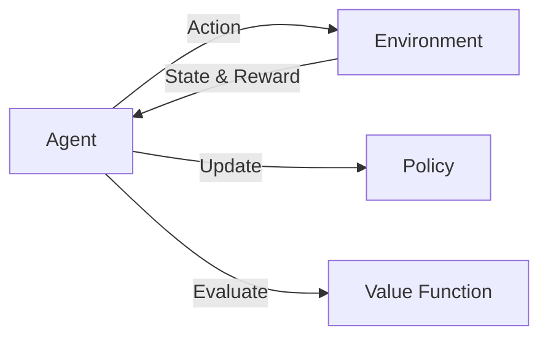

# 强化学习Reinforcement Learning环境建模与仿真技术探讨

关键词：强化学习、环境建模、仿真技术、Markov Decision Process、OpenAI Gym

## 1. 背景介绍
### 1.1  问题的由来
强化学习(Reinforcement Learning, RL)作为人工智能的一个重要分支,其目标是让智能体(Agent)通过与环境的交互,学习最优策略以获得最大累积奖励。在强化学习中,环境建模和仿真技术起着至关重要的作用。高质量的环境模型和仿真平台,可以加速强化学习算法的开发和测试,提高算法的鲁棒性和泛化能力。

### 1.2  研究现状 
目前,强化学习环境建模主要基于马尔可夫决策过程(Markov Decision Process, MDP)。一些通用的强化学习环境如OpenAI Gym已被广泛使用。同时,针对特定领域的仿真环境如Mujoco、Gazebo、CARLA等也不断涌现。学术界和工业界都在积极探索更加逼真、高效的环境建模和仿真技术,以推动强化学习的发展。

### 1.3  研究意义
探讨强化学习环境建模与仿真技术,有助于我们更好地理解强化学习的内在机理,设计更加高效、鲁棒的学习算法。同时,逼真的仿真环境可以降低现实部署的成本,加速强化学习在自动驾驶、机器人控制等领域的应用。因此,该主题具有重要的理论意义和实践价值。

### 1.4  本文结构
本文将首先介绍强化学习中的核心概念,并阐述它们之间的联系。然后,重点探讨MDP环境建模的原理和方法。接下来,文章将以OpenAI Gym为例,详细说明通用仿真平台的设计思路和使用方法。最后,总结环境建模和仿真技术的发展趋势,并展望其面临的机遇与挑战。

## 2. 核心概念与联系
强化学习的核心概念包括:
- 智能体(Agent):可以通过动作影响环境的决策主体。
- 环境(Environment):智能体交互的对象,接收动作,返回下一个状态和奖励。 
- 状态(State):环境在某一时刻的完整描述。
- 动作(Action):智能体施加于环境的行为。
- 策略(Policy):将状态映射为动作的函数。
- 奖励(Reward):环境对智能体动作的即时反馈。
- 价值函数(Value Function):衡量某一状态(状态-动作对)的长期期望回报。

这些概念之间紧密相关,构成了完整的强化学习循环(如图1所示)。智能体根据当前状态,依据策略选择动作施加于环境;环境返回下一个状态和即时奖励;智能体再根据新状态更新价值函数,优化策略,选择下一个动作。如此反复,直至学习到最优策略。


<center>图1 强化学习循环示意图</center>

## 3. 核心算法原理 & 具体操作步骤
### 3.1  算法原理概述
强化学习的主流算法可分为基于价值(Value-based)、基于策略(Policy-based)和两者结合(Actor-Critic)三大类。其中,Q-Learning是一种典型的基于价值的无模型算法。它通过迭代更新状态-动作价值函数Q(s,a),最终收敛到最优值函数Q*。

### 3.2  算法步骤详解
Q-Learning的核心思想可用如下的Bellman方程表示:
$$
Q(s_t,a_t) \leftarrow Q(s_t,a_t)+\alpha[r_t+\gamma \max_{a}Q(s_{t+1},a)-Q(s_t,a_t)]
$$

其中,$s_t$和$a_t$分别表示t时刻的状态和动作,$r_t$为即时奖励,$\alpha$为学习率,$\gamma$为折扣因子。

具体算法步骤如下:
1. 初始化Q(s,a),对所有s∈S+,a∈A,任意设置Q(s,a)的初始值。
2. 观察当前状态s。
3. 根据某一策略(如ε-greedy)选取动作a。 
4. 执行动作a,观察奖励r和下一状态s'。
5. 根据上述Bellman方程更新Q(s,a)。
6. s←s',重复步骤3-5,直至终止。

### 3.3  算法优缺点
Q-Learning的优点在于:
- 简单易实现,通用性强。
- 能够在不了解环境转移概率的情况下学习最优策略。
- 异步更新,样本利用率高。

但它也存在一些局限:
- 价值函数容易过估计,导致次优策略。
- 难以处理连续状态和动作空间。
- 探索-利用难以权衡,易陷入局部最优。

### 3.4  算法应用领域
Q-Learning及其变种被广泛应用于各种序贯决策问题,如:
- 游戏(如Atari、Go等)
- 机器人控制
- 资源调度
- 推荐系统
- 自然语言处理

## 4. 数学模型和公式 & 详细讲解 & 举例说明
### 4.1  数学模型构建
MDP作为经典的环境模型,由一个六元组$<S,A,P,R,\gamma,\mu_0>$定义:
- S:有限状态集。
- A:有限动作集。
- P:转移概率函数,$P(s'|s,a)$表示在状态s下执行动作a后转移到状态s'的概率。
- R:奖励函数,$R(s,a)$表示在状态s下执行动作a获得的即时奖励。
- $\gamma$:折扣因子,$\gamma \in [0,1]$。
- $\mu_0$:初始状态分布。

MDP的目标是寻找一个最优策略$\pi^*$,使得期望累积奖励最大化:

$$
\pi^* = \arg\max_{\pi} \mathbb{E}\left[\sum_{t=0}^{\infty} \gamma^t R(s_t,a_t)|\pi \right]
$$

### 4.2  公式推导过程
为了求解最优策略,我们引入状态价值函数$V^{\pi}(s)$和动作价值函数$Q^{\pi}(s,a)$:

$$
V^{\pi}(s)=\mathbb{E}\left[\sum_{k=0}^{\infty} \gamma^k R(s_{t+k},a_{t+k})|s_t=s,\pi \right] \\
Q^{\pi}(s,a)=\mathbb{E}\left[\sum_{k=0}^{\infty} \gamma^k R(s_{t+k},a_{t+k})|s_t=s,a_t=a,\pi \right]
$$

根据Bellman期望方程,我们可以得到:

$$
V^{\pi}(s) = \sum_{a \in A} \pi(a|s) \sum_{s' \in S} P(s'|s,a) [R(s,a) + \gamma V^{\pi}(s')] \\  
Q^{\pi}(s,a) = \sum_{s' \in S} P(s'|s,a) [R(s,a) + \gamma \sum_{a' \in A} \pi(a'|s') Q^{\pi}(s',a')]
$$

进一步地,最优价值函数$V^*(s)$和$Q^*(s,a)$满足Bellman最优方程:

$$
V^*(s) = \max_{a \in A}  \sum_{s' \in S} P(s'|s,a) [R(s,a) + \gamma V^*(s')] \\ 
Q^*(s,a) = \sum_{s' \in S} P(s'|s,a) [R(s,a) + \gamma \max_{a' \in A} Q^*(s',a')]
$$

最优策略可由最优价值函数导出:

$$
\pi^*(a|s) = \arg\max_{a \in A} Q^*(s,a)
$$

### 4.3  案例分析与讲解
考虑一个简单的网格世界环境,如图2所示。智能体的目标是从起点S出发,尽快到达终点G,同时避免掉入陷阱T。每走一步奖励为-1,掉入陷阱奖励为-10,到达终点奖励为+10。

<center>

</center>
<center>图2 网格世界环境示意图</center>

我们可以将该环境建模为一个MDP:
- 状态:各个网格的坐标$(i,j)$。
- 动作:上、下、左、右四个方向。
- 转移概率:若下一状态不超出边界,则为1,否则保持不变。
- 奖励:如前所述。
- 折扣因子:$\gamma=0.9$。

应用Q-Learning算法,我们可以得到最优策略,如图3中箭头所示。

<center>

</center>
<center>图3 Q-Learning求解结果</center>

### 4.4  常见问题解答
**Q**: Q-Learning能否处理连续状态和动作空间?

**A**: 原始的Q-Learning只能处理离散空间。对于连续空间,通常使用函数逼近的方法,如DQN使用神经网络拟合Q函数。此外,还可以考虑离散化或采用Actor-Critic等其他类型的算法。

**Q**: 折扣因子$\gamma$有何物理意义?取值多少合适?

**A**: $\gamma$反映了未来奖励的重要程度。$\gamma$越大,则越重视长远利益。一般取值在0.9-0.99之间。当然,也需要根据具体问题的时间尺度进行调节。

**Q**: ε-greedy策略是否会影响Q-Learning的收敛性?

**A**: 只要保证每个状态-动作对被无限次访问,Q-Learning就能以概率1收敛到最优值函数。ε-greedy策略通过逐渐降低$\epsilon$,可以在探索和利用之间进行平衡,不影响收敛性。但$\epsilon$降低过快,可能导致欠勘探而得到次优策略。

## 5. 项目实践：代码实例和详细解释说明
### 5.1  开发环境搭建
我们以OpenAI Gym平台为例,演示如何使用Python实现Q-Learning算法。首先,安装OpenAI Gym:

```
pip install gym
```

### 5.2  源代码详细实现
下面给出Q-Learning算法的完整Python实现:

```python
import numpy as np
import gym

# 超参数
num_episodes = 1000  # 训练轮数
learning_rate = 0.8  # 学习率 
gamma = 0.95  # 折扣因子
epsilon = 0.1  # epsilon-greedy策略中的参数

def train_QLearning(env):
    # 初始化Q表
    Q = np.zeros((env.observation_space.n, env.action_space.n))
    
    # 训练循环
    for i in range(num_episodes):
        state = env.reset()
        done = False
        while not done:
            # epsilon-greedy策略选择动作
            if np.random.rand() < epsilon:
                action = env.action_space.sample() 
            else:
                action = np.argmax(Q[state])
            
            # 执行动作,观察下一状态和奖励
            next_state, reward, done, _ = env.step(action) 
            
            # 更新Q表
            Q[state][action] += learning_rate * (reward + gamma * np.max(Q[next_state]) - Q[state][action])
            
            state = next_state
        
        # 输出当前轮次
        if i % 100 == 0:
            print('Episode {}'.format(i))
    
    return Q

# 训练
env = gym.make('FrozenLake-v0')
Q = train_QLearning(env)

# 测试
state = env.reset()
done = False
while not done:
    action = np.argmax(Q[state])
    state, reward, done, _ = env.step(action)
    env.render()
print('Episode Reward: {}'.format(reward))
```

### 5.3  代码解读与分析
- 第1-2行:导入NumPy和Gym库。
- 第5-8行:设置超参数,包括训练轮数、学习率、折扣因子和ε-greedy策略中的ε值。
- 第10-32行:定义Q-Learning训练函数。
  - 第12行:初始化Q表。
  - 第15-29行:训练循环。
    - 第17