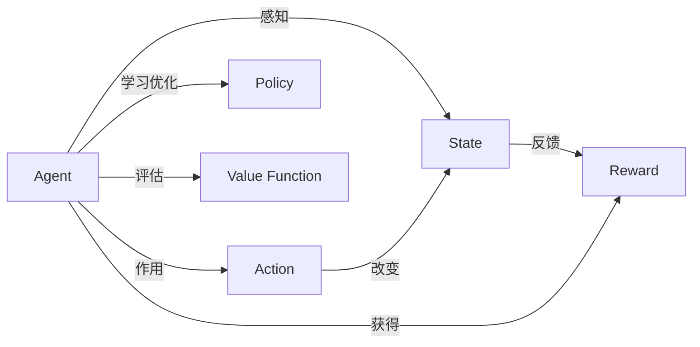

# 强化学习Reinforcement Learning的实时动态决策制定与应用

关键词：强化学习、实时决策、动态规划、马尔可夫决策过程、Q-learning、深度强化学习、多智能体强化学习

## 1. 背景介绍

### 1.1 问题的由来

在现实世界中，我们经常面临需要实时做出决策的场景，如自动驾驶、智能交通调度、智能电网调度、金融投资决策等。这些场景的共同特点是环境是动态变化的，需要根据当前的环境状态和历史经验实时制定最优决策。传统的优化决策方法难以应对这种复杂动态环境，亟需一种能够自主学习、自适应的决策方法。

### 1.2 研究现状

强化学习作为一种重要的机器学习范式，通过智能体与环境的交互，学习最优决策策略，在动态环境下具有独特优势。近年来，强化学习理论和应用都取得了长足进展。从最早的Q-learning到DQN将深度学习引入强化学习，再到近年来的DDPG、PPO、SAC等算法，极大地提升了强化学习的性能和应用范围。同时，多智能体强化学习、层次化强化学习等新方向也不断涌现。

### 1.3 研究意义 

研究强化学习的实时动态决策制定，对于解决现实世界中的诸多决策优化问题具有重要意义。一方面，它可以提供一种通用的自适应决策优化框架，另一方面，对强化学习理论的发展也有重要推动作用。此外，研究成果还可应用于自动驾驶、智慧城市、工业控制等领域，助力社会发展。

### 1.4 本文结构

本文将首先介绍强化学习的核心概念与基本原理，然后重点阐述强化学习的几种主要算法，包括Q-learning、DQN、Policy Gradient等，并给出详细的数学模型和推导过程。接着，通过几个具体的项目实践，演示如何使用代码实现这些算法。然后分析强化学习的几个主要应用场景，并推荐一些学习资源和工具。最后总结全文，展望强化学习的发展趋势和面临的挑战。

## 2. 核心概念与联系

强化学习的核心概念包括：
- Agent：智能体，可以感知环境状态并作出行动决策的主体。
- State：状态，环境的内部状态，Agent可以感知。
- Action：动作，Agent作用于环境的行为。
- Reward：奖励，环境对Agent动作的即时反馈。
- Policy：策略，Agent的决策函数，将状态映射为动作的概率分布。
- Value Function：价值函数，评估每个状态或状态-动作对的长期累积奖励。

这些概念的关系可以用下图表示：

Agent通过感知State，并根据Policy选择Action，获得环境的即时Reward反馈。同时Agent会学习评估每个State的长期Value Function。Agent的目标就是学习最优的Policy，最大化长期累积Reward。

强化学习可以看作一个连续的马尔可夫决策过程(MDP)。MDP定义了一个五元组<S, A, P, R, γ>：
- S：有限状态集
- A：有限动作集 
- P：状态转移概率矩阵，$P_{ss'}^a$表示在状态s下执行动作a后转移到状态s'的概率
- R：奖励函数，$R_s^a$表示在状态s下执行动作a获得的即时奖励
- γ：折扣因子，$\gamma \in [0,1]$，表示未来奖励的衰减程度

MDP的最优策略可以通过求解贝尔曼最优方程得到：

$$
V^*(s) = \max_a \sum_{s'} P_{ss'}^a [R_s^a + \gamma V^*(s')]
$$

$$
Q^*(s,a) = \sum_{s'} P_{ss'}^a [R_s^a + \gamma \max_{a'} Q^*(s',a')]
$$

其中，$V^*(s)$表示状态s的最优状态价值，$Q^*(s,a)$表示状态动作对(s,a)的最优动作价值。求解这两个方程的过程就是动态规划。

## 3. 核心算法原理 & 具体操作步骤

### 3.1 算法原理概述

强化学习的主要算法可以分为以下三大类：
1. 基于价值(Value-Based)：学习状态价值函数或动作价值函数，如Q-learning、Sarsa等
2. 基于策略(Policy-Based)：直接学习最优策略函数，如Policy Gradient、Actor-Critic等  
3. 基于模型(Model-Based)：学习环境动力学模型，基于模型进行规划，如Dyna-Q等

下面我们重点介绍几种典型算法：

### 3.2 算法步骤详解

#### 3.2.1 Q-learning

Q-learning是一种经典的值迭代算法，通过不断更新动作价值函数Q来逼近最优Q*。算法步骤如下：

1. 初始化Q(s,a)，对所有s∈S, a∈A，任意初始化Q(s,a)
2. 重复循环直到收敛{
   - 初始化状态s
   - 重复循环直到s为终止状态{
     - 根据ϵ-greedy策略选择动作a
     - 执行动作a，观察奖励r和下一状态s'
     - 更新Q值：
     $$Q(s,a) \leftarrow Q(s,a) + \alpha [r + \gamma \max_{a'} Q(s',a') - Q(s,a)]$$
     - s ← s'
  }
}

其中，α为学习率，ϵ为探索率。Q-learning是一种异策略(Off-policy)算法，目标策略为贪婪策略，而行为策略为ϵ-greedy策略，具有一定的探索性。

#### 3.2.2 DQN (Deep Q-Network)

DQN将深度神经网络引入Q-learning，用深度神经网络拟合动作价值函数Q，可以处理高维状态空间。算法步骤如下：

1. 初始化Q网络参数θ，目标网络参数θ'=θ
2. 初始化经验回放池D
3. 对每个episode循环{
   - 初始化状态s
   - 对每个step循环{
     - 根据ϵ-greedy策略选择动作a
     - 执行动作a，观察奖励r和下一状态s'
     - 将转移样本(s,a,r,s')存入D 
     - 从D中随机采样一个batch的转移样本(s_i,a_i,r_i,s_i')
     - 计算目标值：
       - 若s_i'为终止状态，y_i = r_i
       - 否则，$y_i = r_i + \gamma \max_{a'} Q(s_i', a'; \theta')$
     - 最小化损失：
     $$L(\theta) = \frac{1}{N} \sum_i (y_i - Q(s_i, a_i; \theta))^2$$
     - 每C步同步目标网络参数：θ' ← θ
     - s ← s'
  }
}

引入目标网络和经验回放是DQN的两个关键创新点，分别解决了训练不稳定和样本相关性问题。此外还有Double DQN、Dueling DQN、Priority Replay等改进版本。

#### 3.2.3 Policy Gradient 

策略梯度是一类基于策略的算法，直接对策略函数参数进行梯度上升。假设策略函数为$\pi_\theta(a|s)$，则性能目标函数为：

$$
J(\theta) = E_{\pi_\theta} [\sum_{t=0}^{\infty} \gamma^t r_t]
$$

根据策略梯度定理，目标函数的梯度为：

$$
\nabla_\theta J(\theta) = E_{\pi_\theta} [\nabla_\theta \log \pi_\theta(a|s) Q^{\pi_\theta}(s,a)]
$$

其中，$Q^{\pi_\theta}(s,a)$为策略$\pi_\theta$下的动作价值函数。于是可以通过随机梯度上升算法更新策略参数：

$$
\theta \leftarrow \theta + \alpha \nabla_\theta J(\theta)
$$

实际应用中，动作价值函数$Q^{\pi_\theta}(s,a)$一般由蒙特卡洛方法估计，称为REINFORCE算法。

### 3.3 算法优缺点

- Q-learning：
  - 优点：简单，收敛性有理论保证
  - 缺点：难以处理连续状态和动作空间
- DQN：  
  - 优点：可以处理高维状态空间，端到端学习
  - 缺点：难以处理连续动作空间，训练不稳定
- Policy Gradient：
  - 优点：可以直接处理连续动作空间，易于引入先验知识  
  - 缺点：方差大，样本效率低
  
### 3.4 算法应用领域

- 游戏：Atari游戏、围棋、星际争霸等
- 机器人控制：机械臂操纵、四足机器人、仿人机器人等  
- 自然语言处理：对话系统、机器翻译、文本生成等
- 计算机视觉：视觉导航、视觉问答等
- 推荐系统：电商推荐、广告投放等

## 4. 数学模型和公式 & 详细讲解 & 举例说明

### 4.1 数学模型构建

马尔可夫决策过程(MDP)提供了强化学习问题的标准数学模型。一个MDP由状态集合S、动作集合A、转移概率P、奖励函数R和折扣因子γ组成。Agent与环境交互的过程可以看作一个MDP：
- 每个时刻t，Agent处于状态$s_t \in S$
- Agent根据策略$\pi(a|s)$选择一个动作$a_t \in A$
- Agent执行动作$a_t$，环境转移到下一个状态$s_{t+1}$，转移概率为$P_{s_t s_{t+1}}^{a_t}$
- 同时Agent获得一个即时奖励$r_t = R_{s_t}^{a_t}$

Agent的目标是最大化累积奖励的期望，即寻找最优策略$\pi^*$：

$$
\pi^* = \arg\max_\pi E_{\pi} [\sum_{t=0}^{\infty} \gamma^t r_t]
$$

为了评估一个策略的性能，引入状态价值函数$V^\pi(s)$和动作价值函数$Q^\pi(s,a)$：

$$
V^\pi(s) = E_\pi [\sum_{k=0}^{\infty} \gamma^k r_{t+k} | s_t = s]
$$

$$
Q^\pi(s,a) = E_\pi [\sum_{k=0}^{\infty} \gamma^k r_{t+k} | s_t = s, a_t = a]
$$

最优价值函数$V^*(s)$和$Q^*(s,a)$满足贝尔曼最优方程：

$$
V^*(s) = \max_a \sum_{s'} P_{ss'}^a [R_s^a + \gamma V^*(s')]
$$

$$
Q^*(s,a) = \sum_{s'} P_{ss'}^a [R_s^a + \gamma \max_{a'} Q^*(s',a')]
$$

求解上述方程的过程就是值迭代或策略迭代。

### 4.2 公式推导过程

以Q-learning为例，我们推导其更新公式。Q-learning的目标是学习最优动作价值函数Q*。根据贝尔曼最优方程，Q*满足：

$$
Q^*(s,a) = \sum_{s'} P_{ss'}^a [R_s^a + \gamma \max_{a'} Q^*(s',a')]
$$

我们构造一个序列$Q_0,Q_1,...$去逼近Q*：

$$
Q_{t+1}(s,a) = \sum_{s'} P_{ss'}^a [R_s^a + \gamma \max_{a'} Q_t(s',a')]
$$

将上式改写为期望形式：

$$
Q_{t+1}(s,a) = E_{s' \sim P_{ss'}^a} [R_s^a + \gamma \max_{a'} Q_t(s',a')]
$$

然后用蒙特卡洛方法对期望进行单样本估计：

$$
Q_{t+1}(s,a) = Q_t(s,a) + \alpha [r + \gamma \max_{a'} Q_t(s',a') - Q_t(s,a)]
$$

其中，$(s,a,r,s')$为一个