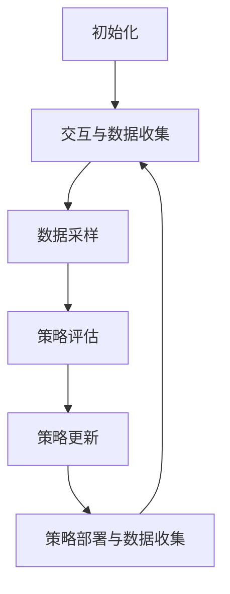

# 强化学习Reinforcement Learning的数据驱动策略在线调整实践

## 1. 背景介绍

### 1.1 问题的由来

在当今快速变化的环境中,智能系统需要不断适应新的情况和挑战。传统的机器学习方法通常依赖于固定的训练数据集,并在部署后保持策略不变。然而,实际应用场景中,环境的动态变化可能会导致系统性能下降,无法满足新的需求。因此,需要一种能够在线学习和调整策略的方法,以保持系统的鲁棒性和适应性。

### 1.2 研究现状

强化学习(Reinforcement Learning, RL)作为一种基于环境交互的学习范式,已经在许多领域取得了卓越的成就,如游戏、机器人控制和自动驾驶等。然而,大多数现有的强化学习算法都假设环境是静态的,无法有效地处理环境的动态变化。近年来,研究人员提出了一些数据驱动的在线调整方法,试图解决这一问题。

### 1.3 研究意义

数据驱动的在线策略调整方法可以使强化学习系统适应不断变化的环境,提高系统的鲁棒性和灵活性。这对于实际应用场景至关重要,如自动驾驶、机器人控制和智能制造等领域。此外,这种方法还可以减少人工干预的需求,降低系统维护成本。

### 1.4 本文结构

本文将首先介绍强化学习的核心概念和数据驱动策略在线调整的基本思路。然后,详细阐述算法原理、数学模型和公式推导。接下来,通过代码实例和案例分析,展示实际应用中的实践。最后,探讨未来发展趋势和面临的挑战。

## 2. 核心概念与联系

强化学习是一种基于环境交互的学习范式,其核心思想是通过试错和奖惩机制,让智能体(Agent)学习如何在给定环境中采取最优策略。强化学习系统通常由以下几个核心组件组成:

1. **环境(Environment)**: 智能体所处的外部世界,它定义了状态空间、动作空间和奖惩机制。

2. **智能体(Agent)**: 与环境交互的决策实体,它根据当前状态选择动作,并从环境中获得奖惩反馈。

3. **策略(Policy)**: 智能体在给定状态下选择动作的策略,它是强化学习算法需要学习的目标。

4. **奖励函数(Reward Function)**: 定义了智能体在特定状态下采取某个动作所获得的奖惩值。

5. **价值函数(Value Function)**: 评估一个状态或状态-动作对在给定策略下的长期累积奖励。

在传统的强化学习算法中,策略是基于固定的训练数据集学习得到的,并在部署后保持不变。然而,实际环境往往是动态变化的,固定策略可能无法适应新的情况。因此,需要一种在线调整策略的方法,以保持系统的适应性。

数据驱动的在线策略调整方法利用了强化学习的交互式学习特性。智能体在与环境交互的过程中,不断收集新的数据,并基于这些数据调整策略。这种方法的关键在于如何有效地利用新数据,并平衡策略的稳定性和适应性。

## 3. 核心算法原理 & 具体操作步骤

### 3.1 算法原理概述

数据驱动的在线策略调整算法通常包括以下几个关键步骤:

1. **数据收集**: 智能体与环境交互,收集新的状态-动作-奖励数据。

2. **数据缓冲**: 将收集到的新数据存储在经验回放缓冲区(Experience Replay Buffer)中。

3. **策略评估**: 基于缓冲区中的数据,评估当前策略的性能,例如计算价值函数或优势函数。

4. **策略更新**: 根据评估结果,使用特定的优化算法(如策略梯度或Q-Learning)更新策略。

5. **策略部署**: 将更新后的策略应用于实际环境,并继续收集新数据。

该算法的核心思想是利用在线收集的数据不断评估和调整策略,以适应环境的变化。通过经验回放缓冲区,可以有效地利用历史数据,提高数据利用率和学习效率。

### 3.2 算法步骤详解

以下是数据驱动的在线策略调整算法的详细步骤:

1. **初始化**:
   - 初始化策略网络(Policy Network)和价值网络(Value Network)的参数。
   - 创建经验回放缓冲区(Experience Replay Buffer)。

2. **交互与数据收集**:
   - 根据当前策略,智能体与环境交互,执行动作并观察状态转移和奖励。
   - 将 $(s_t, a_t, r_t, s_{t+1})$ 这一经验转换存储到经验回放缓冲区中。

3. **数据采样**:
   - 从经验回放缓冲区中随机采样一个批次的数据 $\mathcal{B} = \{(s_i, a_i, r_i, s_i')\}$。

4. **策略评估**:
   - 计算采样数据批次的目标值 $y_i$,例如使用时序差分(Temporal Difference)方法计算 $Q$ 值目标:
     $$y_i = r_i + \gamma \max_{a'} Q(s_i', a'; \theta^Q)$$
   - 计算当前 $Q$ 值估计:
     $$Q(s_i, a_i; \theta^Q)$$
   - 计算损失函数,例如使用均方误差(Mean Squared Error):
     $$\mathcal{L}(\theta^Q) = \frac{1}{|\mathcal{B}|} \sum_{(s_i, a_i, r_i, s_i') \in \mathcal{B}} \big(y_i - Q(s_i, a_i; \theta^Q)\big)^2$$

5. **策略更新**:
   - 使用优化算法(如梯度下降)更新价值网络参数 $\theta^Q$:
     $$\theta^Q \leftarrow \theta^Q - \alpha \nabla_{\theta^Q} \mathcal{L}(\theta^Q)$$
   - 根据更新后的价值网络,计算策略梯度:
     $$\nabla_{\theta^\pi} J(\theta^\pi) = \mathbb{E}_{\pi_\theta} \big[\nabla_{\theta^\pi} \log \pi_\theta(a|s) A^{\pi_\theta}(s, a)\big]$$
     其中 $A^{\pi_\theta}(s, a)$ 是优势函数(Advantage Function),可以由价值网络计算得到。
   - 使用策略梯度更新策略网络参数 $\theta^\pi$:
     $$\theta^\pi \leftarrow \theta^\pi + \alpha \nabla_{\theta^\pi} J(\theta^\pi)$$

6. **策略部署与数据收集**:
   - 将更新后的策略网络部署到实际环境中。
   - 智能体根据新策略与环境交互,收集新的数据,并重复步骤 2-5。

该算法通过不断收集新数据、评估当前策略并进行更新,实现了在线调整策略的目标。经验回放缓冲区的使用提高了数据利用效率,而策略梯度方法则保证了策略的收敛性和稳定性。

### 3.3 算法优缺点

**优点**:

1. **在线适应性**: 算法可以根据环境的变化动态调整策略,提高了系统的鲁棒性和灵活性。

2. **数据利用效率高**: 通过经验回放缓冲区,算法可以有效地利用历史数据,提高了数据利用率和学习效率。

3. **收敛性和稳定性**: 策略梯度方法保证了算法的收敛性,同时经验回放缓冲区也有助于策略的稳定性。

**缺点**:

1. **计算开销较大**: 需要同时训练策略网络和价值网络,计算开销较大。

2. **超参数sensitiv**: 算法的性能受到多个超参数(如学习率、折扣因子等)的影响,需要进行精心调参。

3. **探索与利用权衡**: 在线学习过程中,需要权衡探索新策略和利用已学习策略之间的平衡。

### 3.4 算法应用领域

数据驱动的在线策略调整算法可以应用于各种强化学习场景,尤其是那些环境动态变化的领域:

1. **自动驾驶**: 自动驾驶系统需要不断适应路况、天气和交通状况的变化。

2. **机器人控制**: 机器人在执行任务时,需要根据环境的变化调整控制策略。

3. **智能制造**: 在制造过程中,需要根据原材料和设备状态的变化调整生产策略。

4. **对话系统**: 对话系统需要根据用户的反馈和对话上下文动态调整对话策略。

5. **金融交易**: 算法交易系统需要根据市场行情的变化调整交易策略。

6. **视频游戏AI**: 游戏AI需要根据玩家行为和游戏状态的变化调整游戏策略。

总的来说,任何需要在动态环境中做出决策的智能系统,都可以考虑应用数据驱动的在线策略调整算法。

## 4. 数学模型和公式 & 详细讲解 & 举例说明

### 4.1 数学模型构建

在强化学习中,我们通常使用马尔可夫决策过程(Markov Decision Process, MDP)来建模环境和智能体的交互过程。一个MDP可以用一个五元组 $\langle \mathcal{S}, \mathcal{A}, \mathcal{P}, \mathcal{R}, \gamma \rangle$ 来表示,其中:

- $\mathcal{S}$ 是状态空间,表示环境可能的状态集合。
- $\mathcal{A}$ 是动作空间,表示智能体可以执行的动作集合。
- $\mathcal{P}$ 是状态转移概率函数,定义了在当前状态 $s$ 执行动作 $a$ 后,转移到下一状态 $s'$ 的概率 $\mathcal{P}(s'|s, a)$。
- $\mathcal{R}$ 是奖励函数,定义了在状态 $s$ 执行动作 $a$ 后获得的即时奖励 $\mathcal{R}(s, a)$。
- $\gamma \in [0, 1)$ 是折扣因子,用于权衡即时奖励和未来奖励的重要性。

在强化学习中,我们的目标是找到一个最优策略 $\pi^*$,使得在该策略下,智能体可以获得最大的期望累积奖励:

$$\pi^* = \arg\max_\pi \mathbb{E}_\pi \Big[\sum_{t=0}^\infty \gamma^t r_t \Big]$$

其中 $r_t$ 是在时间步 $t$ 获得的即时奖励。

为了评估一个策略的好坏,我们引入了价值函数(Value Function)的概念。状态价值函数 $V^\pi(s)$ 定义为在状态 $s$ 开始,按照策略 $\pi$ 执行,获得的期望累积奖励:

$$V^\pi(s) = \mathbb{E}_\pi \Big[\sum_{t=0}^\infty \gamma^t r_t \Big| s_0 = s\Big]$$

而状态-动作价值函数 $Q^\pi(s, a)$ 定义为在状态 $s$ 执行动作 $a$,然后按照策略 $\pi$ 执行,获得的期望累积奖励:

$$Q^\pi(s, a) = \mathbb{E}_\pi \Big[\sum_{t=0}^\infty \gamma^t r_t \Big| s_0 = s, a_0 = a\Big]$$

价值函数满足贝尔曼方程(Bellman Equation):

$$V^\pi(s) = \sum_{a \in \mathcal{A}} \pi(a|s) \Big(\mathcal{R}(s, a) + \gamma \sum_{s' \in \mathcal{S}} \mathcal{P}(s'|s, a) V^\pi(s')\Big)$$

$$Q^\pi(s, a) = \mathcal{R}(s, a) + \gamma \sum_{s' \in \mathcal{S}} \mathcal{P}(s'|s, a) \sum_{a' \in \mathcal{