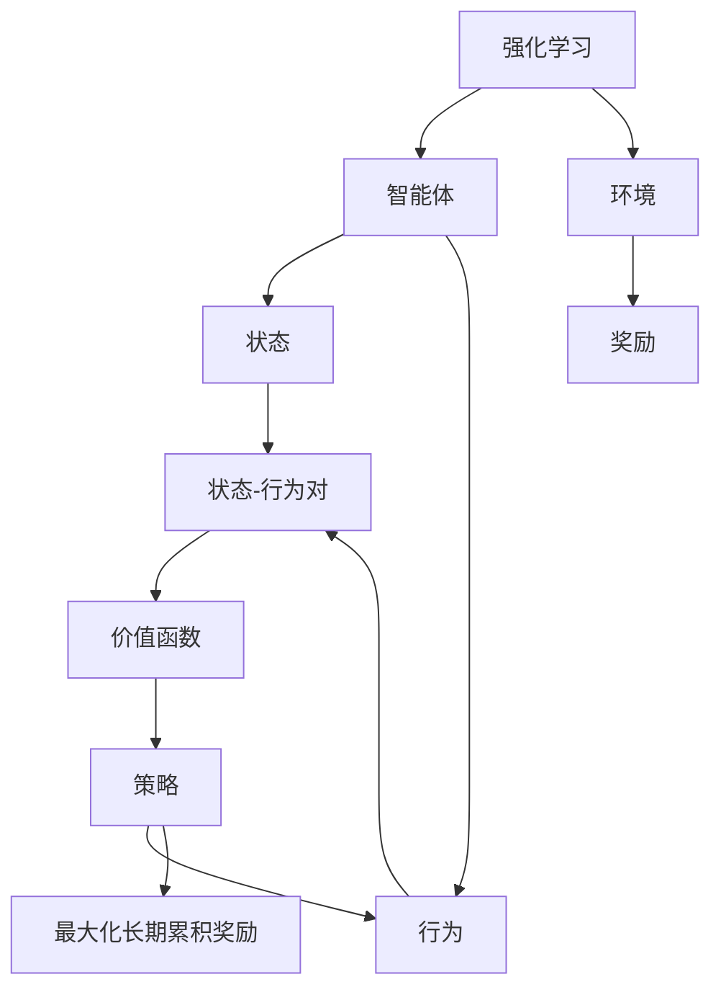

# 强化学习：价值函数的利用与更新

## 1. 背景介绍

### 1.1 问题的由来

在人工智能领域中,强化学习(Reinforcement Learning)是一种重要的机器学习范式,它致力于让智能体(Agent)通过与环境的交互来学习如何采取最优策略以最大化长期累积奖励。与监督学习和无监督学习不同,强化学习没有提供标准的输入/输出对样本,而是通过试错和奖惩机制来学习。

在强化学习问题中,价值函数(Value Function)扮演着核心角色。它用于评估一个状态或一个状态-行为对在长期累积奖励方面的好坏程度。通过学习价值函数,智能体可以选择那些能够带来更高长期回报的行为,从而优化其决策过程。因此,如何有效地利用和更新价值函数对于强化学习算法的性能至关重要。

### 1.2 研究现状

传统的强化学习算法,如Q-Learning、Sarsa等,主要依赖于价值函数的迭代更新来逐步改善策略。然而,这些算法在处理大规模状态空间和连续动作空间时往往会遇到维数灾难(Curse of Dimensionality)的问题,导致计算效率低下。

近年来,结合深度学习技术的深度强化学习(Deep Reinforcement Learning)方法应运而生,如深度Q网络(Deep Q-Network, DQN)、策略梯度(Policy Gradient)等,它们利用神经网络来逼近价值函数或策略函数,显著提高了强化学习在高维空间中的表现。

然而,即使在深度强化学习领域,价值函数的利用和更新仍然是一个值得深入研究的课题。例如,如何设计更稳定的目标网络更新机制?如何处理连续控制问题中的价值函数逼近?如何利用价值函数进行探索和exploitation的权衡?这些问题都需要进一步的探索和创新。

### 1.3 研究意义

价值函数在强化学习中扮演着关键角色,对于提高强化学习算法的性能和应用范围具有重要意义。通过深入研究价值函数的利用和更新方法,我们可以:

1. 提高强化学习算法的收敛速度和稳定性,加快训练过程。
2. 扩展强化学习在连续控制、多智能体等复杂场景中的应用。
3. 探索新的价值函数表示方法,提高算法的泛化能力。
4. 优化探索与利用(Exploration-Exploitation)的权衡,提高决策质量。
5. 促进强化学习理论与实践的融合,推动该领域的发展。

### 1.4 本文结构

本文将全面探讨强化学习中价值函数的利用与更新方法。首先,我们将介绍强化学习和价值函数的核心概念,阐明它们之间的联系。接下来,将详细阐述基于价值函数的强化学习算法原理,包括具体操作步骤、数学模型推导以及代码实现。然后,我们将探讨价值函数在实际应用场景中的作用,并介绍相关工具和学习资源。最后,我们将总结价值函数在强化学习中的发展趋势和面临的挑战,并对未来的研究方向进行展望。

## 2. 核心概念与联系

强化学习(Reinforcement Learning)是一种基于奖惩机制的机器学习范式,它由智能体(Agent)和环境(Environment)两个核心组成部分构成。

智能体是一个可以感知环境状态(State)并采取行为(Action)的决策实体。环境则是智能体所处的外部世界,它会根据智能体的行为提供相应的奖励(Reward)反馈。

在强化学习过程中,智能体的目标是学习一个策略(Policy),通过选择合适的行为序列来最大化长期累积奖励(Maximize Long-Term Cumulative Reward)。为了实现这一目标,价值函数(Value Function)扮演着核心角色。

价值函数用于评估一个状态或一个状态-行为对(State-Action Pair)在长期累积奖励方面的好坏程度。通过学习价值函数,智能体可以选择那些能够带来更高长期回报的行为,从而优化其决策过程。

因此,价值函数在强化学习中扮演着桥梁作用,它将环境状态和行为映射到长期累积奖励,为智能体制定最优策略提供了依据。利用和更新价值函数是强化学习算法的核心环节,也是本文探讨的重点内容。

## 3. 核心算法原理 & 具体操作步骤

### 3.1 算法原理概述

基于价值函数的强化学习算法通常分为两个阶段:价值函数的评估(Value Function Evaluation)和价值函数的改善(Value Function Improvement)。这两个阶段交替进行,直到价值函数收敛为最优解。

1. **价值函数评估**:在这个阶段,算法根据当前的策略和状态转移模型,计算每个状态或状态-行为对的价值函数估计值。常用的方法包括蒙特卡罗估计(Monte Carlo Estimation)和时序差分学习(Temporal Difference Learning)。

2. **价值函数改善**:在这个阶段,算法利用更新后的价值函数估计值来改善当前的策略,使其更接近最优策略。常用的方法包括贪婪策略改善(Greedy Policy Improvement)和策略迭代(Policy Iteration)。

这两个阶段的交替进行构成了强化学习算法的核心循环,也被称为价值迭代(Value Iteration)或策略迭代(Policy Iteration)。下面我们将详细介绍两种经典算法的具体操作步骤。

### 3.2 算法步骤详解

#### 3.2.1 Q-Learning算法

Q-Learning是一种基于价值函数的无模型强化学习算法,它直接学习状态-行为对的价值函数Q(s,a),而不需要了解环境的转移概率模型。Q-Learning算法的步骤如下:

1. 初始化Q(s,a)值,通常设置为0或一个小的随机值。
2. 对于每个时间步:
    a. 观察当前状态s
    b. 根据某种策略(如ε-贪婪策略)选择一个行为a
    c. 执行行为a,观察到新状态s'和奖励r
    d. 更新Q(s,a)值,使用下式:
        
        $$Q(s,a) \leftarrow Q(s,a) + \alpha [r + \gamma \max_{a'} Q(s',a') - Q(s,a)]$$
        
        其中,α是学习率,γ是折扣因子。
        
3. 重复步骤2,直到Q值函数收敛。

在Q-Learning算法中,价值函数Q(s,a)的更新利用了时序差分(Temporal Difference)的思想,它将当前Q值与目标值(r + γ max Q(s',a'))之间的差值作为更新量。通过不断缩小这个差值,Q值函数最终会收敛到最优解。

#### 3.2.2 Sarsa算法

Sarsa算法是另一种基于价值函数的强化学习算法,它直接学习状态-行为对的价值函数Q(s,a)。与Q-Learning不同,Sarsa算法在更新Q值时使用的是实际执行的下一个行为,而不是最大化Q值的行为。Sarsa算法的步骤如下:

1. 初始化Q(s,a)值,通常设置为0或一个小的随机值。
2. 对于每个时间步:
    a. 观察当前状态s,根据某种策略(如ε-贪婪策略)选择一个行为a
    b. 执行行为a,观察到新状态s'、奖励r,并根据策略选择下一个行为a'
    c. 更新Q(s,a)值,使用下式:
        
        $$Q(s,a) \leftarrow Q(s,a) + \alpha [r + \gamma Q(s',a') - Q(s,a)]$$
        
        其中,α是学习率,γ是折扣因子。
        
    d. 将s'和a'分别赋值给s和a,进入下一个时间步
    
3. 重复步骤2,直到Q值函数收敛。

Sarsa算法的名称来源于它的更新规则,即"State-Action-Reward-State-Action"。相比Q-Learning,Sarsa算法更加贴近实际执行的策略,因此在策略评估方面可能会更加准确,但也可能会导致收敛速度变慢。

### 3.3 算法优缺点

Q-Learning和Sarsa算法都是基于价值函数的经典强化学习算法,它们具有以下优缺点:

**优点**:

1. 简单易懂,算法思路清晰。
2. 无需了解环境的转移概率模型,具有很强的通用性。
3. 收敛性理论较为完善,在满足一定条件下可以收敛到最优解。
4. 可以处理离散状态和离散行为空间的问题。

**缺点**:

1. 在高维状态空间和连续行为空间中,会遇到维数灾难的问题,计算效率低下。
2. 需要大量的样本数据和迭代次数才能收敛,训练过程缓慢。
3. 无法直接处理连续控制问题,需要进行离散化或函数逼近。
4. 探索与利用(Exploration-Exploitation)的权衡需要人工设置参数(如ε-贪婪策略中的ε值)。

### 3.4 算法应用领域

基于价值函数的强化学习算法广泛应用于以下领域:

1. **游戏AI**:如国际象棋、围棋、雅达利游戏等,智能体通过与游戏环境交互来学习最优策略。
2. **机器人控制**:如机器人路径规划、机械臂控制等,智能体需要学习如何在连续状态和行为空间中做出最优决策。
3. **自动驾驶**:如无人驾驶决策系统,智能体需要根据当前交通状况做出最佳行驶决策。
4. **资源管理**:如数据中心资源调度、网络流量控制等,智能体需要学习如何合理分配有限资源以获得最大收益。
5. **自然语言处理**:如对话系统、机器翻译等,智能体需要学习如何根据上下文做出最佳语言生成或理解决策。

总的来说,基于价值函数的强化学习算法适用于那些需要在复杂环境中做出序列决策的问题,并在这些领域取得了广泛的应用和研究。

## 4. 数学模型和公式 & 详细讲解 & 举例说明

### 4.1 数学模型构建

在强化学习中,我们通常将问题建模为一个马尔可夫决策过程(Markov Decision Process, MDP)。MDP由以下几个要素构成:

- 状态集合S(State Space)
- 行为集合A(Action Space)
- 转移概率P(s'|s,a),表示在状态s执行行为a后,转移到状态s'的概率
- 奖励函数R(s,a,s'),表示在状态s执行行为a并转移到状态s'时获得的即时奖励
- 折扣因子γ,用于权衡即时奖励和长期累积奖励的权重

在MDP中,我们的目标是找到一个策略π(a|s),即在每个状态s下选择行为a的概率分布,使得按照该策略执行时能够最大化长期累积奖励的期望值,即:

$$\max_\pi \mathbb{E}_\pi \left[ \sum_{t=0}^\infty \gamma^t R(s_t, a_t, s_{t+1}) \right]$$

其中,t表示时间步,γ是折扣因子,用于确保累积奖励收敛。

为了实现这一目标,我们引入价值函数(Value Function)的概念。价值函数用于评估一个状态或一个状态-行为对在长期累积奖励方面的好坏程度。具体来说,我们定义了两种价值函数:

1. 状态价值函数V(s):表示在状态s下,按照策略π执行时,期望获得的长期累积奖励:

$$V^\pi(s) = \mathbb{E}_\pi \left[ \sum_{t=0}^\inf