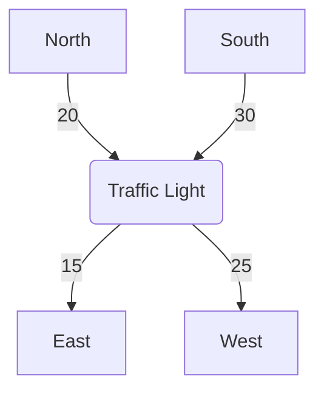

# 强化学习：在智能交通系统中的应用

## 1. 背景介绍

### 1.1 问题的由来

随着城市化进程的加快和汽车保有量的不断增长，交通拥堵、事故频发等问题日益严重,给城市的可持续发展带来了巨大挑战。传统的交通管理和控制系统已经难以满足现代城市对交通系统高效、智能化的需求。因此,迫切需要开发新的智能交通系统来解决这些问题。

### 1.2 研究现状

近年来,人工智能技术在交通领域的应用受到了广泛关注。作为人工智能的一个重要分支,强化学习因其在解决序列决策问题方面的优势,成为了智能交通系统研究的热点。许多学者致力于将强化学习应用于交通信号控制、车辆路径规划、智能路网管理等领域,取得了一定的研究进展。

### 1.3 研究意义

智能交通系统的建设对于缓解交通拥堵、提高道路利用率、减少能源消耗和环境污染等具有重要意义。强化学习在智能交通系统中的应用,可以实现交通参与主体(如车辆、行人、交通信号灯等)的智能决策,从而优化交通流量,提高交通系统的整体效率。

### 1.4 本文结构

本文首先介绍强化学习在智能交通系统中应用的背景和意义,然后深入探讨强化学习的核心概念和算法原理,包括马尔可夫决策过程、时序差分学习等。接着详细阐述强化学习在交通信号控制、车辆路径规划等领域的具体应用,并给出相关的数学模型和公式推导。最后,本文总结了强化学习在智能交通系统中的未来发展趋势和面临的挑战。

## 2. 核心概念与联系

强化学习是一种基于环境交互的机器学习范式,旨在通过试错和奖惩机制,学习出最优的决策策略。它的核心概念包括:

1. **智能体(Agent)**: 指能够感知环境、作出行为决策并从环境中获得反馈的主体。在智能交通系统中,智能体可以是车辆、行人、交通信号灯等。

2. **环境(Environment)**: 指智能体所处的外部世界,智能体通过与环境交互来获取信息和反馈。在智能交通系统中,环境包括道路网络、交通流量等。

3. **状态(State)**: 描述环境的当前情况,是智能体作出决策的基础。在智能交通系统中,状态可以是交通流量、车辆位置等。

4. **行为(Action)**: 智能体根据当前状态作出的决策,会导致环境状态的转移。在智能交通系统中,行为可以是车辆加速、减速、改变路线等。

5. **奖励(Reward)**: 环境对智能体行为的反馈,用于评估行为的好坏。在智能交通系统中,奖励可以是减少拥堵、提高通行效率等。

6. **策略(Policy)**: 指智能体在每个状态下选择行为的规则或策略,是强化学习的最终目标。

强化学习的核心思想是通过不断与环境交互,根据获得的奖励信号来调整策略,最终学习到一个能够获得最大累积奖励的最优策略。这种试错式的学习方式非常适合应用于智能交通系统,因为交通系统是一个高度动态、复杂的环境,难以建立精确的数学模型。

## 3. 核心算法原理与具体操作步骤

### 3.1 算法原理概述

强化学习算法的核心是基于**马尔可夫决策过程(Markov Decision Process, MDP)**的价值迭代和策略迭代。MDP是一种离散时间随机控制过程,由一组状态、行为、转移概率和奖励函数组成。

在MDP中,智能体从当前状态 $s_t$ 出发,选择行为 $a_t$,然后转移到新状态 $s_{t+1}$,并获得相应的奖励 $r_{t+1}$。智能体的目标是找到一个策略 $\pi$,使得在该策略下的期望累积奖励最大化:

$$
\max_{\pi} \mathbb{E}_{\pi}\left[\sum_{t=0}^{\infty} \gamma^t r_{t+1}\right]
$$

其中 $\gamma \in [0, 1)$ 是折现因子,用于权衡即时奖励和长期奖励的重要性。

价值迭代和策略迭代是求解MDP的两种主要方法:

- **价值迭代(Value Iteration)**: 通过不断更新状态价值函数或行为价值函数,直到收敛到最优价值函数,从而得到最优策略。

- **策略迭代(Policy Iteration)**: 通过不断评估当前策略并改进策略,直到收敛到最优策略。

### 3.2 算法步骤详解

以下是基于时序差分(Temporal Difference, TD)学习的 Q-Learning 算法步骤:

1. 初始化 Q 表格,即对所有状态-行为对 $(s, a)$ 赋予任意初始值。

2. 对每个Episode(即一个完整的交互序列):
    
    a. 初始化起始状态 $s_0$
    
    b. 对每个时间步 $t$:
        
        i. 根据当前策略(如 $\epsilon$-贪婪策略)选择行为 $a_t$
        
        ii. 执行行为 $a_t$,观察到新状态 $s_{t+1}$ 和奖励 $r_{t+1}$
        
        iii. 更新 Q 值:
        
        $$
        Q(s_t, a_t) \leftarrow Q(s_t, a_t) + \alpha \left[r_{t+1} + \gamma \max_{a'} Q(s_{t+1}, a') - Q(s_t, a_t)\right]
        $$
        
        其中 $\alpha$ 是学习率, $\gamma$ 是折现因子。
        
        iv. 将 $s_{t+1}$ 设为新的当前状态
        
    c. 直到Episode结束

3. 重复步骤2,直到Q值收敛

4. 根据收敛后的Q值,构建最优策略 $\pi^*$:

$$
\pi^*(s) = \arg\max_a Q(s, a)
$$

### 3.3 算法优缺点

Q-Learning算法的优点:

- 无需建立精确的环境模型,通过与环境交互直接学习
- 收敛性理论保证,能够找到最优策略
- 算法简单,易于实现和扩展

缺点:

- 存在维数灾难问题,状态-行为空间过大时计算开销大
- 探索与利用两者之间需要平衡
- 对于连续状态和行为空间,需要函数近似或其他技巧

### 3.4 算法应用领域

强化学习算法在智能交通系统中有广泛的应用,主要包括:

- **交通信号控制**: 根据实时交通流量,动态调整信号灯时长和相位,以最小化车辆延误和能耗。
- **车辆路径规划**: 为车辆规划出最优路径,避免拥堵,提高通行效率。
- **智能路网管理**: 对路网中的各种资源(如车道、收费站等)进行智能调配,优化整体交通流量。
- **自动驾驶决策**: 为自动驾驶车辆制定安全、高效的行车策略。

## 4. 数学模型和公式详细讲解与举例说明

### 4.1 数学模型构建

在智能交通系统中,我们可以将交通参与主体(如车辆、行人、信号灯等)建模为智能体,将道路网络及其状态(如交通流量、事故等)建模为环境。

具体来说,对于交通信号控制问题,我们可以构建如下马尔可夫决策过程模型:

- 状态 $s$: 包括相位、周期、每个车道上的车辆数量等
- 行为 $a$: 改变绿灯时长、相位顺序等
- 转移概率 $P(s' | s, a)$: 在当前状态 $s$ 下执行行为 $a$ 后,转移到新状态 $s'$ 的概率
- 奖励 $R(s, a, s')$: 在状态 $s$ 下执行行为 $a$ 并转移到状态 $s'$ 时获得的奖励,可设置为负车辆延误等

目标是找到一个最优策略 $\pi^*$,使得在该策略下的预期累积奖励最大化:

$$
\pi^* = \arg\max_\pi \mathbb{E}\left[\sum_{t=0}^\infty \gamma^t R(s_t, a_t, s_{t+1}) | \pi\right]
$$

其中 $\gamma$ 是折现因子,用于平衡即时奖励和长期奖励。

### 4.2 公式推导过程

以 Q-Learning 算法为例,我们推导其更新公式。

根据贝尔曼最优方程:

$$
Q^*(s, a) = \mathbb{E}_{s' \sim P(\cdot|s, a)}\left[R(s, a, s') + \gamma \max_{a'} Q^*(s', a')\right]
$$

我们对 $Q^*(s, a)$ 进行估计,记为 $Q(s, a)$,则有:

$$
Q(s, a) \leftarrow Q(s, a) + \alpha \left[R(s, a, s') + \gamma \max_{a'} Q(s', a') - Q(s, a)\right]
$$

其中 $\alpha$ 是学习率,用于控制更新幅度。

通过不断更新 $Q(s, a)$,当 $\alpha$ 满足适当条件时,估计值 $Q(s, a)$ 将收敛到真实值 $Q^*(s, a)$。

### 4.3 案例分析与讲解

考虑一个简单的交通信号控制案例,如下图所示:

其中节点表示路口,边上的数字表示每个车道上的车辆数量。我们的目标是通过调整信号灯的绿灯时长和相位顺序,来最小化车辆延误。

假设状态 $s$ 由四个车道的车辆数量组成,行为 $a$ 为改变绿灯时长(如 +5秒、-5秒等),奖励 $R$ 为负车辆延误。我们可以应用 Q-Learning 算法来学习最优策略。

初始时,Q值被初始化为任意值。在每个Episode中,智能体根据当前状态和 $\epsilon$-贪婪策略选择行为,执行后观察到新状态和奖励,并根据上述公式更新相应的Q值。

通过大量Episodes的训练,Q值将逐渐收敛,智能体可以根据收敛后的Q值得到最优策略,即在每个状态下选择能够最大化 $Q(s, a)$ 的行为。

例如,在上述案例中,如果最优策略是:当North和South车道车辆数量较多时,优先为它们分配更长的绿灯时长;当East和West车道车辆数量较多时,则相应调整绿灯时长和相位顺序。这样可以有效缓解拥堵,提高整体通行效率。

### 4.4 常见问题解答

1. **探索与利用的权衡**

在强化学习中,探索(Exploration)和利用(Exploitation)是一对矛盾的因素。过多探索会导致学习效率低下,过多利用又可能陷入次优解。通常采用 $\epsilon$-贪婪策略或者软更新(Softmax)等方法来权衡探索与利用。

2. **奖励函数的设计**

奖励函数的设计对于强化学习算法的性能有很大影响。奖励函数应当能够正确反映任务目标,同时也需要考虑长期累积奖励,而不仅仅是即时奖励。在智能交通系统中,奖励函数可以设置为负车辆延误、能耗等。

3. **状态空间和行为空间的设计**

状态空间和行为空间的设计也是强化学习应用中需要考虑的重要问题。过于简单的状态空间和行为空间可能导致策略性能不佳,而过于复杂又会带来维数灾难的问题。需要根据具体问题,合理设计状态空间和行为空间。

4. **算法收敛性和鲁棒性**

虽然理论上强化学习算法能够收