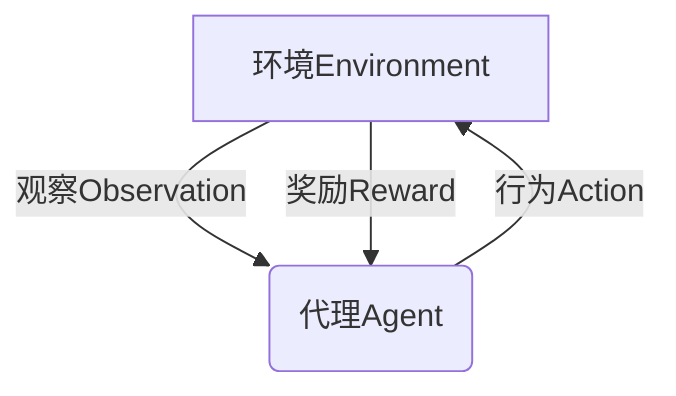

# 强化学习：在金融风控中的应用

## 1. 背景介绍

### 1.1 问题的由来

在金融领域中,风险管理是一个至关重要的课题。传统的风险管理方法主要依赖人工经验和规则,这种方式存在一些缺陷,例如:

1. 人工决策往往带有主观性和局限性
2. 规则制定需要大量的人力和时间成本 
3. 规则难以及时更新,无法适应金融市场的快速变化

为了解决这些问题,研究人员开始探索利用人工智能技术进行风险管理,其中强化学习(Reinforcement Learning)因其在序列决策问题中的优异表现,成为了一个热门的研究方向。

### 1.2 研究现状  

近年来,强化学习在金融风险管理领域取得了诸多进展,主要集中在以下几个方面:

1. **交易策略优化**: 利用强化学习自动学习最优的交易策略,实现自动化交易。
2. **信用风险评估**: 基于强化学习构建信用评分模型,评估客户的违约风险。
3. **反欺诈检测**: 使用强化学习技术识别金融交易中的欺诈行为。
4. **风险资产组合优化**: 通过强化学习确定最优的风险资产投资组合。

### 1.3 研究意义

将强化学习应用于金融风险管理具有重要意义:

1. **提高风险管理效率**: 强化学习可自动化决策过程,提高风险管理的效率和准确性。
2. **降低人力成本**: 减少人工决策的工作量,降低人力成本。
3. **适应市场变化**: 强化学习算法可持续学习,适应金融市场的快速变化。
4. **挖掘潜在规律**: 强化学习可从海量数据中发现人类难以察觉的潜在规律。

### 1.4 本文结构

本文将全面介绍强化学习在金融风控中的应用,内容包括:

1. 强化学习的核心概念
2. 在金融风控中应用强化学习的核心算法原理
3. 相关数学模型和公式推导
4. 实际项目案例和代码实现
5. 在不同场景下的应用实践
6. 相关工具和学习资源推荐
7. 未来发展趋势和面临的挑战

## 2. 核心概念与联系

在介绍强化学习在金融风控中的应用之前,我们先来了解一下强化学习的核心概念。

强化学习是一种基于环境交互的机器学习范式,其核心思想是通过获取环境反馈(reward)来学习一系列行为策略,使得在完成某项任务时能获得最大的累积奖励。

强化学习主要包括四个核心要素:

1. **环境(Environment)**: 代理与之交互的外部世界。
2. **代理(Agent)**: 在环境中执行行为的决策实体。
3. **状态(State)**: 环境的instantaneous情况。
4. **奖励(Reward)**: 代理执行行为后从环境获得的反馈。

强化学习的目标是学习一个策略(Policy),使得在完成任务时获得的累积奖励最大化。这个策略定义了代理在每个状态下应该采取什么行为。

在金融风控场景中,我们可以将:

- **环境**视为金融市场的动态变化
- **代理**即为风控决策系统
- **状态**表示当前的市场状况和风险状态 
- **奖励**则是风控决策的效果好坏

通过与环境(金融市场)不断交互,风控决策系统可以学习到最优的风控策略,从而实现风险的有效管控。

## 3. 核心算法原理 & 具体操作步骤

### 3.1 算法原理概述

在金融风控场景下应用强化学习,核心算法主要包括两类:基于价值函数(Value-based)和基于策略(Policy-based)。

1. **基于价值函数算法**

该类算法旨在学习状态(或状态-行为对)的价值函数,然后根据价值函数推导出最优策略。典型算法有Q-Learning和SARSA。

2. **基于策略算法**  

该类算法直接对策略函数进行参数化,通过策略梯度的方式优化策略参数,从而学习最优策略。典型算法有REINFORCE、Actor-Critic等。

### 3.2 算法步骤详解

以Q-Learning算法为例,具体步骤如下:

1. **初始化**
   
   初始化Q表格(状态-行为值函数),所有Q值设为0或一个较小的值。

2. **选择行为**

   对于当前状态,根据一定的策略(如$\epsilon$-贪婪策略)选择一个行为执行。

3. **获取奖励和下一状态**

   执行选择的行为,获得环境返回的奖励和下一状态。

4. **更新Q值**

   根据下面的Q-Learning更新规则更新Q表格中的Q值:

   $$Q(s_t, a_t) \leftarrow Q(s_t, a_t) + \alpha[r_{t+1} + \gamma\max_aQ(s_{t+1}, a) - Q(s_t, a_t)]$$

   其中:
   - $\alpha$是学习率
   - $\gamma$是折现因子
   - $r_{t+1}$是获得的奖励
   - $\max_aQ(s_{t+1}, a)$是下一状态下所有行为Q值的最大值

5. **重复2-4步骤**

   重复执行2-4步骤,直到Q值收敛或满足停止条件。

6. **根据Q值构建策略**

   最终根据学习到的Q值,构建一个在每个状态下选择最优行为的贪婪策略。

### 3.3 算法优缺点

**优点**:

1. 可以直接从环境交互中学习,无需事先的监督数据
2. 能够学习到最优的序列决策策略
3. 具有较强的通用性,可应用于多种场景

**缺点**:

1. 收敛速度较慢,需要大量的环境交互数据
2. 可能遇到维数灾难问题
3. 探索和利用之间需要平衡

### 3.4 算法应用领域

除了金融风控场景,强化学习还广泛应用于如下领域:

1. 机器人控制
2. 自动驾驶决策
3. 游戏AI
4. 资源调度优化
5. 自然语言处理
6. 计算机系统优化
...

## 4. 数学模型和公式 & 详细讲解 & 举例说明

### 4.1 数学模型构建

在强化学习中,我们通常将问题建模为**马尔可夫决策过程(Markov Decision Process, MDP)**。一个MDP可以用下面的元组来表示:

$$\langle \mathcal{S}, \mathcal{A}, \mathcal{P}, \mathcal{R}, \gamma \rangle$$

其中:

- $\mathcal{S}$是状态空间的集合
- $\mathcal{A}$是行为空间的集合 
- $\mathcal{P}$是状态转移概率函数,定义为$\mathcal{P}_{ss'}^a = \mathbb{P}(s_{t+1}=s'|s_t=s, a_t=a)$
- $\mathcal{R}$是奖励函数,定义为$\mathcal{R}_s^a = \mathbb{E}[r_{t+1}|s_t=s, a_t=a]$  
- $\gamma \in [0, 1)$是折现因子,用于权衡未来奖励的重要性

在金融风控场景中,我们可以将:

- 状态空间$\mathcal{S}$定义为所有可能的市场状态和风险状态
- 行为空间$\mathcal{A}$为风控决策系统可执行的所有行为(如审批、拒绝等)
- 状态转移概率$\mathcal{P}$描述了在采取某个行为后,市场和风险状态转移到下一状态的概率
- 奖励函数$\mathcal{R}$定义了在某个状态采取某个行为后获得的奖励(如利润、损失等)

目标是找到一个最优策略$\pi^*$,使得在该策略下的期望累积折现奖励最大:

$$\pi^* = \arg\max_\pi \mathbb{E}_\pi \left[ \sum_{t=0}^\infty \gamma^t r_t \right]$$

### 4.2 公式推导过程  

以Q-Learning算法为例,我们来推导其更新规则的数学原理。

在强化学习中,我们定义**行为价值函数(Action-Value Function)**,表示在状态$s$下执行行为$a$后的期望累积折现奖励:

$$Q^\pi(s, a) = \mathbb{E}_\pi \left[ \sum_{k=0}^\infty \gamma^k r_{t+k+1} | s_t=s, a_t=a \right]$$

根据贝尔曼最优性方程,最优行为价值函数$Q^*(s, a)$满足:

$$Q^*(s, a) = \mathbb{E}_{s' \sim \mathcal{P}(\cdot|s, a)} \left[ r(s, a) + \gamma \max_{a'} Q^*(s', a') \right]$$

我们令目标函数为:

$$L(\theta) = \mathbb{E}_{s, a \sim \rho(\cdot)} \left[ \left( Q^\pi(s, a) - y \right)^2 \right]$$

其中$y = r(s, a) + \gamma \max_{a'} Q^*(s', a')$是目标Q值。

对$L(\theta)$求导并化简,可得:

$$\nabla_\theta L(\theta) = \mathbb{E}_{s, a \sim \rho(\cdot)} \left[ \left( Q^\pi(s, a) - y \right) \nabla_\theta Q^\pi(s, a) \right]$$

令$\delta = y - Q^\pi(s, a)$为TD误差,则:

$$\nabla_\theta L(\theta) = \mathbb{E}_{s, a \sim \rho(\cdot)} \left[ \delta \nabla_\theta Q^\pi(s, a) \right]$$

通过随机梯度下降法更新参数$\theta$:

$$\theta \leftarrow \theta + \alpha \delta \nabla_\theta Q^\pi(s, a)$$

其中$\alpha$是学习率。这就是Q-Learning算法的更新规则。

### 4.3 案例分析与讲解

现在让我们通过一个简单的示例,来进一步理解Q-Learning算法在金融风控中的应用。

**场景描述**:

假设我们有一个贷款审批系统,需要根据申请人的信用记录和收入情况决定是否批准贷款。我们将这个问题建模为一个MDP:

- 状态空间$\mathcal{S} = \{$好信用好收入, 好信用差收入, 差信用好收入, 差信用差收入$\}$
- 行为空间$\mathcal{A} = \{$批准, 拒绝$\}$
- 状态转移概率$\mathcal{P}$定义为:如果批准贷款,下个月收入情况会发生变化;如果拒绝贷款,状态保持不变
- 奖励函数$\mathcal{R}$定义为:如果批准了好申请人,获得正奖励;如果批准了差申请人,获得负奖励;拒绝申请人,奖励为0

我们采用Q-Learning算法,通过不断与环境交互,学习一个最优的贷款审批策略。

**算法运行过程**:

1. 初始化,所有Q值设为0
2. 对于当前状态"好信用好收入",由于Q值都为0,随机选择行为"批准"
3. 执行该行为,获得正奖励,状态转移到"好信用差收入"
4. 根据Q-Learning更新规则,更新Q("好信用好收入", "批准")的Q值
5. 重复上述过程,不断更新Q值
6. 最终学习到一个近似最优策略:对于好信用申请人批准贷款,对于差信用申请人拒绝贷款

通过这个示例,我们可以看到Q-Learning算法是如何通过不断试错和奖惩,逐步学习到一个最优的贷款审批策略。在实际应用中,我们可以进一步扩展状态空间和行为空间,使用更复杂的模型,来解决更加复杂的金融风控问题。

### 4.4 常见问题解答

1. **为什么需要折现因子$\gamma$?**

   折现因子$\gamma$的作用是权衡当前奖励和未来奖励的重要性。一