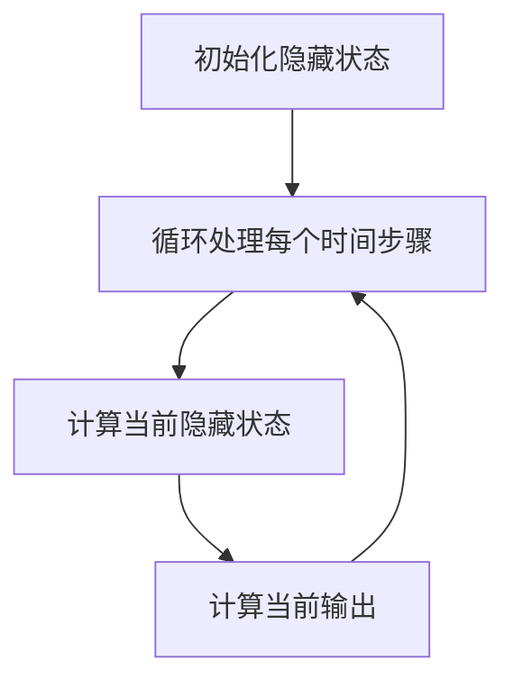
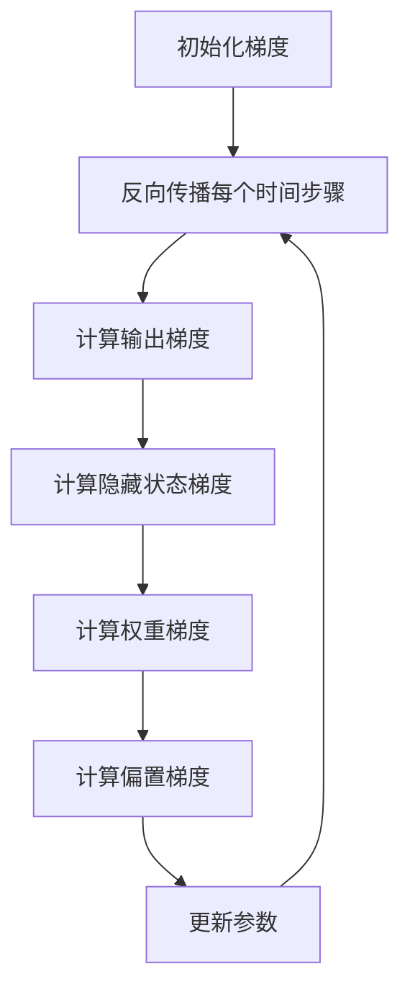

# 循环神经网络 (Recurrent Neural Network)

## 1. 背景介绍

### 1.1 问题的由来

在过去几十年中，神经网络在各种任务中取得了巨大的成功,例如计算机视觉、自然语言处理和语音识别等。然而,传统的前馈神经网络在处理序列数据时存在一些固有的缺陷。它们无法很好地捕捉序列数据中的长期依赖关系,也无法利用序列数据中的上下文信息。为了解决这个问题,循环神经网络(Recurrent Neural Network, RNN)应运而生。

### 1.2 研究现状

循环神经网络是一种特殊类型的人工神经网络,它能够处理序列数据,例如文本、语音和时间序列数据。与传统的前馈神经网络不同,RNN在隐藏层之间引入了循环连接,使得网络能够记住之前的状态,并将其与当前输入结合起来进行处理。这种特性使得RNN在处理序列数据时表现出色,广泛应用于自然语言处理、语音识别、机器翻译等领域。

然而,传统的RNN在训练过程中容易出现梯度消失或梯度爆炸的问题,这限制了它们捕捉长期依赖关系的能力。为了解决这个问题,研究人员提出了多种改进的RNN变体,例如长短期记忆网络(Long Short-Term Memory, LSTM)和门控循环单元(Gated Recurrent Unit, GRU)。这些变体通过引入门控机制和记忆单元,有效地缓解了梯度问题,提高了RNN在处理长序列数据时的性能。

### 1.3 研究意义

循环神经网络在自然语言处理、语音识别、时间序列预测等领域发挥着重要作用。它们能够有效地处理序列数据,捕捉数据中的长期依赖关系和上下文信息,从而提高了模型的预测和生成能力。研究循环神经网络不仅有助于我们更好地理解序列数据的本质,还可以推动相关领域的技术进步,为解决实际问题提供有力的工具。

### 1.4 本文结构

本文将全面介绍循环神经网络的基本原理、核心算法、数学模型、实现细节和实际应用。我们将从背景介绍开始,阐述循环神经网络的由来和研究现状。接下来,我们将深入探讨循环神经网络的核心概念和算法原理,包括网络结构、前向传播和反向传播过程。然后,我们将详细讲解循环神经网络的数学模型和公式推导,并通过案例分析加深理解。此外,我们还将介绍基于循环神经网络的实际应用场景,以及相关的工具和资源。最后,我们将总结循环神经网络的未来发展趋势和面临的挑战,并对常见问题进行解答。

## 2. 核心概念与联系

循环神经网络(Recurrent Neural Network, RNN)是一种特殊类型的人工神经网络,旨在处理序列数据。与传统的前馈神经网络不同,RNN在隐藏层之间引入了循环连接,使得网络能够记住之前的状态,并将其与当前输入结合起来进行处理。这种特性使得RNN在处理序列数据时表现出色,广泛应用于自然语言处理、语音识别、机器翻译等领域。

RNN的核心概念包括:

1. **序列数据**:RNN专门设计用于处理序列数据,例如文本、语音和时间序列数据。序列数据是一种有序的数据集合,其中每个元素都与前后元素存在潜在的依赖关系。

2. **循环连接**:RNN在隐藏层之间引入了循环连接,使得网络能够记住之前的状态。这种循环连接使得RNN能够捕捉序列数据中的长期依赖关系和上下文信息。

3. **隐藏状态**:隐藏状态是RNN在处理序列数据时维护的内部状态。它包含了网络对序列数据的记忆和理解,并在每个时间步骤上进行更新。

4. **前向传播**:在前向传播过程中,RNN逐步处理序列数据的每个元素,并根据当前输入和之前的隐藏状态计算新的隐藏状态和输出。

5. **反向传播**:RNN使用反向传播算法进行训练,通过计算损失函数对参数进行梯度更新。由于引入了循环连接,RNN的反向传播过程需要通过时间反向传播误差。

6. **长期依赖问题**:传统的RNN在训练过程中容易出现梯度消失或梯度爆炸的问题,这限制了它们捕捉长期依赖关系的能力。为了解决这个问题,研究人员提出了多种改进的RNN变体,例如长短期记忆网络(LSTM)和门控循环单元(GRU)。

这些核心概念相互关联,共同构成了循环神经网络的基础理论和实现框架。通过理解这些概念及其联系,我们可以更好地掌握循环神经网络的工作原理,并将其应用于实际问题中。

## 3. 核心算法原理 & 具体操作步骤

### 3.1 算法原理概述

循环神经网络(RNN)的核心算法原理是通过引入循环连接,使得网络能够记住之前的状态,并将其与当前输入结合起来进行处理。这种特性使得RNN能够捕捉序列数据中的长期依赖关系和上下文信息,从而提高了模型的预测和生成能力。

RNN的工作原理可以概括为以下几个步骤:

1. **初始化**:在处理序列数据之前,RNN需要初始化隐藏状态。通常,初始隐藏状态被设置为全零向量。

2. **前向传播**:RNN逐步处理序列数据的每个元素。对于每个时间步骤 t,RNN根据当前输入 x_t 和上一时间步骤的隐藏状态 h_(t-1) 计算新的隐藏状态 h_t 和输出 o_t。这个过程可以表示为:

   $$h_t = f(x_t, h_{t-1})$$
   $$o_t = g(h_t)$$

   其中,f 和 g 分别表示隐藏状态和输出的计算函数,通常使用非线性激活函数(如 tanh 或 ReLU)。

3. **反向传播**:在训练过程中,RNN使用反向传播算法计算损失函数对参数的梯度,并进行参数更新。由于引入了循环连接,RNN的反向传播过程需要通过时间反向传播误差,这称为"反向传播through time"(BPTT)。

4. **梯度裁剪**:为了缓解梯度消失或梯度爆炸的问题,RNN通常采用梯度裁剪技术,将梯度值限制在一个合理的范围内。

虽然RNN能够捕捉序列数据中的长期依赖关系,但它在实践中仍然存在一些局限性。为了解决这个问题,研究人员提出了多种改进的RNN变体,例如长短期记忆网络(LSTM)和门控循环单元(GRU)。这些变体通过引入门控机制和记忆单元,有效地缓解了梯度问题,提高了RNN在处理长序列数据时的性能。

### 3.2 算法步骤详解

下面我们将详细介绍循环神经网络(RNN)的算法步骤,包括前向传播和反向传播过程。

#### 前向传播

假设我们有一个序列数据 X = (x_1, x_2, ..., x_T),其中 T 是序列长度。RNN的前向传播过程可以分为以下步骤:

1. 初始化隐藏状态:

   $$h_0 = 0$$

2. 对于每个时间步骤 t (t = 1, 2, ..., T):
   - 计算当前时间步骤的隐藏状态:
     $$h_t = \tanh(W_{hh}h_{t-1} + W_{xh}x_t + b_h)$$
   - 计算当前时间步骤的输出:
     $$o_t = W_{ho}h_t + b_o$$

其中:
- $h_t$ 是时间步骤 t 的隐藏状态向量
- $x_t$ 是时间步骤 t 的输入向量
- $W_{hh}$ 是隐藏状态到隐藏状态的权重矩阵
- $W_{xh}$ 是输入到隐藏状态的权重矩阵
- $W_{ho}$ 是隐藏状态到输出的权重矩阵
- $b_h$ 和 $b_o$ 分别是隐藏状态和输出的偏置向量

上述过程可以用以下 Mermaid 流程图表示:

#### 反向传播

在训练过程中,RNN使用反向传播算法计算损失函数对参数的梯度,并进行参数更新。由于引入了循环连接,RNN的反向传播过程需要通过时间反向传播误差,这称为"反向传播through time"(BPTT)。

假设我们有一个损失函数 L,它是所有时间步骤输出的函数:

$$L = \sum_{t=1}^T L_t(o_t, y_t)$$

其中,y_t 是时间步骤 t 的目标输出。

反向传播过程可以分为以下步骤:

1. 初始化梯度:

   $$\frac{\partial L}{\partial h_T} = 0$$

2. 对于每个时间步骤 t (t = T, T-1, ..., 1):
   - 计算输出梯度:
     $$\frac{\partial L_t}{\partial o_t} = \frac{\partial L}{\partial o_t}$$
   - 计算隐藏状态梯度:
     $$\frac{\partial L}{\partial h_t} = \frac{\partial L_t}{\partial o_t}W_{ho}^T + \frac{\partial L}{\partial h_{t+1}}\frac{\partial h_{t+1}}{\partial h_t}$$
   - 计算权重梯度:
     $$\frac{\partial L}{\partial W_{hh}} = \sum_{t=1}^T \frac{\partial L}{\partial h_t}h_{t-1}^T$$
     $$\frac{\partial L}{\partial W_{xh}} = \sum_{t=1}^T \frac{\partial L}{\partial h_t}x_t^T$$
     $$\frac{\partial L}{\partial W_{ho}} = \sum_{t=1}^T \frac{\partial L_t}{\partial o_t}h_t^T$$
   - 计算偏置梯度:
     $$\frac{\partial L}{\partial b_h} = \sum_{t=1}^T \frac{\partial L}{\partial h_t}$$
     $$\frac{\partial L}{\partial b_o} = \sum_{t=1}^T \frac{\partial L_t}{\partial o_t}$$

3. 更新参数:
   - 使用优化算法(如随机梯度下降或Adam)根据计算得到的梯度更新权重和偏置。

上述过程可以用以下 Mermaid 流程图表示:

需要注意的是,为了缓解梯度消失或梯度爆炸的问题,RNN通常采用梯度裁剪技术,将梯度值限制在一个合理的范围内。此外,改进的RNN变体(如LSTM和GRU)在反向传播过程中也有一些细微的差异,但总体思路是类似的。

### 3.3 算法优缺点

循环神经网络(RNN)作为一种处理序列数据的有效模型,具有以下优点:

1. **序列建模能力**:RNN能够有效地处理序列数据,捕捉数据中的长期依赖关系和上下文信息,从而提高了模型的预测和生成能力。

2. **灵活性**:RNN可以处理不同长度的序列数据,这使得它在自然语言处理、语音识别和时间序列预测等领域具有广泛的应用前景。

3. **端到端训练**:RNN可以通过端到端