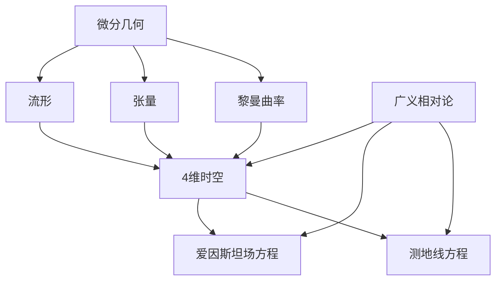

# 微分几何入门与广义相对论：4维表述基础

## 1. 背景介绍

### 1.1 问题的由来

自古以来，人类一直对宇宙的奥秘充满好奇。从伽利略用望远镜观察到木星的卫星开始，人类对宇宙的探索就从未停止过。然而，传统的牛顿力学在解释一些天体运动现象时存在困难。例如，水星绕日运行的离心率无法用牛顿力学精确预测。这促使科学家们寻求一种新的理论来解释这些现象。

### 1.2 研究现状

爱因斯坦在1915年提出了广义相对论，这是一个关于时空和引力的理论。广义相对论将时间和空间统一为四维时空连续体，并将引力视为时空的曲率。这一理论不仅解决了水星运动的难题，而且预言了一些新的现象,如黑洞和引力波。

广义相对论的数学基础是微分几何,特别是黎曼几何。黎曼几何研究曲面和曲线在高维空间中的性质,为描述时空的曲率奠定了基础。然而,广义相对论的数学表述相当复杂,需要使用张量分析和黎曼几何的高级概念。

### 1.3 研究意义

理解广义相对论对于现代物理学和宇宙学至关重要。它不仅是当代科学的支柱理论之一,而且为探索诸如黑洞、宇宙起源等前沿课题提供了理论基础。此外,广义相对论在技术领域也有重要应用,如全球导航卫星系统(GNSS)需要考虑相对论效应的影响。

然而,广义相对论的数学表述往往令人生畏。本文旨在以4维时空的视角,循序渐进地介绍微分几何和广义相对论的基本概念,为读者打开通往这一深奥理论的大门。

### 1.4 本文结构

本文首先介绍微分几何的基本概念,如流形、张量和黎曼曲率等,为后续内容奠定基础。然后,我们将探讨广义相对论在4维时空中的数学表述,包括爱因斯坦场方程和测地线方程等核心内容。接下来,我们将详细讲解算法原理、数学模型和公式推导,并通过实例分析加深理解。最后,我们将介绍广义相对论的实际应用场景,推荐相关学习资源,并展望未来的发展趋势和挑战。

## 2. 核心概念与联系

微分几何和广义相对论是密切相关的两个领域。微分几何提供了描述曲面和曲线在高维空间中性质的数学工具,包括流形、张量和黎曼曲率等概念。这些概念为广义相对论在4维时空中的数学表述奠定了基础。

在广义相对论中,时间和空间被统一为4维时空连续体。爱因斯坦场方程描述了时空的曲率如何由质量和能量分布决定,而测地线方程描述了物体在曲率时空中的运动轨迹。这些核心概念都依赖于微分几何中的流形、张量和黎曼曲率等基本工具。

因此,掌握微分几何的基本概念对于深入理解广义相对论的数学表述至关重要。本文将循序渐进地介绍这些核心概念,并探讨它们在广义相对论中的应用。

## 3. 核心算法原理 & 具体操作步骤

### 3.1 算法原理概述

广义相对论的核心算法原理可以概括为以下两个方程:

1. **爱因斯坦场方程**:描述了时空的曲率如何由质量和能量分布决定。
2. **测地线方程**:描述了物体在曲率时空中的运动轨迹。

爱因斯坦场方程是一组耦合的非线性偏微分方程,将时空的曲率(左边)与物质的能量-动量张量(右边)联系起来:

$$
R_{\mu\nu} - \frac{1}{2}g_{\mu\nu}R = \frac{8\pi G}{c^4}T_{\mu\nu}
$$

其中,$R_{\mu\nu}$是黎曼曲率张量,$g_{\mu\nu}$是度规张量,描述时空的度量关系,$R$是曲率标量,$T_{\mu\nu}$是能量-动量张量,描述物质的分布,$G$是牛顿引力常数,$c$是光速。

测地线方程描述了自由粒子在曲率时空中的运动轨迹,它是一个二阶常微分方程:

$$
\frac{d^2x^\mu}{d\tau^2} + \Gamma^\mu_{\alpha\beta}\frac{dx^\alpha}{d\tau}\frac{dx^\beta}{d\tau} = 0
$$

其中,$x^\mu$是粒子在时空中的坐标,$\tau$是该粒子沿测地线的本征时间,$\Gamma^\mu_{\alpha\beta}$是引力场的克氏符号,描述了时空的曲率。

这两个方程互为因果:物质的分布决定了时空的曲率,而时空的曲率又决定了物体的运动轨迹。它们共同构成了广义相对论的核心算法原理。

### 3.2 算法步骤详解

1. **确定问题的初始条件和边界条件**
    - 给定物质的能量-动量张量$T_{\mu\nu}$的分布
    - 确定时空的初始度规$g_{\mu\nu}$和曲率$R_{\mu\nu}$
    - 设置适当的坐标系和边界条件

2. **求解爱因斯坦场方程,获得时空的度规和曲率**
    - 将$T_{\mu\nu}$代入爱因斯坦场方程的右边
    - 求解这组耦合的非线性偏微分方程,获得$g_{\mu\nu}$和$R_{\mu\nu}$
    - 这通常需要数值方法,如有限元法或谱方法等

3. **计算引力场的克氏符号$\Gamma^\mu_{\alpha\beta}$**
    - 克氏符号由度规张量$g_{\mu\nu}$的一阶和二阶导数决定
    - 计算公式:$\Gamma^\mu_{\alpha\beta} = \frac{1}{2}g^{\mu\nu}(\partial_\alpha g_{\beta\nu} + \partial_\beta g_{\alpha\nu} - \partial_\nu g_{\alpha\beta})$

4. **求解测地线方程,获得粒子的运动轨迹**
    - 将初始位置和速度代入测地线方程
    - 数值求解这个二阶常微分方程,获得$x^\mu(\tau)$
    - 这可以使用如Runge-Kutta法等常微分方程数值求解方法

5. **分析和可视化结果**
    - 绘制时空的曲率分布和粒子的运动轨迹
    - 与观测数据进行比较,验证理论的准确性
    - 分析特殊情况,如黑洞或宇宙大爆炸等

需要注意的是,由于方程的非线性和耦合性质,通常需要使用数值方法进行求解。此外,不同的坐标系和边界条件会导致计算复杂度的差异。

### 3.3 算法优缺点

**优点:**

1. **准确性强**:广义相对论能够精确描述许多天体运动现象,如水星运动的离心率、引力波的存在等,是目前描述宇宙中大尺度引力场的最准确理论。

2. **内涵深刻**:广义相对论将时空和引力统一起来,揭示了它们之间的内在联系,极大地推动了人类对宇宙的认识。

3. **应用广泛**:广义相对论不仅在天体物理和宇宙学中有重要应用,在技术领域如GNSS导航系统等也发挥着关键作用。

**缺点:**

1. **计算复杂**:由于方程的非线性和耦合性质,求解往往需要复杂的数值方法,计算量很大。

2. **与量子理论矛盾**:广义相对论是一个经典理论,与量子理论存在矛盾,无法解释微观尺度上的引力现象。

3. **边界条件困难**:在一些极端情况下,如奇点处,确定合适的边界条件是一个挑战。

4. **仅适用于大尺度**:广义相对论主要描述大尺度的引力场,无法解释微观尺度上的引力现象。

### 3.4 算法应用领域

广义相对论的核心算法在以下领域有重要应用:

1. **天体物理**:解释行星运动、双星系统、脉冲星等天体现象。

2. **黑洞物理**:研究黑洞的性质、形成和辐射过程。

3. **宇宙学**:描述宇宙的演化、膨胀历史和结构形成。

4. **引力波探测**:预言并检验引力波的存在,开辟了新的观测窗口。

5. **航天导航**:全球导航卫星系统需要考虑相对论效应的影响。

6. **实验检验**:通过精密实验检验广义相对论的预言,验证其正确性。

7. **量子引力**:为发展一种统一的量子引力理论提供理论基础。

总的来说,广义相对论是当代科学的支柱理论之一,对于探索宇宙奥秘和推进人类认识具有重要意义。

## 4. 数学模型和公式 & 详细讲解 & 举例说明

### 4.1 数学模型构建

为了在4维时空中描述广义相对论,我们需要构建一个合适的数学模型。这个模型的基本元素包括:

1. **流形 (Manifold)**: 表示4维时空连续体的数学对象。
2. **张量 (Tensor)**: 在流形上定义的多线性函数,用于描述物理量。
3. **度规张量 (Metric Tensor)**: 定义时空中的度量关系,决定长度和时间的测量。
4. **黎曼曲率张量 (Riemann Curvature Tensor)**: 描述时空的曲率,是广义相对论的核心概念。
5. **能量-动量张量 (Energy-Momentum Tensor)**: 描述物质和辐射的能量-动量分布。

在这个模型中,时空被视为一个4维流形,每个事件由四个坐标$(t, x, y, z)$表示。物理量如能量、动量等被描述为张量场定义在这个流形上。

度规张量$g_{\mu\nu}$决定了时空的度量关系,即如何测量长度和时间间隔。在平直时空中,它简化为闵可夫斯基度规:

$$
g_{\mu\nu} = \begin{pmatrix}
-1 & 0 & 0 & 0\\
0 & 1 & 0 & 0\\
0 & 0 & 1 & 0\\
0 & 0 & 0 & 1
\end{pmatrix}
$$

但在曲率时空中,度规张量会发生变形,反映时空的曲率。

黎曼曲率张量$R^\rho_{\sigma\mu\nu}$是一个阶数为4的张量,它完全描述了时空的曲率。当$R^\rho_{\sigma\mu\nu} = 0$时,时空是平直的;否则,时空就存在曲率。

物质的能量-动量分布由能量-动量张量$T_{\mu\nu}$描述。对于理想流体,它可以写为:

$$
T_{\mu\nu} = (\rho + p/c^2)u_\mu u_\nu + p g_{\mu\nu}
$$

其中$\rho$是能量密度,$p$是压强,$u^\mu$是四维速度。

通过将这些张量代入爱因斯坦场方程和测地线方程,我们可以求解时空的度规和曲率,并获得粒子在曲率时空中的运动轨迹。

### 4.2 公式推导过程

我们将推导广义相对论的两个核心公式:爱因斯坦场方程和测地线方程。

**1. 爱因斯坦场方程的推导**

爱因斯坦场方程的左边描述时空的曲率,右边描述物质的能量-动量分布。我们先从