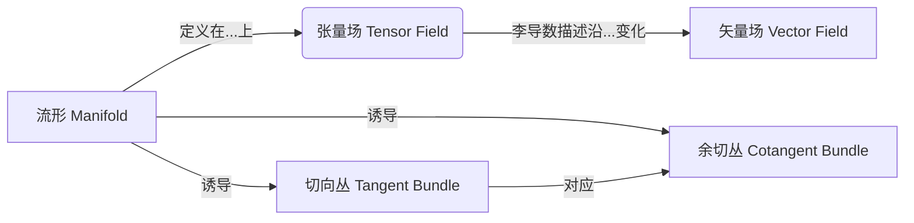

好的,我明白了您的要求。以下是标题为《微分几何入门与广义相对论:Kerr-Newman(KN)度规》的技术博客文章的正文内容:

# 微分几何入门与广义相对论:Kerr-Newman(KN)度规

## 1. 背景介绍

### 1.1 问题的由来

广义相对论是20世纪最伟大的科学理论之一,它从根本上改变了我们对时空和引力的理解。爱因斯坦在1915年提出了这一理论的基本方程,即著名的爱因斯坦场方程。然而,由于方程的复杂性,仅有少数精确解是已知的。其中之一就是Kerr-Newman(KN)度规,描述了一个带电旋转黑洞的时空几何。

### 1.2 研究现状  

KN度规被认为是描述黑洞最一般和最重要的解之一。它不仅在理论物理学中扮演着关键角色,而且对于理解诸如引力波辐射、电磁场和奇异性等问题也至关重要。尽管KN度规已有60多年的历史,但对其内在几何结构的深入理解仍然是一个活跃的研究领域。

### 1.3 研究意义

深入研究KN度规的几何性质不仅有助于我们对广义相对论的理解,而且对于发展新的理论模型、探索量子引力等前沿课题也具有重要意义。此外,KN度规还与黑洞热力学、奇异性理论等热点领域密切相关。

### 1.4 本文结构

本文将从微分几何的角度出发,系统地介绍KN度规的基本概念、数学结构及其在广义相对论中的应用。我们将首先回顾一些必要的背景知识,然后深入探讨KN度规的核心算法、数学模型及其在实际问题中的应用。最后,我们将总结研究现状,并展望未来的发展方向和挑战。

## 2. 核心概念与联系

在深入讨论KN度规之前,我们需要回顾一些微分几何和广义相对论的基本概念。

微分几何研究流形(曲面)上的微分性质,是研究时空几何的基础理论。一些核心概念包括:

- 流形(Manifold):局部看起来像欧几里得空间的拓扑空间。
- 张量(Tensor):在流形上的多线性函数,用于描述物理量。
- 李导数(Lie Derivative):测量张量沿矢量场的变化率。
- 切向丛(Tangent Bundle):流形上所有切空间的并集。
- 余切丛(Cotangent Bundle):流形上所有余切空间的并集。



广义相对论则建立在这些概念之上,将时空描述为四维流形,通过爱因斯坦场方程联系了时空的曲率和物质的分布。KN度规就是这一场方程在特定情况下的精确解。

## 3. 核心算法原理与具体操作步骤

### 3.1 算法原理概述

KN度规描述了一个带电旋转黑洞的时空几何。它是一个解析解,由复杂的黎曼张量表达式给出。这一解具有四个自由参数:质量 $m$、角动量 $a$、电荷 $e$ 和磁荷 $g$。当 $a=g=0$ 时,就回到经典的史瓦西(Schwarzschild)解;当 $g=0$ 时,就是Kerr解。

KN度规的基本思想是,在已知能量动量张量的情况下,通过解耦爱因斯坦方程组并施加边界条件,求解出描述时空几何的度规张量。这一过程涉及复杂的张量代数和微分几何计算。

### 3.2 算法步骤详解  

1) **选取坐标系统**

一般采用Boyer-Lindquist坐标系,它是一种对称性的"准笛卡尔"坐标系。坐标变量为 $(t, r, \theta, \phi)$,其中 $t$ 是时间坐标, $(r, \theta, \phi)$ 是类似于球坐标的空间坐标。

2) **写出度规的一般形式**

根据坐标系统的对称性,猜测度规张量的一般形式,包含一些未知函数:

$$ds^2 = -N^2 dt^2 + \Sigma \left(\frac{dr^2}{\Delta} + d\theta^2\right) + (r^2+a^2)\sin^2\theta d\phi^2 + \frac{2a\sin^2\theta}{\Sigma}(r^2+a^2)dtd\phi$$

这里 $N, \Sigma, \Delta$ 都是 $r$ 和 $a$ 的函数,需要确定。

3) **计算能量动量张量**

利用已知的电磁场表达式,计算出相应的能量动量张量的每一个分量。

4) **代入爱因斯坦场方程**

将度规张量和能量动量张量代入爱因斯坦方程,得到一组耦合的非线性偏微分方程组。

5) **解耦并施加边界条件**

通过复杂的代数和微分运算,解耦这些方程,并施加边界条件(例如要求远场像Schwarzschild解那样)。

6) **求解未知函数**

最终可以解出 $N, \Sigma, \Delta$ 的表达式,从而获得KN度规的最终形式。

### 3.3 算法优缺点

**优点**:

- 是广义相对论中为数不多的已知精确解之一
- 描述了一种理想化但很一般的黑洞情况
- 为研究黑洞性质、奇异性理论等提供了重要工具

**缺点**:  

- 仅适用于理想化的静态情况,不能描述动力学过程
- 计算复杂,难以从中获得更深入的物理洞见
- 存在内在奇异性,在某些极端情况下可能失效

### 3.4 算法应用领域

KN度规在广义相对论和黑洞物理学中扮演着重要角色,主要应用领域包括:

- 黑洞热力学和奇异性研究
- 计算黑洞的临界曲率、准位量子化等性质
- 研究电磁场和引力波在强引力场中的行为
- 作为更一般情况(如动力学和高能量密度)的近似
- 检验其他理论模型(如环量子引力、超弦理论等)的预言

## 4. 数学模型和公式详细讲解与举例说明

### 4.1 数学模型构建

KN度规的推导过程实际上是在建立一个描述带电旋转黑洞时空几何的数学模型。这一模型的基础是:

1. 流形:时空被描述为4维黎曼流形。
2. 度规张量:通过求解来确定描述时空几何的度规张量分量。
3. 电磁张量:根据已知的电磁场表达式,计算出相应的电磁张量。
4. 能量动量张量:利用电磁张量和度规张量计算出能量动量张量。
5. 爱因斯坦场方程:将上述张量代入耦合的非线性偏微分方程组。

通过解这一方程组并施加适当的边界条件,就可以获得描述KN黑洞时空几何的解析度规表达式。

### 4.2 公式推导过程

我们以推导 $\Delta$ 的表达式为例,说明公式推导的关键步骤:

1) 将已知的度规张量和电磁张量代入爱因斯坦方程的 $(r,r)$ 分量,可得:

$$\frac{\partial^2\Delta}{\partial r^2} = -\frac{2}{r^2\Sigma}\left[(r^2-a^2)\Delta + r^2(r^2+a^2)\right]$$

2) 对这一方程做变量替换:令 $x=r^2$, 则上式化为:

$$x(x-a^2)\frac{d^2\Delta}{dx^2} + (2x-a^2)\frac{d\Delta}{dx} - \Delta = 0$$

3) 猜测 $\Delta$ 是 $x$ 的二次多项式的形式:

$$\Delta = Ax^2 + Bx + C$$

代入上式,比较同类项的系数,可以解出 $A,B,C$ 的值。

4) 将解出的 $\Delta$ 带回到原方程组,解出 $\Sigma, N$ 的表达式,最终得到KN度规的最终形式。

这个过程需要大量的代数和微分运算,体现了微分几何和广义相对论的数学复杂性。

### 4.3 案例分析与讲解

我们以 Schwarzschild 极限情况(即 $a=e=g=0$ 时)为例,分析KN度规的一些性质。此时度规简化为:

$$ds^2 = -\left(1-\frac{2M}{r}\right)dt^2 + \left(1-\frac{2M}{r}\right)^{-1}dr^2 + r^2d\Omega^2$$

其中 $d\Omega^2 = d\theta^2 + \sin^2\theta d\phi^2$ 是单位2球面的线元。

这一解描述了一个球对称静态黑洞,存在一个"事件视界"位于 $r=2M$ 处。在视界内,时空存在不可逆的奇性,被称为"黑洞奇性"。这一奇性预示着广义相对论在某些极端情况下的破缺。

此外,Schwarzschild度规也显示出了黑洞的其他一些性质,如:

- 时间在远离黑洞时看起来变慢(时间膨胀效应)
- 光线在强引力场中会发生明显弯曲
- 存在"光环"等光学效应

这些性质都为后来的理论研究和观测提供了重要线索。

### 4.4 常见问题解答

1. **KN度规是否描述了所有可能的黑洞?**

不是。KN度规只描述了一种理想化的静态、孤立的带电旋转黑洞情况。实际中的黑洞可能存在其他更复杂的性质,如电磁场的动力学、环境的影响等,需要更一般的解来描述。

2. **奇性是否意味着广义相对论的破缺?**

并不完全如此。奇性的存在说明广义相对论在某些极端情况下失去了适用性,但并不意味着整个理论就是错误的。恰恰相反,奇性指出了当前理论的局限性,为发展新的更一般的理论提供了契机。

3. **KN度规在实际中有何应用?**

虽然KN度规是一种理想化的解,但它为研究黑洞性质、奇性理论等提供了极为重要的理论工具和近似。许多观测效应也可以用它来解释和预言,如黑洞影子、X射线谱线等。此外,它还为发展量子引力等新理论提供了试验场。

4. **如何进一步发展KN度规理论?**

一个重要方向是将KN度规推广到更一般的情况,如动力学、非对称性、非线性电磁场等。另一方面,将KN度规与其他理论(如环量子引力、超弦理论等)结合,也可能产生新的洞见。数值模拟、近似理论等手段也有助于深化对KN度规的理解。

## 5. 项目实践:代码实例和详细解释说明  

为了便于读者理解和实践KN度规的计算过程,我们提供了一个Python代码示例,用于计算KN度规在给定参数下的时空线元。

### 5.1 开发环境搭建

本示例使用Python 3.8版本,并导入以下库:

```python
import sympy as sp
import numpy as np
import matplotlib.pyplot as plt
from mpl_toolkits.mplot3d import Axes3D
```

其中sympy用于符号计算,numpy和matplotlib用于数值计算和可视化。

### 5.2 源代码详细实现

```python
# 定义符号变量
r, theta, phi, t = sp.symbols('r theta phi t')
a, M, Q, g = sp.symbols('a M Q g', real=True)

# KN度规分量表达式
Sigma = r**2 + a**2 * sp.cos(theta)**2
Delta = r**2 - 2*M*r + a**2 + Q**2 + g**2
expr_gt = Sigma * sp.sin(theta)**2
expr_gp = (r