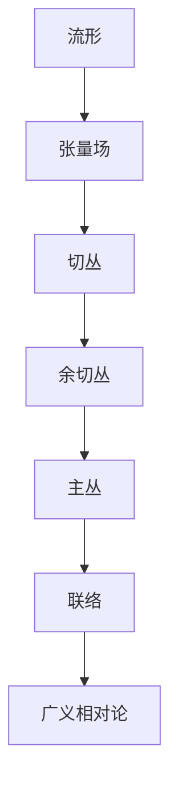

# 微分几何入门与广义相对论：主丛上的联络

## 1. 背景介绍

### 1.1 问题的由来

微分几何是研究流形上的微分结构的数学分支。它在广义相对论、量子场论、弦理论等领域扮演着重要角色。然而,微分几何的概念和方法往往令人生畏,尤其是对于初学者而言。本文旨在为读者提供一个温和的入门,逐步引导读者了解微分几何的基本概念,并将其应用于广义相对论中的联络理论。

### 1.2 研究现状

微分几何的发展可以追溯到19世纪,当时数学家们试图在更一般的空间中推广欧几里德几何。随着张量分析的出现,微分几何获得了强大的工具,并在20世纪初广义相对论的建立中发挥了关键作用。近年来,微分几何在物理学、计算机科学等领域也有了广泛应用。

### 1.3 研究意义

掌握微分几何不仅有助于深入理解广义相对论等基础物理理论,还能拓展我们对空间几何结构的认知。此外,微分几何在计算机图形学、计算机视觉等领域也有重要应用。本文旨在为读者提供一个切入点,帮助他们逐步掌握这一重要的数学工具。

### 1.4 本文结构

本文将从流形的基本概念出发,逐步介绍张量场、余切丛、切丛等概念。然后,我们将重点探讨主丛上的联络理论,并将其应用于广义相对论中的引力场方程。最后,我们将总结未来的发展趋势和挑战。

## 2. 核心概念与联系

上图展示了本文涉及的核心概念及其联系。我们将从流形的概念出发,逐步介绍张量场、切丛、余切丛等概念,最终引入主丛和联络的概念。联络理论在广义相对论中扮演着关键角色,我们将重点探讨它在引力场方程中的应用。

## 3. 核心算法原理 & 具体操作步骤

### 3.1 算法原理概述

联络是一种将切向量平行传输到相邻点的方式。在曲线流形上,联络描述了切向量沿曲线的变化规律。在广义相对论中,我们需要在曲线流形上定义一种合适的联络,以描述引力场对物体运动的影响。

### 3.2 算法步骤详解

1. **定义流形**:首先,我们需要定义一个四维时空流形 $\mathcal{M}$,它描述了宇宙的几何结构。

2. **引入度规张量场**:在流形上,我们引入一个度规张量场 $g_{\mu\nu}$,它描述了时空的度量关系。

3. **构造切丛和余切丛**:基于流形和度规张量场,我们可以构造切丛 $TM$ 和余切丛 $T^*M$,它们分别描述了流形上的切向量和余切向量。

4. **定义主丛**:我们将余切丛的总空间 $T^*M$ 视为一个主丛,其基空间为流形 $\mathcal{M}$,纤维为向量空间 $\mathbb{R}^4$。

5. **构造联络**:在主丛上,我们定义一种联络 $\nabla$,它描述了切向量沿曲线的平行传输规律。联络的具体形式由引力场的性质决定,在广义相对论中,它由克里斯托费尔符号 $\Gamma^\rho_{\mu\nu}$ 给出。

6. **求解联络方程**:利用爱因斯坦场方程,我们可以求解出克里斯托费尔符号,进而确定联络的具体形式。

7. **计算测地线**:已知联络,我们可以计算出测地线的方程,描述了物体在引力场中的运动轨迹。

### 3.3 算法优缺点

**优点**:

- 联络理论提供了一种自然、几何化的描述引力场的方式,避免了人为引入许多附加结构。
- 联络方程与爱因斯坦场方程紧密相关,能够自洽地描述引力场和物质的相互作用。
- 测地线方程直接反映了物体在引力场中的运动规律,具有清晰的物理意义。

**缺点**:

- 联络理论涉及大量抽象的数学概念,如流形、丛等,对初学者来说存在一定学习曲线。
- 求解联络方程通常需要复杂的张量计算,尤其是在一般情况下,往往需要数值方法。
- 联络理论主要描述了经典引力场,无法自然地推广到量子引力领域。

### 3.4 算法应用领域

联络理论在广义相对论中扮演着核心角色,是描述引力场的基础理论。除此之外,它在以下领域也有重要应用:

- **量子场论**:规范场论中的规范势和规范协变导数可以视为一种联络。
- **几何学**:联络理论为研究流形上的平行传输提供了一种自然的方式。
- **微分拓扑学**:联络在研究流形的拓扑不变量时发挥着重要作用。
- **计算机图形学**:联络可以用于描述曲面上的平行传输,在曲面参数化等问题中有应用。

## 4. 数学模型和公式 & 详细讲解 & 举例说明

### 4.1 数学模型构建

在构建广义相对论的数学模型时,我们需要引入以下基本概念:

- **流形** $\mathcal{M}$:一个四维时空流形,描述宇宙的几何结构。
- **度规张量场** $g_{\mu\nu}$:定义在流形上的对称张量场,描述时空的度量关系。
- **切丛** $TM$:流形上所有切向量的集合,描述了流形上的切向量场。
- **余切丛** $T^*M$:流形上所有余切向量的集合,描述了流形上的余切向量场。
- **主丛** $\pi: T^*M \rightarrow \mathcal{M}$:将余切丛的总空间 $T^*M$ 视为一个主丛,其基空间为流形 $\mathcal{M}$,纤维为向量空间 $\mathbb{R}^4$。
- **联络** $\nabla$:定义在主丛上的一种联络,描述切向量沿曲线的平行传输规律。

### 4.2 公式推导过程

在广义相对论中,我们需要求解联络 $\nabla$ 的具体形式。这可以通过以下步骤实现:

1. **定义测地线方程**:

$$
\frac{d^2x^\mu}{d\lambda^2} + \Gamma^\mu_{\rho\sigma}\frac{dx^\rho}{d\lambda}\frac{dx^\sigma}{d\lambda} = 0
$$

其中 $\lambda$ 是仿射参数, $\Gamma^\mu_{\rho\sigma}$ 是待定的克里斯托费尔符号,它决定了联络的具体形式。

2. **引入质量-能量张量**:根据广义相对论的基本假设,物质的存在会引起时空曲率,因此我们引入质量-能量张量 $T_{\mu\nu}$ 来描述物质的分布。

3. **爱因斯坦场方程**:爱因斯坦场方程给出了时空曲率和物质分布之间的关系:

$$
R_{\mu\nu} - \frac{1}{2}g_{\mu\nu}R = \frac{8\pi G}{c^4}T_{\mu\nu}
$$

其中 $R_{\mu\nu}$ 是黎曼曲率张量, $R$ 是黎曼曲率标量, $G$ 是牛顿常数, $c$ 是光速。

4. **计算黎曼曲率张量**:利用克里斯托费尔符号,我们可以计算出黎曼曲率张量的表达式:

$$
R^\rho_{\sigma\mu\nu} = \partial_\mu\Gamma^\rho_{\nu\sigma} - \partial_\nu\Gamma^\rho_{\mu\sigma} + \Gamma^\rho_{\mu\lambda}\Gamma^\lambda_{\nu\sigma} - \Gamma^\rho_{\nu\lambda}\Gamma^\lambda_{\mu\sigma}
$$

5. **求解克里斯托费尔符号**:将黎曼曲率张量的表达式代入爱因斯坦场方程,我们可以求解出克里斯托费尔符号 $\Gamma^\mu_{\rho\sigma}$,进而确定联络 $\nabla$ 的具体形式。

### 4.3 案例分析与讲解

为了更好地理解联络理论在广义相对论中的应用,我们将通过一个简单的案例进行分析和讲解。

**案例背景**:考虑一个质量为 $M$ 的球形物体,它处于一个静止的真空环境中。我们需要求解这个系统的联络,并计算出物体周围的测地线。

1. **定义流形和度规张量场**:

由于系统具有球对称性,我们可以选择球坐标系 $(t, r, \theta, \phi)$,并定义一个对应的流形 $\mathcal{M}$ 和度规张量场 $g_{\mu\nu}$。具体形式为:

$$
ds^2 = -\left(1 - \frac{2GM}{c^2r}\right)c^2dt^2 + \left(1 - \frac{2GM}{c^2r}\right)^{-1}dr^2 + r^2(d\theta^2 + \sin^2\theta d\phi^2)
$$

2. **计算克里斯托费尔符号**:

利用爱因斯坦场方程和球对称性,我们可以计算出克里斯托费尔符号的非零分量:

$$
\Gamma^r_{tt} = \frac{GM}{c^2r^2}\left(1 - \frac{2GM}{c^2r}\right)^{-1}, \quad \Gamma^r_{\theta\theta} = -r\left(1 - \frac{2GM}{c^2r}\right), \quad \Gamma^r_{\phi\phi} = -r\sin^2\theta\left(1 - \frac{2GM}{c^2r}\right)
$$

3. **求解测地线方程**:

已知联络的形式,我们可以求解测地线方程,描述物体在引力场中的运动轨迹。对于径向运动,测地线方程为:

$$
\frac{d^2u}{d\phi^2} + u = \frac{3GM}{c^2}\frac{1}{u^2}
$$

其中 $u = 1/r$, $\phi$ 是某种参数化。

4. **分析结果**:

上述测地线方程描述了物体在球形引力场中的运动规律。当 $GM/c^2 \rightarrow 0$ 时,方程退化为牛顿力学中的克卢格运动方程。当 $GM/c^2$ 不可忽略时,方程体现了广义相对论效应,如周向偏移等。

通过这个简单案例,我们可以看到联络理论如何在具体问题中发挥作用,并获得一些物理上的洞见。

### 4.4 常见问题解答

1. **为什么需要引入联络的概念?**

在曲线流形上,切向量无法沿曲线自然地平行传输。联络提供了一种规定切向量平行传输规律的方式,使得我们可以在曲线流形上研究切向量场的性质。

2. **联络和导数有什么区别?**

导数描述了标量场或向量场沿某一方向的变化率,而联络描述了切向量沿曲线的平行传输规律。两者虽然都涉及到"变化",但侧重点不同。

3. **为什么广义相对论需要引入联络?**

在广义相对论中,我们需要研究物体在曲线时空中的运动轨迹。联络提供了一种描述切向量沿曲线平行传输的方式,使得我们可以求解测地线方程,描述物体的运动规律。

4. **联络是否唯一?**

在一般情况下,联络的选择并不唯一。不同的联络对应着不同的平行传输规律。在广义相对论中,我们选择一种特殊的联络,使得测地线方程与爱因斯坦场方程相容。

5. **联络理论是否可以推广到量子引力领域?**

目前,联络理论主要应用于经典引力场的描述。要将其