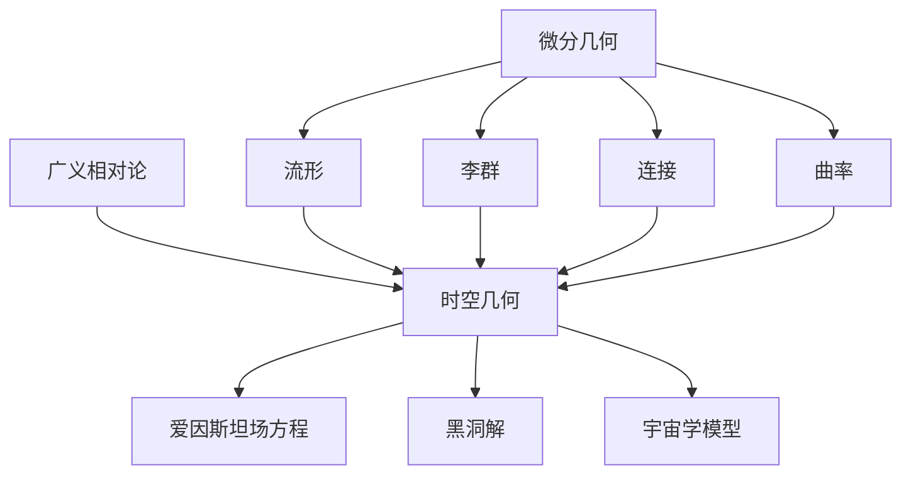

# 微分几何入门与广义相对论：拓扑空间

## 1. 背景介绍

### 1.1 问题的由来

微分几何和广义相对论是数学和物理学中两个极其重要且相互关联的领域。微分几何为研究曲线、曲面和更高维流形的几何性质提供了强大的数学工具,而广义相对论则是描述时空本质和宇宙运行规律的基础理论。这两个领域的交汇点在于,广义相对论需要借助微分几何的概念和方法来精确描述时空的几何结构。

### 1.2 研究现状

微分几何的发展可以追溯到17世纪,当时数学家开始研究曲线和曲面的性质。19世纪,黎曼、高斯等人的工作奠定了流形理论的基础。20世纪初,广义相对论的提出极大地推动了微分几何的发展,爱因斯坦借助了黎曼流形的概念来描述时空的几何结构。

近年来,微分几何和广义相对论在理论和应用方面都取得了长足的进步。微分几何在数学物理、计算机图形学、计算机视觉等领域有着广泛的应用,而广义相对论则是当代宇宙学和黑洞物理学的基石。

### 1.3 研究意义

深入理解微分几何和广义相对论对于科学发展具有重要意义。微分几何为研究自然界中的各种几何对象提供了强有力的数学工具,而广义相对论则揭示了宇宙的本质规律,改变了人类对时空的认知。

此外,微分几何和广义相对论的交叉研究也有助于推动两个领域的进一步发展。例如,利用微分几何的方法可以更好地理解和描述广义相对论中的时空几何,而广义相对论也为微分几何提出了新的挑战和应用场景。

### 1.4 本文结构

本文将从微分几何的基础概念出发,介绍流形、李群、连接和曲率等核心概念,并探讨它们与广义相对论的联系。接下来,我们将重点讨论广义相对论中的时空几何,包括爱因斯坦场方程、黑洞解和宇宙学模型等。最后,我们将展望微分几何和广义相对论的未来发展方向和挑战。

## 2. 核心概念与联系

微分几何和广义相对论之间存在着密切的联系,两者的核心概念相互依赖和影响。

微分几何的核心概念包括:

1. **流形(Manifold)**: 流形是一种抽象的数学对象,用于描述局部看起来像欧几里得空间的空间。它为研究曲线、曲面和更高维度的几何对象奠定了基础。

2. **李群(Lie Group)**: 李群是一种具有连续对称性的群,它描述了流形上的变换。李群在微分几何和广义相对论中扮演着重要角色,例如描述时空的对称性。

3. **连接(Connection)**: 连接定义了流形上的平行传输,它描述了如何在流形上比较切向量。在广义相对论中,连接用于描述时空的曲率。

4. **曲率(Curvature)**: 曲率是描述流形几何性质的关键概念,它衡量了流形与欧几里得空间的偏离程度。在广义相对论中,时空的曲率反映了引力场的存在。

广义相对论的核心概念是时空几何,它描述了时空的本质和运行规律。时空几何的主要方面包括:

1. **爱因斯坦场方程(Einstein Field Equations)**: 这是广义相对论的核心方程,它将时空的曲率与物质和能量的分布联系起来,描述了引力场的性质。

2. **黑洞解(Black Hole Solutions)**: 黑洞是广义相对论中的一种极端物体,它的引力场如此强大,以至于任何物质和辐射都无法逃脱。研究黑洞解有助于深入理解引力的本质。

3. **宇宙学模型(Cosmological Models)**: 广义相对论为描述宇宙的演化提供了理论基础。宇宙学模型描述了宇宙的起源、演化和最终命运,是现代宇宙学的核心。

微分几何为广义相对论提供了描述时空几何的数学工具。例如,流形用于描述时空的几何结构,连接描述了时空上的平行传输,曲率则描述了时空的曲曲折折程度。同时,广义相对论也为微分几何提出了新的挑战和应用场景,推动了微分几何的发展。

## 3. 核心算法原理 & 具体操作步骤

### 3.1 算法原理概述

在广义相对论中,爱因斯坦场方程是描述时空几何和物质分布关系的核心方程。它的基本思想是,物质和能量的存在会导致时空产生曲率,而曲率反过来又影响物质和能量的运动。

爱因斯坦场方程可以写成张量形式:

$$
R_{\mu\nu} - \frac{1}{2}g_{\mu\nu}R = \frac{8\pi G}{c^4}T_{\mu\nu}
$$

其中,左边项描述了时空的曲率,右边项描述了物质和能量的分布。具体来说:

- $R_{\mu\nu}$ 是黎曼曲率张量,描述了时空的内在曲率。
- $R$ 是黎曼曲率标量,是曲率张量的迹。
- $g_{\mu\nu}$ 是度规张量,描述了时空的度规性质。
- $T_{\mu\nu}$ 是能量动量张量,描述了物质和能量的分布。
- $G$ 是牛顿引力常数,而 $c$ 是光速。

爱因斯坦场方程是一组耦合的非线性偏微分方程,它将时空的几何性质与物质和能量的分布联系起来,描述了引力场的本质。解这组方程就可以得到描述时空几何的度规张量,进而研究各种引力场和宇宙学现象。

### 3.2 算法步骤详解

解爱因斯坦场方程通常需要遵循以下步骤:

1. **选择合适的坐标系统**:根据问题的对称性,选择合适的坐标系统可以简化计算。常用的坐标系统包括笛卡尔坐标、球坐标和黑洞坐标等。

2. **确定能量动量张量**:根据给定的物质和能量分布,确定能量动量张量 $T_{\mu\nu}$ 的具体形式。对于理想流体,能量动量张量可以写成 $T_{\mu\nu} = (\rho + p/c^2)u_\mu u_\nu + pg_{\mu\nu}$,其中 $\rho$ 是能量密度, $p$ 是压强, $u^\mu$ 是四速度。

3. **计算黎曼曲率张量和标量**:利用选定的坐标系统和度规张量,计算黎曼曲率张量 $R_{\mu\nu}$ 和黎曼曲率标量 $R$。这通常需要计算一系列导数和代数运算。

4. **代入爱因斯坦场方程**:将计算得到的曲率张量、曲率标量和能量动量张量代入爱因斯坦场方程,得到一组耦合的非线性偏微分方程。

5. **求解方程组**:利用适当的数值方法或分析方法,求解这组非线性偏微分方程,得到度规张量 $g_{\mu\nu}$ 的解析或数值解。

6. **分析和解释结果**:根据得到的度规张量解,分析和解释时空的几何性质,如曲率、奇点、极限等,并与观测结果进行比较和验证。

需要注意的是,爱因斯坦场方程的解析解只存在于一些具有高度对称性的情况下,大多数情况下需要采用数值方法进行求解。此外,对于一些极端情况,如奇点和黑洞,求解也会遇到数学上的困难和奇点性问题。

### 3.3 算法优缺点

爱因斯坦场方程作为描述时空几何的核心算法,具有以下优点:

- 简洁统一:方程形式简洁,将时空的几何性质与物质和能量的分布统一描述。
- 精确描述:方程精确描述了时空的曲率和引力场的性质,与观测结果吻合良好。
- 广泛应用:方程可以应用于各种引力场和宇宙学问题,是广义相对论的理论基础。

然而,爱因斯坦场方程也存在一些缺点和局限性:

- 非线性复杂:方程是一组耦合的非线性偏微分方程,解析解只存在于少数情况下,大多数情况需要采用数值方法求解。
- 奇点问题:在一些极端情况下,如黑洞奇点,方程会出现奇点性问题,导致无法获得有意义的解。
- 量子效应缺失:广义相对论是一种经典理论,无法描述量子效应,在微观尺度上存在局限性。

### 3.4 算法应用领域

爱因斯坦场方程是广义相对论的核心,因此它在描述各种引力场和宇宙学现象时都有广泛的应用:

- **黑洞物理学**:通过求解爱因斯坦场方程,可以得到描述黑洞时空几何的各种解,如史瓦西解、柯尔解和旋转黑洞解等,这是研究黑洞性质的理论基础。

- **致密天体物理学**:对于中子星、白矮星等致密天体,爱因斯坦场方程可以用于研究它们的内部结构和引力场。

- **宇宙学**:通过求解具有各种对称性的爱因斯坦场方程,可以得到描述宇宙演化的各种宇宙学模型,如热大爆炸模型、膨胀宇宙模型等。

- **引力波物理学**:爱因斯坦场方程预言了引力波的存在,并描述了它们的产生、传播和探测。引力波的观测为广义相对论提供了重要的实验验证。

- **精密测量**:通过求解爱因斯坦场方程,可以精确计算出一些可观测量,如行星运动周期、光线偏折等,这为精密测量和检验广义相对论提供了理论依据。

总的来说,爱因斯坦场方程是广义相对论的核心,它在黑洞物理学、致密天体物理学、宇宙学、引力波物理学和精密测量等领域都有着广泛的应用。

## 4. 数学模型和公式 & 详细讲解 & 举例说明

### 4.1 数学模型构建

在广义相对论中,时空被描述为一个四维流形,其上定义了一个度规张量 $g_{\mu\nu}$,描述了时空的几何性质。度规张量的存在使得时空具有了内在的曲率,这种曲率反映了物质和能量的分布。

为了描述时空的曲率,我们需要引入一些额外的数学概念。首先,我们定义了一个关于度规张量的导数算子,称为连接 $\Gamma^\rho_{\mu\nu}$。连接描述了在流形上平移向量时的变化规律,它决定了曲线在流形上的几何性质。

利用连接,我们可以定义黎曼曲率张量 $R^\rho_{\sigma\mu\nu}$,它描述了向量在流形上平移时的非交换性。黎曼曲率张量完全捕捉了流形的内在曲率,当曲率张量为零时,流形就是平直的。

我们还可以定义黎曼曲率张量的一些特殊形式,如黎曼曲率张量 $R_{\mu\nu}$ 和黎曼曲率标量 $R$,它们分别是曲率张量的某些张量和标量收缩。

在构建广义相对论的数学模型时,我们需要将时空的几何性质与物质和能量的分布联系起来。这就需要引