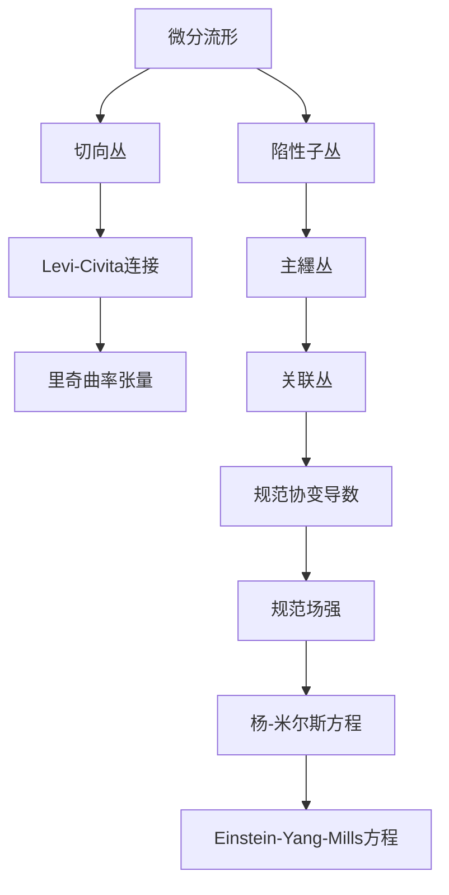

# 微分几何入门与广义相对论：规范场强与曲率

## 1. 背景介绍

### 1.1 问题的由来

微分几何和广义相对论是现代物理学和数学的两个重要分支。微分几何为研究曲面和更高维流形的内在几何性质提供了强有力的工具,而广义相对论则是描述引力现象的基本理论框架。这两个领域之间存在着内在的联系,规范场强和曲率是将它们紧密联系在一起的关键概念。

在经典的广义相对论中,引力被描述为时空的曲率,而曲率本身又由物质的分布所决定。然而,在试图将广义相对论与量子理论相结合的过程中,人们发现需要引入额外的规范场来描述其他基本作用力。这些规范场的存在会影响时空的几何结构,从而改变曲率。因此,研究规范场强和曲率之间的关系对于深入理解广义相对论和统一场论至关重要。

### 1.2 研究现状

近年来,规范场强和曲率的研究在理论物理和数学领域都取得了重大进展。在理论物理方面,科学家们提出了各种扩展的引力理论,试图将广义相对论与其他基本作用力统一起来。这些理论通常涉及到新的规范场和修改后的引力方程。

在数学方面,微分几何学家们发展了各种新的技术和工具来研究流形上的规范场和曲率。例如,通过研究主纆丛和关联丛的几何性质,人们获得了对规范场强的更深入的理解。此外,通过研究Ricci流和Ricci扁平流,人们也获得了对曲率演化的新见解。

### 1.3 研究意义

研究规范场强和曲率对于推进我们对宇宙基本理论的理解至关重要。从理论物理的角度来看,这有助于我们统一所有基本作用力,并最终实现对所有自然现象的完整描述。从数学的角度来看,这将促进微分几何和拓扑学的发展,并为研究更广泛的几何结构提供新的工具和见解。

此外,规范场强和曲率的研究也有潜在的应用前景。例如,在粒子物理学中,人们可以利用规范场理论来描述基本粒子的相互作用。在一般相对论中,人们可以利用曲率的概念来研究黑洞和宇宙学。因此,这一领域的研究不仅具有理论意义,也可能产生实际应用。

### 1.4 本文结构

本文将从微分几何和广义相对论的基本概念出发,介绍规范场强和曲率的相关理论。我们将首先探讨规范场的几何结构,包括主纆丛、关联丛和规范协变导数等概念。然后,我们将研究曲率张量及其与规范场强的关系。接下来,我们将讨论一些具体的理论模型,如扬-米尔斯理论和Einstein-Yang-Mills理论,并分析它们在统一场论中的作用。最后,我们将总结研究成果,并展望未来的发展方向和挑战。

## 2. 核心概念与联系

在探讨规范场强和曲率之前,我们需要先了解一些基本概念。

微分流形是研究微分几何和广义相对论的基本空间。在流形上,我们可以定义切向丛和陷性子丛,分别描述流形上的切向量和切向量场。

Levi-Civita连接是一种特殊的线性连接,它赋予流形一种内在的几何结构,并导出里奇曲率张量。里奇曲率张量描述了流形的曲率,是广义相对论中引力场的源头。

另一方面,规范场的几何结构由主纆丛和关联丛来描述。主纆丛编码了规范变换的几何性质,而关联丛则描述了规范场在流形上的取值。通过规范协变导数,我们可以定义规范场强,它描述了规范场在流形上的局部变化。

规范场强满足一组非线性偏微分方程,称为杨-米尔斯方程。当我们将广义相对论与规范场理论结合时,就得到了Einstein-Yang-Mills方程,它描述了引力场和规范场的耦合作用。

通过研究这些概念及其相互关系,我们可以获得对规范场强和曲率的深入理解,并探索它们在统一场论中的作用。

## 3. 核心算法原理 & 具体操作步骤

### 3.1 算法原理概述

在探讨规范场强和曲率的具体算法之前,我们需要先了解一些基本原理。

首先,规范场强是一个张量值的对象,它描述了规范场在流形上的局部变化。具体来说,规范场强可以通过规范协变导数来定义,它测量了规范场在平行移动过程中的变化。

其次,曲率张量也是一个张量值的对象,它描述了流形的内在几何性质。曲率张量可以通过线性连接的旋量子来定义,它测量了切向量在平行移动过程中的变化。

规范场强和曲率张量之间存在着内在的联系。事实上,在某些扩展的引力理论中,规范场强会直接影响曲率张量的计算。因此,研究它们之间的关系对于构建统一场论至关重要。

### 3.2 算法步骤详解

现在,让我们具体讨论计算规范场强和曲率张量的算法步骤。

#### 3.2.1 计算规范场强

1. 选择一个合适的规范群和表示。
2. 在流形上构造主纆丛和关联丛。
3. 定义规范协变导数,它作用于关联丛上的截面。
4. 利用规范协变导数的定义,计算规范场强张量。

具体来说,给定一个规范场 $A$,它的规范场强 $F$ 可以通过以下公式计算:

$$F = dA + A \wedge A$$

其中 $d$ 表示外微分算子,而 $\wedge$ 表示外代数乘积。

#### 3.2.2 计算曲率张量

1. 选择一个合适的线性连接,通常是Levi-Civita连接。
2. 利用线性连接的定义,计算切向量场的协变导数。
3. 利用协变导数的定义,计算线性连接的旋量子。
4. 利用旋量子的定义,计算曲率张量。

具体来说,给定一个线性连接 $\nabla$,其曲率张量 $R$ 可以通过以下公式计算:

$$R(X, Y)Z = \nabla_X\nabla_YZ - \nabla_Y\nabla_XZ - \nabla_{[X, Y]}Z$$

其中 $X$、$Y$ 和 $Z$ 是切向量场,而 $[X, Y]$ 表示它们的李括号。

需要注意的是,在扩展的引力理论中,曲率张量的计算会受到规范场强的影响。因此,我们需要将规范场强的贡献考虑在内。

### 3.3 算法优缺点

像任何其他算法一样,计算规范场强和曲率张量的算法也有其优缺点。

**优点:**

1. 严格的数学基础,确保了计算结果的准确性和一致性。
2. 适用于广泛的情况,包括各种规范群、表示和线性连接。
3. 提供了一种系统的方法来研究规范场强和曲率之间的关系。

**缺点:**

1. 计算过程可能非常复杂,尤其是在高维流形或更复杂的规范群情况下。
2.需要对微分几何和规范场论有深入的理解,存在一定的学习曲线。
3.在某些特殊情况下,可能需要进一步简化或近似计算。

总的来说,尽管存在一些缺点,但计算规范场强和曲率张量的算法仍然是研究这一领域的重要工具。通过不断改进和优化,我们可以提高计算效率,并获得更准确的结果。

### 3.4 算法应用领域

计算规范场强和曲率张量的算法在多个领域都有广泛的应用。

**理论物理:**

1. 量子场论:规范场强是描述基本作用力的关键概念。
2. 广义相对论:曲率张量描述了时空的几何性质。
3. 统一场论:研究规范场强和曲率的关系是实现统一场论的关键。

**数学:**

1. 微分几何:曲率张量是研究流形内在几何性质的重要工具。
2. 代数几何:规范场强和曲率在研究代数变种和模空间中发挥着重要作用。
3. 拓扑学:规范场强和曲率与特征类和不变量之间存在着密切联系。

**其他应用:**

1. 一般相对论:计算黑洞和宇宙学模型中的曲率张量。
2. 粒子物理:利用规范场理论描述基本粒子的相互作用。
3. 凝聚态物理:研究拓扑绝缘体和其他新型材料中的规范场强和曲率。

总之,计算规范场强和曲率张量的算法不仅在理论物理和数学领域具有重要意义,而且在其他应用领域也发挥着重要作用。随着科技的不断进步,这一算法的应用前景将越来越广阔。

## 4. 数学模型和公式 & 详细讲解 & 举例说明

### 4.1 数学模型构建

为了研究规范场强和曲率之间的关系,我们需要构建一个合适的数学模型。在这个模型中,我们将把规范场强和曲率张量统一描述为几何对象。

让我们考虑一个四维流形 $M$,它表示我们宇宙的时空。在这个流形上,我们定义了一个主纆丛 $P(M, G)$,其中 $G$ 是一个紧凑的规范李群。主纆丛描述了规范变换的几何性质。

从主纆丛 $P(M, G)$ 出发,我们可以构造一个关联丛 $E$,它描述了规范场在流形 $M$ 上的取值。具体来说,关联丛 $E$ 是一个向丛,其纤维是规范群 $G$ 的某个表示空间 $V$。

在关联丛 $E$ 上,我们可以定义一个规范协变导数 $D$,它是一种特殊的线性连接。规范协变导数测量了关联丛上截面在平行移动过程中的变化。利用规范协变导数,我们可以定义规范场强张量 $F$,它描述了规范场在流形上的局部变化。

另一方面,在流形 $M$ 上,我们也可以定义一个线性连接 $\nabla$,通常是Levi-Civita连接。利用这个线性连接,我们可以计算切向丛上截面的协变导数,并进一步定义曲率张量 $R$,它描述了流形的内在几何性质。

在这个统一的数学框架下,规范场强张量 $F$ 和曲率张量 $R$ 都可以被视为流形上的几何对象。它们之间的关系由一组耦合方程来描述,这些方程就是我们要研究的核心内容。

### 4.2 公式推导过程

现在,让我们具体推导规范场强张量 $F$ 和曲率张量 $R$ 之间的关系。

首先,我们需要引入一个新的几何对象,称为曲率二形式 $\Omega$。曲率二形式是一个二次微分形式,它可以通过规范协变导数 $D$ 和规范场强张量 $F$ 来定义:

$$\Omega = D(F)$$

其中 $D(F)$ 表示对规范场强张量 $F$ 应用规范协变导数 $D$ 的结果。

接下来,我们可以利用Bianchi identities,这是一组满足规范协变导数的重要等式。对于曲率二形式 $\Omega$,我们有:

$$D(\Omega) = 0$$

将