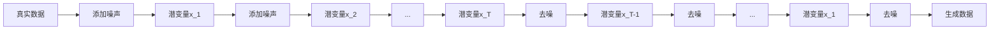

# 扩散模型Diffusion Model原理与代码实例讲解

关键词：扩散模型, 生成模型, 前向过程, 逆向过程, 去噪, 高分辨率图像生成

## 1. 背景介绍

### 1.1 问题的由来
随着深度学习的快速发展,生成模型已经成为人工智能领域的研究热点之一。传统的生成模型如GAN和VAE在图像生成、语音合成等任务上取得了不错的效果,但仍然存在训练不稳定、生成质量不高等问题。近年来,一种称为扩散模型(Diffusion Model)的生成模型引起了广泛关注,其能够生成高质量、高分辨率的图像,在图像生成领域展现出巨大的潜力。

### 1.2 研究现状
扩散模型最早由Sohl-Dickstein等人于2015年提出,但一度没有受到太多关注。直到2020年,Ho等人提出了一种称为去噪扩散概率模型(Denoising Diffusion Probabilistic Models, DDPM)的改进版本,才使得扩散模型重新焕发生机。此后,扩散模型迅速成为生成模型领域的研究热点,涌现出了一系列优秀的工作,如improved DDPM、Latent Diffusion Model、Guided Diffusion等。目前扩散模型已经在高分辨率人脸图像生成、文本到图像生成等任务上取得了SOTA的效果。

### 1.3 研究意义
扩散模型作为一种全新的生成模型范式,有望在图像生成、语音合成、分子生成等领域取得突破性进展。深入理解扩散模型的原理,掌握其实现方法,对于推动生成模型的发展具有重要意义。同时,扩散模型所蕴含的思想,如马尔可夫链、逆向去噪等,也为其他生成模型的改进提供了新的思路。因此,系统地学习和研究扩散模型,对于从事生成模型研究的学者和从业者来说十分必要。

### 1.4 本文结构
本文将从以下几个方面对扩散模型进行深入探讨：

1. 介绍扩散模型的核心概念和基本原理
2. 详细讲解扩散模型的前向和逆向过程
3. 推导扩散模型的数学模型和关键公式
4. 基于PyTorch实现DDPM的完整代码
5. 总结扩散模型的优势、局限性以及未来的发展方向

通过本文的学习,读者将全面掌握扩散模型的理论基础和实践技能,为进一步开展扩散模型的研究和应用打下坚实基础。

## 2. 核心概念与联系

扩散模型是一种基于马尔可夫链的生成模型,其核心思想是通过迭代地向数据添加高斯噪声,将其逐步"扩散"到近似于标准正态分布的先验分布,然后再通过学习逆向去噪过程,逐步去除噪声,从先验分布恢复出真实数据的分布。整个过程可以分为前向扩散过程(forward diffusion process)和逆向去噪过程(reverse denoising process)两个阶段。

在前向扩散过程中,模型通过固定方差的高斯噪声逐步破坏数据,形成一系列的潜变量$\mathbf{x}_1, \mathbf{x}_2, \cdots, \mathbf{x}_T$,其中$\mathbf{x}_0$为真实数据,$T$为扩散的总步数。当$T$较大时,$\mathbf{x}_T$将近似于标准正态分布$\mathcal{N}(\mathbf{0}, \mathbf{I})$。

在逆向去噪过程中,模型从$\mathbf{x}_T$开始,通过预测每一步的噪声,逐步去除噪声,最终恢复出干净的数据$\mathbf{x}_0$。逆向去噪过程可以看作是对条件概率$p_{\theta}(\mathbf{x}_{t-1}|\mathbf{x}_t)$进行建模,其中$\theta$为模型参数。通过最大化似然估计来训练去噪模型。

扩散模型与其他生成模型的主要区别在于:

1. 与GAN不同,扩散模型没有判别器,而是通过最大化似然来训练生成模型。
2. 与VAE不同,扩散模型没有显式的隐变量编码,而是通过迭代去噪过程隐式地学习数据流形。
3. 扩散模型可以显式地控制生成过程的随机性,通过调节噪声水平来权衡生成质量和多样性。

下图展示了扩散模型的总体框架:

## 3. 核心算法原理 & 具体操作步骤

### 3.1 算法原理概述
扩散模型的核心算法可以分为前向扩散过程和逆向去噪过程两个部分。前向过程定义了一个加噪的马尔可夫链,将数据分布$q(\mathbf{x}_0)$逐步转化为先验分布$\pi(\mathbf{x}_T)$。逆向过程则通过学习逐步去噪,将先验分布转化为数据分布。

### 3.2 算法步骤详解

#### 3.2.1 前向扩散过程
前向扩散过程定义了一系列的潜变量$\mathbf{x}_1, \cdots, \mathbf{x}_T$,其中每一步都通过加入高斯噪声$\epsilon$来破坏数据:

$$
q(\mathbf{x}_t|\mathbf{x}_{t-1}) = \mathcal{N}(\mathbf{x}_t; \sqrt{1-\beta_t}\mathbf{x}_{t-1}, \beta_t\mathbf{I})
$$

其中$\beta_t$为噪声水平的超参数。当$T$较大时,$\mathbf{x}_T$将近似于标准正态分布。

前向过程可以一次性采样得到任意时刻$t$的$\mathbf{x}_t$:

$$
\mathbf{x}_t = \sqrt{\bar{\alpha}_t}\mathbf{x}_0 + \sqrt{1-\bar{\alpha}_t}\epsilon
$$

其中$\alpha_t=1-\beta_t$,$\bar{\alpha}_t=\prod_{s=1}^t \alpha_s$。

#### 3.2.2 逆向去噪过程
逆向去噪过程通过学习每一步的去噪分布$p_{\theta}(\mathbf{x}_{t-1}|\mathbf{x}_t)$来逐步恢复数据:

$$
p_{\theta}(\mathbf{x}_{t-1}|\mathbf{x}_t) = \mathcal{N}(\mathbf{x}_{t-1}; \mu_{\theta}(\mathbf{x}_t, t), \sigma_t^2\mathbf{I})
$$

其中$\mu_{\theta}$为去噪模型(如Unet),$\sigma_t$为固定的噪声水平。

训练时,去噪模型$\mu_{\theta}$通过最小化以下损失函数来学习逆向转移分布:

$$
L_{simple} = \mathbb{E}_{t,\mathbf{x}_0,\epsilon}\left[\|  \epsilon - \epsilon_{\theta}(\sqrt{\bar{\alpha}_t}\mathbf{x}_0 + \sqrt{1-\bar{\alpha}_t}\epsilon, t) \|^2 \right]
$$

其中$\epsilon_{\theta}$为去噪模型预测的噪声。

采样时,从$\mathbf{x}_T \sim \mathcal{N}(\mathbf{0}, \mathbf{I})$开始,每一步通过去噪、加噪两个步骤来逐步恢复数据:

$$
\mathbf{x}_{t-1} = \frac{1}{\sqrt{\alpha_t}} \left( \mathbf{x}_t - \frac{1-\alpha_t}{\sqrt{1-\bar{\alpha}_t}}\epsilon_{\theta}(\mathbf{x}_t, t) \right) + \sigma_t \mathbf{z}
$$

其中$\mathbf{z} \sim \mathcal{N}(\mathbf{0}, \mathbf{I})$。

### 3.3 算法优缺点

扩散模型的主要优点包括:

1. 生成质量高:扩散模型能够生成高分辨率、高保真度的图像,在人脸生成等任务上达到SOTA效果。
2. 训练稳定:扩散模型没有GAN中的对抗训练,因此训练过程更加稳定。
3. 可控性强:通过调节噪声水平,可以控制生成结果的随机性和多样性。

扩散模型的主要缺点包括:  

1. 推理速度慢:扩散模型需要较长的马尔可夫链,导致采样速度较慢。
2. 训练成本高:扩散模型需要较深的神经网络作为去噪模型,训练成本较高。

### 3.4 算法应用领域
扩散模型在图像生成领域展现出巨大潜力,可以应用于:

1. 人脸生成:扩散模型能够生成高质量的人脸图像,在人脸编辑、人脸动画等任务中有广泛应用。
2. 图像翻译:扩散模型可以用于图像风格转换、图像着色等图像翻译任务。
3. 文本到图像生成:扩散模型可以根据文本描述生成相应的图像,实现文本到图像的转换。

除图像领域外,扩散模型还可以应用于语音合成、分子生成等领域。

## 4. 数学模型和公式 & 详细讲解 & 举例说明

### 4.1 数学模型构建
扩散模型的数学模型可以表示为一个加噪的马尔可夫链:

$$
q(\mathbf{x}_{1:T}|\mathbf{x}_0) = \prod_{t=1}^T q(\mathbf{x}_t|\mathbf{x}_{t-1})
$$

其中每一步转移概率$q(\mathbf{x}_t|\mathbf{x}_{t-1})$为高斯分布:

$$
q(\mathbf{x}_t|\mathbf{x}_{t-1}) = \mathcal{N}(\mathbf{x}_t; \sqrt{1-\beta_t}\mathbf{x}_{t-1}, \beta_t\mathbf{I})
$$

通过一系列的转移,数据分布$q(\mathbf{x}_0)$被逐步转化为先验分布$\pi(\mathbf{x}_T)$。

逆向去噪过程通过学习逆向转移概率$p_{\theta}(\mathbf{x}_{t-1}|\mathbf{x}_t)$来逐步恢复数据:

$$
p_{\theta}(\mathbf{x}_{0:T}) = p(\mathbf{x}_T)\prod_{t=1}^T p_{\theta}(\mathbf{x}_{t-1} | \mathbf{x}_t)
$$

去噪模型参数$\theta$通过最大化边际似然$p_{\theta}(\mathbf{x}_0)$来学习:

$$
\max_{\theta} \mathbb{E}_{q(\mathbf{x}_0)}[\log p_{\theta}(\mathbf{x}_0)]
$$

### 4.2 公式推导过程

#### 4.2.1 前向过程的一次性采样公式
对于任意时刻$t$,我们可以一次性采样得到$\mathbf{x}_t$:

$$
\begin{aligned}
\mathbf{x}_t &= \sqrt{\alpha_t}\mathbf{x}_{t-1} + \sqrt{1-\alpha_t}\epsilon_t \\
&= \sqrt{\alpha_t\alpha_{t-1}}\mathbf{x}_{t-2} + \sqrt{1-\alpha_t}\epsilon_t + \sqrt{\alpha_t(1-\alpha_{t-1})}\epsilon_{t-1} \\
&= \cdots \\
&= \sqrt{\bar{\alpha}_t}\mathbf{x}_0 + \sqrt{1-\bar{\alpha}_t}\epsilon
\end{aligned}
$$

其中$\epsilon=\sum_{s=1}^t \sqrt{\frac{1-\alpha_s}{\bar{\alpha}_s}} \epsilon_s$。

#### 4.2.2 训练目标的变换
去噪模型的训练目标可以从最大化边际似然变换为最小化以下损失函数:

$$
\begin{aligned}
L &= \mathbb{E}_{q(\mathbf{x}_0)}\left[\mathbb{E}_{q(\mathbf{x}_1, \cdots, \mathbf{x}_T|\mathbf{x