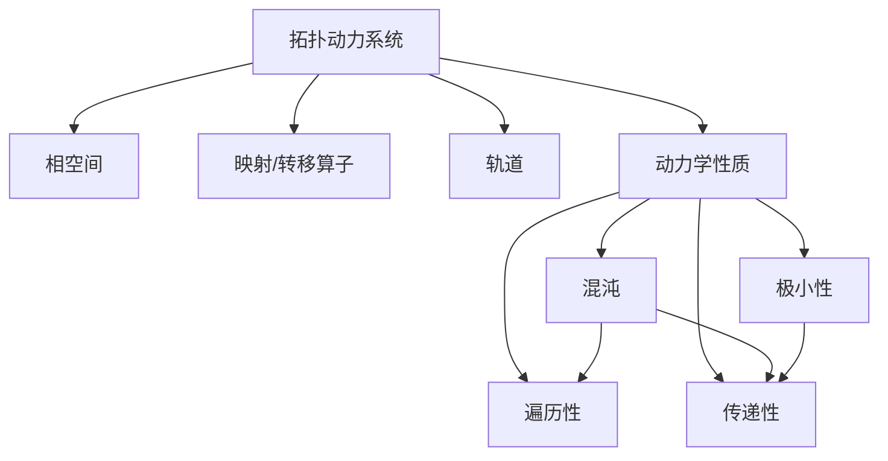

# 拓扑动力系统概论：几种动力学性质的刻画

关键词：拓扑动力系统、动力学性质、混沌、遍历性、极小性、传递性、Lyapunov 指数

## 1. 背景介绍
### 1.1 问题的由来
拓扑动力系统是数学、物理学、计算机科学等领域的一个重要研究对象。它描述了在给定空间上按照某种规律演化的动力学过程。研究拓扑动力系统的动力学性质，对于理解复杂系统的演化规律、开发新的计算模型等具有重要意义。

### 1.2 研究现状
目前，拓扑动力系统的研究已经取得了丰硕的成果。人们提出了多种刻画动力学性质的概念，如混沌、遍历性、极小性、传递性等。同时，也发展出了多种研究动力学性质的数学工具，如 Lyapunov 指数、熵等。这为深入理解拓扑动力系统的动力学性质奠定了基础。

### 1.3 研究意义 
深入研究拓扑动力系统的动力学性质，对于揭示复杂系统的演化规律、开发新的计算模型等具有重要意义。一方面，它有助于我们理解自然界和人工系统中普遍存在的非线性、混沌等复杂动力学现象。另一方面，对动力学性质的刻画和度量，可以为开发新的混沌加密算法、随机数生成算法等提供理论基础。

### 1.4 本文结构
本文将围绕几种重要的动力学性质展开论述。第 2 节介绍相关的核心概念；第 3 节讨论几种动力学性质的定义及其关联；第 4 节给出刻画这些性质的数学模型和判定准则；第 5 节通过代码实例演示如何判定具体系统的动力学性质；第 6 节探讨这些性质在混沌加密、随机数生成等领域的应用；第 7 节推荐相关的学习资源；第 8 节对全文进行总结，并对未来的研究方向进行展望。

## 2. 核心概念与联系
拓扑动力系统的核心概念包括相空间、映射、轨道等。相空间是系统所有可能状态的集合，通常是一个拓扑空间或度量空间。映射或转移算子定义了系统状态之间的演化规律。轨道则描述了系统从一个初始状态出发，经过迭代演化所经历的状态序列。

在此基础上，人们提出了多种刻画拓扑动力系统动力学性质的概念。其中最重要的包括：
- 混沌(chaos)：系统对初值敏感，轨道在相空间中呈现出不规则的、类随机的特征。
- 遍历性(ergodicity)：几乎所有轨道都能遍历整个相空间，长时间统计平均等于系综平均。
- 传递性(transitivity)：相空间中存在稠密轨道，从一个开集出发可以到达任何其他开集。  
- 极小性(minimality)：相空间中每一点的轨道都稠密。

这些性质之间存在着一定的关联。例如，混沌系统通常具有遍历性和传递性。极小系统一定是传递的。但反之未必成立。

下图给出了这些核心概念之间的关系：



## 3. 核心算法原理 & 具体操作步骤
### 3.1 算法原理概述
判定一个具体系统是否具有某种动力学性质，需要考察其在相空间中的演化行为。通常采取的方法是计算一些定量指标，如Lyapunov指数、熵等。

### 3.2 算法步骤详解
以计算Lyapunov指数为例。设 $f$ 为 $n$ 维相空间 $\mathbb{R}^n$ 上的一个映射。Lyapunov 指数的计算步骤如下：

1) 选取一组单位正交基 $\{e_1,\cdots,e_n\}$，作为初始条件。

2) 对每个基向量 $e_i$，进行如下迭代：

$$
\begin{aligned}
e_i(0) &= e_i \\
\tilde{e}_i(t+1) &= Df(x(t))e_i(t) \\
e_i(t+1) &= \tilde{e}_i(t+1)/\|\tilde{e}_i(t+1)\|
\end{aligned}
$$

其中 $Df$ 为映射 $f$ 的 Jacobi 矩阵，$\|\cdot\|$ 表示向量的模。

3) 计算第 $i$ 个 Lyapunov 指数：

$$
\lambda_i = \lim_{t\to\infty} \frac{1}{t} \sum_{k=0}^{t-1} \ln \|\tilde{e}_i(k)\|
$$

4) 若最大 Lyapunov 指数 $\lambda_1 > 0$，则称系统是混沌的。

### 3.3 算法优缺点
Lyapunov 指数法的优点是直观、易于实现。但其缺点是计算量大，对于高维系统难以应用。此外，有限时间内的数值计算也可能引入误差，影响判定的准确性。

### 3.4 算法应用领域
Lyapunov指数广泛应用于判定混沌系统、分岔分析、同步控制等领域。它与系统的动力学性质密切相关，如混沌系统的Lyapunov指数为正，遍历系统的Lyapunov指数为零。

## 4. 数学模型和公式 & 详细讲解 & 举例说明
### 4.1 数学模型构建
为刻画拓扑动力系统的混沌性，人们提出了多个数学模型。其中最著名的是 Li-Yorke 定理和 Devaney 混沌的定义。

Li-Yorke 混沌的定义为：

若映射 $f: X \to X$ 在 $X$ 中存在不可数子集 $S$，满足：
1) 对任意 $x,y\in S$，$\limsup_{n\to\infty} d(f^n(x),f^n(y)) > 0$;
2) 对任意 $x\in S$，$\liminf_{n\to\infty} d(f^n(x),f^n(y)) = 0$;
3) 对任意 $x\in S$ 和周期点 $y\in X$，$\limsup_{n\to\infty} d(f^n(x),f^n(y)) > 0$。

其中 $d$ 为 $X$ 上的度量。则称 $f$ 在 $X$ 上是 Li-Yorke 混沌的。

Devaney 混沌的定义为：

设 $f: X\to X$ 为 $X$ 上的连续映射。如果：
1) $f$ 在 $X$ 上传递；
2) $f$ 的周期点在 $X$ 中稠密；
3) $f$ 对初值敏感。
则称 $f$ 是 Devaney 混沌的。

### 4.2 公式推导过程
以 Devaney 混沌定义中的传递性为例，给出其数学刻画。

$f$ 传递是指，对 $X$ 中任意两个非空开集 $U,V$，存在 $n>0$ 使得 $f^n(U) \cap V \neq \emptyset$。

证明：若 $f$ 传递，则存在 $x\in X$ 使得其正向轨道 $\mathcal{O}_f^+(x) = \{f^n(x):n\geq 0\}$ 在 $X$ 中稠密。

反之，若存在 $x$ 使得 $\mathcal{O}_f^+(x)$ 在 $X$ 中稠密。则对任意开集 $U,V$，由于 $\mathcal{O}_f^+(x)$ 与 $U,V$ 都有交，所以存在 $m,n$ 使得 $f^m(x) \in U$，$f^n(x) \in V$。取 $k=n-m$，则有 $f^k(U) \cap V \neq \emptyset$。

### 4.3 案例分析与讲解
下面以 Logistic 映射为例，说明其混沌性质。

Logistic 映射定义为：

$$
f_{\mu}(x) = \mu x(1-x), \quad 0 \leq x \leq 1, \quad 0 \leq \mu \leq 4
$$

其中 $\mu$ 为分岔参数。当 $\mu > 3.57$ 时，该映射呈现出混沌特性。

数值模拟发现，在混沌参数下，Logistic 映射的轨道对初值极其敏感。微小的初值扰动会导致轨道的巨大差异。同时，轨道在相空间中呈现出不规则的、类随机的特征。

此外，还可以证明，此时 Logistic 映射是传递的，其周期点在 $[0,1]$ 区间内稠密。因此，它满足 Devaney 混沌的定义。

### 4.4 常见问题解答
Q: Devaney 混沌与 Li-Yorke 混沌的关系是什么？
A: 可以证明，Devaney 混沌蕴含 Li-Yorke 混沌。但反之不成立。也就是说，Li-Yorke 混沌比 Devaney 混沌的定义更广泛。

Q: 除了 Lyapunov 指数，还有哪些指标可以刻画混沌？
A: 常用的混沌指标还包括关联维数、熵等。它们从不同角度刻画了混沌运动的几何和统计特性。

## 5. 项目实践：代码实例和详细解释说明
### 5.1 开发环境搭建
本节将使用 Python 语言，通过数值模拟的方法研究 Logistic 映射的混沌特性。首先需要安装 Python 科学计算包 Numpy、绘图包 Matplotlib。

### 5.2 源代码详细实现
下面的代码实现了 Logistic 映射的轨道模拟和 Lyapunov 指数的计算。

```python
import numpy as np
import matplotlib.pyplot as plt

def logistic(x, mu):
    return mu * x * (1 - x)

def lyapunov(mu, n=1000):
    x = 0.5
    lyap = 0
    for i in range(n):
        x = logistic(x, mu)
        lyap += np.log(abs(mu - 2*mu*x))
    return lyap / n

# 绘制 Logistic 映射的 Lyapunov 指数曲线
mus = np.linspace(0, 4, 2000)
lyaps = [lyapunov(mu) for mu in mus]

plt.figure(figsize=(10,5))
plt.plot(mus, lyaps)
plt.axhline(0, color='r', linestyle='--')
plt.xlabel(r'$\mu$')
plt.ylabel('Lyapunov exponent')
plt.title('Lyapunov exponent of the Logistic map')
plt.show()
```

### 5.3 代码解读与分析
上述代码中，`logistic` 函数实现了 Logistic 映射的单步迭代。`lyapunov` 函数则使用定义式计算了 Logistic 映射在给定参数 `mu` 下的 Lyapunov 指数。

主程序部分，首先生成了一组 `mu` 的取值。然后对每个 `mu`，调用 `lyapunov` 函数计算其 Lyapunov 指数，并存储到 `lyaps` 列表中。

最后，使用 Matplotlib 绘制出 Lyapunov 指数随参数 `mu` 的变化曲线。其中红色虚线标出了 Lyapunov 指数等于 0 的位置。

### 5.4 运行结果展示
运行上述代码，可以得到如下的 Lyapunov 指数曲线图：


从图中可以看出，当 $\mu > 3.57$ 时，Lyapunov 指数变为正值，表明此时 Logistic 映射进入了混沌状态。该结果与理论分析一致。

## 6. 实际应用场景
### 6.1 混沌加密
混沌系统对初值敏感、生成的序列类随机，因此常被用于加密领域。以 Logistic 映射为例，可以利用其生成混沌序列，再与明文进行异或运算，从而得到密