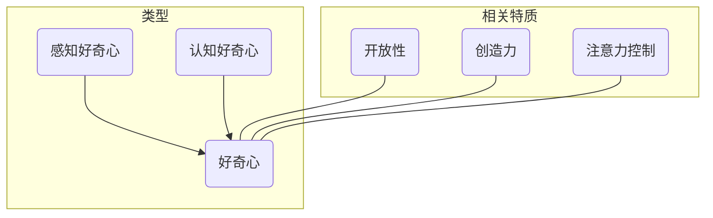
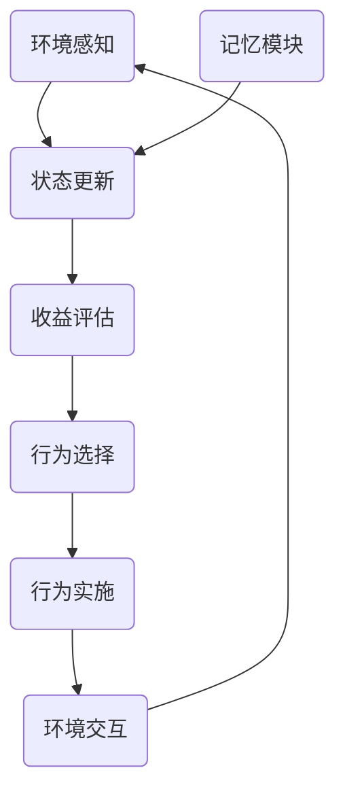

好的,我会严格按照您提供的要求和结构模板来撰写这篇文章。以下是文章正文部分:

# 探索与理解:好奇心的力量

## 1. 背景介绍

### 1.1 问题的由来

在这个瞬息万变的数字时代,信息技术的发展日新月异。作为IT从业者,我们必须时刻保持好奇心和学习热情,才能跟上技术变革的步伐。然而,很多人对新兴技术充满疑虑和恐惧,宁愿固步自封,停留在舒适区。这种守旧心理严重阻碍了个人成长和事业发展。

### 1.2 研究现状 

学界和业界已有大量研究表明,好奇心对于创新、学习和解决复杂问题至关重要。好奇心可以激发求知欲,促进主动探索,帮助我们突破思维定式。但如何有效培养和保持好奇心,仍是一个值得深入探讨的课题。

### 1.3 研究意义

本文旨在阐明好奇心对IT从业者的重要性,分析好奇心的本质特征,提出培养好奇心的策略,并探讨在软件开发、人工智能等领域应用好奇心的实践方法。通过本文,我们可以重新认识好奇心的力量,提高自身的学习能力和创新潜能。

### 1.4 本文结构

本文共分为9个部分:第一部分介绍研究背景;第二部分阐述好奇心的核心概念;第三和四部分分别探讨好奇心的算法实现原理和数学模型;第五部分给出实际代码示例;第六部分分析好奇心在不同场景中的应用;第七部分推荐相关工具和资源;第八部分总结发展趋势和挑战;最后一部分列出常见问题解答。

## 2. 核心概念与联系

好奇心(Curiosity)是人类基本的心理需求之一,是推动我们不断探索、学习和发现的内在动力。好奇心可分为两种类型:

1. **感知好奇心(Perceptual Curiosity)**: 对新奇刺激物的关注和探索欲望。例如,婴儿对新玩具的兴趣,或成年人对新奇事物的留意。

2. **认知好奇心(Epistemic Curiosity)**: 渴望获取新知识、揭开未解之谜的欲望。例如,对某一现象的根源机制的探究,或对复杂系统的工作原理的求索。

这两种好奇心相辅相成,感知好奇心常常是认知好奇心的前驱和诱因。好奇心与其他心理特质也存在密切联系,如开放性、创造力、注意力控制等。



## 3. 核心算法原理 & 具体操作步骤

### 3.1 算法原理概述

好奇心的实现可以建模为一个主动探索与学习的过程。该过程由感知模块、记忆模块、内在评估模块和决策模块等多个子模块协同完成。

**感知模块**负责获取外部环境信息,识别新奇刺激;**记忆模块**存储已有的知识和经验;**内在评估模块**根据当前状态、记忆和目标,评估各种行为的预期收益;**决策模块**基于评估结果,选择具有最高收益的行为执行。

整个过程遵循以下基本原则:

1. **最大化学习进度(Maximal Learning Progress)**:系统倾向于选择可以最大化学习进度的行为,即获取最多新信息的行为。

2. **最小化认知冲突(Minimal Cognitive Conflict)**:系统倾向于选择可以最小化与已有知识冲突的行为,即保持认知一致性。

3. **最大化内在动机(Maximal Intrinsic Motivation)**:系统倾向于选择可以最大化内在动机(如新奇性、挑战性等)的行为。

### 3.2 算法步骤详解

好奇心驱动的主动学习算法可概括为以下步骤:

1. **环境感知**:通过传感器获取环境信息,识别新奇刺激。

2. **状态更新**:将新获得的信息与记忆中的知识融合,更新认知状态。

3. **收益评估**:对各种可选行为的预期收益(学习进度、认知一致性、内在动机等)进行评估。

4. **行为选择**:根据评估结果,选择具有最高收益的行为执行。

5. **行为实施**:执行所选行为,与环境交互并获取反馈。

6. **回到步骤2**,重复上述过程。



### 3.3 算法优缺点

**优点**:

- 主动学习,高效获取新知识
- 内在驱动,有利于长期学习
- 具有一定通用性,可应用于多领域

**缺点**:

- 计算代价较高,需要复杂的评估过程
- 容易陷入局部最优,忽视全局目标
- 对环境和任务的先验知识缺乏

### 3.4 算法应用领域

好奇心驱动的主动学习算法可应用于多个领域:

- **机器学习**:用于主动选择训练样本,提高模型效率
- **机器人**:驱动机器人主动探索环境,获取知识
- **推荐系统**:根据用户好奇心推荐新颖有趣的内容
- **游戏AI**:控制游戏AI主动探索、学习游戏规则
- **教育智能辅助**:根据学生好奇心提供个性化学习资源

## 4. 数学模型和公式 & 详细讲解 & 举例说明  

### 4.1 数学模型构建

为了量化好奇心驱动的学习过程,我们可以建立如下数学模型:

假设智能体的认知状态用beliefstate $b_t$表示,其中包含对环境的理解程度。行为序列记为$a_{1:T}$,观测序列记为$o_{1:T}$。

智能体的目标是最大化其在当前beliefstate下的期望收益:

$$J(\pi) = \sum\limits_{t=1}^{T}\mathbb{E}_{\pi}[r(b_t,a_t,o_t)]$$

其中$\pi$是智能体的行为策略,$r$是在给定状态beliefstate $b_t$下执行行为$a_t$获得观测$o_t$的即时收益。

这个收益函数可以设计为包含以下几个部分:

$$r(b_t,a_t,o_t) = \underbrace{r_\text{knowledge}(b_t,o_t)}_\text{学习进度} + \underbrace{r_\text{consistency}(b_t,o_t)}_\text{认知一致性} + \underbrace{r_\text{intrinsic}(a_t)}_\text{内在动机}$$

1) $r_\text{knowledge}$衡量新获得观测$o_t$对于扩展认知状态$b_t$的贡献,即学习进度;
2) $r_\text{consistency}$衡量新观测$o_t$与现有认知状态$b_t$的契合程度,即认知一致性;
3) $r_\text{intrinsic}$衡量行为$a_t$本身的新奇性、挑战性等内在动机因素。

通过对上述不同部分的权衡,智能体可以权衡探索(exploration)与利用(exploitation)之间的平衡。

### 4.2 公式推导过程

以下给出$r_\text{knowledge}$和$r_\text{consistency}$的具体计算公式及推导过程:

1) **学习进度 $r_\text{knowledge}$**

我们可以用信息论中的信息量(self-information)来衡量观测$o_t$的学习价值:

$$r_\text{knowledge}(b_t,o_t) = -\log P(o_t|b_t)$$

其中$P(o_t|b_t)$是在当前beliefstate $b_t$下,观测$o_t$发生的概率。直观上,越是低概率的观测,其信息量就越大,对扩展beliefstate的贡献就越大。

2) **认知一致性 $r_\text{consistency}$** 

为了保持认知的一致性和平滑性,我们可以最小化新观测$o_t$与当前beliefstate $b_t$的偏差:

$$r_\text{consistency}(b_t,o_t) = -D_\text{KL}(P(o_t|b_t) \| P(o_t|b_{t+1}))$$

其中$D_\text{KL}$是KL散度,衡量两个概率分布之间的差异。$P(o_t|b_{t+1})$是更新后的beliefstate对观测$o_t$的概率预测。

当新观测$o_t$与当前beliefstate $b_t$的预测高度一致时,KL散度接近0,认知一致性收益最大。

### 4.3 案例分析与讲解

考虑一个简单的网格世界案例,智能体的目标是学习这个世界的转移规则。

假设智能体当前的beliefstate $b_t$是一个概率分布,对每个可能的转移规则$m$的置信度为$P(m|b_t)$。

如果智能体在状态$s_t$执行行为$a_t$,得到观测$o_t=s_{t+1}$,那么学习进度收益为:

$$r_\text{knowledge}(b_t,o_t) = -\log \sum\limits_{m}P(s_{t+1}|s_t,a_t,m)P(m|b_t)$$

认知一致性收益为:

$$r_\text{consistency}(b_t,o_t) = -D_\text{KL}(P(s_{t+1}|s_t,a_t,b_t) \| P(s_{t+1}|s_t,a_t,b_{t+1}))$$

其中$P(s_{t+1}|s_t,a_t,b_{t+1})$是根据贝叶斯规则更新后的新beliefstate对转移的预测。

智能体将权衡这两种收益,选择可以最大化总收益的行为执行。例如,如果当前状态已经学习充分,可能会选择具有较高内在动机(如新奇性)的行为,以获取新知识。

### 4.4 常见问题解答

**Q:为什么要将认知一致性作为收益的一部分?**

A:认知一致性对于保持学习的连续性和平滑性很重要。如果新获得的知识与已有认知存在严重冲突,可能会导致学习中断或系统不稳定。通过最小化认知冲突,智能体可以在新旧知识之间保持平衡。

**Q:如何权衡学习进度与认知一致性之间的关系?**

A:这需要根据具体任务和场景,对两者进行合理的权重分配。有时我们更关注获取新知识,可以给学习进度以更高权重;有时为了保持系统稳定,需要给认知一致性以更高权重。通常可以在训练过程中通过调参找到一个合适的权衡点。

**Q:除了学习进度和认知一致性,还有其他可以纳入收益函数的因素吗?**

A:是的,我们还可以考虑其他因素,如行为的能量消耗、任务完成度、长期回报等。这些因素可以作为收益函数的附加项,与学习进度和认知一致性一起权衡。具体取决于任务的特点和目标。

## 5. 项目实践:代码实例和详细解释说明

### 5.1 开发环境搭建

本节我们将基于Python和PyTorch深度学习框架,实现一个简单的好奇心驱动主动学习智能体。

首先,我们需要安装相关依赖库:

```bash
pip install numpy pytorch matplotlib
```

接下来,导入所需的库:

```python
import numpy as np
import torch
import torch.nn as nn
import matplotlib.pyplot as plt
```

### 5.2 源代码详细实现

我们定义一个GridWorld环境,智能体需要通过探索学习其状态转移规则。

```python
class GridWorld:
    def __init__(self, size,