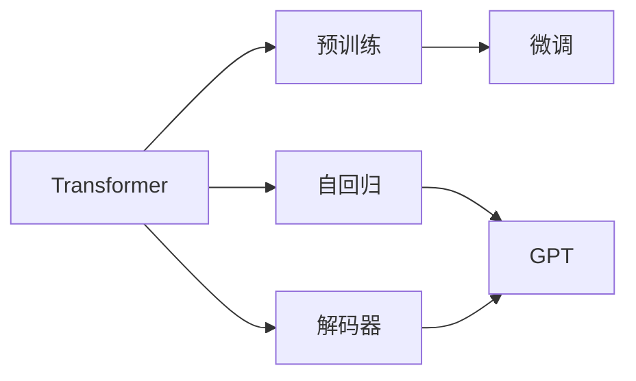

# 搭建GPT模型（解码器）

## 1. 背景介绍
### 1.1 问题的由来
近年来，自然语言处理(NLP)领域取得了突破性的进展，尤其是以Transformer为代表的预训练语言模型(PLM)的出现，极大地推动了NLP技术的发展。而GPT(Generative Pre-trained Transformer)作为其中的佼佼者，以其强大的语言理解和生成能力，在学术界和工业界引起了广泛关注。

### 1.2 研究现状
目前，GPT模型已经发展到了第三代，即GPT-3。与之前的版本相比，GPT-3在模型规模、训练数据量等方面都有了大幅提升，使得其在许多NLP任务上取得了超越人类的表现。众多研究者和企业都在探索如何将GPT应用到实际场景中，以解决现实世界的问题。

### 1.3 研究意义
尽管GPT模型已经展现出了强大的能力，但对于许多开发者和研究者来说，如何从零开始搭建并训练一个GPT模型，仍然是一个具有挑战性的课题。深入理解GPT的内部原理和实现细节，对于进一步改进模型性能和拓展其应用范围，具有重要的意义。

### 1.4 本文结构
本文将从以下几个方面来详细介绍如何搭建GPT模型（解码器）：

1. 介绍GPT模型的核心概念与内部联系
2. 阐述GPT的核心算法原理和具体操作步骤
3. 讲解GPT所依赖的数学模型和公式
4. 给出项目实践的代码实例和详细解释
5. 探讨GPT的实际应用场景
6. 推荐相关的工具和学习资源
7. 总结GPT的未来发展趋势与面临的挑战
8. 回答常见问题

## 2. 核心概念与联系

在讲解GPT的原理和实现之前，我们首先需要了解几个核心概念：

- Transformer：一种基于自注意力机制(Self-Attention)的神经网络架构，是GPT的基础。
- 预训练(Pre-training)：在大规模无标注语料上进行自监督学习，让模型学习到语言的一般规律和表示。
- 微调(Fine-tuning)：在特定任务的有标注数据上，对预训练模型进行监督学习，使其适应具体任务。
- 自回归(Auto-Regressive)：模型根据之前生成的内容，预测下一个词的概率分布，从而实现语言生成。
- 解码器(Decoder)：Transformer的一个子模块，GPT模型只使用解码器部分。

下图展示了这些概念之间的联系：



可以看到，GPT是一个基于Transformer解码器、使用自回归目标进行预训练和微调的语言模型。接下来我们将详细解释其中的原理和实现。

## 3. 核心算法原理 & 具体操作步骤
### 3.1 算法原理概述
GPT模型的核心是Transformer的解码器模块，其主要由以下几个部分组成：

1. 词嵌入(Word Embedding)：将输入的离散词转换为连续的向量表示。
2. 位置编码(Positional Encoding)：为每个位置的词向量添加位置信息。
3. 自注意力层(Self-Attention Layer)：捕捉词之间的依赖关系。
4. 前馈神经网络(Feed-Forward Neural Network)：对自注意力层的输出进行非线性变换。
5. Layer Normalization：对每一层的输入进行归一化，加速训练收敛。
6. 残差连接(Residual Connection)：将输入与层的输出相加，防止梯度消失。

### 3.2 算法步骤详解

1. 准备输入数据，对文本进行tokenization，将每个token映射为对应的id。
2. 将token id序列传入词嵌入层，得到词向量序列。
3. 对词向量序列进行位置编码，加入位置信息。
4. 将位置编码后的向量序列传入第一个解码器块：
   - 通过自注意力层计算上下文表示
   - 将自注意力层输出传入前馈神经网络
   - 对前馈层输出进行Layer Normalization，并与输入进行残差连接
5. 将第一个解码器块的输出传入第二个解码器块，重复步骤4。
6. 多次重复步骤5，直到达到预定的解码器层数。
7. 将最后一个解码器块的输出传入线性层，并进行softmax归一化，得到下一个词的概率分布。
8. 根据概率分布采样或选择概率最大的词作为生成的结果。

### 3.3 算法优缺点

优点：
- 通过自注意力机制，有效捕捉长距离依赖
- 并行计算，训练和推理速度快
- 可以处理任意长度的序列
- 通过预训练和微调，可以适应不同的NLP任务

缺点：
- 模型参数量大，需要大量计算资源
- 对于某些任务，如问答和对话，还需要引入外部知识
- 生成的文本有时会出现重复、矛盾等问题
- 训练数据中的偏见可能会影响模型的公平性

### 3.4 算法应用领域
GPT模型可以应用于以下领域：

- 文本生成：如写作助手、对话生成、文章摘要等
- 文本分类：如情感分析、垃圾邮件检测等  
- 语义理解：如问答系统、关键词提取等
- 机器翻译：如中英文互译等
- 代码生成：如根据自然语言描述生成代码等

## 4. 数学模型和公式 & 详细讲解 & 举例说明
### 4.1 数学模型构建
GPT模型的数学表达可以用以下公式来描述：

$$ \begin{aligned}
\text{Embedding}: \quad & E = e(X) \\
\text{Positional Encoding}: \quad & P = p(E) \\
\text{Self-Attention}: \quad & A^{(i)} = \text{Attention}(P^{(i-1)}) \\  
\text{Feed-Forward}: \quad & F^{(i)} = \text{FeedForward}(A^{(i)}) \\
\text{Layer Norm}: \quad & L^{(i)} = \text{LayerNorm}(F^{(i)} + P^{(i-1)}) \\
\text{Output}: \quad & O = \text{Softmax}(L^{(n)}W^T)
\end{aligned} $$

其中，$X$表示输入的token id序列，$e$表示词嵌入函数，$p$表示位置编码函数，$\text{Attention}$表示自注意力层，$\text{FeedForward}$表示前馈神经网络，$\text{LayerNorm}$表示层归一化，$n$表示解码器层数，$W$表示输出层的权重矩阵。

### 4.2 公式推导过程
接下来我们详细推导每一步的计算过程。

**词嵌入**：将每个token的id $x_i$映射为一个$d$维的词向量$e_i$：

$$e_i = W_e x_i$$

其中$W_e \in \mathbb{R}^{d \times V}$是词嵌入矩阵，$V$是词表大小。

**位置编码**：为每个位置的词向量添加位置信息，公式如下：

$$\begin{aligned}
p_{2i} &= \sin(pos / 10000^{2i/d}) \\
p_{2i+1} &= \cos(pos / 10000^{2i/d})
\end{aligned}$$

其中$pos$表示位置，$i$表示维度的索引。将位置编码与词嵌入相加，得到最终的输入表示：

$$h_0 = e + p$$

**自注意力层**：计算每个位置与其他位置的相关性，得到加权的上下文表示。具体计算如下：

$$\begin{aligned}
Q &= h_{i-1} W_q \\
K &= h_{i-1} W_k \\ 
V &= h_{i-1} W_v \\
\text{Attention}(Q, K, V) &= \text{softmax}(\frac{QK^T}{\sqrt{d_k}})V
\end{aligned}$$

其中$W_q, W_k, W_v \in \mathbb{R}^{d \times d}$是可学习的参数矩阵，$d_k$是缩放因子，用于控制点积的方差。

**前馈神经网络**：对自注意力层的输出进行非线性变换，公式如下：

$$\text{FeedForward}(x) = \max(0, xW_1 + b_1)W_2 + b_2$$

其中$W_1 \in \mathbb{R}^{d \times d_{ff}}, b_1 \in \mathbb{R}^{d_{ff}}, W_2 \in \mathbb{R}^{d_{ff} \times d}, b_2 \in \mathbb{R}^d$是可学习的参数，$d_{ff}$是前馈层的维度。

**层归一化和残差连接**：对前馈层的输出进行归一化，并与输入相加：

$$h_i = \text{LayerNorm}(\text{FeedForward}(h_{i-1}) + h_{i-1})$$

其中$\text{LayerNorm}$的计算方式为：

$$\text{LayerNorm}(x) = \frac{x - \text{mean}(x)}{\sqrt{\text{var}(x) + \epsilon}} * \gamma + \beta$$

$\gamma, \beta$是可学习的缩放和偏移参数，$\epsilon$是一个小常数，用于防止分母为零。

**输出层**：将最后一层的输出传入线性层，并进行softmax归一化：

$$P(x_t|x_{<t}) = \text{softmax}(h_n W^T)$$

其中$W \in \mathbb{R}^{d \times V}$是输出层的权重矩阵。

### 4.3 案例分析与讲解
下面我们以一个简单的例子来说明GPT的生成过程。假设我们要生成以下文本：

"The quick brown fox jumps over the lazy dog."

首先，我们将这个句子转换为token id序列：

[464, 3612, 2516, 3899, 7936, 2058, 1996, 7112, 2115, 1012]

然后，我们将这个序列传入GPT模型，经过词嵌入、位置编码、多层解码器的计算，得到最后一层的输出向量$h_n$。

接下来，我们将$h_n$乘以输出层权重矩阵$W^T$，并进行softmax归一化，得到下一个词的概率分布：

$$P(x_{t+1}|x_{\leq t}) = \text{softmax}(h_n W^T)$$

假设"."的概率最大，我们就将其作为生成的下一个词。不断重复这个过程，直到生成了所需长度的文本。

### 4.4 常见问题解答

**Q:** GPT模型的时间复杂度是多少？  
**A:** GPT模型的时间复杂度是$O(n^2d)$，其中$n$是序列长度，$d$是词向量维度。这主要是由自注意力层的计算量决定的。

**Q:** 如何避免生成重复的内容？  
**A:** 可以使用Nucleus Sampling等采样策略，根据概率分布随机选择下一个词，而不是总是选择概率最大的词。此外，也可以在生成过程中动态调整Temperature参数，控制输出分布的平滑程度。

**Q:** GPT模型能否处理图像、音频等非文本数据？  
**A:** GPT模型主要是为文本数据设计的，但也可以将其他类型的数据转换为类似文本的序列形式，如将图像划分为patch，将每个patch转换为一个token。这就是最近流行的Vision Transformer的基本思路。

## 5. 项目实践：代码实例和详细解释说明
### 5.1 开发环境搭建
首先，我们需要安装必要的依赖库，包括PyTorch、Transformers等。可以使用以下命令进行安装：

```bash
pip install torch transformers
```

### 5.2 源代码详细实现
下面是一个简单的GPT模型的PyTorch实现：

```python
import torch
import torch.nn as nn
from transformers import GPT2Tokenizer, GPT2Config, GPT2LMHeadModel

class GPT(nn.Module):
    def __init__(self, config):
        super().__init__()
        self.config = config
        self.embed = nn.Embedding(config.vocab_size, config.n_embd)
        self.pos_embed = nn.Embedding(config.n_positions, config.n_embd)
        self.