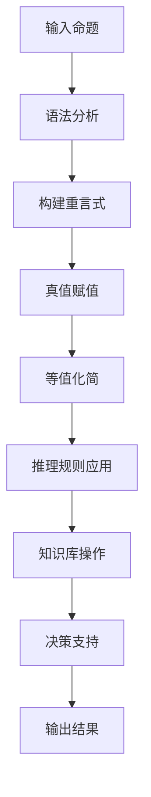

# 数理逻辑：应用重言式系统

## 1. 背景介绍

### 1.1 问题的由来

在计算机科学和人工智能领域中,推理和决策过程是核心问题之一。传统的命令式编程范式往往难以有效地处理复杂的逻辑推理问题。因此,需要一种更加灵活和表达力强的方法来表示和操作知识。重言式系统(Propositional Logic)作为一种形式化的知识表示和推理系统,为解决这一问题提供了有力的支持。

### 1.2 研究现状

重言式系统的理论基础可以追溯到古希腊时期,当时的逻辑学家们开始探索命题逻辑的基本概念和推理规则。在20世纪初,数理逻辑学家如弗雷格(Gottlob Frege)和罗素(Bertrand Russell)等人对命题逻辑进行了系统化的研究,为现代重言式系统奠定了坚实的理论基础。

随着计算机科学的发展,重言式系统在人工智能、自动推理、知识表示等领域得到了广泛应用。许多经典的人工智能系统,如专家系统、规划系统和决策支持系统,都依赖于重言式系统来表示和推理知识。

### 1.3 研究意义

重言式系统具有以下重要意义:

1. **知识表示**: 重言式系统提供了一种形式化的方法来表示和组织知识,使得知识可以被计算机系统理解和操作。

2. **推理能力**: 重言式系统具有强大的推理能力,可以从已知的命题推导出新的命题,支持复杂的逻辑推理过程。

3. **决策支持**: 基于重言式系统的推理,可以为人工智能系统提供决策支持,帮助系统做出合理的决策。

4. **可解释性**: 重言式系统的推理过程具有可解释性,可以追溯推理链路,了解决策的依据和原因。

5. **理论基础**: 重言式系统为人工智能和自动推理等领域提供了坚实的理论基础,促进了这些领域的发展。

### 1.4 本文结构

本文将全面介绍重言式系统的核心概念、算法原理、数学模型、实际应用以及未来发展趋势。文章结构如下:

- 第2部分介绍重言式系统的核心概念和与其他逻辑系统的联系。
- 第3部分详细阐述重言式系统的核心算法原理和具体操作步骤。
- 第4部分构建重言式系统的数学模型,推导公式并举例说明。
- 第5部分提供代码实例,详细解释重言式系统的实现细节。
- 第6部分探讨重言式系统在各个领域的实际应用场景。
- 第7部分推荐相关的学习资源、开发工具和论文。
- 第8部分总结研究成果,展望未来发展趋势和面临的挑战。
- 第9部分列出常见问题并给出解答。

## 2. 核心概念与联系

重言式系统(Propositional Logic)是一种形式化的知识表示和推理系统,它基于命题(Proposition)和逻辑运算符(Logical Operators)构建。命题是一个可以判断为真或假的陈述句,而逻辑运算符则用于连接和操作这些命题。

重言式系统的核心概念包括:

1. **命题(Proposition)**: 一个可以判断为真或假的陈述句,通常用大写字母(如P、Q、R)表示。

2. **逻辑常量(Logical Constants)**: 表示永真(True,用T表示)和永假(False,用F表示)的特殊命题。

3. **逻辑运算符(Logical Operators)**: 用于连接和操作命题的运算符,包括:
   - 合取(Conjunction,∧): P∧Q表示"P且Q"
   - 析取(Disjunction,∨): P∨Q表示"P或Q"
   - 蕴含(Implication,→): P→Q表示"如果P,那么Q"
   - 等价(Equivalence,↔): P↔Q表示"P当且仅当Q"
   - 否定(Negation,¬): ¬P表示"非P"

4. **重言式(Well-Formed Formula,WFF)**: 按照一定规则正确构造的命题表达式,是重言式系统的基本单位。

5. **语义(Semantics)**: 通过真值赋值(Truth Assignment)来确定重言式的真假值。

6. **推理规则(Inference Rules)**: 用于从已知的重言式推导出新的重言式的规则,如穷举法(Truth Table)、归谬法(Proof by Contradiction)等。

7. **知识库(Knowledge Base)**: 一组已知为真的重言式的集合,代表着系统所拥有的知识。

重言式系统与其他逻辑系统的联系:

- **一阶逻辑(First-Order Logic)**: 一阶逻辑在重言式系统的基础上引入了变元、函数和量词,具有更强的表达能力。
- **模态逻辑(Modal Logic)**: 模态逻辑扩展了重言式系统,引入了可能性和必然性等模态运算符,用于推理涉及可能世界的命题。
- **缺省逻辑(Default Logic)**: 缺省逻辑是一种非单调逻辑,用于处理具有例外情况的推理问题,常与重言式系统结合使用。
- **模糊逻辑(Fuzzy Logic)**: 模糊逻辑允许命题的真值在[0,1]区间内取值,用于处理不确定性和模糊性问题。

重言式系统作为最基础的逻辑系统,为其他更复杂的逻辑系统奠定了理论基础,并在许多领域发挥着重要作用。

## 3. 核心算法原理 & 具体操作步骤

### 3.1 算法原理概述

重言式系统的核心算法原理包括:

1. **语法分析(Syntactic Analysis)**: 将自然语言命题转换为形式化的重言式表达式。

2. **真值赋值(Truth Assignment)**: 根据语义规则,为每个原子命题赋予真值(真或假),从而确定复合命题的真值。

3. **等值化简(Equivalence Simplification)**: 利用逻辑等值规则(如交换律、结合律等)化简重言式,使其更加简洁。

4. **推理规则(Inference Rules)**: 应用推理规则(如穷举法、归谬法等)从已知的重言式推导出新的重言式。

5. **知识库操作(Knowledge Base Operations)**: 对知识库进行修改(添加、删除、修订)并维护其一致性。

6. **决策支持(Decision Support)**: 基于推理结果,为人工智能系统提供决策支持。

这些核心算法原理相互关联,共同构成了重言式系统的推理和决策框架。

### 3.2 算法步骤详解

以下是重言式系统算法的具体操作步骤:

1. **输入命题**: 接收自然语言形式的命题作为输入。

2. **语法分析**: 将自然语言命题转换为形式化的重言式表达式,包括识别原子命题、逻辑运算符等。

3. **构建重言式**: 根据语法规则,构建正确的重言式表达式。

4. **真值赋值**: 为每个原子命题赋予真值(真或假),并根据语义规则计算复合命题的真值。

5. **等值化简**: 利用逻辑等值规则(如交换律、结合律等)化简重言式,使其更加简洁。

6. **推理规则应用**: 应用推理规则(如穷举法、归谬法等)从已知的重言式推导出新的重言式。

7. **知识库操作**: 将推导出的新重言式添加到知识库中,或者从知识库中删除/修订已有的重言式,并维护知识库的一致性。

8. **决策支持**: 基于推理结果和知识库,为人工智能系统提供决策支持,如规划、诊断、预测等。

9. **输出结果**: 将决策结果或推理结论输出。

### 3.3 算法优缺点

重言式系统算法的优点包括:

- **形式化**: 能够将自然语言命题转换为形式化的逻辑表达式,便于计算机处理。
- **推理能力**: 具有强大的推理能力,可以从已知的命题推导出新的命题。
- **可解释性**: 推理过程具有可解释性,可以追溯推理链路,了解决策的依据和原因。
- **知识库支持**: 支持构建和维护知识库,可以累积和共享知识。

但同时也存在一些缺点:

- **表达能力有限**: 重言式系统只能表示简单的命题,无法表达涉及变元、函数和量词的复杂知识。
- **组合爆炸**: 随着命题数量的增加,推理过程的计算复杂度会快速增长,导致组合爆炸问题。
- **缺乏不确定性处理**: 重言式系统只能处理确定的真值,无法很好地处理不确定性和模糊性问题。
- **缺乏上下文理解**: 重言式系统缺乏对上下文和背景知识的理解能力,难以处理一些需要常识推理的问题。

### 3.4 算法应用领域

重言式系统算法在以下领域有广泛的应用:

- **人工智能**: 作为知识表示和推理的基础,重言式系统被广泛应用于专家系统、规划系统、决策支持系统等人工智能领域。

- **硬件设计**: 在数字电路设计和验证过程中,重言式系统可用于建模和推理,确保电路设计的正确性。

- **软件工程**: 在软件需求分析、模型检查和形式化验证等过程中,重言式系统可以帮助发现潜在的错误和缺陷。

- **自动推理**: 重言式系统是自动推理系统的核心,用于推导新的结论和检验推理的有效性。

- **机器学习**: 在一些基于规则的机器学习算法中,重言式系统可用于表示和推理规则。

- **密码学**: 重言式系统在密码学中有应用,可用于建模和分析密码系统的安全性。

- **游戏AI**: 在棋类游戏等领域,重言式系统可用于表示游戏规则并进行推理,指导AI系统做出合理的决策。

总的来说,重言式系统算法为广泛的领域提供了基础的知识表示和推理能力,是人工智能和自动推理系统不可或缺的一部分。

## 4. 数学模型和公式 & 详细讲解 & 举例说明

### 4.1 数学模型构建

重言式系统的数学模型基于集合论和布尔代数。我们首先定义重言式系统的语法和语义:

**语法定义**:

- 原子命题(Atomic Proposition)的集合为$\mathcal{P} = \{p, q, r, \ldots\}$
- 逻辑运算符集合为$\mathcal{O} = \{\neg, \wedge, \vee, \rightarrow, \leftrightarrow\}$
- 重言式(Well-Formed Formula,WFF)的集合$\mathcal{WFF}$由以下规则递归定义:
  - 每个原子命题$p \in \mathcal{P}$都是重言式
  - 如果$\alpha$是重言式,那么$\neg\alpha$也是重言式
  - 如果$\alpha$和$\beta$都是重言式,那么$(\alpha \wedge \beta)$、$(\alpha \vee \beta)$、$(\alpha \rightarrow \beta)$和$(\alpha \leftrightarrow \beta)$也都是重言式

**语义定义**:

- 真值赋值(Truth Assignment)函数$v: \mathcal{P} \rightarrow \{0, 1\}$将每个原子命题映射到真值0(假)或1(真)
- 对于复合命题,真值由以下规则递归定义:
  - $v(\neg\alpha) = 1 - v(\alpha)$
  - $v(\alpha \wedge \beta) = \min(v(\alpha), v(\beta))$
  - $v(\alpha \vee \beta) = \max(v(\alpha), v(\beta))$
  - $v(\alpha \rightarrow \beta) = \max(1 - v(\alpha), v(\beta