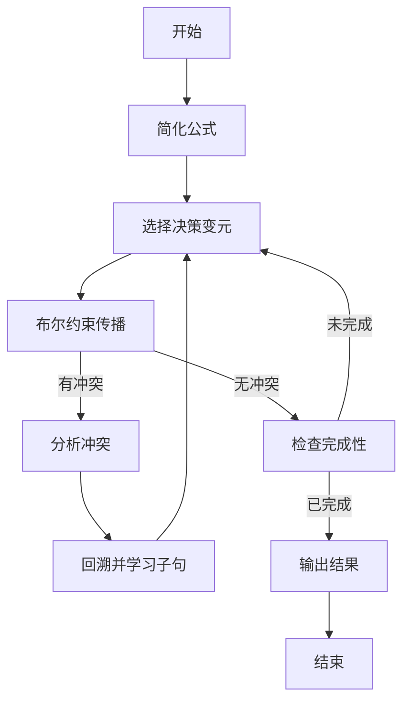

# 数理逻辑：恒真性和可真性

## 1. 背景介绍

### 1.1 问题的由来

在计算机科学和数学领域中，逻辑推理是一个基础且重要的概念。逻辑推理是指根据一组已知的前提或公理,通过推理规则得出新的结论。在这个过程中,我们需要评估给定命题的真实性,即判断命题在所有可能的情况下是否都为真。这就引出了两个关键概念:恒真性(tautology)和可真性(satisfiability)。

恒真性是指一个命题在任何情况下都为真,而可真性则是指一个命题在某些情况下为真。这两个概念在许多领域都有重要应用,例如自动定理证明、约束求解、硬件设计验证、人工智能规划等。因此,研究恒真性和可真性问题,不仅具有理论意义,而且对实际应用也有重要价值。

### 1.2 研究现状

恒真性和可真性问题一直是逻辑和计算机科学研究的热点课题。早期,逻辑学家如弗雷格(Frege)、罗素(Russell)和希尔伯特(Hilbert)等人为这一领域奠定了坚实的理论基础。20世纪30年代,哥德尔(Gödel)的不完备性定理进一步揭示了这一问题的深层复杂性。

随着计算机的发展,恒真性和可真性问题也受到了计算机科学家的广泛关注。库克(Cook)证明了可满足性问题(SAT)是NP完全的,这为研究恒真性和可真性问题提供了新的视角。自20世纪70年代以来,SAT求解算法的研究取得了长足进展,推动了这一领域的快速发展。

当前,恒真性和可真性问题的研究主要集中在以下几个方面:高效的SAT/QBF求解算法、SMT(满足模理论)求解、自动定理证明系统、知识表示与推理等。这些研究不仅拓展了理论深度,也为实际应用提供了有力支持。

### 1.3 研究意义

研究恒真性和可真性问题具有重要的理论意义和应用价值:

- 理论意义:
  - 深化对逻辑推理、计算复杂性理论的理解
  - 推动自动定理证明、约束求解等相关领域的发展
  - 为人工智能、知识表示与推理等提供坚实的理论基础

- 应用价值:
  - 硬件设计验证:验证数字电路的正确性
  - 软件验证:检查程序的正确性和安全性
  - 规划与决策:在人工智能规划中求解约束问题
  - 组合优化:解决组合优化问题,如作业调度、旅行商问题等
  - 密码学:设计和分析密码系统的安全性

总之,恒真性和可真性问题不仅是计算机科学和数学的基础课题,而且在诸多应用领域都有广泛的意义和价值。

### 1.4 本文结构

本文将全面介绍恒真性和可真性问题的相关理论和技术。具体来说,第2部分将阐述核心概念及其内在联系;第3部分将详细解释核心算法的原理和具体步骤;第4部分将构建数学模型,并推导和讲解相关公式;第5部分将通过项目实践展示代码实现;第6部分将介绍实际应用场景;第7部分将推荐相关工具和学习资源;最后第8部分将总结研究成果,并展望未来发展趋势和挑战。

## 2. 核心概念与联系

在深入探讨恒真性和可真性问题之前,我们先介绍一些核心概念。

**命题逻辑(Propositional Logic)**是研究命题之间逻辑联系的一门学科。在命题逻辑中,我们使用命题变元(如p、q、r等)来表示命题,并通过逻辑连接词(如¬、∧、∨、→、↔等)构造复合命题。一个命题要么为真,要么为假,不存在第三种情况。

**真值赋值(Truth Assignment)**是指为每个命题变元赋予真值(真或假)。真值赋值的组合就形成了一个**真值指派(Truth Valuation)**,它为整个命题赋予一个确定的真值。

**语句(Statement)**或**公式(Formula)**是指由命题变元及逻辑连接词构成的复合命题。我们通常使用大写字母(如F、G、H等)来表示语句。

**恒真式(Tautology)**是指在任何真值指派下都为真的语句。换言之,不存在使该语句为假的真值赋值。

**可满足式(Satisfiable Formula)**是指存在某些真值指派使该语句为真的语句。

**矛盾式(Unsatisfiable Formula)**是指在任何真值指派下都为假的语句,它是可满足式的补集。

**有效推理(Valid Inference)**是指前提为真时,结论必为真的推理。

**NP问题**是指在确定性多项式时间内可以验证候选解是正确的,但求解过程的计算复杂度不是多项式级别的问题。

**NP完全问题**是NP问题中最困难的一类问题,任何一个NP问题都可以在多项式时间内化简为NP完全问题的一个实例。

**可满足性问题(SAT)**就是判断一个给定的命题逻辑语句是否为可满足式的NP完全问题。SAT问题及其推广(如QBF、SMT等)是研究恒真性和可真性问题的核心。

这些概念相互关联、环环相扣。理解它们之间的内在联系,是把握恒真性和可真性问题的关键所在。

## 3. 核心算法原理 & 具体操作步骤

### 3.1 算法原理概述

判断一个命题逻辑语句是恒真式还是可满足式,是研究恒真性和可真性问题的核心任务。这可以通过系统地枚举所有可能的真值指派来解决,但这种暴力方法在语句变元数量较大时将变得非常低效。

为了更有效地解决这一问题,研究人员提出了多种算法,包括基于真值表的算法、分解算法、DPLL算法及其改进版本、冲突驱动学习算法等。这些算法的核心思想是:通过逻辑推理和搜索剪枝,避免枚举所有真值指派,从而提高求解效率。

其中,DPLL算法及其改进版本(如CDCL算法)是当前最流行和有效的SAT/QBF求解算法。它们基于单步单项式规则和单步子句规则,通过系统搜索和无效支配剪枝等策略,以渐进式的方式求解问题。这些算法在理论和实践中都取得了卓越的成就。

### 3.2 算法步骤详解

以CDCL(Conflict-Driven Clause Learning,冲突驱动子句学习)算法为例,它的主要步骤如下:

1. **简化公式**:通过常量传播、单位传播等规则,简化原始公式。

2. **选择决策变元**:如果公式为空子句,则返回不可满足;如果公式为空,则返回可满足。否则,根据预先设定的启发式函数(如VSIDS),选择一个未赋值的变元作为决策变元。

3. **布尔约束传播(BCP)**:基于单步单项式规则和单步子句规则,对决策变元及其影响的变元执行单项式消去和子句规则化,获得一系列单位子句。通过这种单项式消去和规则化步骤,可以推导出更多的逻辑结果。

4. **检查完成性**:如果所有变元都被赋值且不存在冲突子句,则找到一个可满足的真值指派,算法终止并输出结果。否则,继续下一步。

5. **分析冲突**:当存在冲突子句时,通过冲突分析过程确定冲突的原因。该过程将构建一个冲突图,并找到一个可学习的新子句。

6. **回溯并学习子句**:撤销部分赋值直到达到冲突的前提,并将新学习的子句加入公式中,回到步骤2继续求解。

该算法通过不断的搜索、回溯和学习,最终可以确定公式是可满足式还是矛盾式。算法的性能很大程度上取决于决策变元选择、无效支配剪枝、重启策略等启发式技术。

### 3.3 算法优缺点

CDCL算法具有以下优点:

- 高效性:通过逻辑推理和无效支配剪枝,避免枚举所有真值指派,大幅提高求解效率。
- 通用性:可以处理一般的SAT/QBF问题,而不局限于特定结构的公式。
- 可扩展性:可以通过集成理论推理组件,扩展到SMT求解器。
- 可学习性:通过冲突分析和子句学习,可以积累有价值的约束知识,指导后续搜索。

但它也存在一些缺点:

- 最坏情况的指数时间复杂度:在一些病态实例上,算法的性能将急剧下降。
- 高内存占用:由于需要维护大量的约束和学习的子句,内存开销较大。
- 参数敏感性:算法的性能很大程度上依赖于决策变元选择、重启策略等启发式参数的设置。

因此,虽然CDCL算法是目前最成功的SAT/QBF求解器,但改进其健壮性、降低内存占用、自动调参等仍是当前的研究热点。

### 3.4 算法应用领域

CDCL算法及其变体在诸多领域都有广泛应用:

- **硬件设计验证**:验证数字电路、处理器等硬件系统的正确性。
- **软件验证**:检查程序的正确性、安全性,以及并发程序的一致性等。
- **组合优化**:求解作业调度、旅行商问题等经典的组合优化问题。
- **人工智能规划**:在自动规划系统中求解约束满足问题。
- **形式化验证**:用于验证安全关键系统(如航空系统)的正确性。
- **密码学**:分析和评估密码系统的安全性。

可以看出,CDCL算法在计算机科学和数学的多个领域都有重要应用,成为解决NP难问题的有力工具。

## 4. 数学模型和公式 & 详细讲解 & 举例说明

### 4.1 数学模型构建

为了形式化描述恒真性和可真性问题,我们需要构建相应的数学模型。我们将使用**命题逻辑**作为基础,并引入必要的数学概念和符号。

首先,给定一个命题逻辑语句$F$,我们可以将其视为一个**布尔函数**:

$$
F: \mathcal{B}^n \rightarrow \mathcal{B}
$$

其中,$\mathcal{B} = \{0, 1\}$表示布尔域,$n$是语句$F$中的变元个数。

每个真值指派$\boldsymbol{x} = (x_1, x_2, \ldots, x_n) \in \mathcal{B}^n$对应着一种可能的输入情况,而$F(\boldsymbol{x})$给出了在该输入下语句$F$的真值(0表示假,1表示真)。

因此,判断一个语句$F$是否为恒真式,等价于检查其对应的布尔函数$F$是否满足:

$$
\forall \boldsymbol{x} \in \mathcal{B}^n, F(\boldsymbol{x}) = 1
$$

类似地,判断$F$是否为可满足式,等价于检查是否存在某个$\boldsymbol{x}$使得$F(\boldsymbol{x}) = 1$,即:

$$
\exists \boldsymbol{x} \in \mathcal{B}^n, F(\boldsymbol{x}) = 1
$$

通过这种数学表示,我们可以借助离散数学、布尔代数等理论,对恒真性和可真性问题