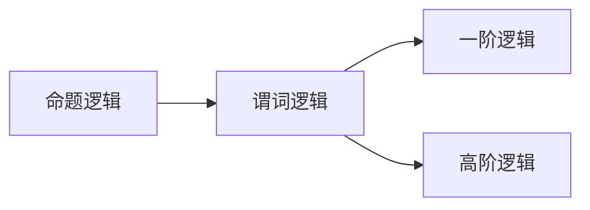
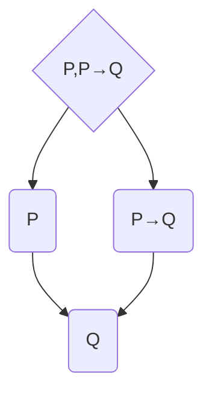
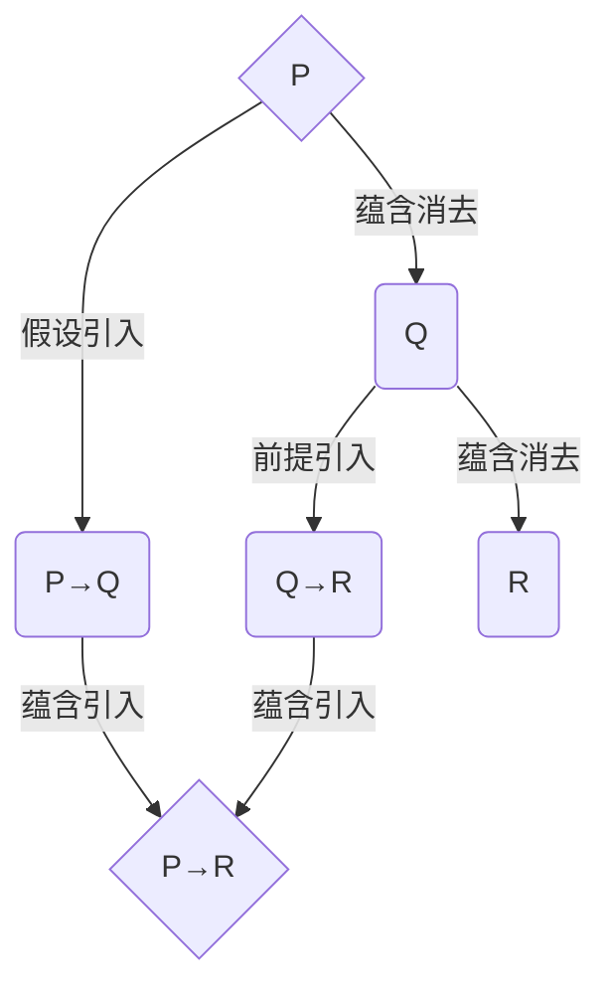

# 数理逻辑：第一章演绎逻辑的基本规则

关键词：数理逻辑, 演绎逻辑, 命题逻辑, 谓词逻辑, 自然演绎, 公理系统, 逻辑推理

## 1. 背景介绍
### 1.1  问题的由来
数理逻辑是数学与逻辑学相结合的产物,它以严谨的数学方法研究逻辑推理的规律。数理逻辑的发展可以追溯到古希腊时期亚里士多德的三段论,他首次系统地总结了推理的基本规则。后来莱布尼茨提出用符号语言表示概念,用计算规则来推理,为数理逻辑的诞生奠定了基础。19世纪布尔、德摩根等人创立了符号逻辑,把逻辑学数学化。直到20世纪,由于罗素、哥德尔、图灵等人的开创性工作,数理逻辑才真正成为一门独立学科。

### 1.2  研究现状
当前,数理逻辑已经成为计算机科学、人工智能等领域的重要理论基础。在计算机领域,命题逻辑和一阶逻辑被广泛应用于程序验证、自动定理证明、知识表示与推理等。近年来,随着深度学习等人工智能技术的发展,高阶逻辑、模态逻辑、模糊逻辑等逻辑系统也开始受到关注。同时,研究者们也在不断探索将数理逻辑与概率论、范畴论等数学分支相结合,拓展其应用范围。

### 1.3  研究意义
数理逻辑为计算机科学提供了坚实的理论基础。深入理解和掌握数理逻辑的基本概念和推理规则,对于设计高质量的程序、构建智能推理系统至关重要。同时,研究数理逻辑的发展脉络和前沿动态,也有助于我们把握人工智能领域的发展趋势。此外,学习数理逻辑还能培养严谨缜密的逻辑思维能力,这是从事科研和工程工作所必备的素质。

### 1.4  本文结构
本文将重点介绍数理逻辑中的演绎逻辑部分。第2节介绍命题逻辑和谓词逻辑的基本概念。第3节讲解自然演绎系统的推理规则。第4节给出演绎逻辑的数学定义和例题分析。第5节演示如何用Prolog语言实现谓词逻辑的推理。第6节讨论演绎逻辑在人工智能中的应用。第7节推荐相关学习资源。第8节总结全文并展望演绎逻辑的发展前景。

## 2. 核心概念与联系
演绎逻辑是数理逻辑的一个重要分支,它研究有效的推理模式,旨在用最简洁的公理和规则来刻画日常推理。根据表达能力的不同,演绎逻辑可分为命题逻辑和谓词逻辑(一阶逻辑)两大类。

命题逻辑是研究命题之间逻辑联结词(如"非"、"或"、"且"、"蕴含"等)的逻辑系统。命题逻辑中最基本的元素是"命题",它表示一个陈述句,可以判断真假,但不考虑内部结构。在命题逻辑中,任何复杂的命题都可以由原子命题和逻辑联结词构成。命题逻辑的主要局限是无法刻画命题内部的结构,如主语和谓语等。

谓词逻辑在命题逻辑的基础上引入了"个体词"、"谓词"和"量词"等概念,大大增强了表达能力。谓词逻辑中的基本元素是"个体词"(常量和变元)和"谓词",个体词表示个体对象,谓词表示个体的性质或关系。谓词逻辑还引入了全称量词$\forall$和存在量词$\exists$,可以表达"任意"和"存在"的概念。一阶逻辑中的公式由有限个原子公式和逻辑联结词构成,原子公式可以是谓词后跟个体词,表示个体满足某种性质或关系。

命题逻辑和谓词逻辑的关系如下图所示:

## 3. 核心算法原理 & 具体操作步骤
### 3.1  算法原理概述
演绎逻辑的推理通常采用"自然演绎"(Natural Deduction)的方法。自然演绎系统由一组推理规则组成,每条规则都给出了如何从已知前提推出结论的模式。使用自然演绎系统进行推理,就是反复使用规则,直到推导出待证明的结论。

### 3.2  算法步骤详解
以命题逻辑的自然演绎系统为例,主要有以下十条推理规则:

1. 前提引入(Premise)：$P\vdash P$
2. 假设引入(Hypothesis)：要证明$P\to Q$,可假设$P$,在此基础上推出$Q$
3. 合取引入(Conjunction Introduction)：$P,Q\vdash P\land Q$
4. 合取消去(Conjunction Elimination)：$P\land Q\vdash P$, $P\land Q\vdash Q$
5. 析取引入(Disjunction Introduction)：$P\vdash P\lor Q$, $Q\vdash P\lor Q$
6. 析取消去(Disjunction Elimination)：$P\lor Q,P\to R,Q\to R\vdash R$
7. 蕴含引入(Implication Introduction)：由$P\vdash Q$可得$\vdash P\to Q$
8. 蕴含消去(Implication Elimination / Modus ponens)：$P,P\to Q\vdash Q$
9. 否定引入(Negation Introduction)：由$P\vdash Q$且$P\vdash\lnot Q$可得$\vdash\lnot P$
10. 否定消去(Negation Elimination)：$\lnot\lnot P\vdash P$

其中$P,Q,R$表示任意命题，$\vdash$表示可推出的关系。

使用这些规则进行推理的一般步骤是:

1. 写出已知的前提命题
2. 根据推理目标,适当使用假设引入
3. 逐步使用规则,将前提和假设转化为目标结论
4. 如果使用了假设引入,则需要使用蕴含引入消除假设
5. 重复上述步骤,直到推导出目标命题

### 3.3  算法优缺点
自然演绎系统的优点是规则简单,容易理解和使用,且推理过程直观,接近人的思维方式。但其缺点是推理效率较低,难以应对大规模、复杂的推理任务。在实际应用中,往往需要结合其他优化技术,如子句归结等。

### 3.4  算法应用领域
自然演绎系统是研究演绎逻辑的基础,在程序验证、定理证明、知识推理等领域有广泛应用。许多定理证明器如Coq、Isabelle等都是基于自然演绎系统构建的。在人工智能领域,自然演绎也是构建专家系统、问答系统等的重要工具。

## 4. 数学模型和公式 & 详细讲解 & 举例说明
### 4.1  数学模型构建
演绎逻辑的语法和语义可以用数学模型精确定义。以命题逻辑为例,其语法可定义为:

- 命题变元: $P_0,P_1,P_2,\dots$
- 逻辑联结词:$\lnot,\land,\lor,\to$  
- 合式公式:
  - 每个命题变元都是合式公式
  - 若$\varphi$是合式公式,则$\lnot\varphi$也是合式公式
  - 若$\varphi,\psi$是合式公式,则$(\varphi\land\psi)$,$(\varphi\lor\psi)$,$(\varphi\to\psi)$也是合式公式

命题逻辑的语义定义了每个公式在解释下的真值。设$I$为命题变元到$\{0,1\}$的映射,称为解释,则$I$可以扩展为合式公式的真值函数:

- $I(P_i)=I(P_i)$
- $I(\lnot\varphi)=1-I(\varphi)$
- $I(\varphi\land\psi)=\min(I(\varphi),I(\psi))$
- $I(\varphi\lor\psi)=\max(I(\varphi),I(\psi))$ 
- $I(\varphi\to\psi)=\max(1-I(\varphi),I(\psi))$

若在解释$I$下$I(\varphi)=1$,则称$I$是$\varphi$的模型,记为$I\vDash\varphi$。若$\varphi$在所有解释下都为真,则称$\varphi$是有效的,记为$\vDash\varphi$。

给定一个公式集$\Gamma$和一个公式$\varphi$,若对于任意解释$I$,只要$I$是$\Gamma$中每个公式的模型,则$I$也是$\varphi$的模型,那么称$\varphi$是$\Gamma$的逻辑结果,记为$\Gamma\vDash\varphi$。

### 4.2  公式推导过程
基于上述定义,可以将前面介绍的自然演绎规则形式化地表示为公式之间的推导关系。例如,蕴含消去规则可以写作:

$$\frac{\Gamma\vdash \varphi\quad \Gamma\vdash \varphi\to\psi}{\Gamma\vdash \psi}$$

其中$\Gamma$表示前提公式集,$\varphi,\psi$表示具体的命题公式。这条规则表示,如果从$\Gamma$可以推导出$\varphi$和$\varphi\to\psi$,那么也可以推导出$\psi$。

使用自然演绎规则进行推导的过程可以形式化为一棵推导树,树的节点是公式,边表示推导关系,如下图所示:

### 4.3  案例分析与讲解
下面我们以一个具体的例子来说明如何使用自然演绎系统进行推理。

例:已知$P\to Q,Q\to R$,证明:$P\to R$。

证明过程如下:

1. 假设引入:为证$P\to R$,假设$P$成立
2. 前提引入:引入已知前提$P\to Q$
3. 蕴含消去:由1和2,推出$Q$
4. 前提引入:引入已知前提$Q\to R$
5. 蕴含消去:由3和4,推出$R$
6. 蕴含引入:由1-5,在假设$P$的条件下推出$R$成立,故证毕

用推导树表示如下:

### 4.4  常见问题解答
问:命题逻辑和谓词逻辑有何区别和联系?
答:命题逻辑是谓词逻辑的特例,只研究命题之间的逻辑关系,无法表达命题内部结构。谓词逻辑在命题逻辑基础上引入个体词、谓词、量词等概念,大大增强了表达能力,可以刻画客观世界中的对象及其性质与关系。

问:自然演绎系统是否是可靠、完备的?
答:可以证明,命题逻辑和一阶逻辑的自然演绎系统都是可靠和完备的。可靠性是指,凡是在系统中可以推导出的结论,在语义上都是正确的,即:若$\Gamma\vdash\varphi$,则$\Gamma\vDash\varphi$。完备性是指,凡是在语义上正确的结论,都可以在系统中推导出来,即:若$\Gamma\vDash\varphi$,则$\Gamma\vdash\varphi$。

## 5. 项目实践：代码实例和详细解释说明
### 5