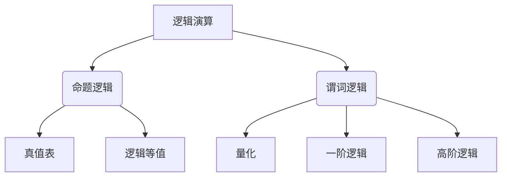

# 数理逻辑：逻辑演算（二）

## 1. 背景介绍

### 1.1 问题的由来

逻辑是一门研究推理规律和推理方法的学科。在数学、计算机科学、人工智能等领域中,逻辑演算扮演着至关重要的角色。随着科技的不断发展,逻辑演算的应用范围也在不断扩大,例如在程序验证、自动推理、知识表示和推理等领域都有着广泛的应用。

### 1.2 研究现状

逻辑演算是一个古老而又充满活力的研究领域。自古希腊时期开始,逻辑学就一直是哲学家们探讨的热门话题。19世纪,数理逻辑学得到了飞速发展,布尔代数、谓词逻辑等理论被建立,为后续的计算机科学奠定了基础。20世纪,随着计算机的诞生,逻辑演算在计算机科学中的应用变得越来越广泛。

### 1.3 研究意义

掌握逻辑演算的理论和方法对于计算机科学家来说是必不可少的。逻辑演算不仅是构建正确的计算机程序的基础,也是人工智能、自动推理等领域的理论支柱。掌握逻辑演算有助于提高程序员的抽象思维能力,培养严谨的逻辑思维,从而编写出更加健壮、可靠的软件系统。

### 1.4 本文结构

本文将从逻辑演算的基本概念出发,深入探讨其核心算法原理、数学模型和公式,并结合实际项目实践,全面介绍逻辑演算的理论和应用。文章最后将对逻辑演算的未来发展趋势和挑战进行展望,为读者提供一个全面的认识。

## 2. 核心概念与联系

逻辑演算主要包括两大部分:命题逻辑和谓词逻辑。

命题逻辑研究的是命题之间的逻辑关系,通过真值表、逻辑等值等概念来描述和操作命题之间的逻辑联系。

谓词逻辑则在命题逻辑的基础上引入了量化的概念,可以处理更加复杂的逻辑关系。一阶逻辑和高阶逻辑都属于谓词逻辑的范畴,但处理的对象和复杂程度不同。

这两大部分概念相互关联,相辅相成,共同构成了逻辑演算的理论体系。掌握了这些核心概念,就能更好地理解和应用逻辑演算的方法。

## 3. 核心算法原理 & 具体操作步骤

### 3.1 算法原理概述

逻辑演算的核心算法主要包括:

1. 命题逻辑的真值表算法
2. 命题逻辑的等值推导算法
3. 一阶谓词逻辑的归结算法
4. 一阶谓词逻辑的分离算法

这些算法都是基于逻辑演算的基本原理和规则,通过一系列的推导步骤,来检验命题或谓词公式的可满足性、等值性等逻辑特征。

### 3.2 算法步骤详解

#### 3.2.1 真值表算法

真值表算法用于检验一个命题公式在不同真值赋值情况下的真假值。算法步骤如下:

1. 列出所有可能的真值赋值情况
2. 根据命题公式的结构,计算每种赋值情况下公式的真值
3. 根据真值表的结果,判断公式的可满足性

例如,对于公式 $p \land \neg q$,其真值表为:

$$
\begin{array}{c|c|c|c}
p & q & \neg q & p \land \neg q\\ \hline
T & T & F & F\\
T & F & T & T\\  
F & T & F & F\\
F & F & T & F
\end{array}
$$

可以看出,该公式在某些情况下为真,因此是可满足的。

#### 3.2.2 等值推导算法

等值推导算法用于判断两个命题公式是否为逻辑等值关系,算法步骤如下:

1. 构造两个公式的主合取范式(主析取范式)
2. 对范式进行化简
3. 比较两个范式是否相同,如果相同则为等值关系

例如,对于公式 $p \lor (q \land r)$ 和 $(p \lor q) \land (p \lor r)$,可以推导出它们都化简为 $p \lor (q \land r)$,因此是等值关系。

#### 3.2.3 归结算法

归结算法是一阶谓词逻辑中判断公式可满足性的重要算法,步骤如下:

1. 对公式进行消去步骤,消去所有存在量词
2. 对消去后的公式进行归结步骤,使用归结规则推导出矛盾子句
3. 如果推导出矛盾子句,则公式不可满足;否则可满足

例如,对于公式 $\forall x P(x) \rightarrow (\exists y Q(y) \land \forall z (P(z) \rightarrow R(y,z)))$,经过消去和归结步骤,可以推导出矛盾子句,因此该公式不可满足。

#### 3.2.4 分离算法

分离算法是判断一阶谓词公式是否为逻辑蕴含关系的经典算法,步骤如下:

1. 对前件公式进行消去步骤,得到无量词的子句集合 S
2. 对后件公式的否定进行消去步骤,得到无量词的子句集合 T
3. 对集合 S 和 T 进行分离推理,推导出矛盾子句
4. 如果推导出矛盾子句,则为逻辑蕴含关系;否则不为蕴含关系

例如,对于公式 $\forall x P(x) \models \exists x Q(x)$,经过分离算法的推导,可以发现它们不是逻辑蕴含关系。

### 3.3 算法优缺点

上述算法都有自己的优缺点:

- 真值表算法直观简单,但当命题公式过于复杂时,真值表会变得非常庞大,效率低下
- 等值推导算法可以快速判断两个公式是否等值,但需要对公式进行复杂的范式转换
- 归结算法和分离算法是处理一阶逻辑公式的有力工具,但在最坏情况下,它们的计算复杂度都是指数级的

因此,在实际应用中需要权衡算法的适用场景、效率和复杂度,选择合适的算法。

### 3.4 算法应用领域

逻辑演算的算法在多个领域都有着广泛的应用:

- 程序验证: 使用逻辑推理来验证程序的正确性
- 自动推理: 构建智能系统,模拟人类的推理过程
- 知识表示: 使用逻辑公式来表示和推理知识
- 数据库查询优化: 将查询语句转化为逻辑公式,使用等值推导等方法进行优化
- 定理证明: 使用逻辑推理的方法,对数学定理进行严格的证明

## 4. 数学模型和公式 & 详细讲解 & 举例说明

### 4.1 数学模型构建

逻辑演算的数学模型主要包括以下几个部分:

1. **语法模型**
   - 命题逻辑语法: $\phi ::= p \;|\; \neg\phi \;|\; \phi \land \phi \;|\; \phi \lor \phi \;|\; \phi \rightarrow \phi \;|\; \phi \leftrightarrow \phi$
   - 一阶谓词逻辑语法: $\phi ::= P(t_1,...,t_n) \;|\; \neg\phi \;|\; \phi \land \phi \;|\; \phi \lor \phi \;|\; \phi \rightarrow \phi \;|\; \phi \leftrightarrow \phi \;|\; \forall x \phi \;|\; \exists x \phi$

2. **语义模型**
   - 命题逻辑语义: 真值赋值、真值函数
   - 一阶谓词逻辑语义: 解释、模型

3. **推理规则**
   - 命题逻辑推理规则: 等值规则、推理规则
   - 一阶谓词逻辑推理规则: 消去规则、归结规则、分离规则

通过将逻辑公式形式化为语法模型,并赋予语义模型,我们就可以使用推理规则对公式进行操作和推导。这些数学模型为逻辑演算提供了坚实的理论基础。

### 4.2 公式推导过程

以一阶谓词逻辑的归结算法为例,公式推导的过程如下:

1. 对公式进行消去步骤,使用消去规则将存在量词消去,得到无量词的子句集合 S
2. 对集合 S 中的每一个子句,使用归结规则与其他子句进行归结,产生新的子句
3. 将新产生的子句加入集合 S,重复第 2 步,直到推导出矛盾子句或无法再产生新子句为止
4. 如果推导出矛盾子句,则公式不可满足;否则公式可满足

例如,对于公式 $\forall x \exists y (P(x,y) \lor \neg Q(x)) \land \forall x \neg P(x,f(x))$,其推导过程为:

1. 消去步骤: $\{P(x,y) \lor \neg Q(x), \neg P(x,f(x))\}$
2. 归结步骤:
   - $P(x,y) \lor \neg Q(x), \neg P(x,f(x)) \leadsto \neg Q(x)$
   - 由于推导出矛盾子句 $\neg Q(x)$,因此原公式不可满足

可以看出,通过严格按照推理规则进行逐步推导,我们可以得出公式的可满足性结论。

### 4.3 案例分析与讲解

现在让我们通过一个实际案例,来进一步理解逻辑演算的应用。

假设我们有一个家庭智能系统,它需要根据一些前提条件来判断是否应该打开空调。前提条件如下:

1. 如果室内温度高于 28 摄氏度,则应该打开空调
2. 如果天气炎热且室内温度高于 25 摄氏度,则应该打开空调
3. 如果室外温度低于 20 摄氏度,则不应该打开空调

我们可以使用一阶谓词逻辑来表示这些条件:

- 命题:
  - $H(x)$: 室内温度为 $x$ 摄氏度
  - $O(y)$: 室外温度为 $y$ 摄氏度 
  - $W$: 天气炎热
  - $C$: 应该打开空调

- 前提条件公式:
  - $\forall x (H(x) \land x > 28 \rightarrow C)$
  - $\forall x \forall y (W \land H(x) \land x > 25 \rightarrow C)$ 
  - $\forall y (O(y) \land y < 20 \rightarrow \neg C)$

现在,假设我们得到以下信息:

- 室内温度为 30 摄氏度: $H(30)$
- 室外温度为 25 摄氏度: $O(25)$
- 天气炎热: $W$

我们需要判断在这种情况下,是否应该打开空调。

根据逻辑演算的推理规则,我们可以这样推导:

1. 由第一条前提可知: $H(30) \land 30 > 28 \rightarrow C$,根据前件成立,可以推出 $C$
2. 由第二条前提也可知: $W \land H(30) \land 30 > 25 \rightarrow C$,根据前件成立,也可以推出 $C$
3. 由第三条前提: $O(25) \land 25 \geq 20 \rightarrow \neg C$ 的前件不成立,因此不能推出 $\neg C$

综上所述,根据给定的前提条件和信息,我们可以推导出应该打开空调的结论 $C$。

通过这个例子,我们可以看到逻辑演算在实际问题中的应用。使用逻辑公式表示前提条件,再根据具体信息进行推理,