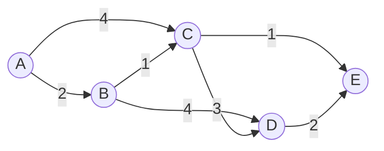

# 最短路径 原理与代码实例讲解

作者：禅与计算机程序设计艺术 / Zen and the Art of Computer Programming

## 1. 背景介绍

### 1.1 问题的由来

在现实生活中，我们经常会遇到寻找最短路径的问题，比如导航系统中寻找从起点到终点的最短路径，网络中寻找两个节点之间的最短路径等。最短路径问题是图论中的经典问题之一，在计算机科学、运筹学、地图导航等领域有着广泛的应用。

### 1.2 研究现状

目前，已经有许多算法被提出来解决最短路径问题，其中最著名的有 Dijkstra 算法、Floyd-Warshall 算法、Bellman-Ford 算法和 A* 搜索算法等。这些算法在不同的场景下有着不同的优缺点和适用范围。

### 1.3 研究意义

研究最短路径问题对于优化路径规划、提高网络传输效率、改善导航体验等方面都有重要意义。通过深入理解最短路径算法的原理，并将其应用到实际问题中，可以极大地提升系统的性能和用户体验。

### 1.4 本文结构

本文将从最短路径问题的核心概念出发，重点介绍 Dijkstra 算法的原理和代码实现。通过详细讲解算法的每一步骤，并给出具体的代码示例和注释说明，帮助读者深入理解 Dijkstra 算法的运作机制。同时，本文还将讨论 Dijkstra 算法的时间复杂度、优化技巧以及在实际场景中的应用。

## 2. 核心概念与联系

在讨论最短路径问题之前，我们需要先了解一些核心概念：

- 图（Graph）：由节点（Vertex）和边（Edge）组成的数据结构，用于表示节点之间的关系。
- 权重（Weight）：边上的数值，表示从一个节点到另一个节点的代价或距离。
- 最短路径：在带权图中，从起点到终点的所有路径中，权重和最小的路径。

最短路径问题就是在带权图中寻找从起点到终点的最短路径。Dijkstra 算法是解决单源最短路径问题的经典算法，其核心思想是贪心策略，每次选择距离起点最近的节点进行扩展，直到找到终点为止。

## 3. 核心算法原理 & 具体操作步骤

### 3.1 算法原理概述

Dijkstra 算法的基本思路如下：

1. 初始化起点的距离为 0，其他节点的距离为无穷大。
2. 将起点加入到已访问节点集合中。
3. 从未访问节点集合中选择距离起点最近的节点 u，将其加入到已访问节点集合中。
4. 更新节点 u 的相邻节点的距离，如果通过节点 u 到达相邻节点的距离更短，则更新相邻节点的距离。
5. 重复步骤 3 和步骤 4，直到所有节点都被访问或者找到终点为止。

### 3.2 算法步骤详解

下面我们通过一个具体的例子来详细说明 Dijkstra 算法的每一步操作。

考虑下图所示的带权有向图，我们要找到从节点 A 到其他节点的最短路径。



初始状态下，各节点的距离如下：

| 节点 | A   | B    | C    | D    | E    |
|------|-----|------|------|------|------|
| 距离 | 0   | ∞    | ∞    | ∞    | ∞    |

第一步，将起点 A 加入到已访问节点集合中，更新节点 B 和节点 C 的距离：

| 节点 | A   | B    | C    | D    | E    |
|------|-----|------|------|------|------|
| 距离 | 0   | 2    | 4    | ∞    | ∞    |

第二步，从未访问节点集合中选择距离最近的节点 B，将其加入到已访问节点集合中，更新节点 C 和节点 D 的距离：

| 节点 | A   | B   | C    | D    | E    |
|------|-----|-----|------|------|------|
| 距离 | 0   | 2   | 3    | 6    | ∞    |

第三步，从未访问节点集合中选择距离最近的节点 C，将其加入到已访问节点集合中，更新节点 D 和节点 E 的距离：

| 节点 | A   | B   | C   | D    | E    |
|------|-----|-----|-----|------|------|
| 距离 | 0   | 2   | 3   | 6    | 4    |

第四步，从未访问节点集合中选择距离最近的节点 E，将其加入到已访问节点集合中，更新节点 D 的距离：

| 节点 | A   | B   | C   | D    | E   |
|------|-----|-----|-----|------|-----|
| 距离 | 0   | 2   | 3   | 6    | 4   |

最后，从未访问节点集合中选择距离最近的节点 D，将其加入到已访问节点集合中。至此，所有节点都已被访问，算法结束。

最终得到的最短路径为：

- A -> A：0
- A -> B：2
- A -> C：3
- A -> D：6
- A -> E：4

### 3.3 算法优缺点

Dijkstra 算法的优点包括：

- 思路清晰，易于理解和实现。
- 能够保证找到最短路径（如果存在）。
- 在稀疏图上效率较高。

Dijkstra 算法的缺点包括：

- 时间复杂度较高，在最坏情况下为 $O(V^2)$，其中 $V$ 为节点数。
- 不能处理带负权边的图。
- 需要对所有节点进行遍历，即使并不需要知道所有节点的最短路径。

### 3.4 算法应用领域

Dijkstra 算法在许多领域都有广泛应用，例如：

- 路径规划：在地图导航中，Dijkstra 算法可以用于寻找两个地点之间的最短路径。
- 网络路由：在计算机网络中，Dijkstra 算法可以用于寻找网络中两个节点之间的最短路径，从而优化网络传输效率。
- 资源调度：在任务调度、资源分配等问题中，Dijkstra 算法可以用于寻找最优的调度方案。

## 4. 数学模型和公式 & 详细讲解 & 举例说明

### 4.1 数学模型构建

我们可以使用邻接矩阵或邻接表来表示带权图。以邻接矩阵为例，假设图有 $n$ 个节点，则邻接矩阵 $G$ 为一个 $n \times n$ 的方阵，其中 $G[i][j]$ 表示从节点 $i$ 到节点 $j$ 的边的权重，如果不存在从 $i$ 到 $j$ 的边，则 $G[i][j]=\infty$。

定义 $dist[i]$ 表示从起点到节点 $i$ 的最短距离，$visited[i]$ 表示节点 $i$ 是否已被访问。

### 4.2 公式推导过程

Dijkstra 算法的核心公式为：

$$
dist[v] = \min\{dist[v], dist[u]+G[u][v]\}
$$

其中，$u$ 为当前已访问节点集合中距离起点最近的节点，$v$ 为节点 $u$ 的相邻节点。

该公式表示，如果通过节点 $u$ 到达节点 $v$ 的距离 $dist[u]+G[u][v]$ 比当前已知的最短距离 $dist[v]$ 更小，则更新 $dist[v]$ 的值。

### 4.3 案例分析与讲解

以上文中的例子为例，我们来详细分析 Dijkstra 算法的执行过程。

初始状态下，$dist$ 数组和 $visited$ 数组的值如下：

| 节点 | A   | B    | C    | D    | E    |
|------|-----|------|------|------|------|
| dist | 0   | ∞    | ∞    | ∞    | ∞    |
| visited | false | false | false | false | false |

第一步，选择距离最近的节点 A，将其标记为已访问，更新节点 B 和节点 C 的距离：

| 节点 | A   | B    | C    | D    | E    |
|------|-----|------|------|------|------|
| dist | 0   | 2    | 4    | ∞    | ∞    |
| visited | true | false | false | false | false |

第二步，选择距离最近的未访问节点 B，将其标记为已访问，更新节点 C 和节点 D 的距离：

| 节点 | A   | B   | C    | D    | E    |
|------|-----|-----|------|------|------|
| dist | 0   | 2   | 3    | 6    | ∞    |
| visited | true | true | false | false | false |

依此类推，直到所有节点都被访问为止。

### 4.4 常见问题解答

1. 问：Dijkstra 算法能否处理负权边？
   答：不能。Dijkstra 算法要求所有边的权重都是非负的，否则可能会出现错误的结果。如果图中包含负权边，可以考虑使用 Bellman-Ford 算法或 Floyd-Warshall 算法。

2. 问：Dijkstra 算法的时间复杂度是多少？
   答：使用邻接矩阵表示图时，Dijkstra 算法的时间复杂度为 $O(V^2)$，其中 $V$ 为节点数。使用邻接表表示图并配合优先队列优化时，时间复杂度可以降低到 $O((V+E)\log V)$，其中 $E$ 为边数。

3. 问：Dijkstra 算法是否可以找到所有节点对之间的最短路径？
   答：不能。Dijkstra 算法是单源最短路径算法，只能找到从起点到其他节点的最短路径。如果要找到所有节点对之间的最短路径，可以考虑使用 Floyd-Warshall 算法。

## 5. 项目实践：代码实例和详细解释说明

### 5.1 开发环境搭建

本文使用 C++ 语言实现 Dijkstra 算法，读者需要准备以下开发环境：

- 操作系统：Windows、Linux 或 macOS
- 编译器：支持 C++11 标准的编译器，如 GCC、Clang 或 MSVC
- 编辑器或 IDE：任意文本编辑器或集成开发环境，如 Visual Studio、Dev-C++、Code::Blocks 等

### 5.2 源代码详细实现

下面给出 Dijkstra 算法的 C++ 实现代码：

```cpp
#include <iostream>
#include <vector>
#include <climits>

using namespace std;

void dijkstra(vector<vector<int>>& graph, int src) {
    int V = graph.size();
    vector<int> dist(V, INT_MAX);
    vector<bool> visited(V, false);

    dist[src] = 0;

    for (int count = 0; count < V - 1; ++count) {
        int u = -1;
        for (int v = 0; v < V; ++v) {
            if (!visited[v] && (u == -1 || dist[v] < dist[u])) {
                u = v;
            }
        }

        visited[u] = true;

        for (int v = 0; v < V; ++v) {
            if (!visited[v] && graph[u][v] != 0 && dist[u] != INT_MAX &&
                dist[u] + graph[u][v] < dist[v]) {
                dist[v] = dist[u] + graph[u][v];
            }
        }
    }

    cout << "Vertex\tDistance from Source" << endl;
    for (int i = 0; i < V; ++i) {
        cout << i << "\t" << dist[i] << endl;
    }
}

int main() {
    vector<vector<int>> graph = {
        {0, 2, 4, 0, 0},
        {2, 0, 1, 4, 0},
        {4, 1, 0, 3, 1},
        {0, 4, 3, 0, 2},
        {0, 0, 1, 2, 0}
    };

    dijkstra(graph, 0);

    return 0;
}
```

### 5.3 代码解读与分析

- 第 6-8 行：定义 `dijkstra` 函数，接受邻接矩阵 `graph` 和起点