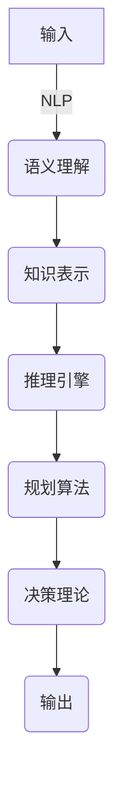

# 最重要的是理解输入给Agent的内容、进行推理、规划、做出准确决策

## 1. 背景介绍

### 1.1 问题的由来

在人工智能系统的发展过程中,我们面临着一个关键的挑战:如何确保系统能够准确理解和解释输入的信息,并基于此做出正确的决策和行动。这个问题的由来可以追溯到人工智能的本质——模拟人类的认知过程。人类在获取信息后,会对信息进行分析、推理和规划,最终做出相应的决策。同样,人工智能系统也需要具备这些能力,才能真正实现智能化。

### 1.2 研究现状  

目前,自然语言处理(NLP)和知识表示是人工智能领域的热门研究方向,旨在赋予系统理解和表达自然语言的能力。但是,仅仅理解语言还不够,系统还需要对获取的信息进行推理、规划和决策。一些研究人员提出了基于规则的方法,试图模拟人类的推理过程;另一些研究人员则采用机器学习方法,通过大量数据训练模型进行推理和决策。

### 1.3 研究意义

理解输入、推理和决策是人工智能系统的核心能力,对于实现真正的智能化至关重要。准确理解输入信息可以避免系统做出错误的决策,从而提高系统的可靠性和安全性。同时,良好的推理和规划能力也可以使系统做出更加合理和优化的决策,提高系统的效率和性能。

### 1.4 本文结构

本文将全面探讨如何赋予人工智能系统理解输入、推理和决策的能力。首先,我们将介绍相关的核心概念和原理;然后详细阐述推理和决策的算法原理,包括数学模型和公式推导;接着通过代码实例和应用场景,展示如何在实践中应用这些原理和算法;最后,我们将总结研究成果,并展望未来的发展趋势和挑战。

## 2. 核心概念与联系

理解输入、推理和决策涉及多个核心概念,包括自然语言处理(NLP)、知识表示、推理引擎、规划算法和决策理论等。这些概念之间存在着密切的联系和依赖关系。



1. **自然语言处理(NLP)**: 用于理解输入的自然语言,提取语义信息。
2. **知识表示**: 将提取的语义信息表示为计算机可理解的形式,如逻辑规则、语义网络等。
3. **推理引擎**: 基于知识表示,利用推理算法进行逻辑推理,得出新的知识或结论。
4. **规划算法**: 根据推理得到的知识,结合目标和约束条件,生成行动计划。
5. **决策理论**: 评估不同计划的效用,选择最优计划,并执行相应的行动。

这些概念和模块相互依赖、环环相扣,共同构建了一个完整的理解、推理和决策系统。

## 3. 核心算法原理 & 具体操作步骤

### 3.1 算法原理概述

推理和决策的核心算法原理包括:

1. **逻辑推理算法**: 基于一阶逻辑或其他形式的逻辑,从已知的事实和规则中推导出新的结论。常用算法有前向链接(Forward Chaining)、反向链接(Backward Chaining)等。

2. **概率推理算法**: 在存在不确定性时,利用概率论和贝叶斯推理等方法进行推理。常用算法有马尔可夫链蒙特卡罗(MCMC)、变分推理(Variational Inference)等。

3. **规划算法**: 根据当前状态、目标状态和约束条件,生成行动序列。常用算法有A*算法、STRIPS规划算法等。

4. **决策算法**: 评估不同行动序列的效用,选择最优序列。常用算法有马尔可夫决策过程(MDP)、强化学习算法等。

### 3.2 算法步骤详解

以一个简单的任务规划为例,具体步骤如下:

1. **输入处理**:利用NLP技术对输入的自然语言进行语义分析,提取出任务目标、初始状态和约束条件等信息。

2. **知识表示**:将提取的信息转换为计算机可理解的形式,如逻辑规则、语义网络等。

3. **推理**:基于知识表示,利用逻辑推理算法推导出新的知识和结论。例如,从已知的规则和状态中推导出可能的行动。

4. **规划**:利用规划算法,结合推理得到的知识、任务目标和约束条件,生成可行的行动序列。

5. **决策**:对生成的行动序列进行评估,利用决策算法选择最优序列。

6. **执行**:执行选定的行动序列,完成任务。

7. **反馈**:根据执行结果,更新知识库和算法模型,用于下一次迭代。

### 3.3 算法优缺点

上述算法具有以下优缺点:

**优点**:
- 能够利用已有的知识和规则进行推理,模拟人类的思维过程。
- 规划和决策算法可以生成最优的行动序列,提高系统的效率和性能。
- 概率推理算法能够处理不确定性,提高系统的鲁棒性。

**缺点**:
- 逻辑推理算法受限于知识库的完整性和一致性,难以处理复杂的现实场景。
- 规划和决策算法的计算复杂度较高,对于大规模问题可能无法在合理时间内得到解。
- 概率推理算法需要大量的训练数据,且推理过程通常是黑盒操作,缺乏可解释性。

### 3.4 算法应用领域

上述算法在多个领域都有广泛的应用:

- **智能助理**:理解用户的自然语言指令,进行推理和规划,执行相应的任务。
- **机器人控制**:根据环境信息和任务目标,规划机器人的行动路径。
- **自动驾驶**:感知道路信息,推理出车辆的运动状态,规划最优的行驶路线。
- **游戏AI**:根据游戏规则和当前局面,推理出最佳的策略和行动。
- **医疗诊断**:基于病人症状和医学知识库,推理出可能的病因并给出治疗方案。

## 4. 数学模型和公式 & 详细讲解 & 举例说明

### 4.1 数学模型构建

推理和决策算法通常需要构建数学模型来形式化问题。以马尔可夫决策过程(MDP)为例,它可以用一个五元组 $\langle S, A, P, R, \gamma \rangle$ 来表示:

- $S$ 是状态集合
- $A$ 是行动集合
- $P(s'|s,a)$ 是状态转移概率,表示在状态 $s$ 下执行行动 $a$ 后,转移到状态 $s'$ 的概率
- $R(s,a)$ 是即时奖励函数,表示在状态 $s$ 执行行动 $a$ 后获得的奖励
- $\gamma \in [0,1)$ 是折现因子,用于权衡即时奖励和长期奖励的重要性

目标是找到一个策略 $\pi: S \rightarrow A$,使得期望的累积奖励最大化:

$$
\max_\pi \mathbb{E}\left[ \sum_{t=0}^\infty \gamma^t R(s_t, a_t) \right]
$$

其中 $s_t$ 和 $a_t$ 分别表示在时间步 $t$ 的状态和行动。

### 4.2 公式推导过程

在MDP中,我们可以定义状态价值函数 $V^\pi(s)$ 和行动价值函数 $Q^\pi(s,a)$ 来评估策略的好坏:

$$
\begin{aligned}
V^\pi(s) &= \mathbb{E}_\pi\left[ \sum_{t=0}^\infty \gamma^t R(s_t, a_t) \big| s_0 = s \right] \\
Q^\pi(s,a) &= \mathbb{E}_\pi\left[ \sum_{t=0}^\infty \gamma^t R(s_t, a_t) \big| s_0 = s, a_0 = a \right]
\end{aligned}
$$

利用贝尔曼方程,我们可以将价值函数分解为即时奖励和未来奖励之和:

$$
\begin{aligned}
V^\pi(s) &= \sum_{a \in A} \pi(a|s) \left( R(s,a) + \gamma \sum_{s' \in S} P(s'|s,a) V^\pi(s') \right) \\
Q^\pi(s,a) &= R(s,a) + \gamma \sum_{s' \in S} P(s'|s,a) \sum_{a' \in A} \pi(a'|s') Q^\pi(s',a')
\end{aligned}
$$

基于这些公式,我们可以使用动态规划或强化学习算法来求解最优策略 $\pi^*$ 和最优价值函数 $V^*(s)$ 或 $Q^*(s,a)$。

### 4.3 案例分析与讲解

考虑一个机器人导航的例子。机器人的状态 $s$ 表示其在网格世界中的位置,行动 $a$ 包括上下左右四个方向的移动。状态转移概率 $P(s'|s,a)$ 取决于机器人的运动模型和环境障碍物。即时奖励 $R(s,a)$ 可以设置为机器人距离目标位置的负值,这样机器人就会尽量选择最短路径。

我们可以使用Q-Learning算法来求解最优策略。Q-Learning的核心思想是通过不断尝试和更新,逐步逼近最优的Q函数。具体算法如下:

```python
import numpy as np

# 初始化Q函数
Q = np.zeros((num_states, num_actions))

# 设置学习率和折现因子
alpha = 0.1
gamma = 0.9

# 开始训练
for episode in range(num_episodes):
    state = env.reset()  # 重置环境
    done = False
    while not done:
        # 选择行动(探索或利用)
        if np.random.uniform() < epsilon:
            action = env.action_space.sample()  # 探索
        else:
            action = np.argmax(Q[state])  # 利用

        # 执行行动,获取下一个状态、奖励和是否结束
        next_state, reward, done, _ = env.step(action)

        # 更新Q函数
        Q[state, action] += alpha * (reward + gamma * np.max(Q[next_state]) - Q[state, action])

        state = next_state

# 根据Q函数得到最优策略
policy = np.argmax(Q, axis=1)
```

通过多次尝试和更新,Q函数将逐渐收敛到最优解,从而得到最优策略。我们可以将训练好的策略应用到实际的机器人导航任务中。

### 4.4 常见问题解答

1. **为什么需要折现因子 $\gamma$?**

    折现因子 $\gamma$ 用于权衡即时奖励和长期奖励的重要性。如果 $\gamma=0$,则只考虑即时奖励;如果 $\gamma=1$,则将来的奖励和即时奖励同等重要。通常情况下,我们会设置 $\gamma$ 接近但小于1,这样可以确保算法收敛,同时也考虑了长期奖励。

2. **如何处理连续状态和行动空间?**

    对于连续状态和行动空间,我们可以使用函数逼近的方法,例如神经网络或核方法,来近似价值函数或策略函数。这种方法被称为深度强化学习(Deep Reinforcement Learning)。

3. **如何提高算法的鲁棒性和可解释性?**

    我们可以结合符号推理和机器学习的方法,利用已有的知识和规则来引导和约束模型的学习过程,从而提高算法的鲁棒性和可解释性。这种方法被称为神经符号集成(Neuro-Symbolic Integration)。

## 5. 项目实践:代码实例和详细解释说明

### 5.1 开发环境搭建

在实践中,我们通常会使用Python生态系统中的各种库和框架来实现推理和决策算法。以下是一些常用的库: