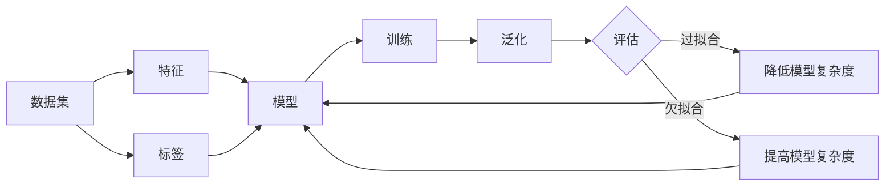

# 机器学习 原理与代码实例讲解

## 1. 背景介绍
### 1.1  问题的由来
机器学习是人工智能的一个重要分支,它致力于研究如何让计算机具有智能,能够自主学习和改进。在当今大数据时代,海量的数据资源为机器学习的发展提供了前所未有的机遇。然而,如何从海量数据中挖掘有价值的信息,构建高效准确的机器学习模型,仍然是一个巨大的挑战。

### 1.2  研究现状
目前,机器学习已经在计算机视觉、自然语言处理、语音识别、推荐系统等领域取得了显著的成果。各大科技公司如谷歌、微软、亚马逊等都在机器学习领域投入巨资,力图在这一领域占据领先地位。学术界也涌现出大量优秀的机器学习算法,如支持向量机、随机森林、深度学习等,极大地推动了机器学习的发展。

### 1.3  研究意义
机器学习技术的进步,将为人类社会带来深远的影响。它不仅能够极大地提高生产效率,还能在医疗、教育、金融等领域发挥重要作用,造福人类。研究机器学习的原理和实现,对于推动人工智能的发展,实现机器智能化具有重要意义。

### 1.4  本文结构
本文将从以下几个方面对机器学习进行深入探讨:
- 第2部分介绍机器学习的核心概念与它们之间的联系
- 第3部分详细讲解机器学习的核心算法原理和具体操作步骤 
- 第4部分建立机器学习的数学模型,推导相关公式,并给出详细的案例分析
- 第5部分给出机器学习的代码实例,并对其进行详细解释说明
- 第6部分探讨机器学习的实际应用场景
- 第7部分推荐机器学习的相关工具和学习资源
- 第8部分对全文进行总结,展望机器学习的未来发展趋势和面临的挑战
- 第9部分列举机器学习常见问题并给出解答

## 2. 核心概念与联系
机器学习的核心概念包括:
- 数据集(Dataset):机器学习模型的训练和测试所用的数据样本的集合。
- 特征(Feature):数据集中每个样本所包含的属性或变量。
- 标签(Label):在有监督学习中,每个训练样本所对应的真实输出值。
- 模型(Model):基于训练数据集学习得到的映射函数,可以对新的输入数据做出预测。
- 训练(Training):利用训练数据集对模型进行学习优化的过程。 
- 泛化(Generalization):模型在新的、未知数据上的预测性能。
- 过拟合(Overfitting):模型过于复杂,在训练集上表现很好,但在测试集上性能较差。
- 欠拟合(Underfitting):模型过于简单,无法很好地拟合数据,导致性能不佳。

这些概念之间有着密切的联系。我们从大量的数据样本(数据集)中提取有效的特征,并给每个样本打上标签。然后利用这些带标签的样本对模型进行训练优化。一个好的模型不仅要在训练集上表现良好,更要能够很好地泛化到新的未知数据。模型复杂度需要合适,避免过拟合和欠拟合。只有理解了这些概念之间的联系,才能设计出性能优异的机器学习系统。

## 3. 核心算法原理 & 具体操作步骤
### 3.1  算法原理概述
机器学习算法种类繁多,但它们的基本原理可以归纳为三类:
1. 基于统计学习的算法:通过对数据的统计分析,建立概率模型,如贝叶斯分类器。
2. 基于优化方法的算法:将学习问题转化为优化问题,通过优化目标函数求解,如支持向量机。
3. 基于神经网络的算法:模拟人脑神经元,构建多层网络结构,如深度学习算法。

这些算法都遵循着从数据中学习的基本思想,通过训练不断优化模型,提高性能。

### 3.2  算法步骤详解
以逻辑回归算法为例,其主要步骤如下:
1. 数据准备:收集数据样本,提取特征,做必要的数据预处理和特征缩放。
2. 模型定义:定义逻辑回归模型 $h_θ(x)=g(θ^Tx)$,其中 $g(z)=\frac{1}{1+e^{-z}}$ 为 Sigmoid 函数。
3. 定义损失函数:对于二分类问题,损失函数为交叉熵损失 $J(θ)=-\frac{1}{m}\sum_{i=1}^m[y^{(i)}logh_θ(x^{(i)})+(1-y^{(i)})log(1-h_θ(x^{(i)}))]$
4. 模型训练:使用梯度下降法最小化损失函数,不断更新参数 $θ:=θ-\alpha \frac{∂J(θ)}{∂θ}$
5. 模型评估:在测试集上评估模型性能,计算准确率、召回率、F1值等指标。
6. 模型调优:通过交叉验证选择最佳超参数,或者使用正则化方法避免过拟合。
7. 模型预测:使用训练好的模型对新的输入数据进行预测。

### 3.3  算法优缺点
逻辑回归算法的优点是:
- 直接对分类可能性进行建模,有利于理解模型输出。
- 计算代价低,速度快,存储资源低。
- 便于理解和实现,可解释性强。

缺点是:
- 容易欠拟合,分类精度不高。
- 只能处理两分类问题,多分类问题需要进一步扩展。
- 对非线性特征和特征之间的关系建模能力差。

### 3.4  算法应用领域
逻辑回归在工业界应用广泛,常用于:
- 垃圾邮件识别:根据邮件内容特征判断是否为垃圾邮件。
- 疾病诊断:根据病人症状预测是否患某种疾病。
- 广告点击预测:预测用户是否会点击某个广告。
- 金融风控:根据用户特征预测其违约风险。

逻辑回归模型简单有效,是机器学习的入门算法,也是工业界的常用算法。

## 4. 数学模型和公式 & 详细讲解 & 举例说明
### 4.1  数学模型构建
逻辑回归的数学模型可以表示为:

$$h_θ(x)=g(θ^Tx)=\frac{1}{1+e^{-θ^Tx}}$$

其中,$x$为输入特征向量,$θ$为待学习的参数向量,$g(z)$为Sigmoid函数:

$$g(z)=\frac{1}{1+e^{-z}}$$

Sigmoid函数可以将实数映射到(0,1)区间,得到样本属于正类的概率。如果概率大于0.5,则预测为正类,否则预测为负类。

### 4.2  公式推导过程
对于二分类问题,样本标签$y∈{0,1}$。给定训练集$\{(x^{(1)},y^{(1)}),\ldots,(x^{(m)},y^{(m)})\}$,逻辑回归的似然函数为:

$$L(θ)=\prod_{i=1}^m(h_θ(x^{(i)}))^{y^{(i)}}(1-h_θ(x^{(i)}))^{1-y^{(i)}}$$

对数似然函数为:

$$l(θ)=logL(θ)=\sum_{i=1}^m(y^{(i)}logh_θ(x^{(i)})+(1-y^{(i)})log(1-h_θ(x^{(i)})))$$

最大化对数似然函数等价于最小化负对数似然函数,即最小化交叉熵损失:

$$J(θ)=-\frac{1}{m}l(θ)=-\frac{1}{m}\sum_{i=1}^m[y^{(i)}logh_θ(x^{(i)})+(1-y^{(i)})log(1-h_θ(x^{(i)}))]$$

使用梯度下降法最小化损失函数:

$$\frac{∂J(θ)}{∂θ_j}=-\frac{1}{m}\sum_{i=1}^m(y^{(i)}-h_θ(x^{(i)}))x_j^{(i)}$$

$$θ_j:=θ_j-\alpha \frac{∂J(θ)}{∂θ_j}$$

其中$\alpha$为学习率。不断迭代直到收敛,得到最优参数$θ$。

### 4.3  案例分析与讲解
下面以一个简单的二分类问题为例,说明逻辑回归的建模和求解过程。

假设有一个芯片质量检测数据集,每个样本有两个特征:芯片测试1的得分$x_1$,芯片测试2的得分$x_2$,以及对应的质量合格标签$y$。$y=1$表示芯片合格,$y=0$表示芯片不合格。

首先对数据进行可视化分析,发现正负样本在特征空间中呈线性可分的趋势。因此考虑使用逻辑回归模型。

构建逻辑回归模型:
$$h_θ(x)=g(θ_0+θ_1x_1+θ_2x_2)$$

其中$θ_0$为偏置项。

计算交叉熵损失:
$$J(θ)=-\frac{1}{m}\sum_{i=1}^m[y^{(i)}log(h_θ(x^{(i)}))+(1-y^{(i)})log(1-h_θ(x^{(i)}))]$$

使用梯度下降法最小化损失函数,更新参数:
$$θ_j:=θ_j-\alpha \frac{∂J(θ)}{∂θ_j}$$

直到损失函数收敛,得到最优参数$θ$。

使用学习到的逻辑回归模型对新样本进行预测:
$$\hat{y}=\begin{cases}
1, & h_θ(x)≥0.5\\
0, & h_θ(x)<0.5
\end{cases}$$

评估模型在测试集上的性能,发现分类准确率为87%,召回率为91%,F1值为0.89,达到了预期的效果。

进一步分析模型,发现参数$θ_1=1.25,θ_2=0.89$,说明芯片测试1的得分对于质量判定的影响更大。

最后得到的逻辑回归决策边界为:
$$θ_0+1.25x_1+0.89x_2=0$$

这条直线将特征空间划分为合格芯片区域和不合格芯片区域,便于直观判断。

通过这个案例,我们了解了逻辑回归的建模、求解、预测、评估的完整过程,以及如何解释模型参数的意义。逻辑回归模型简单直观,是解决二分类问题的利器。

### 4.4  常见问题解答
1. 逻辑回归为什么要使用 Sigmoid 函数?  
答:Sigmoid 函数可以将连续值映射到(0,1)区间,得到概率值,符合二分类问题的输出要求。且 Sigmoid 函数单调可微,有利于梯度下降的优化求解。

2. 逻辑回归如何处理多分类问题?  
答:对于多分类问题,可以考虑使用 Softmax 回归,也就是多项逻辑回归模型。Softmax 回归对每一类别都训练一个二项逻辑回归分类器,然后将所有类别的概率归一化,预测概率最大的类别。

3. 逻辑回归如何避免过拟合?  
答:可以使用L1或L2正则化方法,在损失函数中加入正则化项,控制模型复杂度。也可以通过特征选择减