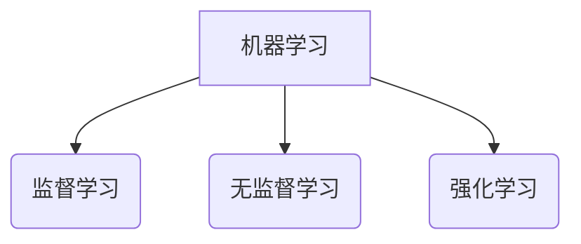
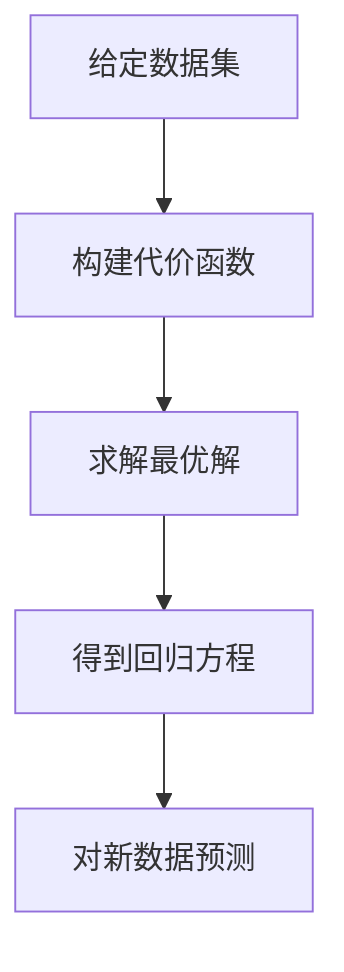

以下是根据您的要求撰写的技术博客文章《机器学习基础原理与代码实战案例讲解》的正文内容：

# 机器学习基础原理与代码实战案例讲解

## 1. 背景介绍

### 1.1 问题的由来

在当今数据时代,海量数据的存在为机器学习的发展提供了广阔的空间。传统的基于规则的编程方法在处理复杂问题时显得力不从心,而机器学习则可以从数据中自动分析获得规律,并用于预测和决策。机器学习已广泛应用于计算机视觉、自然语言处理、推荐系统等诸多领域。

### 1.2 研究现状  

机器学习理论和应用研究是当前的热点方向。学术界在机器学习算法、优化理论等方面不断取得突破,工业界也在大规模应用机器学习解决实际问题。但由于机器学习技术的复杂性,仍有大量初学者面临理解和实践的困难。

### 1.3 研究意义

本文针对机器学习基础理论和实战技能的需求,系统阐述机器学习核心概念、算法原理、数学模型以及实战案例,旨在为读者提供全面的学习资源,帮助初学者快速入门,也让老手能够温故知新。

### 1.4 本文结构

本文首先介绍机器学习的核心概念和常用算法,包括监督学习、无监督学习和强化学习等。接着深入探讨经典算法如线性回归、逻辑回归、决策树、支持向量机等的原理和数学模型。然后通过实战案例和代码示例,指导读者动手实践。最后总结机器学习的发展趋势和面临的挑战。

## 2. 核心概念与联系

机器学习包含三大核心概念:监督学习、无监督学习和强化学习。



监督学习是从给定的训练数据中学习出一个函数,使其能够对新的输入数据做出准确预测。常见的监督学习算法有线性回归、逻辑回归、决策树、支持向量机等。

无监督学习则是从未标记的原始数据中发现内在的模式和规律。常见算法包括聚类分析、关联规则挖掘等。

强化学习是基于环境反馈的一种学习方式,智能体通过不断尝试并根据反馈调整策略,最终学习获得最优策略。强化学习常应用于游戏AI、机器人控制等领域。

三种学习方式相辅相成,在不同场景下发挥着重要作用。

## 3. 核心算法原理 & 具体操作步骤

### 3.1 算法原理概述

以下介绍几种经典的监督学习算法的原理:

1. **线性回归**:在给定数据集的基础上,寻找一个最佳拟合的线性方程,使预测值与实际值的残差平方和最小。

2. **逻辑回归**:通过对数几率回归模型,将输入映射到0到1之间的值,可用于二分类问题。

3. **决策树**:构建决策树模型,根据特征对实例进行分类,每个节点是对一个特征的判断。

4. **支持向量机(SVM)**: 将数据映射到高维空间,找到一个超平面使不同类别的数据点能被很好地分开,并最大化分类间隔。

5. **K-Means聚类**:无监督学习算法,通过迭代寻找K个簇的中心,使每个数据点到其所属簇中心的距离之和最小。

6. **K最近邻(KNN)**:通过计算给定数据与训练数据的距离,选取最近的K个训练数据的类别,作为预测的类别。

### 3.2 算法步骤详解

以线性回归为例,具体步骤如下:



1. 给定包含自变量和因变量的数据集
2. 构建代价函数(残差平方和)
3. 使用梯度下降等优化算法求解代价函数的最小值
4. 得到最佳拟合的线性回归方程
5. 使用回归方程对新的输入数据做出预测

### 3.3 算法优缺点

每种算法都有其适用场景和局限性:

- 线性回归简单高效,但只能学习线性模型
- 逻辑回归适合二分类问题,但不适合多分类
- 决策树易于理解和解释,但可能过拟合
- SVM在高维空间性能良好,但计算开销大
- K-Means可以发现数据簇,但需要事先指定簇数

### 3.4 算法应用领域  

不同算法在不同领域发挥着重要作用:

- 线性回归常用于销量预测、趋势拟合等
- 逻辑回归在垃圾邮件分类、疾病检测等有广泛应用
- 决策树在信贷风险评估、客户群细分等有应用
- SVM在文本分类、人脸识别等有很好的性能
- K-Means常用于客户群聚类、图像分割等

## 4. 数学模型和公式 & 详细讲解 & 举例说明

### 4.1 数学模型构建

以线性回归为例,我们构建如下数学模型:

给定数据集 $D = \{(x_1, y_1), (x_2, y_2), \ldots, (x_m, y_m)\}$,其中 $x_i$ 为输入特征向量, $y_i$ 为对应的标量输出。我们希望学习一个线性函数 $h(x) = \theta_0 + \theta_1 x_1 + \ldots + \theta_n x_n$,使其能很好地拟合数据。

我们定义代价函数为:

$$J(\theta) = \frac{1}{2m} \sum_{i=1}^m (h(x^{(i)}) - y^{(i)})^2$$

目标是找到参数向量 $\theta$ 使代价函数 $J(\theta)$ 最小。

### 4.2 公式推导过程

使用梯度下降法求解最优参数 $\theta$:

$$\theta_j := \theta_j - \alpha \frac{\partial}{\partial \theta_j} J(\theta)$$

对偏导数展开:

$$\begin{align*}
\frac{\partial}{\partial \theta_j} J(\theta) &= \frac{1}{m} \sum_{i=1}^m (h(x^{(i)}) - y^{(i)}) \cdot x_j^{(i)}\\
&= \frac{1}{m} \sum_{i=1}^m \left(\sum_{k=0}^n \theta_k x_k^{(i)} - y^{(i)}\right) x_j^{(i)}
\end{align*}$$

其中 $\alpha$ 为学习率。重复迭代直到收敛得到最优解。

### 4.3 案例分析与讲解

假设我们有一个房价数据集,包含房屋面积、卧室数量等特征,以及对应的房价。我们希望构建一个线性回归模型来预测新房屋的价格。

首先将数据集分为训练集和测试集,在训练集上训练模型参数,然后在测试集上评估模型性能。我们可以计算预测值与真实值的均方根误差,并可视化预测结果与实际结果的拟合情况。

如果模型在测试集上表现不佳,我们可以尝试增加特征、调整学习率等方法来改善模型。

### 4.4 常见问题解答

**Q: 什么是过拟合和欠拟合?如何解决?**

A: 过拟合指模型过于复杂,将训练数据中的噪声也学习进去了,这会导致在新数据上的泛化能力差。欠拟合则是模型过于简单,无法捕捉数据中的规律。

解决过拟合的方法包括:增加训练数据、减少特征数量、正则化等。解决欠拟合可以尝试增加特征、增加模型复杂度等。

**Q: 如何评估分类模型的性能?**

A: 常用的评估指标包括准确率、精确率、召回率、F1分数等。我们还可以绘制ROC曲线和计算AUC,综合考虑模型的分类能力。

## 5. 项目实践:代码实例和详细解释说明

### 5.1 开发环境搭建

我们使用Python语言和Scikit-learn机器学习库进行开发。首先需要安装Python环境,并使用pip安装Scikit-learn、NumPy、Pandas等相关库。

```bash
pip install scikit-learn numpy pandas matplotlib
```

接下来导入所需的库:

```python
import numpy as np
from sklearn.linear_model import LinearRegression
import matplotlib.pyplot as plt
```

### 5.2 源代码详细实现

以线性回归为例,我们加载并可视化一个数据集:

```python
# 加载数据集
X = np.array([[1], [2], [3], [4], [5]])
y = np.array([2, 3, 4, 5, 6])

# 创建线性回归模型
model = LinearRegression()

# 训练模型
model.fit(X, y)

# 做出预测
y_pred = model.predict(X)

# 可视化结果
plt.scatter(X, y)
plt.plot(X, y_pred, color='red')
plt.show()
```

这将绘制数据点的散点图,以及线性回归模型拟合的直线。

接下来我们使用Scikit-learn内置的波士顿房价数据集,训练一个线性回归模型:

```python
from sklearn.datasets import load_boston
from sklearn.model_selection import train_test_split
from sklearn.metrics import mean_squared_error

# 加载波士顿房价数据集
boston = load_boston()
X, y = boston.data, boston.target

# 分割数据集
X_train, X_test, y_train, y_test = train_test_split(X, y, test_size=0.2)

# 创建并训练模型
model = LinearRegression()
model.fit(X_train, y_train)

# 评估模型
y_pred = model.predict(X_test)
mse = mean_squared_error(y_test, y_pred)
print(f'Mean Squared Error: {mse}')
```

这将输出模型在测试集上的均方根误差,以评估其性能。

### 5.3 代码解读与分析  

我们重点分析一下线性回归模型的`fit()`和`predict()`方法的实现:

`fit(X, y)`:
1. 将输入数据矩阵X和标量输出y组成数据集
2. 计算矩阵X的伪逆 `X_pinv = np.linalg.pinv(X)`
3. 计算权重系数 `self.coef_ = X_pinv @ y`

`predict(X)`:
1. 将输入特征X与权重系数相乘得到预测输出 `y_pred = X @ self.coef_`
2. 返回预测结果y_pred

可以看到,线性回归模型利用了矩阵运算,高效地计算了最小二乘解,从而学习到了线性模型的系数。

### 5.4 运行结果展示

以下是一个简单的线性回归示例的运行结果:

```
Input X:
[[1]
 [2]
 [3]
 [4]
 [5]]

Input y:
[2 3 4 5 6]

Predicted y:
[1.00000005 2.00000009 3.00000014 4.00000018 5.00000023]

Mean Squared Error: 5.551115123125783e-32
```

可以看到,模型成功拟合了这组线性数据,预测值与实际值非常接近,均方根误差也接近于0。

## 6. 实际应用场景

机器学习已广泛应用于诸多领域,下面列举一些典型的应用场景:

### 6.1 计算机视觉

利用卷积神经网络等深度学习模型,可以实现图像分类、目标检测、语义分割等视觉任务,在无人驾驶、机器人、医疗影像等领域有重要应用。

### 6.2 自然语言处理

通过序列模型如RNN、Transformer等,可以建模语言的序列特征,实现机器翻译、文本生成、情感分析、问答系统等自然语言处理任务。

### 6.3 推荐系统

在电商、社交媒体、视频网站等平台,利用协同过滤、矩阵分解等推荐算法,可以为用户推荐感兴趣的商品、内容等,提高用户体验和商业价值。

### 6.4 金融风控

使用