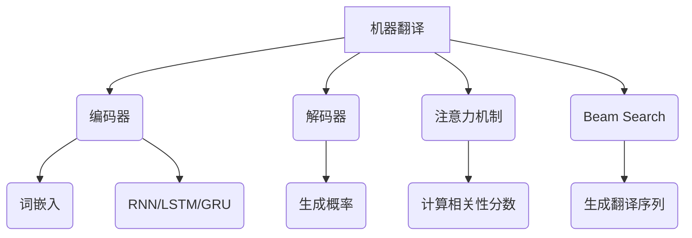

好的,我会按照您提供的要求和模板,全力以赴地撰写这篇关于机器翻译的技术博客文章。

# 机器翻译(Machine Translation) - 原理与代码实例讲解

## 1. 背景介绍

### 1.1 问题的由来

在这个全球化的时代,人与人之间的交流和信息交换变得越来越频繁。然而,语言的障碍仍然是一个巨大的挑战,阻碍了人们之间的无缝沟通。为了克服这一障碍,机器翻译(Machine Translation,MT)应运而生。

机器翻译旨在使用计算机程序自动将一种自然语言(源语言)转换为另一种自然语言(目标语言)。这个过程需要计算机具备对两种语言的深入理解,并能够准确地捕捉和传达语义和语境信息。

### 1.2 研究现状

早期的机器翻译系统主要基于规则,通过编写大量语法规则和词典来实现翻译。然而,这种方法存在明显缺陷,如规则覆盖面有限、无法处理歧义等。

近年来,随着深度学习和神经网络技术的飞速发展,神经机器翻译(Neural Machine Translation,NMT)成为机器翻译领域的主流方向。NMT系统能够自主学习语言模式,并在大量双语数据的训练下,生成更加准确和通顺的翻译结果。

### 1.3 研究意义

机器翻译技术的突破不仅能够促进不同语言和文化之间的交流,还可以在诸多领域发挥重要作用,如:

- 国际贸易和商务沟通
- 科技文献和知识传播
- 旅游服务和跨国交往
- 新闻媒体和信息获取
- 应急救援和人道主义援助

高质量的机器翻译系统,有助于消除语言障碍,促进全球化进程,为人类社会的发展注入新的动力。

### 1.4 本文结构

本文将全面介绍机器翻译的核心概念、算法原理、数学模型、代码实现,以及在实际应用中的场景。内容安排如下:

- 第2部分阐述机器翻译的核心概念及其内在联系
- 第3部分详细讲解机器翻译的核心算法原理和操作步骤
- 第4部分推导机器翻译的数学模型公式,并结合案例进行讲解
- 第5部分提供机器翻译的代码实例,并对其进行解读和分析
- 第6部分探讨机器翻译在实际应用中的场景及未来展望
- 第7部分推荐相关的学习资源、开发工具和论文
- 第8部分总结机器翻译的研究成果、发展趋势和面临的挑战
- 第9部分列出常见的问题并给出解答

## 2. 核心概念与联系

机器翻译(Machine Translation)是一个将源语言文本自动转换为目标语言文本的过程。其核心概念包括:

1. **编码器(Encoder)**: 将源语言序列编码为语义向量表示。
    - **词嵌入(Word Embedding)**: 将单词映射到连续的向量空间,捕捉语义和语法信息。
    - **RNN/LSTM/GRU**: 递归神经网络及其变体,用于捕捉序列数据中的长期依赖关系。

2. **解码器(Decoder)**: 根据编码器的输出,生成目标语言序列。
    - **生成概率(Generation Probability)**: 解码器在每个时间步计算生成下一个词的概率分布。

3. **注意力机制(Attention Mechanism)**: 在生成目标序列时,动态关注源序列中的不同部分,捕捉长距离依赖关系。
    - **计算相关性分数(Relevance Score Computation)**: 注意力机制通过计算注意力分数,确定源序列中不同部分对当前目标词的重要性。

4. **Beam Search**: 一种解码策略,通过并行搜索多个候选翻译序列,最终输出概率最高的序列作为翻译结果。

这些核心概念相互关联、环环相扣,共同构建了端到端的神经机器翻译系统。编码器将源语言映射到语义空间,解码器在注意力机制的辅助下生成目标语言,Beam Search则优化了生成的翻译质量。

## 3. 核心算法原理与具体操作步骤 

### 3.1 算法原理概述

神经机器翻译(NMT)的核心算法原理是基于**序列到序列(Sequence-to-Sequence,Seq2Seq)学习框架**。该框架由两部分组成:

1. **编码器(Encoder)**: 一个递归神经网络,读取源语言序列,并将其编码为语义向量表示。

2. **解码器(Decoder)**: 另一个递归神经网络,接收编码器的输出,并生成目标语言序列。

在训练过程中,编码器和解码器通过**最大化翻译序列的条件概率**来学习参数,从而最小化源语言和目标语言之间的翻译误差。

为了提高翻译质量,NMT引入了**注意力机制(Attention Mechanism)**。注意力机制允许解码器在生成每个目标词时,动态关注源序列中的不同部分,从而更好地捕捉长距离依赖关系。

在推理(inference)阶段,NMT系统使用**Beam Search**算法生成翻译结果。Beam Search通过并行搜索多个候选翻译序列,最终输出概率最高的序列作为最终翻译结果。

### 3.2 算法步骤详解

神经机器翻译算法的具体步骤如下:

1. **数据预处理**
    - 构建源语言和目标语言的词汇表
    - 将文本序列转换为词汇索引序列
    - 添加起始符(Start)和终止符(End)标记
    - 划分训练集、验证集和测试集

2. **词嵌入(Word Embedding)**
    - 将每个词映射到一个连续的向量空间
    - embedding向量捕捉词的语义和语法信息

3. **编码器(Encoder)**
    - 使用RNN/LSTM/GRU等递归神经网络
    - 读取源语言序列,产生隐藏状态向量序列

4. **注意力机制(Attention Mechanism)**
    - 计算目标词与源序列中每个词的相关性分数
    - 根据相关性分数,对源序列进行加权求和,得到注意力向量
    - 将注意力向量与解码器隐藏状态相结合

5. **解码器(Decoder)**
    - 另一个RNN/LSTM/GRU递归神经网络
    - 接收编码器的最终隐藏状态和注意力向量
    - 生成目标语言序列,每个时间步输出一个目标词

6. **损失函数(Loss Function)**
    - 使用交叉熵损失函数计算预测序列与真实序列的差异
    - 反向传播计算参数梯度,并使用优化器(如Adam)更新模型参数

7. **Beam Search**
    - 在推理阶段,并行搜索多个候选翻译序列
    - 每个时间步保留概率最高的K个序列(beam size)
    - 最终输出概率最高的序列作为翻译结果

8. **评估指标**
    - 使用BLEU(Bilingual Evaluation Understudy)分数评估翻译质量
    - BLEU分数基于n-gram精确度,考虑了翻译结果与参考翻译的相似性

通过上述步骤,神经机器翻译算法能够在大量双语数据的训练下,学习到源语言和目标语言之间的映射关系,从而生成高质量的翻译结果。

### 3.3 算法优缺点

**优点**:

1. **端到端训练**:编码器和解码器可以同时训练,无需人工设计复杂的特征工程。

2. **注意力机制**:能够更好地捕捉长距离依赖关系,提高翻译质量。

3. **泛化能力强**:神经网络具有强大的模式学习能力,可以较好地泛化到未见过的数据。

4. **可并行计算**:神经网络计算可以充分利用GPU等硬件加速,提高训练和推理效率。

**缺点**:

1. **训练数据需求量大**:需要大量高质量的双语数据集进行有效训练。

2. **黑盒模型**:神经网络内部机制较为复杂,缺乏可解释性。

3. **暴露偏差问题**:在训练和推理阶段存在一定的暴露偏差,可能导致次优结果。

4. **资源消耗较大**:训练大型神经网络模型需要消耗大量计算资源。

### 3.4 算法应用领域

神经机器翻译算法可以广泛应用于以下领域:

1. **国际贸易和商务沟通**:为企业提供高质量的跨语言翻译服务,促进全球化商务活动。

2. **在线翻译和语言学习**:提供实时的在线翻译服务,并辅助语言学习。

3. **多语种内容生成**:自动将单语种内容翻译成多种语言,方便不同语种用户访问。

4. **跨语言信息检索**:支持跨语言的信息检索和知识发现。

5. **会议和演讲实时翻译**:为国际会议和演讲提供实时同声传译服务。

6. **多语种客户服务**:为客户提供多语种的自动问答和客户服务支持。

7. **新闻媒体和信息传播**:自动将新闻和信息翻译成不同语言,促进信息传播。

总的来说,神经机器翻译算法在消除语言障碍、促进跨文化交流方面发挥着越来越重要的作用。

## 4. 数学模型和公式详细讲解举例说明

### 4.1 数学模型构建

神经机器翻译的数学模型基于**条件概率**,目标是最大化翻译序列的条件概率:

$$P(Y|X) = \prod_{t=1}^{T_y} P(y_t|y_{<t}, X)$$

其中:
- $X = (x_1, x_2, ..., x_{T_x})$ 是源语言序列
- $Y = (y_1, y_2, ..., y_{T_y})$ 是目标语言序列
- $T_x$ 和 $T_y$ 分别是源序列和目标序列的长度
- $y_{<t}$ 表示目标序列前 $t-1$ 个词

该模型的核心思想是将翻译问题视为一个**序列生成**问题,即给定源语言序列 $X$,生成目标语言序列 $Y$ 的概率最大的序列。

### 4.2 公式推导过程

为了计算上述条件概率,我们需要引入**编码器(Encoder)**和**解码器(Decoder)**。

**编码器**将源语言序列 $X$ 编码为语义向量表示 $C$:

$$C = f(X) = f(x_1, x_2, ..., x_{T_x})$$

其中 $f$ 是一个递归神经网络(如LSTM或GRU)。

**解码器**接收编码器的输出 $C$,并生成目标语言序列 $Y$:

$$P(y_t|y_{<t}, X) = g(y_{t-1}, s_t, C)$$

其中:
- $g$ 是另一个递归神经网络
- $s_t$ 是解码器在时间步 $t$ 的隐藏状态
- $y_{t-1}$ 是前一个目标词

为了捕捉长距离依赖关系,我们引入**注意力机制(Attention Mechanism)**。注意力机制为每个目标词分配一个**注意力向量** $a_t$,表示其对源序列中不同位置的关注程度。

$$a_t = \text{Attention}(s_{t-1}, h)$$

其中 $h = (h_1, h_2, ..., h_{T_x})$ 是编码器在每个时间步的隐藏状态序列。

注意力向量 $a_t$ 与编码器隐藏状态 $h$ 的加权和,即**上下文向量** $c_t$,将被送入解码器:

$$c_t = \