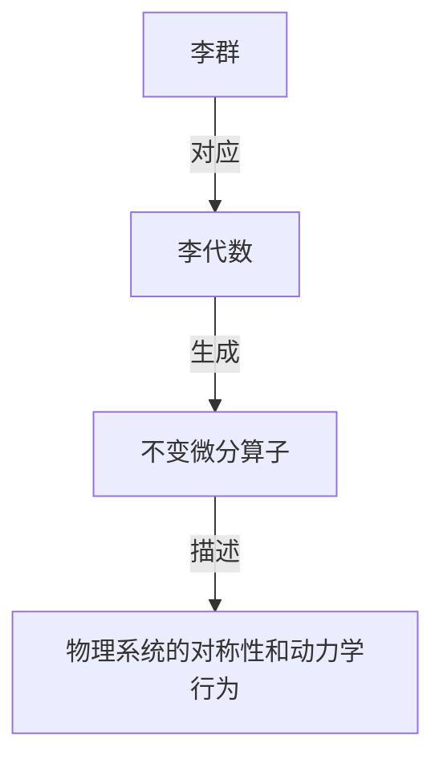

# 李群与李代数基础：第2节 李群的李代数与不变微分算子

## 1. 背景介绍

### 1.1 问题的由来

在研究现代物理学、量子力学、相对论、粒子物理学和量子场论时,我们常常需要处理一些具有对称性的问题。这些对称性可以用李群(Lie Group)来描述,而李群的性质则可以通过它的李代数(Lie Algebra)来研究。李代数不仅在数学上有着重要的理论意义,而且在物理学中也扮演着关键的角色。

### 1.2 研究现状

李群和李代数理论最早由挪威数学家索菲娅·李(Sophus Lie)于19世纪后期提出,并在20世纪得到了进一步的发展和完善。目前,李群和李代数理论已经成为数学和物理学中不可或缺的一个分支,在量子力学、相对论、粒子物理学、量子场论等领域都有着广泛的应用。

### 1.3 研究意义

掌握李群和李代数理论对于理解现代物理学理论、处理对称性问题以及研究各种物理系统的动力学行为都有着重要的意义。通过学习李代数与不变微分算子的知识,我们可以更深入地了解物理系统的对称性,并利用这些对称性来简化问题的求解过程。

### 1.4 本文结构

本文将首先介绍李群和李代数的基本概念,然后重点讨论李群的李代数以及与之相关的不变微分算子。我们将详细阐述不变微分算子的定义、性质和计算方法,并通过具体的例子来加深理解。最后,我们将探讨不变微分算子在物理学中的应用,以及未来的发展趋势和挑战。

## 2. 核心概念与联系

在深入讨论李群的李代数和不变微分算子之前,我们需要先了解一些基本概念。

**李群(Lie Group):**
一个李群是一个连续群,它不仅满足群的基本运算,而且还具有光滑的结构。李群在数学和物理学中扮演着重要的角色,因为它可以用来描述许多对称性问题。

**李代数(Lie Algebra):**
每个李群都对应一个李代数,李代数是一个向量空间,它描述了李群在单位元素附近的局部结构。李代数不仅在理解李群的性质方面有着重要作用,而且在处理物理系统的动力学行为时也扮演着关键角色。

**不变微分算子(Invariant Differential Operator):**
不变微分算子是一种特殊的微分算子,它在李群的作用下保持不变。不变微分算子与李代数之间存在着密切的联系,它们可以用来研究物理系统的对称性和动力学行为。

这三个概念之间的关系可以用以下流程图来概括:

李群描述了一个物理系统的对称性,而与之对应的李代数则提供了研究这种对称性的工具。不变微分算子是由李代数生成的,它可以用来描述物理系统的对称性和动力学行为。因此,掌握这三个概念及其联系,对于理解和处理对称性问题至关重要。

## 3. 核心算法原理 & 具体操作步骤

### 3.1 算法原理概述

要研究一个李群的性质,我们通常先研究它对应的李代数。李代数是一个向量空间,它由一组生成元(也称为基矢)和它们之间的对易关系来描述。

生成元可以看作是无穷小的变换,而对易关系则描述了这些变换之间的组合规则。通过研究生成元和对易关系,我们可以了解李代数的结构,进而推导出与之相关的不变微分算子。

不变微分算子是一种特殊的微分算子,它在李群的作用下保持不变。换句话说,如果我们对一个函数施加李群变换,然后再作用不变微分算子,结果与直接作用不变微分算子再施加李群变换是一样的。

这个性质可以用下面的等式来表示:

$$
\exp(iX)D\exp(-iX)=D
$$

其中,$ \exp(iX) $表示李群元素,$ D $表示不变微分算子,$ X $是李代数的生成元。

通过求解这个等式,我们可以得到不变微分算子的表达式,从而研究物理系统的对称性和动力学行为。

### 3.2 算法步骤详解

计算不变微分算子的具体步骤如下:

1. **确定李代数的生成元和对易关系**

   首先,我们需要确定描述所研究的物理系统对称性的李代数。通常情况下,这个李代数由一组生成元(基矢)和它们之间的对易关系来描述。

   对易关系可以用如下公式表示:

   $$
   [X_i, X_j] = c_{ij}^k X_k
   $$

   其中,$ X_i $和$ X_j $是生成元,$ c_{ij}^k $是结构常数,它们完全确定了李代数的结构。

2. **构造李代数的表示**

   接下来,我们需要找到李代数的一个具体表示,也就是将生成元表示为一组矩阵或微分算子。这个表示取决于所研究的具体问题。

   常见的表示包括矩阵表示和微分算子表示。矩阵表示通常用于研究有限维系统,而微分算子表示则更适合于研究无限维系统。

3. **求解不变微分算子**

   有了李代数的表示,我们就可以求解不变微分算子了。具体做法是,将李代数的生成元代入下面的等式:

   $$
   \exp(iX)D\exp(-iX)=D
   $$

   其中,$ X $是李代数的生成元,$ D $是待求的不变微分算子。

   通过解这个方程,我们可以得到不变微分算子的表达式。这个过程通常需要一些代数计算和技巧。

4. **分析和应用不变微分算子**

   最后,我们可以利用得到的不变微分算子来研究物理系统的对称性和动力学行为。

   不变微分算子的本征函数就是该系统的不变量,它们描述了系统的对称性。通过求解不变微分算子的本征值问题,我们可以得到系统的能量本征值和本征态,从而揭示系统的动力学行为。

   此外,不变微分算子还可以用于简化微分方程的求解,因为它们与系统的动力学方程对易。

### 3.3 算法优缺点

**优点:**

1. 提供了一种系统的方法来研究物理系统的对称性和动力学行为。
2. 利用不变微分算子可以简化微分方程的求解过程。
3. 不变微分算子的本征函数描述了系统的不变量,有助于深入理解系统的性质。

**缺点:**

1. 计算过程可能比较复杂,需要一定的代数技巧和经验。
2. 对于一些复杂的系统,求解不变微分算子可能会变得非常困难。
3. 不变微分算子只能描述连续对称性,无法处理离散对称性的情况。

### 3.4 算法应用领域

不变微分算子的理论及其计算方法在许多领域都有重要应用,包括但不限于:

- **量子力学:** 在研究原子、分子和固体的量子力学性质时,不变微分算子扮演着关键角色。
- **相对论:** 不变微分算子可以用来研究相对论中的对称性,如洛伦兹不变性。
- **粒子物理学:** 在研究基本粒子的性质和相互作用时,不变微分算子是一种重要的工具。
- **量子场论:** 不变微分算子在量子场论中被广泛应用,用于研究基本场的对称性和动力学行为。
- **数学物理:** 不变微分算子在数学物理领域有着深入的理论基础,被应用于研究各种数学模型的对称性。

总的来说,不变微分算子理论为我们提供了一种强有力的工具,可以用来研究各种物理系统的对称性和动力学行为,在理论物理学和数学物理学领域都有着广泛的应用。

## 4. 数学模型和公式 & 详细讲解 & 举例说明

### 4.1 数学模型构建

在研究不变微分算子之前,我们需要先构建一个数学模型来描述所研究的物理系统。这个模型通常由一个微分方程或一组微分方程组成,它们描述了系统的动力学行为。

我们将以一个简单的例子来说明数学模型的构建过程。假设我们要研究一个自由粒子在三维空间中的运动,它的动力学行为可以用薛定谔方程来描述:

$$
i\hbar\frac{\partial}{\partial t}\Psi(\vec{r},t) = -\frac{\hbar^2}{2m}\nabla^2\Psi(\vec{r},t)
$$

其中,$ \Psi(\vec{r},t) $是粒子的波函数,$ \vec{r} $是粒子的位置矢量,$ t $是时间,$ \hbar $是约化普朗克常数,$ m $是粒子的质量,$ \nabla^2 $是三维拉普拉斯算子。

这个微分方程描述了波函数在时间和空间上的演化,它包含了粒子的动量和能量信息。我们的目标是找到这个方程的解析解或近似解,从而了解粒子的运动状态。

### 4.2 公式推导过程

为了求解不变微分算子,我们需要先确定描述这个系统对称性的李代数。在这个例子中,我们考虑空间平移和空间旋转这两种对称性。

**空间平移对称性:**
空间平移对称性由三个生成元$ P_x,P_y,P_z $描述,它们分别表示沿$ x,y,z $轴的平移。这些生成元在微分算子表示下为:

$$
P_x = -i\hbar\frac{\partial}{\partial x}, \quad P_y = -i\hbar\frac{\partial}{\partial y}, \quad P_z = -i\hbar\frac{\partial}{\partial z}
$$

它们之间的对易关系为:

$$
[P_i, P_j] = 0
$$

**空间旋转对称性:**
空间旋转对称性由三个生成元$ L_x,L_y,L_z $描述,它们分别表示绕$ x,y,z $轴的旋转。这些生成元在微分算子表示下为:

$$
L_x = i\hbar\left(y\frac{\partial}{\partial z} - z\frac{\partial}{\partial y}\right), \quad L_y = i\hbar\left(z\frac{\partial}{\partial x} - x\frac{\partial}{\partial z}\right), \quad L_z = i\hbar\left(x\frac{\partial}{\partial y} - y\frac{\partial}{\partial x}\right)
$$

它们之间的对易关系为:

$$
[L_i, L_j] = i\hbar\epsilon_{ijk}L_k
$$

其中,$ \epsilon_{ijk} $是列维-切维塔符号。

有了这些生成元和对易关系,我们就可以求解不变微分算子了。我们将生成元代入不变微分算子的定义方程:

$$
\exp(iX)D\exp(-iX)=D
$$

其中,$ X $是李代数的生成元,$ D $是待求的不变微分算子。

经过一系列代数计算,我们可以得到与空间平移和空间旋转对称性相关的不变微分算子:

$$
\vec{P}^2 = P_x^2 + P_y^2 + P_z^2, \quad \vec{L}^2 = L_x^2 + L_y^2 + L_z^2, \quad \vec{L}\cdot\vec{P} = L_xP_x + L_yP_y + L_zP_z
$$

这些不变微分算子分别对应于粒子的动量、角动量和动量-角动量耦合。它们的本征函数就是描述粒子运动状态的波函数。

### 4.3 案例分析与讲解

现在,我们来具体分析一下自由粒子的案例。由于空间是均匀和各向同性的,因此自由粒子的波函数应该满足平移和旋转不变性。这意味着波函数应该是$ \vec{P}^2 $、$ \vec{