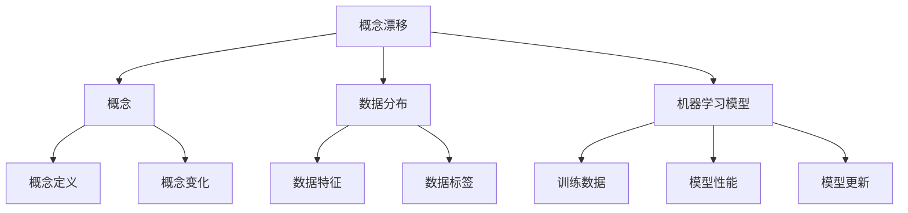
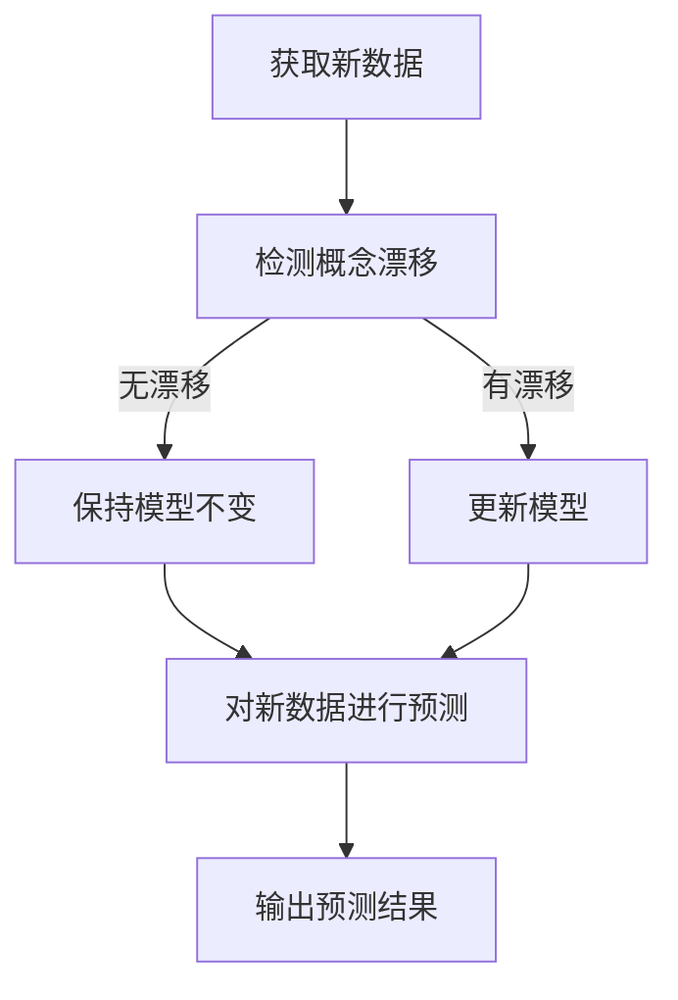

# 概念漂移 (Concept Drift) 原理与代码实例讲解

## 1. 背景介绍

### 1.1 问题的由来

在现实世界中,数据通常是动态变化的,这种变化可能来自于环境、人为因素或其他外部影响。这种数据分布的变化被称为"概念漂移"(Concept Drift)。概念漂移会导致基于历史数据训练的机器学习模型在新的数据分布上表现不佳,因此需要对模型进行更新或重新训练。

例如,在信用卡欺诈检测中,欺诈者的行为模式会随着时间而变化,使用过去的数据训练的模型可能无法很好地检测新的欺诈模式。同样,在天气预报中,气候变化可能导致过去的数据分布与当前情况不符。因此,有效地处理概念漂移对于保持机器学习模型的准确性和可靠性至关重要。

### 1.2 研究现状

近年来,概念漂移问题受到了广泛关注,研究人员提出了多种方法来解决这一问题。一些常见的方法包括:

1. **数据窗口调整**: 通过动态调整训练数据窗口的大小,以适应新的数据分布。
2. **在线学习算法**: 这些算法可以在新数据到来时不断更新模型,而无需重新训练整个模型。
3. **集成学习方法**: 将多个模型组合在一起,以捕获数据分布的变化。
4. **迁移学习**: 利用相关领域的知识来帮助模型适应新的数据分布。

尽管取得了一些进展,但概念漂移问题仍然存在一些挑战,如如何有效检测概念漂移、如何选择合适的处理方法以及如何在有限的计算资源下进行实时更新等。

### 1.3 研究意义

有效处理概念漂移对于保持机器学习模型的准确性和可靠性至关重要。在许多现实应用中,如信用卡欺诈检测、网络入侵检测、天气预报等,数据分布的变化是不可避免的。如果无法及时适应这些变化,模型的性能将会下降,导致决策错误和潜在损失。

通过研究概念漂移的原理和处理方法,我们可以:

1. 提高机器学习模型的鲁棒性,使其能够适应动态环境中的数据变化。
2. 减少由于概念漂移导致的模型性能下降,从而提高决策的准确性和可靠性。
3. 降低由于频繁重新训练模型带来的计算成本和时间开销。
4. 为未来的智能系统设计提供理论基础和技术支持。

### 1.4 本文结构

本文将全面介绍概念漂移的原理、处理方法和实际应用。具体内容包括:

1. 概念漂移的定义、类型和原因。
2. 常见的概念漂移检测和处理算法。
3. 基于数学模型的概念漂移分析。
4. 实际代码实现和案例分析。
5. 概念漂移在不同应用领域的实践。
6. 未来发展趋势和挑战。

通过全面而深入的探讨,本文旨在为读者提供对概念漂移问题的深入理解,并为实际应用提供指导和参考。

## 2. 核心概念与联系

在深入探讨概念漂移的原理和处理方法之前,我们需要先了解一些核心概念及其相互关系。

1. **概念漂移(Concept Drift)**: 指数据分布随时间或其他因素而发生变化,导致基于历史数据训练的机器学习模型在新的数据分布上表现不佳的现象。

2. **概念(Concept)**: 在机器学习中,概念是指要学习的目标,通常由数据特征和标签组成。例如,在图像分类任务中,概念可能是"猫"或"狗"等类别。

3. **数据分布(Data Distribution)**: 指数据样本在特征空间中的分布情况,包括数据特征和标签的分布。概念漂移导致数据分布发生变化。

4. **机器学习模型(Machine Learning Model)**: 通过训练数据学习概念,并对新数据进行预测或决策的模型。当概念发生漂移时,模型的性能可能会下降,需要进行更新或重新训练。

这些概念之间存在着密切的联系。概念漂移导致数据分布发生变化,进而影响机器学习模型的性能。为了应对这一问题,我们需要检测概念漂移,并采取相应的措施来更新或重新训练模型,以保持其在新的数据分布上的准确性和可靠性。

## 3. 核心算法原理 & 具体操作步骤

### 3.1 算法原理概述

处理概念漂移的核心思想是持续监测数据分布的变化,并根据变化的程度决定是否需要更新或重新训练机器学习模型。常见的处理概念漂移的算法可分为以下几类:

1. **数据窗口调整算法**: 通过动态调整训练数据窗口的大小,以适应新的数据分布。这些算法通常会保留最近的数据,并逐步丢弃较旧的数据。

2. **在线学习算法**: 这些算法可以在新数据到来时不断更新模型,而无需重新训练整个模型。常见的在线学习算法包括随机梯度下降(SGD)、在线贝叶斯等。

3. **集成学习算法**: 将多个模型组合在一起,以捕获数据分布的变化。常见的集成学习算法包括加权集成、自适应集成等。

4. **迁移学习算法**: 利用相关领域的知识来帮助模型适应新的数据分布。这些算法通常会将源域和目标域的数据进行对齐,并利用源域的知识来加速目标域模型的训练。

这些算法各有优缺点,需要根据具体的应用场景和数据特征进行选择和调整。

### 3.2 算法步骤详解

以下是一种常见的处理概念漂移的算法流程:

1. **获取新数据**: 持续获取新的数据样本,作为监测概念漂移的基础。

2. **检测概念漂移**: 使用统计检验、监测指标或其他方法,检测新数据与训练数据之间是否存在显著的分布差异。常见的检测方法包括统计检验(如Page-Hinkley检验、DDM检验等)、监测指标(如数据分布统计量、模型误差率等)。

3. **更新模型**: 如果检测到概念漂移,则需要对机器学习模型进行更新或重新训练。更新方式可以是在线学习、集成学习、迁移学习等算法。

4. **对新数据进行预测**: 使用更新后的模型或原有模型(如果未检测到漂移)对新数据进行预测或决策。

5. **输出预测结果**: 将预测结果输出或应用于实际场景。

该流程可以持续循环,以适应不断变化的数据分布。需要注意的是,在实际应用中,还需要考虑算法的计算复杂度、内存占用等因素,以确保算法的实时性和可扩展性。

### 3.3 算法优缺点

处理概念漂移的算法具有以下优缺点:

**优点**:

1. 提高了机器学习模型的鲁棒性,使其能够适应动态环境中的数据变化。
2. 减少了由于概念漂移导致的模型性能下降,从而提高了决策的准确性和可靠性。
3. 降低了由于频繁重新训练模型带来的计算成本和时间开销。
4. 为未来的智能系统设计提供了理论基础和技术支持。

**缺点**:

1. 算法的实现和调优往往需要专业知识和经验,存在一定的复杂性。
2. 检测概念漂移的准确性会受到噪声数据和其他干扰因素的影响。
3. 某些算法可能需要大量的计算资源和内存,在资源受限的环境中可能无法高效运行。
4. 算法的选择和参数调整需要根据具体的应用场景和数据特征进行,缺乏通用性。

因此,在实际应用中,需要权衡算法的优缺点,选择合适的算法并进行适当的调整和优化,以获得最佳的性能和效果。

### 3.4 算法应用领域

处理概念漂移的算法可以应用于多个领域,包括但不限于:

1. **金融领域**: 如信用卡欺诈检测、贷款风险评估等,数据分布随时间和环境的变化而变化。

2. **网络安全领域**: 如网络入侵检测、垃圾邮件过滤等,攻击手段和模式会不断变化。

3. **推荐系统**: 用户偏好和行为模式会随时间而变化,需要持续更新推荐模型。

4. **自然语言处理**: 语言的使用方式和语义会随着时间和环境的变化而变化。

5. **计算机视觉**: 图像和视频数据的分布可能会受到光照、环境等因素的影响而发生变化。

6. **医疗健康**: 疾病模式、患者特征等可能会随着时间和环境的变化而变化。

7. **物联网和传感器数据处理**: 传感器数据的分布可能会受到环境和设备状态的影响而发生变化。

总的来说,任何涉及动态数据和环境变化的领域都可能需要处理概念漂移问题,以确保机器学习模型的准确性和可靠性。

## 4. 数学模型和公式 & 详细讲解 & 举例说明

### 4.1 数学模型构建

为了更好地理解和分析概念漂移,我们可以构建数学模型来描述这一现象。假设我们有一个二分类问题,数据样本 $\mathbf{x}$ 属于正类或负类,标记为 $y \in \{0, 1\}$。我们的目标是学习一个分类函数 $f(\mathbf{x})$,使其能够准确预测新样本的类别。

在传统的机器学习设置中,我们假设训练数据和测试数据的分布是相同的,即 $P(X, Y)$ 是固定的。然而,在概念漂移的情况下,数据分布会随着时间 $t$ 而变化,即 $P(X, Y) = P_t(X, Y)$。

我们可以将概念漂移建模为一个随机过程,其中数据分布在时间 $t$ 发生突变,从 $P_0(X, Y)$ 变为 $P_1(X, Y)$。我们的目标是检测这种突变,并相应地更新分类函数 $f(\mathbf{x})$,使其能够适应新的数据分布。

### 4.2 公式推导过程

为了检测概念漂移,我们可以使用统计检验方法,如Page-Hinkley检验(PH检验)。PH检验的基本思想是监测某个统计量的累积值,如果该值超过了预设的阈值,则认为发生了概念漂移。

具体来说,我们定义一个监测统计量 $m_t$,它衡量了新数据与模型预测之间的差异。例如,对于分类问题,我们可以使用 $0-1$ 损失函数:

$$m_t = \begin{cases}
1, & \text{if } y_t \neq f(\mathbf{x}_t) \\
0, & \text{otherwise}
\end{cases}$$

其中 $y_t$ 是第 $t$ 个样本的真实标签,而 $f(\mathbf{x}_t)$ 是模型对该样本的预测。

然后,我们计算监测统计量的累积值 $M_T$:

$$M_T = \sum_{t=1}^T m_t - \