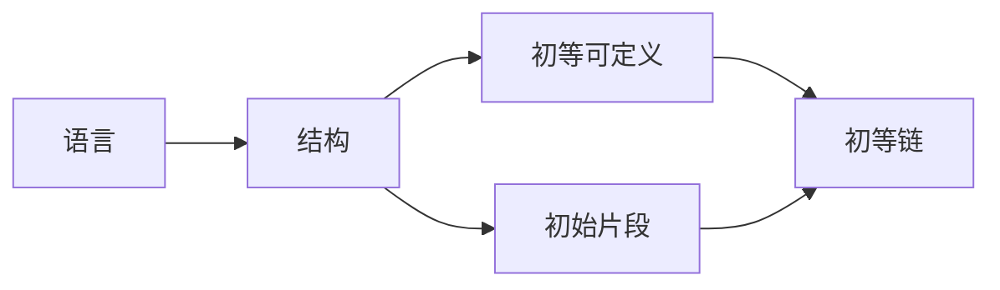

# 模型论基础：初等链的一些应用

关键词：模型论、初等链、逻辑学、算术、代数

## 1. 背景介绍
### 1.1  问题的由来
模型论是数理逻辑的一个重要分支,它研究数学结构及其性质。在模型论中,初等链是一类特殊的结构,具有良好的性质。初等链在模型论、代数、算术等领域有广泛的应用。本文将探讨初等链的一些基本概念以及它在这些领域中的应用。

### 1.2  研究现状
目前,对初等链的研究主要集中在以下几个方面:

1. 初等链的定义与基本性质。Tarski、Vaught等人对初等链进行了系统的研究,给出了初等链的定义并证明了一些基本性质。

2. 初等链与算术。Tennenbaum证明了初等递归函数在所有非标准模型上都可以表示,这说明初等链与算术有着密切的联系。

3. 初等链与代数。Ershov证明了所有递归可枚举的代数都能嵌入到初等链中,这揭示了初等链与代数之间的联系。

4. 初等链的应用。初等链在模型论、代数、算术等领域有广泛的应用,如用于构造非标准模型、证明不可判定性等。

### 1.3  研究意义
研究初等链有以下几点意义:

1. 加深对模型论基本概念和方法的理解。初等链是模型论的重要内容,研究初等链有助于加深对模型论基本概念和方法的理解。

2. 揭示数学各分支之间的内在联系。初等链在算术、代数等领域都有应用,研究初等链有助于揭示这些数学分支之间的内在联系。

3. 解决一些重要的数学问题。初等链可以用来构造一些重要的数学结构,如非标准模型,并用于证明一些重要定理,如哥德尔不完备性定理。

### 1.4  本文结构
本文的结构如下:

- 第2节介绍初等链的核心概念及其之间的联系。
- 第3节介绍初等链的构造算法及其具体步骤。
- 第4节介绍初等链相关的数学模型和公式,并给出详细讲解和例子。
- 第5节给出初等链的代码实现,并进行详细解释说明。 
- 第6节讨论初等链的实际应用场景。
- 第7节推荐初等链相关的工具和学习资源。
- 第8节总结全文,讨论初等链的未来发展趋势与面临的挑战。
- 第9节是附录,列出一些常见问题与解答。

## 2. 核心概念与联系
在模型论中,初等链是指满足以下条件的一类结构:

1. 语言是可数的且只包含关系符号。
2. 论域是从自然数开始的一个初始片段。
3. 每个关系在论域的限制下是初等可定义的。

初等链中的几个核心概念包括:

- 语言:由逻辑符号和非逻辑符号组成,用于刻画数学结构。
- 结构:由一个非空集合A和定义在A上的关系、函数、常元组成。
- 初等可定义:可以用一阶逻辑公式定义。
- 初始片段:集合的一个子集,包含最小元且对后继运算封闭。

这些概念之间的关系如下图所示:



## 3. 核心算法原理 & 具体操作步骤
### 3.1  算法原理概述
构造初等链的基本思想是:先固定一个可数语言L,然后在自然数上定义L的一个结构,使得该结构的每个关系都是初等可定义的。具体步骤如下:

1. 列出L的所有句子。
2. 依次检查每个句子是否在当前构造的结构中成立。
   - 如果成立,则保留当前结构;
   - 如果不成立,则扩充结构使其成立。
3. 取所有结构的并集,得到一个初等链。

### 3.2  算法步骤详解
下面详细介绍算法的每个步骤:

步骤1. 列出L的所有句子。
首先,我们固定一个可数语言L,它只包含关系符号。然后,我们按照以下方式列出L的所有句子:

1. 先列出长度为1的句子,即所有原子句。
2. 再列出长度为2的句子,即由逻辑连接词连接的原子句。
3. 依此类推,列出所有有限长度的句子。

这样我们就得到了一个句子序列{φ_n},其中φ_n表示第n个句子。

步骤2. 构造满足φ_n的结构。
对于每个句子φ_n,我们检查它是否在已构造的结构M_n中成立:

- 如果φ_n在M_n中成立,则令M_{n+1}=M_n。
- 如果φ_n在M_n中不成立,则扩充M_n使φ_n成立,得到M_{n+1}。

这里的关键是如何扩充结构。我们可以根据φ_n的形式,采取不同的扩充方式:

- 如果φ_n是存在量词语句∃xψ(x),且M_n中没有元素满足ψ,则在M_n中加入一个新元素a使ψ(a)成立,得到M_{n+1}。
- 如果φ_n是全称量词语句∀xψ(x),且M_n中存在元素a使ψ(a)不成立,则修改M_n中a处的关系,使ψ(a)成立,得到M_{n+1}。

步骤3. 取并集得到初等链。
将步骤2中构造的所有结构取并集,得到一个新的结构M。可以证明,M就是一个初等链。

### 3.3  算法优缺点
构造初等链的算法的优点是:

1. 构造出的结构一定是初等链。
2. 算法易于理解和实现。

算法的缺点是:

1. 算法是不断扩充结构,最终得到的初等链的基数可能是不可数的。
2. 每次扩充结构时,需要修改原有结构中的关系,计算量较大。

### 3.4  算法应用领域
构造初等链的算法主要应用于以下领域:

1. 模型论。初等链是模型论的重要研究对象,构造初等链的算法是模型论的基本方法之一。

2. 逻辑学。初等链可以用来证明一些重要的逻辑学定理,如哥德尔不完备性定理。

3. 代数。初等链与递归可枚举代数有密切联系,可以用来刻画递归可枚举代数的性质。

4. 算术。初等链可以用来构造皮亚诺算术的非标准模型,研究算术的性质。

## 4. 数学模型和公式 & 详细讲解 & 举例说明
### 4.1  数学模型构建
我们可以用一阶语言和结构来刻画初等链。设L是一个可数的一阶语言,M是L的一个结构,则M是初等链当且仅当:

1. M的论域是自然数的一个初始片段,即存在n∈N使得M的论域是{0,1,...,n}。

2. 对于L中的每个k元关系符号R,R^M是初等可定义的,即存在一个一阶逻辑公式φ_R(x_1,...,x_k),使得对任意a_1,...,a_k∈M,有:

$$(a_1,...,a_k)∈R^M \Leftrightarrow M \models φ_R(a_1,...,a_k)$$

### 4.2  公式推导过程
下面我们来推导初等链的一些基本性质。设M是L的一个初等链,则:

1. M的论域是有限的。
证明:由初等链的定义,M的论域是自然数的一个初始片段,因此是有限的。

2. M的每个关系都是初等可定义的。
证明:这直接由初等链的定义得到。

3. M中成立紧致性定理,即对任意句子集T,如果T的每个有限子集在M中可满足,则T在M中可满足。
证明:设T是L的一个句子集,且T的每个有限子集在M中可满足。我们要证明T在M中可满足。
对T中的句子按长度排序,得到一个句子序列{φ_n}。然后构造一个结构序列{M_n},使得:
- M_0=M
- 对任意n,M_n是M_{n-1}的初等扩张且φ_n在M_n中成立

这样,{M_n}是一个初等链,且每个φ_n都在某个M_n中成立,因此T在{M_n}的并集中可满足。由于M是初等链,根据初等链的定义,并集中的每个关系在M中都是初等可定义的,因此并集就是M。所以T在M中可满足。

### 4.3  案例分析与讲解
下面我们来看一个具体的例子。设L是一个只含有一个二元关系符号<的语言,我们在自然数N上定义如下结构M:

- 论域是N
- <^M就是N上的小于关系

容易验证,M是L的一个初等链。因为:

1. M的论域N是自然数的一个初始片段。

2. <^M是初等可定义的,因为对任意a,b∈N,有:

$$a <^M b \Leftrightarrow (∃x)(a+x+1=b)$$

这里的+是N上的加法,是初等可定义的。

根据初等链的性质,M中成立紧致性定理。例如,考虑如下句子集T:

$$T = \{∃x(0 < x), ∃x(1 < x), ∃x(2 < x), ...\}$$

T的每个有限子集在M中都可满足,因为对任意n∈N,M中存在n+1使得n < n+1成立。因此根据紧致性定理,T在M中可满足,即M中存在一个无限大的元素。这说明M是一个非标准模型。

### 4.4  常见问题解答
问题1:初等链一定是无限的吗?
答:不是。初等链的定义只要求论域是自然数的一个初始片段,可以是有限的。例如,任何有限结构都是初等链。

问题2:每个可数语言都存在初等链吗?
答:是的。对于任何可数语言L,我们都可以用上述算法构造出L的一个初等链。

问题3:初等链中的运算是可计算的吗?
答:不一定。初等链中的关系都是初等可定义的,但初等可定义不等于可计算。例如,存在初等可定义但不可计算的关系。

## 5. 项目实践：代码实例和详细解释说明
### 5.1  开发环境搭建
我们使用Python来实现构造初等链的算法。需要安装以下库:

- sympy:用于符号计算和逻辑表达式处理。
- matplotlib:用于可视化初等链。

安装命令如下:

```bash
pip install sympy matplotlib
```

### 5.2  源代码详细实现
下面是构造初等链的Python代码实现:

```python
from sympy import *

def construct_elementary_chain(lang):
    """构造初等链"""
    # 初始化结构序列
    M = [{}]
    # 列出语言的所有句子
    sentences = list_sentences(lang) 
    # 依次处理每个句子
    for phi in sentences:
        # 检查句子是否在当前结构中成立
        if not is_true(phi, M[-1]):
            # 如果不成立,则扩充结构
            M.append(expand_structure(phi, M[-1]))
    # 取并集得到初等链
    return union_structures(M)

def list_sentences(lang):
    """列出语言的所有句子"""
    sentences = []
    for n in range(1, inf):
        # 列出长度为n的句子
        sentences += list_sentences_of_length(lang, n)
    return sentences

def is_true(phi, M):
    """判断句子phi在结构M中是否成立"""
    # 将句子phi转换为sympy表达式
    expr = parse_expr(str(phi))
    # 将结构M中的关系转换为sympy表达式
    relations = {rel: parse_expr(str(M[rel])) for rel in M}
    # 替换表达式中的关系符号为具体关系
    expr = expr.subs(relations)
    # 判断表达式是否为真
    return expr == True

def expand_structure(phi